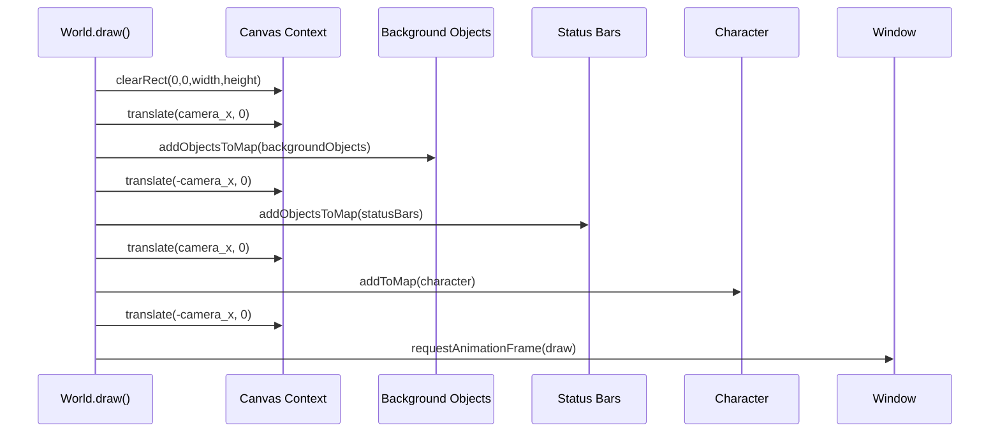
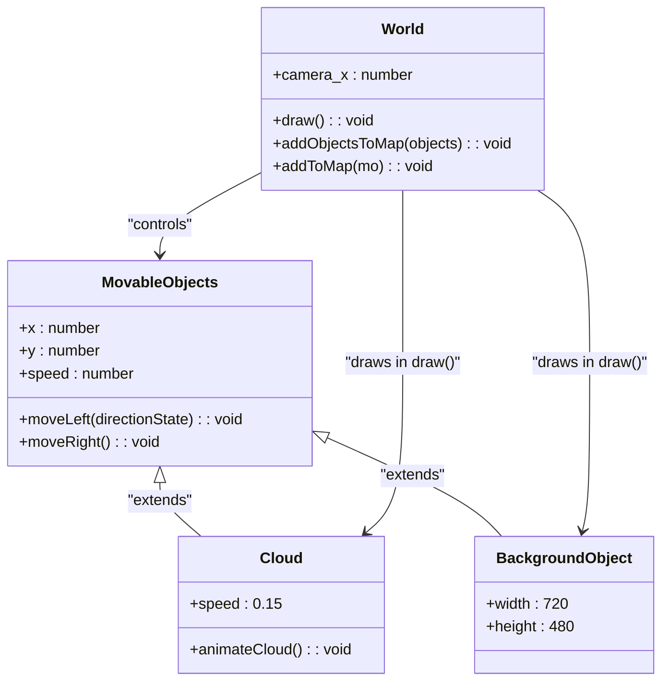

# Camera System

<cite>
**Referenced Files in This Document**   
- [2-world.class.js](file://models/2-world.class.js)
- [character.class.js](file://models/character.class.js)
- [movable-objects.class.js](file://models/movable-objects.class.js)
- [background-object.class.js](file://models/background-object.class.js)
- [clouds.class.js](file://models/clouds.class.js)
- [drawable-object.class.js](file://models/drawable-object.class.js)
- [level.class.js](file://models/level.class.js)
- [1-game.js](file://js/1-game.js)
</cite>

## Table of Contents
1. [Introduction](#introduction)
2. [Camera Coordinate System](#camera-coordinate-system)
3. [World Rendering Pipeline](#world-rendering-pipeline)
4. [Camera Position Update Logic](#camera-position-update-logic)
5. [Parallax Scrolling Implementation](#parallax-scrolling-implementation)
6. [Coordinate Transformation Flow](#coordinate-transformation-flow)
7. [Common Camera Issues and Solutions](#common-camera-issues-and-solutions)
8. [Optimization Techniques](#optimization-techniques)
9. [Conclusion](#conclusion)

## Introduction
The camera system in this side-scrolling game implements a dynamic following mechanism that keeps the player character centered on screen while creating the illusion of movement through the game world. This is achieved through canvas coordinate translation rather than moving individual objects. The World class manages the camera_x property which controls the horizontal offset of the entire game world relative to the canvas. This document details the implementation, coordinate transformation logic, parallax effects, and optimization strategies for creating a smooth scrolling experience.

**Section sources**
- [2-world.class.js](file://models/2-world.class.js#L8-L8)
- [character.class.js](file://models/character.class.js#L50-L55)

## Camera Coordinate System
The camera system operates on a relative coordinate transformation model where the game world moves beneath a fixed camera viewport. The core of this system is the `camera_x` property in the World class, which stores the current horizontal offset applied to the canvas context. Instead of moving the character across the screen, the entire game world is translated in the opposite direction using `ctx.translate(this.camera_x, 0)`. This creates the visual effect of the character moving through the environment while actually remaining near the center of the screen.

```mermaid
flowchart TD
A[Character Movement Input] --> B[Update Character.x Position]
B --> C[Calculate camera_x = -Character.x + Offset]
C --> D[Apply ctx.translate(camera_x, 0)]
D --> E[Draw All World Objects]
E --> F[Objects Appear to Move Relative to Camera]
F --> G[Character Appears Centered on Screen]
```

**Diagram sources**
- [2-world.class.js](file://models/2-world.class.js#L8-L8)
- [2-world.class.js](file://models/2-world.class.js#L66-L85)

**Section sources**
- [2-world.class.js](file://models/2-world.class.js#L8-L8)
- [2-world.class.js](file://models/2-world.class.js#L66-L85)

## World Rendering Pipeline
The rendering process in the World class implements a precise sequence of canvas transformations to correctly position all game elements. The draw() method begins by clearing the canvas, then applies the camera translation before drawing background elements. It temporarily resets the translation to draw UI elements like status bars in fixed screen positions, reapplies the camera translation for character and enemy rendering, and finally resets the transformation before scheduling the next frame. This careful management of the transformation stack ensures that different element types are positioned correctly relative to the camera or screen.



**Diagram sources**
- [2-world.class.js](file://models/2-world.class.js#L66-L85)
- [2-world.class.js](file://models/2-world.class.js#L87-L91)
- [2-world.class.js](file://models/2-world.class.js#L106-L117)

**Section sources**
- [2-world.class.js](file://models/2-world.class.js#L66-L85)

## Camera Position Update Logic
The camera position is updated in real-time based on character movement through a direct mathematical relationship. In the character's animation loop, the camera_x value is calculated as `world.camera_x = -this.x + 100`, where 100 represents the desired offset from the left edge of the screen. This formula ensures that as the character's x position increases (moving right), the camera_x becomes more negative, translating the world to the left and keeping the character visually centered. The system includes boundary checks to prevent the camera from scrolling beyond the level limits, with constraints on both left (x > -1340) and right (x < levelEndX + 100) boundaries.

```mermaid
flowchart TD
A[Character Moves Right] --> B[Character.x Increases]
B --> C[Calculate camera_x = -Character.x + 100]
C --> D[camera_x Becomes More Negative]
D --> E[ctx.translate(camera_x, 0) Moves World Left]
E --> F[Character Appears Centered]
G[Character Moves Left] --> H[Character.x Decreases]
H --> I[Calculate camera_x = -Character.x + 100]
I --> J[camera_x Becomes Less Negative]
J --> K[ctx.translate(camera_x, 0) Moves World Right]
K --> L[Character Appears Centered]
```

**Diagram sources**
- [character.class.js](file://models/character.class.js#L135-L145)
- [2-world.class.js](file://models/2-world.class.js#L8-L8)

**Section sources**
- [character.class.js](file://models/character.class.js#L135-L145)

## Parallax Scrolling Implementation
The camera system supports parallax scrolling effects by leveraging the fact that different background layers are drawn at different times in the rendering pipeline. Clouds and background objects are drawn while the camera translation is active, causing them to scroll at the same rate as the main world. However, the system could be extended to create true parallax effects by applying different translation multipliers to different layers. For example, distant mountains could scroll at 50% of the camera speed while foreground elements scroll at 100%, creating a sense of depth. The current implementation draws clouds as movable objects with their own slow movement speed, creating a secondary motion effect independent of the main camera translation.



**Diagram sources**
- [clouds.class.js](file://models/clouds.class.js#L0-L17)
- [background-object.class.js](file://models/background-object.class.js#L0-L10)
- [movable-objects.class.js](file://models/movable-objects.class.js#L50-L65)

**Section sources**
- [clouds.class.js](file://models/clouds.class.js#L0-L17)
- [background-object.class.js](file://models/background-object.class.js#L0-L10)

## Coordinate Transformation Flow
The coordinate transformation system follows a precise pattern to maintain proper object positioning relative to the camera. When an object is drawn, its world coordinates (x, y) are automatically transformed by the current canvas transformation matrix. The ctx.translate(this.camera_x, 0) call shifts the origin of the coordinate system, so all subsequent drawing operations are offset by camera_x pixels horizontally. This means an object at world position x=500 with camera_x=-300 will appear at screen position x=200. The system carefully manages the transformation stack by applying and removing translations around UI elements that should remain fixed on screen, ensuring proper layering of game world and interface elements.

```mermaid
flowchart LR
A[World Coordinates] --> B[Canvas Transformation]
B --> C[Screen Coordinates]
subgraph "Transformation Process"
D[Object World X: 500] --> E[camera_x: -300]
E --> F[ctx.translate(-300, 0)]
F --> G[Screen X: 200]
end
subgraph "UI Elements"
H[Status Bar World X: 10] --> I[Reset Translation]
I --> J[Screen X: 10 (Fixed)]
end
```

**Diagram sources**
- [2-world.class.js](file://models/2-world.class.js#L66-L85)
- [drawable-object.class.js](file://models/drawable-object.class.js#L25-L28)

**Section sources**
- [2-world.class.js](file://models/2-world.class.js#L66-L85)

## Common Camera Issues and Solutions
Several common camera issues can arise in side-scrolling games, including jittery movement, incorrect boundary handling, and object clipping at screen edges. Jittery movement often occurs when the camera update frequency doesn't match the rendering frame rate; this is mitigated by updating camera_x in the same 60fps animation interval as character movement. Boundary issues are addressed through explicit constraints in the character's movement logic that prevent the camera from translating beyond the level limits. Object disappearance at screen edges can be prevented by ensuring sufficient pre-loading of world objects and implementing proper culling logic that keeps objects in memory even when temporarily off-screen. The current implementation prevents these issues through careful synchronization of movement and rendering updates and explicit boundary checks in the character movement code.

**Section sources**
- [character.class.js](file://models/character.class.js#L135-L145)
- [2-world.class.js](file://models/2-world.class.js#L66-L85)

## Optimization Techniques
To ensure smooth camera panning, several optimization techniques are employed. The camera position is updated at 60fps to match the display refresh rate, preventing stuttering. The rendering pipeline minimizes canvas state changes by batching translation operations and only saving/restoring the context when necessary for sprite flipping. Object pooling could be implemented to reduce garbage collection overhead from frequently created/destroyed objects like throwable items. The system could be further optimized by implementing spatial partitioning to only draw objects within the current camera viewport, reducing the number of draw calls per frame. Additionally, using requestAnimationFrame ensures that rendering is synchronized with the browser's repaint cycle for optimal performance.

**Section sources**
- [2-world.class.js](file://models/2-world.class.js#L66-L85)
- [character.class.js](file://models/character.class.js#L135-L145)

## Conclusion
The camera system effectively creates a side-scrolling experience by translating the canvas context relative to the character's position rather than moving individual objects. The World class manages this through the camera_x property and careful coordination of canvas transformations during the rendering process. By keeping the character near the center of the screen and moving the world beneath it, the system creates an intuitive gameplay experience with proper parallax potential and boundary handling. The implementation demonstrates effective use of HTML5 Canvas transformation methods to create a dynamic game camera that enhances player immersion while maintaining performance through optimized rendering techniques.