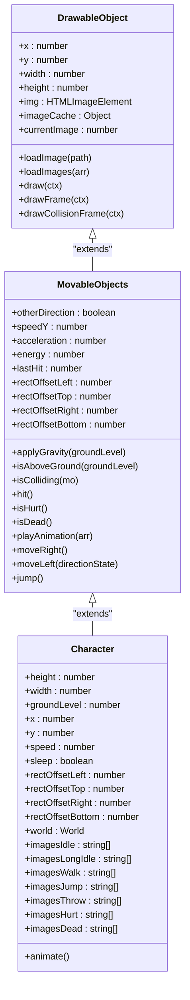
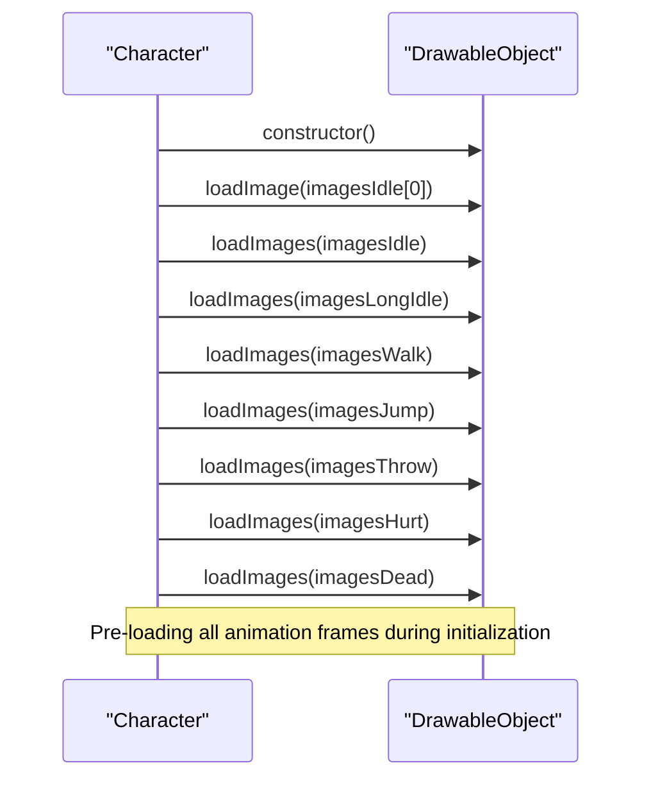
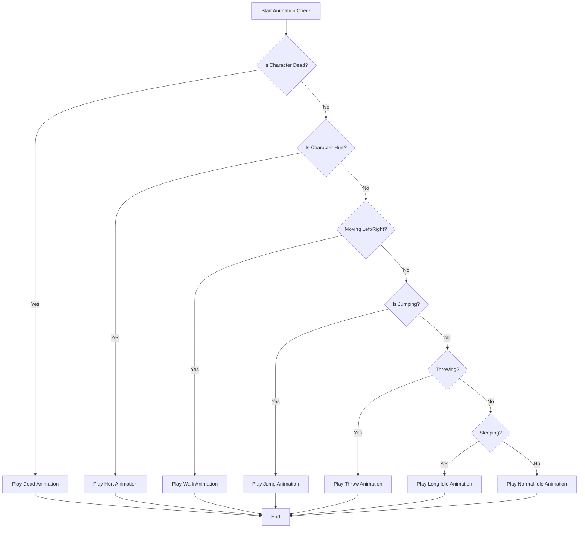
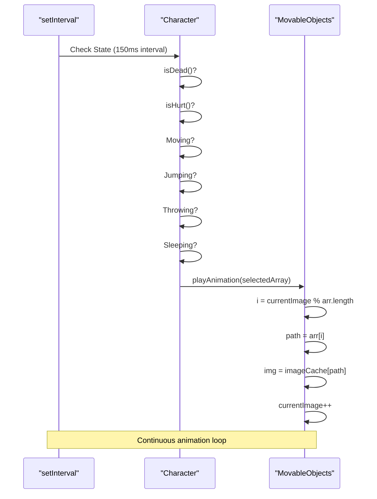

# Animation States

<cite>
**Referenced Files in This Document**   
- [character.class.js](file://models/character.class.js)
- [drawable-object.class.js](file://models/drawable-object.class.js)
- [movable-objects.class.js](file://models/movable-objects.class.js)
- [1-game.js](file://js/1-game.js)
</cite>

## Table of Contents
1. [Introduction](#introduction)
2. [Core Animation Components](#core-animation-components)
3. [Animation State Management](#animation-state-management)
4. [Image Handling and Caching](#image-handling-and-caching)
5. [State Transition Logic](#state-transition-logic)
6. [Animation Playback Mechanism](#animation-playback-mechanism)
7. [Common Issues and Debugging](#common-issues-and-debugging)
8. [Performance Optimization](#performance-optimization)
9. [Conclusion](#conclusion)

## Introduction
The character's animation system is a state-based mechanism that dynamically selects and plays appropriate animation sequences based on user input and character conditions. This system uses a combination of keyboard event monitoring, state detection, and image sequence management to create a responsive and visually coherent character behavior. The implementation leverages JavaScript's setInterval for continuous state checking and animation frame cycling, ensuring smooth transitions between different character states such as idle, walking, jumping, throwing, hurt, and dead.

**Section sources**
- [character.class.js](file://models/character.class.js#L0-L152)
- [movable-objects.class.js](file://models/movable-objects.class.js#L0-L76)

## Core Animation Components

The animation system is built upon several key components that work together to manage character states and visual representation. The Character class extends MovableObjects, which in turn extends DrawableObject, creating a hierarchy that separates concerns between animation, movement, and rendering. Each animation state is represented by an array of image paths, with specific sequences for idle, walking, jumping, throwing, hurt, and dead states.

**Diagram sources**
- [drawable-object.class.js](file://models/drawable-object.class.js#L0-L45)
- [movable-objects.class.js](file://models/movable-objects.class.js#L0-L76)
- [character.class.js](file://models/character.class.js#L0-L152)

**Section sources**
- [character.class.js](file://models/character.class.js#L0-L152)
- [movable-objects.class.js](file://models/movable-objects.class.js#L0-L76)
- [drawable-object.class.js](file://models/drawable-object.class.js#L0-L45)

## Animation State Management

The character's animation states are managed through dedicated image arrays that store the file paths for each animation sequence. These arrays include imagesIdle for normal idle animation, imagesLongIdle for extended idle after inactivity, imagesWalk for walking, imagesJump for jumping, imagesThrow for throwing, imagesHurt for taking damage, and imagesDead for the death sequence. Each array contains the complete set of frames needed for its respective animation, with file paths pointing to the appropriate sprite images in the assets directory.

The animation system uses these arrays to determine which sequence to play based on the character's current state and user input. The state detection occurs through continuous monitoring of keyboard inputs and character conditions, allowing for immediate response to player actions. The separation of animation sequences into distinct arrays enables clean state transitions and prevents animation conflicts.

**Section sources**
- [character.class.js](file://models/character.class.js#L10-L95)

## Image Handling and Caching

The image loading and caching mechanism is implemented in the DrawableObject base class, providing a consistent approach across all drawable entities. The loadImage method handles single image loading by creating a new Image object and setting its source path, while the loadImages method processes arrays of image paths, loading each into the imageCache object for efficient access during animation playback.

This caching strategy prevents redundant image loading and ensures that animation frames are readily available when needed. The imageCache object stores loaded images with their file paths as keys, allowing the playAnimation method to quickly retrieve the appropriate frame without reloading it from the network. This approach significantly improves performance and reduces flickering during animation sequences.

**Diagram sources**
- [drawable-object.class.js](file://models/drawable-object.class.js#L10-L21)
- [character.class.js](file://models/character.class.js#L85-L95)

**Section sources**
- [drawable-object.class.js](file://models/drawable-object.class.js#L10-L21)
- [character.class.js](file://models/character.class.js#L85-L95)

## State Transition Logic

The state transition logic is implemented in the animate method of the Character class, which uses multiple setInterval calls to continuously monitor character state and input conditions. The system employs a sleep timer mechanism that activates after 3 seconds of inactivity, triggering the transition from normal idle to long idle animation.

The transition logic follows a priority-based hierarchy, with death and hurt states taking precedence over all others. When the character is not dead or hurt, the system checks for movement inputs (left/right), jumping state, throwing action (space key), sleep state, and finally defaults to normal idle. This hierarchical approach ensures that the most relevant animation is always displayed based on the current game context.

**Diagram sources**
- [character.class.js](file://models/character.class.js#L99-L149)

**Section sources**
- [character.class.js](file://models/character.class.js#L99-L149)

## Animation Playback Mechanism

The animation playback mechanism is implemented in the playAnimation method of the MovableObjects class, which is inherited by the Character class. This method uses modulo arithmetic to cycle through animation frames, ensuring smooth and continuous playback. The currentImage counter is incremented with each frame update, and the modulo operation (currentImage % arr.length) determines the index of the current frame within the animation array.

The animation update frequency is set to 150ms, providing a balance between smoothness and performance. This interval determines how quickly the animation cycles through its frames, with shorter intervals resulting in faster animation playback. The modulo arithmetic approach ensures that when the end of the array is reached, the animation seamlessly loops back to the beginning, creating a continuous animation effect.

**Diagram sources**
- [movable-objects.class.js](file://models/movable-objects.class.js#L55-L60)
- [character.class.js](file://models/character.class.js#L130-L147)

**Section sources**
- [movable-objects.class.js](file://models/movable-objects.class.js#L55-L60)
- [character.class.js](file://models/character.class.js#L130-L147)

## Common Issues and Debugging

Several common issues can arise in the animation system, including animation flickering, incorrect state transitions, and image caching problems. Animation flickering typically occurs when images are not properly pre-loaded or when there are delays in image loading during animation playback. This can be mitigated by ensuring all animation frames are loaded during initialization, as implemented in the Character constructor.

Incorrect state transitions may happen when the priority hierarchy is not properly maintained or when state checks are not synchronized with the game loop. The current implementation addresses this by using a clear priority order in the animation state checks, with death and hurt states taking precedence. Debugging strategies include adding state logging to monitor transitions and implementing frame rate monitoring to ensure consistent animation timing.

Keyboard input handling is another potential source of issues, particularly with the ANY flag that tracks whether any key is pressed. The implementation in 1-game.js properly manages this flag by setting it to false only when no keys are pressed, preventing premature sleep state activation during continuous input.

**Section sources**
- [character.class.js](file://models/character.class.js#L99-L149)
- [1-game.js](file://js/1-game.js#L0-L55)
- [movable-objects.class.js](file://models/movable-objects.class.js#L55-L60)

## Performance Optimization

The animation system incorporates several performance optimizations to ensure smooth playback and efficient resource usage. The image caching mechanism prevents redundant network requests by storing loaded images in memory for quick access during animation. All animation frames are pre-loaded during character initialization, eliminating loading delays during gameplay.

The use of modulo arithmetic for frame cycling is computationally efficient and ensures seamless animation loops without the need for complex conditional logic. The animation update interval of 150ms strikes a balance between visual smoothness and CPU usage, preventing excessive timer callbacks that could impact game performance.

Memory efficiency is achieved through the centralized imageCache object, which ensures that each image is loaded only once regardless of how many times it appears in animation sequences. This approach reduces memory footprint and improves garbage collection efficiency.

**Section sources**
- [drawable-object.class.js](file://models/drawable-object.class.js#L15-L21)
- [movable-objects.class.js](file://models/movable-objects.class.js#L55-L60)
- [character.class.js](file://models/character.class.js#L85-L95)

## Conclusion

The character's state-based animation system effectively combines input monitoring, state detection, and image sequence management to create a responsive and visually engaging gameplay experience. By leveraging a hierarchical state transition logic and efficient image caching, the system ensures smooth animations and timely responses to player actions. The modular design, with clear separation of concerns between the DrawableObject, MovableObjects, and Character classes, promotes code maintainability and extensibility. This implementation provides a solid foundation for character animation that balances performance, visual quality, and responsiveness.