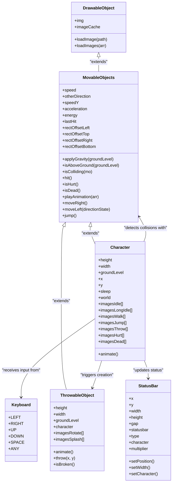
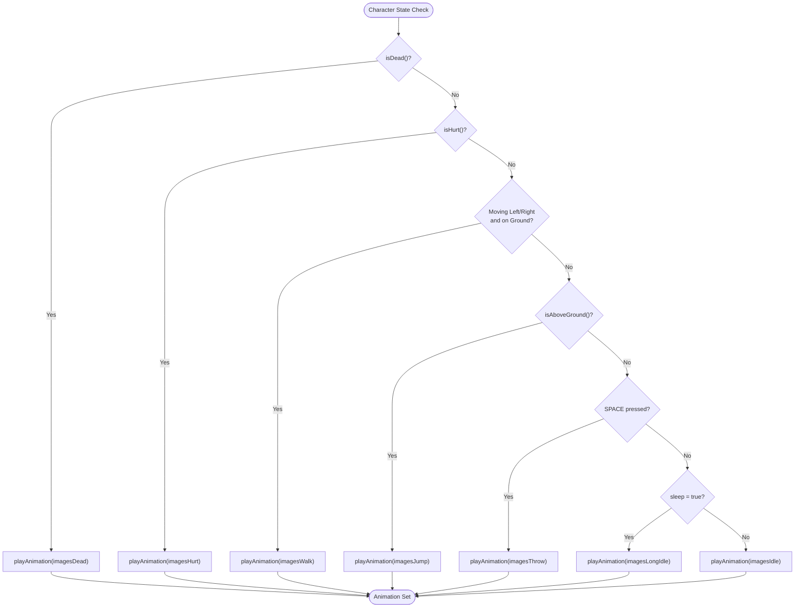
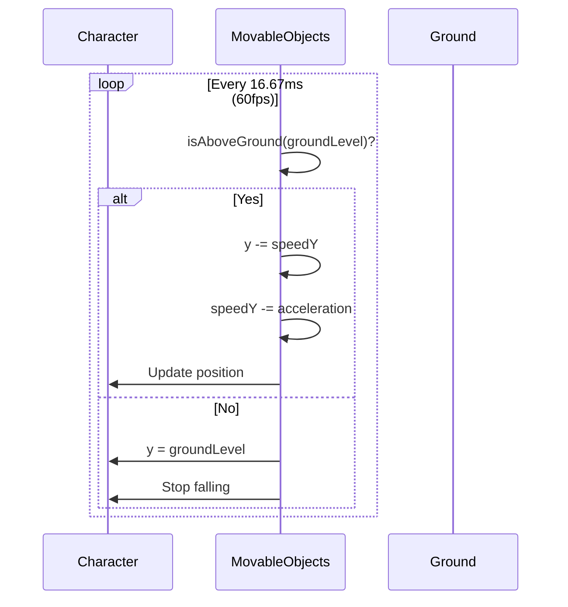

# Character System

<cite>
**Referenced Files in This Document**   
- [character.class.js](file://models/character.class.js)
- [movable-objects.class.js](file://models/movable-objects.class.js)
- [thowable-object.class.js](file://models/thowable-object.class.js)
- [keyboard.class.js](file://models/keyboard.class.js)
- [status-bar.class.js](file://models/status-bar.class.js)
</cite>

## Table of Contents
1. [Introduction](#introduction)
2. [Core Components](#core-components)
3. [Architecture Overview](#architecture-overview)
4. [Detailed Component Analysis](#detailed-component-analysis)
5. [State-Based Animation System](#state-based-animation-system)
6. [Physics Implementation](#physics-implementation)
7. [Game System Interactions](#game-system-interactions)
8. [Common Issues and Solutions](#common-issues-and-solutions)
9. [Optimization Tips](#optimization-tips)
10. [Conclusion](#conclusion)

## Introduction
The Character class represents the player-controlled entity in the game, serving as the central interactive component. This document provides comprehensive documentation of its implementation, covering animation states, movement mechanics, physics implementation, and system interactions. The character is implemented as a subclass of MovableObjects, inheriting core functionality while adding player-specific behaviors and visual states.

**Section sources**
- [character.class.js](file://models/character.class.js#L0-L150)

## Core Components
The Character system consists of several interconnected components that work together to create a responsive and visually engaging player experience. At its core, the Character class extends MovableObjects to inherit movement and collision capabilities, while adding specialized animation states and player input handling. The system integrates with keyboard input, throwable objects, and status bars to create a complete gameplay experience.

**Section sources**
- [character.class.js](file://models/character.class.js#L0-L150)
- [movable-objects.class.js](file://models/movable-objects.class.js#L0-L75)

## Architecture Overview
The Character system follows an inheritance-based architecture where the Character class extends MovableObjects, which in turn extends DrawableObject. This creates a clear hierarchy of responsibilities: DrawableObject handles basic rendering, MovableObjects adds physics and movement, and Character implements player-specific behaviors and animations.

**Diagram sources**
- [character.class.js](file://models/character.class.js#L0-L150)
- [movable-objects.class.js](file://models/movable-objects.class.js#L0-L75)
- [thowable-object.class.js](file://models/thowable-object.class.js#L0-L83)
- [keyboard.class.js](file://models/keyboard.class.js#L0-L8)
- [status-bar.class.js](file://models/status-bar.class.js#L0-L133)

## Detailed Component Analysis

### Character Class Implementation
The Character class represents the player-controlled entity with specific properties and behaviors. It inherits movement and physics capabilities from MovableObjects while adding player-specific animation states and input handling. The character has defined dimensions (height: 280, width: 140) and starts at position (x: 50, y: groundLevel) with a movement speed of 5 pixels per frame.

**Section sources**
- [character.class.js](file://models/character.class.js#L0-L150)

### MovableObjects Base Class
The MovableObjects class provides the foundational physics and movement capabilities for all moving entities in the game. It implements gravity application, collision detection, and basic movement mechanics. Key features include energy management for health tracking, hit detection with cooldown periods, and rectangle-based collision detection with offset boundaries for more accurate hitboxes.

**Section sources**
- [movable-objects.class.js](file://models/movable-objects.class.js#L0-L75)

## State-Based Animation System
The character implements a sophisticated state-based animation system that selects appropriate sprite sheets based on current actions and conditions. The system manages multiple animation states including idle, walking, jumping, throwing, hurt, dead, and long idle (sleeping). Animation selection follows a priority hierarchy based on the character's current state and player input.

**Diagram sources**
- [character.class.js](file://models/character.class.js#L99-L149)

**Section sources**
- [character.class.js](file://models/character.class.js#L0-L150)

## Physics Implementation

### Gravity and Ground Collision
The physics system implements realistic gravity using the applyGravity method inherited from MovableObjects. The character experiences constant downward acceleration (0.3 units per frame) when above the ground level, with vertical position updated at 60 frames per second. When the character reaches the ground level (445 - character height), vertical movement stops and the character remains on the ground.

**Diagram sources**
- [movable-objects.class.js](file://models/movable-objects.class.js#L14-L23)

**Section sources**
- [movable-objects.class.js](file://models/movable-objects.class.js#L0-L75)

### Energy Management and Health
The character's health is managed through an energy system with a maximum value of 100. When hit, the character loses 10 energy points with a minimum of 0. The isHurt method implements a cooldown period of 1 second after being hit, preventing rapid successive damage. The isDead method returns true when energy reaches zero, triggering the death animation sequence.

**Section sources**
- [movable-objects.class.js](file://models/movable-objects.class.js#L50-L60)

## Game System Interactions

### Input Handling
The character receives input from the Keyboard class, which tracks the state of directional keys (LEFT, RIGHT, UP) and action keys (SPACE). The animate method continuously checks keyboard state at 60fps to determine movement and actions. A sleep detection system resets a 3-second timer whenever any key is pressed, transitioning to long idle animation when no input is detected.

**Section sources**
- [character.class.js](file://models/character.class.js#L99-L149)
- [keyboard.class.js](file://models/keyboard.class.js#L0-L8)

### Throwable Object Creation
When the SPACE key is pressed, the character triggers the creation of a ThrowableObject. The throwable object inherits position and direction from the character, with throw direction determined by the character's otherDirection flag. The throwable object applies gravity and animates rotation while in air, switching to splash animation upon ground collision.

**Section sources**
- [character.class.js](file://models/character.class.js#L99-L149)
- [thowable-object.class.js](file://models/thowable-object.class.js#L0-L83)

### Collision Detection
The character uses the isColliding method from MovableObjects to detect collisions with enemies and other game objects. The collision detection uses rectangle-based hitboxes with configurable offsets (rectOffsetLeft, rectOffsetTop, rectOffsetRight, rectOffsetBottom) to provide more accurate collision boundaries than the full sprite dimensions.

**Section sources**
- [movable-objects.class.js](file://models/movable-objects.class.js#L29-L34)

### Status Bar Updates
The StatusBar class monitors the character's energy level and updates the health bar display accordingly. It uses a multiplier based on maximum energy to calculate the visual width of the health bar, updating every 100ms to reflect current health status.

**Section sources**
- [status-bar.class.js](file://models/status-bar.class.js#L70-L85)

## Common Issues and Solutions

### Animation Glitches
Animation glitches can occur when state transitions happen rapidly, potentially causing animation sequences to reset or skip frames. The current implementation mitigates this by setting currentImage to 0 only when jumping, ensuring jump animations start from the beginning.

### Collision Detection Inaccuracies
The rectangle-based collision system may produce inaccuracies with irregularly shaped sprites. The rectOffset properties help mitigate this by allowing fine-tuning of hitbox dimensions, but complex shapes may still experience false positives or negatives.

### State Transition Bugs
The sleep state transition system relies on a timer that resets with any keyboard input. This could potentially cause issues if multiple input events occur in rapid succession, though the 100ms check interval helps prevent excessive timer resets.

**Section sources**
- [character.class.js](file://models/character.class.js#L99-L149)
- [movable-objects.class.js](file://models/movable-objects.class.js#L0-L75)

## Optimization Tips

### Smooth Movement
The character movement is updated at 60fps (1000/60ms interval) to ensure smooth animation. Maintaining this high update frequency is crucial for responsive controls and fluid motion.

### Responsive Controls
Input polling occurs at 60fps, ensuring minimal latency between player input and character response. The sleep timer check at 100ms intervals balances responsiveness with performance.

### Animation Performance
Animation frames are cycled every 150ms, providing a balance between visual smoothness and performance. The playAnimation method efficiently cycles through pre-loaded images in the imageCache.

### Memory Management
All animation images are pre-loaded in the constructor using loadImages, preventing runtime loading delays. This approach trades initial load time for consistent runtime performance.

**Section sources**
- [character.class.js](file://models/character.class.js#L99-L149)

## Conclusion
The Character system implements a comprehensive player-controlled entity with rich animation states, realistic physics, and seamless integration with game systems. By extending the MovableObjects base class, it inherits robust movement and collision capabilities while adding player-specific behaviors. The state-based animation system provides visual feedback for all character actions, and the integration with input, throwable objects, and status bars creates a cohesive gameplay experience. Future improvements could include more sophisticated collision detection, additional animation states, and enhanced input responsiveness.

**Section sources**
- [character.class.js](file://models/character.class.js#L0-L150)
- [movable-objects.class.js](file://models/movable-objects.class.js#L0-L75)