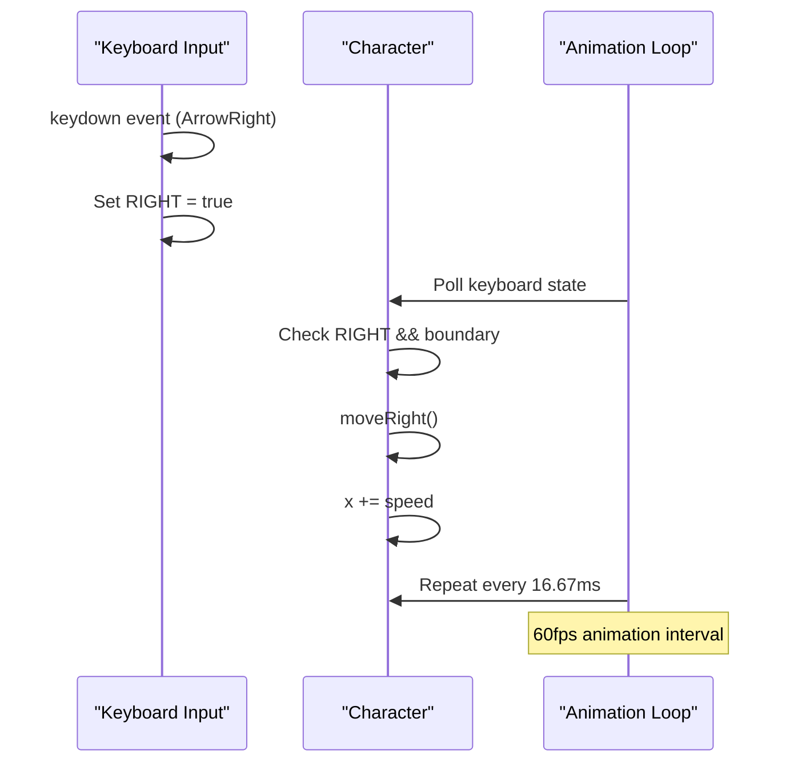
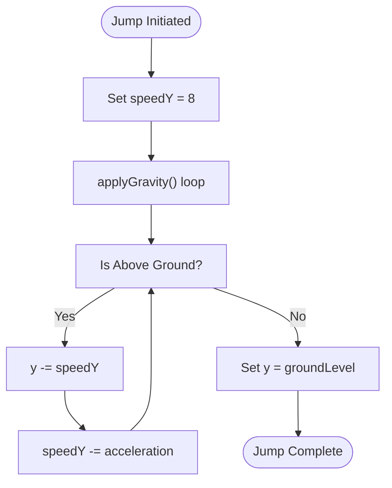
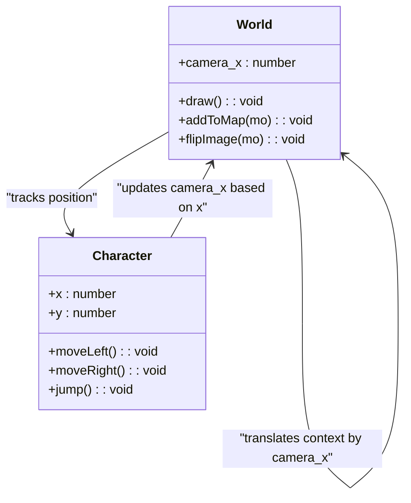

# Movement Mechanics

<cite>
**Referenced Files in This Document**   
- [character.class.js](file://models/character.class.js)
- [keyboard.class.js](file://models/keyboard.class.js)
- [2-world.class.js](file://models/2-world.class.js)
- [movable-objects.class.js](file://models/movable-objects.class.js)
- [1-game.js](file://js/1-game.js)
</cite>

## Table of Contents
1. [Introduction](#introduction)
2. [Input Handling System](#input-handling-system)
3. [Character Movement Implementation](#character-movement-implementation)
4. [Jump Mechanics and Physics](#jump-mechanics-and-physics)
5. [Camera System and Side-Scrolling](#camera-system-and-side-scrolling)
6. [Sprite Orientation and Visual Feedback](#sprite-orientation-and-visual-feedback)
7. [Animation and Frame Rate Management](#animation-and-frame-rate-management)
8. [Boundary and Collision Handling](#boundary-and-collision-handling)
9. [Common Issues and Solutions](#common-issues-and-solutions)
10. [Conclusion](#conclusion)

## Introduction
This document provides a comprehensive analysis of the character movement mechanics in the El Pollo Loco game. The system implements a side-scrolling platformer movement model with left/right translation, jumping, and camera tracking. The architecture follows an event-driven input system where keyboard events are processed through a state object that is polled during animation updates. Movement occurs at a consistent 60fps interval, with physics calculations applied for gravity and jumping. The camera system creates the side-scrolling effect by adjusting the rendering offset based on character position. This documentation explains the technical implementation while providing accessible explanations for developers of all skill levels.

## Input Handling System
The movement system begins with keyboard input detection through event listeners that update the state of a global Keyboard object. When arrow keys are pressed or released, corresponding boolean flags (LEFT, RIGHT, UP) are set to true or false. This state-based approach allows for smooth, continuous movement rather than discrete step-based movement. The input system captures keydown and keyup events, maintaining the current state of all relevant keys. This state is then accessed by the character's animation loop to determine which actions to perform each frame.

**Section sources**
- [1-game.js](file://js/1-game.js#L10-L55)
- [keyboard.class.js](file://models/keyboard.class.js#L1-L8)

## Character Movement Implementation
Character movement is implemented through the moveLeft() and moveRight() methods in the MovableObjects class, which serves as the base class for the Character. These methods modify the character's x-coordinate by adding or subtracting the speed value (5 pixels per update). The movement occurs within a 60fps animation interval, providing smooth motion. The Character class polls the Keyboard state during each animation cycle and calls the appropriate movement method when the corresponding key is pressed. Boundary checks prevent the character from moving beyond the world limits (-1340 on the left) and past the end of the level (levelEndX + 100).

**Diagram sources**
- [character.class.js](file://models/character.class.js#L100-L108)
- [movable-objects.class.js](file://models/movable-objects.class.js#L58-L65)

**Section sources**
- [character.class.js](file://models/character.class.js#L100-L108)
- [movable-objects.class.js](file://models/movable-objects.class.js#L58-L65)

## Jump Mechanics and Physics
The jump functionality is implemented through a physics-based system that uses velocity (speedY) and acceleration to create realistic jumping and falling motion. When the UP key is pressed, the jump() method sets the character's speedY to 8, initiating an upward movement. The applyGravity() method, running at 60fps, continuously adjusts the character's y-position based on speedY and applies downward acceleration (0.3) to simulate gravity. When the character reaches its peak and begins falling, speedY becomes negative, causing the character to descend until it reaches the ground level. The isAboveGround() method determines when to apply gravity versus when to stop at the ground level.

**Diagram sources**
- [movable-objects.class.js](file://models/movable-objects.class.js#L14-L23)
- [movable-objects.class.js](file://models/movable-objects.class.js#L25-L28)
- [character.class.js](file://models/character.class.js#L110-L112)

**Section sources**
- [movable-objects.class.js](file://models/movable-objects.class.js#L14-L28)
- [character.class.js](file://models/character.class.js#L110-L112)

## Camera System and Side-Scrolling
The side-scrolling effect is achieved through the camera_x offset in the World class, which translates the rendering context to create the illusion of a moving camera following the character. The camera_x value is updated every 16.67ms (60fps) to be the negative of the character's x-position plus an offset (100), keeping the character positioned slightly right of center on the screen. During rendering, the canvas context is translated by camera_x before drawing background objects and the character, then translated back to draw UI elements like status bars. This coordinate transformation creates the smooth side-scrolling effect while maintaining proper layering of game elements.

**Diagram sources**
- [2-world.class.js](file://models/2-world.class.js#L66-L85)
- [character.class.js](file://models/character.class.js#L113-L114)

**Section sources**
- [2-world.class.js](file://models/2-world.class.js#L66-L85)
- [character.class.js](file://models/character.class.js#L113-L114)

## Sprite Orientation and Visual Feedback
The character's visual orientation is controlled by the otherDirection flag, which determines whether the sprite should be flipped horizontally. When moving left, the moveLeft() method sets otherDirection to true, triggering the flipImage() method in the World class during rendering. This method saves the canvas state, translates and scales the context by (-1, 1) to flip it horizontally, and adjusts the x-coordinate accordingly. After drawing the flipped sprite, flipImageBack() restores the original canvas state. This approach ensures the character always faces the direction of movement, providing clear visual feedback to the player about their current direction.

**Section sources**
- [movable-objects.class.js](file://models/movable-objects.class.js#L6-L7)
- [2-world.class.js](file://models/2-world.class.js#L106-L127)

## Animation and Frame Rate Management
The movement system operates on precise 60fps intervals using JavaScript's setInterval() method with a 16.67ms delay (1000/60). Two separate animation intervals run concurrently: one for movement and camera updates (16.67ms) and another for animation frame cycling (150ms). This separation allows for smooth physics-based movement while maintaining appropriate animation speeds for different actions (walking, jumping, idle). The requestAnimationFrame() loop in the draw() method ensures smooth rendering synchronized with the browser's refresh rate. This multi-interval approach balances performance with visual quality, preventing animation glitches while maintaining responsive controls.

**Section sources**
- [character.class.js](file://models/character.class.js#L100-L114)
- [2-world.class.js](file://models/2-world.class.js#L83-L85)

## Boundary and Collision Handling
The movement system includes boundary checks to prevent the character from leaving the playable area. The left boundary is set at x = -1340, while the right boundary is determined by the level's end position (levelEndX + 100). These checks are performed in the animation loop before calling moveLeft() or moveRight(). Additionally, the system handles vertical boundaries through the groundLevel property and the isAboveGround() method, which prevents the character from falling through the floor. The collision detection system uses rectangular hitboxes with offset values to provide more accurate collision detection that accounts for transparent areas in the sprites.

**Section sources**
- [character.class.js](file://models/character.class.js#L100-L108)
- [movable-objects.class.js](file://models/movable-objects.class.js#L30-L38)

## Common Issues and Solutions
Several common issues in movement systems are addressed in this implementation. Input lag is minimized by using a state-based input system rather than direct event handling in the game loop. Movement clipping is prevented by the 60fps update rate and precise boundary checks. Camera desynchronization is avoided by updating camera_x in the same interval as character movement. The implementation uses coordinate clamping to ensure the character stays within world bounds and proper canvas state management to prevent rendering artifacts when flipping sprites. For optimal performance, the system separates physics updates from animation updates and uses efficient collision detection with rectangular hitboxes and offset values.

**Section sources**
- [character.class.js](file://models/character.class.js#L100-L114)
- [movable-objects.class.js](file://models/movable-objects.class.js#L14-L23)
- [2-world.class.js](file://models/2-world.class.js#L66-L85)

## Conclusion
The movement mechanics in El Pollo Loco demonstrate a well-structured approach to 2D platformer controls, combining responsive input handling with smooth physics-based movement and camera tracking. The system effectively separates concerns between input processing, physics simulation, rendering, and animation, making it maintainable and extensible. By operating at 60fps with precise interval timing, the implementation ensures smooth motion and responsive controls. The camera system creates an engaging side-scrolling experience, while sprite flipping provides clear visual feedback. This architecture serves as a solid foundation for platformer games and can be extended with additional features like variable jump height, wall sliding, or momentum-based movement.