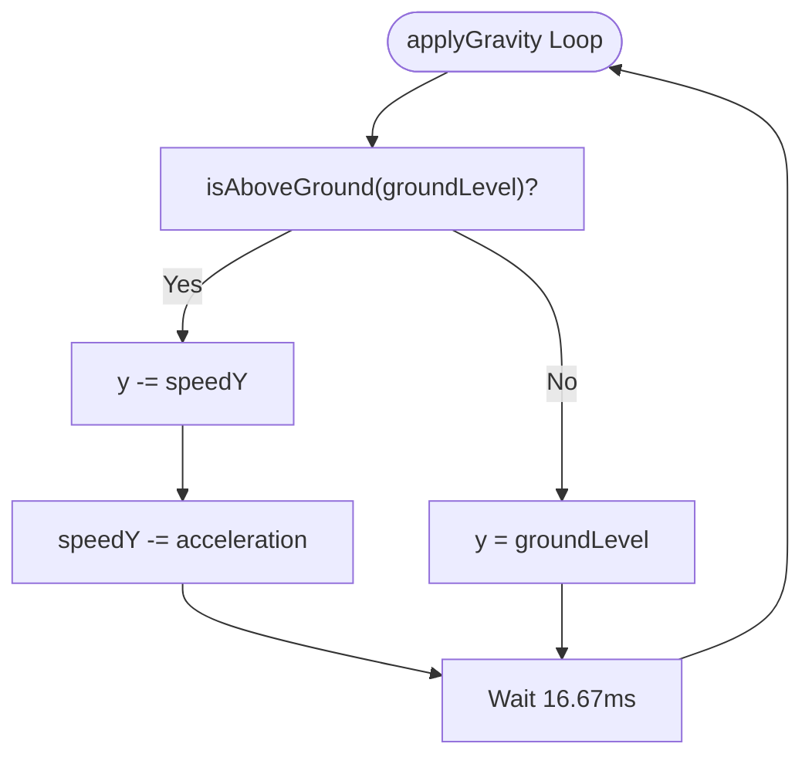
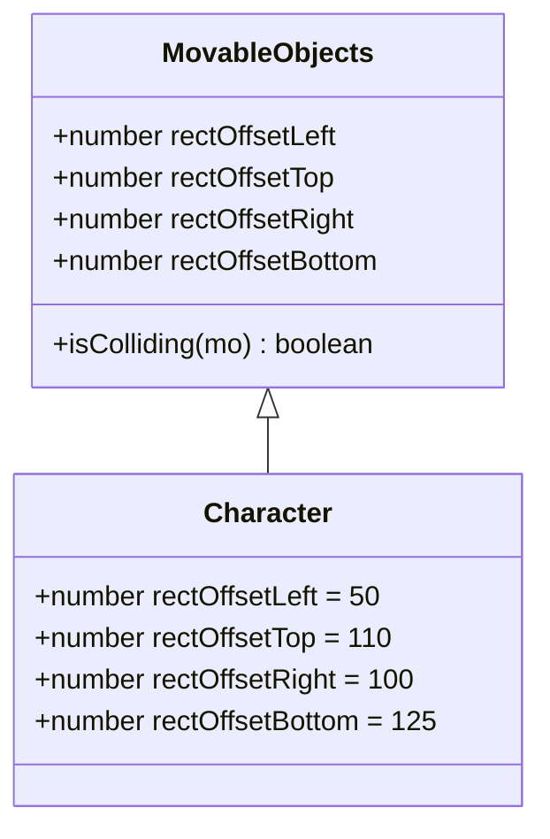
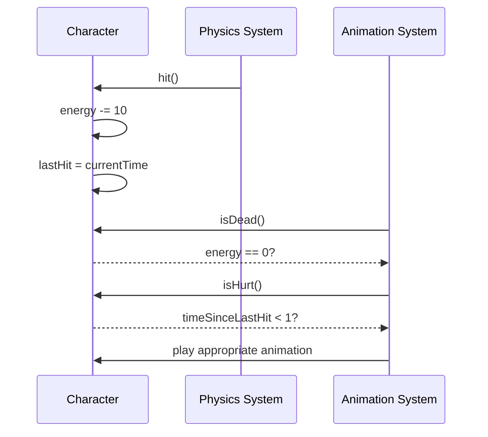

# Physics Implementation

<cite>
**Referenced Files in This Document**  
- [movable-objects.class.js](file://models/movable-objects.class.js)
- [character.class.js](file://models/character.class.js)
</cite>

## Table of Contents
1. [Introduction](#introduction)
2. [Gravity System](#gravity-system)
3. [Collision Detection](#collision-detection)
4. [Energy Management System](#energy-management-system)
5. [Integration Between Character and MovableObjects](#integration-between-character-and-movableobjects)
6. [Common Issues and Solutions](#common-issues-and-solutions)
7. [Performance Considerations](#performance-considerations)
8. [Conclusion](#conclusion)

## Introduction
This document details the physics implementation for the character in the game, focusing on three core systems: gravity, collision detection, and energy management. The physics engine is built upon the inheritance relationship between the `Character` class and the base `MovableObjects` class, which provides shared functionality for all moving entities in the game world. The system operates at 60 frames per second to ensure smooth motion and responsive gameplay.

## Gravity System

The gravity system creates realistic falling motion through the `applyGravity()` method in the `MovableObjects` class. This method uses a continuous interval loop running at 1000/60ms (approximately 60fps) to simulate real-time physics updates. The system employs two key properties: `speedY` representing vertical velocity and `acceleration` set to 0.3 for natural-looking gravity.

When a character is above ground level, the system updates the object's vertical position (`y`) by subtracting the current `speedY` value, then reduces `speedY` by the acceleration constant. This creates the effect of increasing downward speed over time, simulating gravitational pull. The `isAboveGround()` method determines ground contact by checking if the projected next position (current y minus speedY) is above the ground level threshold. When contact is detected, the character's position is fixed at the ground level to prevent falling through the terrain.

**Diagram sources**
- [movable-objects.class.js](file://models/movable-objects.class.js#L14-L23)
- [movable-objects.class.js](file://models/movable-objects.class.js#L25-L27)

**Section sources**
- [movable-objects.class.js](file://models/movable-objects.class.js#L14-L27)

## Collision Detection

The collision system uses precise bounding box calculations to detect interactions between game objects. The `isColliding()` method implements a comprehensive overlap check that accounts for sprite dimensions and offset values. Each object has four `rectOffset` properties (`rectOffsetLeft`, `rectOffsetTop`, `rectOffsetRight`, `rectOffsetBottom`) that define an inner collision box within the sprite's total dimensions.

These offset values prevent false collisions that would occur if the entire sprite boundary were used, particularly important for characters with transparent edges or irregular shapes. The collision detection algorithm checks four conditions: right edge of first object exceeds left edge of second, bottom edge of first exceeds top edge of second, left edge of first is less than right edge of second, and top edge of first is less than bottom edge of second. Only when all four conditions are met is a collision registered.

**Diagram sources**
- [movable-objects.class.js](file://models/movable-objects.class.js#L10-L12)
- [character.class.js](file://models/character.class.js#L8-L11)

**Section sources**
- [movable-objects.class.js](file://models/movable-objects.class.js#L29-L34)
- [character.class.js](file://models/character.class.js#L8-L11)

## Energy Management System

The energy system tracks character health and state through several interrelated methods and properties. The `hit()` method reduces the character's energy by 10 points per hit, with a minimum threshold of 0 to prevent negative values. Upon taking damage, the method records the current timestamp in the `lastHit` property, which is crucial for determining temporary invulnerability periods.

The `isHurt()` method calculates the time elapsed since the last hit by comparing the current timestamp with `lastHit`. If less than 1 second has passed, the method returns true, indicating the character is still in a hurt state. The `isDead()` method provides a simple but critical check by returning true when energy reaches zero, triggering the death animation sequence. These state checks are used in the animation system to determine which visual state to display.

**Diagram sources**
- [movable-objects.class.js](file://models/movable-objects.class.js#L36-L49)
- [character.class.js](file://models/character.class.js#L130-L150)

**Section sources**
- [movable-objects.class.js](file://models/movable-objects.class.js#L36-L53)

## Integration Between Character and MovableObjects

The `Character` class inherits from `MovableObjects`, establishing a clear relationship where the character benefits from the base physics implementation while adding character-specific behaviors. In the constructor, the character initializes its unique properties including height, width, ground level, and sprite offsets, then calls `applyGravity()` with its specific ground level to activate the physics system.

The animation system in the `animate()` method integrates tightly with the physics state checks. It uses `isAboveGround()` to determine if the character should display jumping animations, and `isHurt()` and `isDead()` to trigger appropriate visual feedback. Movement controls respond to keyboard input by calling inherited methods like `moveRight()` and `moveLeft()`, while respecting physics constraints such as only allowing jumps when grounded.

**Section sources**
- [character.class.js](file://models/character.class.js#L1-L152)
- [movable-objects.class.js](file://models/movable-objects.class.js#L1-L76)

## Common Issues and Solutions

### Floating Characters
Floating characters occur when the gravity system fails to properly detect ground contact. This can happen due to imprecise ground level calculations or timing issues in the interval loop. The solution involves ensuring the ground level value accounts for the character's height and verifying that the `isAboveGround()` calculation correctly projects the next position.

### Inaccurate Collision Detection
False collisions often result from improper `rectOffset` values that don't match the sprite's actual hitbox. Developers should visually debug collision boxes by temporarily rendering them on screen and adjusting offset values until they accurately represent the character's solid areas. The current implementation with left=50, top=110, right=100, and bottom=125 suggests a carefully tuned collision box that excludes the character's extremities.

### Energy State Desync
Energy state desynchronization can occur when multiple hit events happen rapidly or when timestamp calculations are affected by system performance. Validating that `lastHit` is only updated when energy remains above zero prevents invalid state transitions. Additionally, using `Date().getTime()` ensures millisecond precision for accurate hurt state duration tracking.

**Section sources**
- [movable-objects.class.js](file://models/movable-objects.class.js#L36-L49)
- [movable-objects.class.js](file://models/movable-objects.class.js#L25-L27)

## Performance Considerations

The physics system operates efficiently by using fixed 60fps intervals that align with typical display refresh rates, preventing unnecessary calculations. The gravity loop runs independently of other game systems, ensuring consistent physics behavior regardless of other processing loads.

Collision detection uses simple arithmetic comparisons rather than computationally expensive operations, making it suitable for frequent execution. The energy system minimizes calculations by storing the `lastHit` timestamp and only computing time differences when needed, rather than continuously updating a countdown timer.

For optimization, developers could implement spatial partitioning to reduce collision checks between distant objects, or use requestAnimationFrame instead of setInterval for better browser integration. However, the current implementation appears well-suited for the game's scope and performance requirements.

**Section sources**
- [movable-objects.class.js](file://models/movable-objects.class.js#L14-L23)
- [movable-objects.class.js](file://models/movable-objects.class.js#L29-L34)

## Conclusion

The physics implementation provides a robust foundation for character movement and interaction in the game environment. By separating core physics functionality into the `MovableObjects` base class and extending it with character-specific behaviors, the system achieves both reusability and specialization. The integration of gravity, collision detection, and energy management creates a cohesive gameplay experience with realistic motion and responsive feedback. With proper tuning of offset values and careful state management, the system effectively handles the challenges of 2D platformer physics while maintaining good performance characteristics.