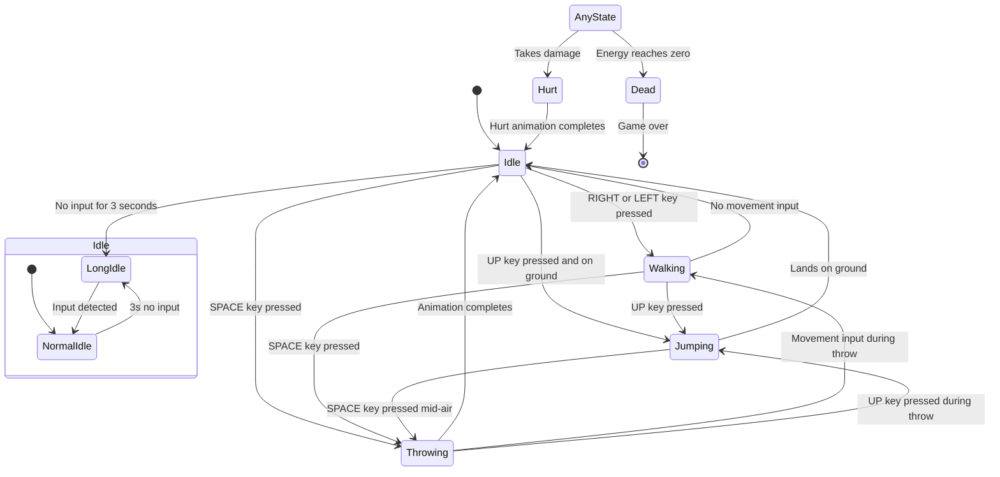
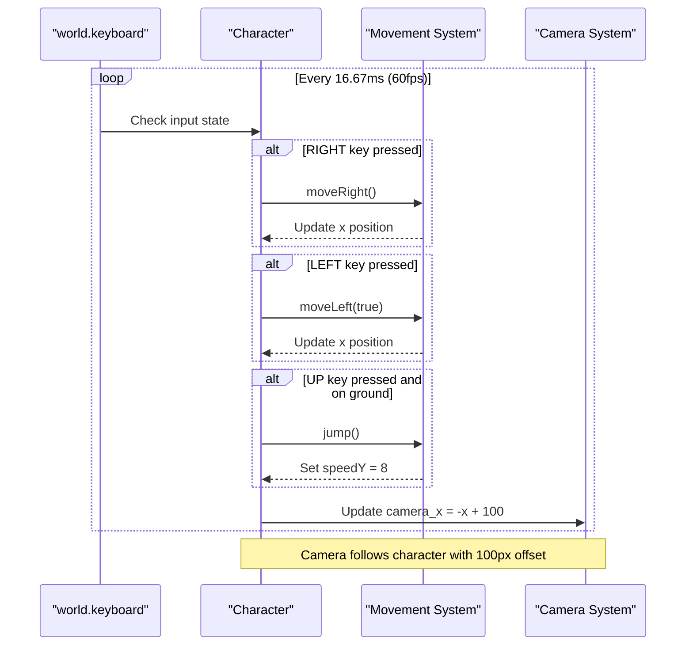

# Character Class (Player Entity)

<cite>
**Referenced Files in This Document**   
- [character.class.js](file://models/character.class.js)
- [movable-objects.class.js](file://models/movable-objects.class.js)
- [drawable-object.class.js](file://models/drawable-object.class.js)
</cite>

## Table of Contents
1. [Introduction](#introduction)
2. [Inheritance Hierarchy](#inheritance-hierarchy)
3. [Core Properties and Initialization](#core-properties-and-initialization)
4. [Animation State Management](#animation-state-management)
5. [Movement and Input Handling](#movement-and-input-handling)
6. [Sleep and Idle Detection Logic](#sleep-and-idle-detection-logic)
7. [Animation Coordination](#animation-coordination)
8. [Implementation Challenges](#implementation-challenges)
9. [Extending the Character Class](#extending-the-character-class)

## Introduction

The Character class represents the player-controlled entity in the game, serving as the central interactive component that responds to user input and environmental conditions. This documentation provides a comprehensive analysis of the Character class, focusing on its inheritance from MovableObjects, extension with player-specific behaviors, and implementation of animation states, movement controls, and state detection logic. The class coordinates multiple animation sequences based on player input and physics state, managing transitions between idle, walking, jumping, throwing, hurt, and dead states.

**Section sources**
- [character.class.js](file://models/character.class.js#L0-L150)

## Inheritance Hierarchy

The Character class follows a three-tier inheritance hierarchy, extending functionality from base classes while adding player-specific behaviors. It inherits from MovableObjects, which in turn extends DrawableObject, creating a layered architecture where each level provides specific capabilities.

```mermaid
classDiagram
class DrawableObject {
+x
+y
+width
+height
+img
+imageCache{}
+currentImage
+loadImage(path)
+loadImages(arr)
+draw(ctx)
+drawFrame(ctx)
+drawCollisionFrame(ctx)
}
class MovableObjects {
+otherDirection
+speedY
+acceleration
+energy
+lastHit
+rectOffsetLeft
+rectOffsetTop
+rectOffsetRight
+rectOffsetBottom
+applyGravity(groundLevel)
+isAboveGround(groundLevel)
+isColliding(mo)
+hit()
+isHurt()
+isDead()
+playAnimation(arr)
+moveRight()
+moveLeft(directionState)
+jump()
}
class Character {
+height
+width
+groundLevel
+speed
+sleep
+rectOffsetLeft
+rectOffsetTop
+rectOffsetRight
+rectOffsetBottom
+world
+imagesIdle[]
+imagesLongIdle[]
+imagesWalk[]
+imagesJump[]
+imagesThrow[]
+imagesHurt[]
+imagesDead[]
+constructor()
+animate()
}
DrawableObject <|-- MovableObjects : "extends"
MovableObjects <|-- Character : "extends"
```

**Diagram sources**
- [character.class.js](file://models/character.class.js#L0-L150)
- [movable-objects.class.js](file://models/movable-objects.class.js#L0-L75)
- [drawable-object.class.js](file://models/drawable-object.class.js#L0-L43)

**Section sources**
- [character.class.js](file://models/character.class.js#L0-L150)
- [movable-objects.class.js](file://models/movable-objects.class.js#L0-L75)
- [drawable-object.class.js](file://models/drawable-object.class.js#L0-L43)

## Core Properties and Initialization

The Character class initializes with specific dimensions, position, and animation assets in its constructor. The initialization process loads all required image assets into memory, sets up gravity physics, and starts the animation system. The constructor demonstrates proper inheritance usage by calling super() to initialize the parent class before setting up character-specific properties.

The class defines several animation image arrays for different states, including idle, walking, jumping, throwing, hurt, and dead animations. Each array contains file paths to the corresponding sprite images, which are preloaded into the imageCache during initialization. The character's physical properties such as height, width, groundLevel, and speed are also established during construction, with the groundLevel calculated relative to the canvas dimensions.

**Section sources**
- [character.class.js](file://models/character.class.js#L85-L98)

## Animation State Management

The Character class manages multiple animation states through dedicated image arrays that correspond to different behavioral conditions. These states include normal idle, long idle (sleep), walking, jumping, throwing, hurt, and dead animations. The state transitions are determined by a combination of input conditions and physics state, with priority given to more critical states like dead and hurt.



**Diagram sources**
- [character.class.js](file://models/character.class.js#L14-L83)
- [character.class.js](file://models/character.class.js#L130-L148)

**Section sources**
- [character.class.js](file://models/character.class.js#L14-L83)
- [character.class.js](file://models/character.class.js#L130-L148)

## Movement and Input Handling

The Character class implements movement controls through keyboard input handling, with direct mapping between key states and character actions. The animate() method contains a setInterval loop that runs at 60fps, continuously checking the world.keyboard state to determine movement actions. The RIGHT and LEFT arrow keys trigger moveRight() and moveLeft() methods respectively, while the UP key initiates jumping when the character is on the ground.

Movement is constrained by level boundaries, with the character prevented from moving beyond the level's end or the left edge of the game world. The camera tracking system is integrated within the movement loop, updating the world.camera_x property to follow the character's position with a fixed offset. This creates a scrolling effect where the game world moves relative to the character's position.



**Diagram sources**
- [character.class.js](file://models/character.class.js#L109-L125)
- [movable-objects.class.js](file://models/movable-objects.class.js#L62-L74)

**Section sources**
- [character.class.js](file://models/character.class.js#L109-L125)
- [movable-objects.class.js](file://models/movable-objects.class.js#L62-L74)

## Sleep and Idle Detection Logic

The Character class implements a sophisticated sleep and idle detection system that transitions between normal idle and long idle (sleep) animations based on player inactivity. This system uses a timer-based approach with debouncing to detect periods of no input. When any keyboard input is detected, the sleep timer is reset, preventing the character from entering the sleep state.

The sleep detection logic employs a closure-based timer system within the animate() method, using setTimeout to set the sleep flag after 3 seconds of inactivity. The resetSleepTimer function clears any existing timeout and restarts the countdown, ensuring that the character only enters the sleep state after a sustained period without input. This creates a more immersive experience where the character appears to rest when the player is not actively controlling it.

```mermaid
flowchart TD
Start([Start Animation]) --> InitializeTimer["Initialize sleepTimer = null"]
InitializeTimer --> ResetTimer["Call resetSleepTimer()"]
ResetTimer --> ClearTimeout["clearTimeout(sleepTimer)"]
ClearTimeout --> SetFlag["Set this.sleep = false"]
SetFlag --> SetTimeout["Set sleepTimer = setTimeout(() => {<br/>this.sleep = true<br/>}, 3000)"]
loop "Every 100ms" {
CheckInput["Check if world.keyboard.ANY is true"]
CheckInput --> HasInput{Input detected?}
HasInput --> |Yes| ResetTimer
HasInput --> |No| Continue
}
SetTimeout --> Wait3s["Wait 3 seconds"]
Wait3s --> SetSleep["Set this.sleep = true"]
SetSleep --> Animate["Animation system uses imagesLongIdle"]
style Start fill:#f9f,stroke:#333
style Animate fill:#bbf,stroke:#333
```

**Diagram sources**
- [character.class.js](file://models/character.class.js#L100-L117)

**Section sources**
- [character.class.js](file://models/character.class.js#L100-L117)

## Animation Coordination

The animate() method coordinates multiple setInterval loops to manage different aspects of character behavior simultaneously. Three distinct intervals run concurrently: one for input-based sleep timer reset (every 100ms), one for movement and camera control (at 60fps), and one for animation state sequencing (every 150ms). This multi-interval approach allows for different update frequencies optimized for each task's requirements.

The animation sequencing loop checks the character's state in a specific priority order: dead > hurt > walking/jumping/throwing > sleep > idle. This ensures that critical states like death and damage take precedence over regular movement animations. The playAnimation() method from the parent MovableObjects class is used to cycle through the appropriate image array, with the currentImage counter incrementing to advance the animation frame.

```mermaid
flowchart LR
A[animate() Method] --> B[Initialize sleepTimer]
B --> C[resetSleepTimer Function]
C --> D[clearTimeout]
D --> E[Set sleep = false]
E --> F[setTimeout 3s]
A --> G[setInterval 100ms]
G --> H[Check world.keyboard.ANY]
H --> I{Input detected?}
I --> |Yes| C
I --> |No| J[Continue]
A --> K[setInterval 16.67ms]
K --> L[Check RIGHT/LEFT/UP keys]
L --> M[Call moveRight/moveLeft/jump]
M --> N[Update world.camera_x]
A --> O[setInterval 150ms]
O --> P[Check isDead()]
P --> Q{Dead?}
Q --> |Yes| R[playAnimation(imagesDead)]
Q --> |No| S[Check isHurt()]
S --> T{Hurt?}
T --> |Yes| U[playAnimation(imagesHurt)]
T --> |No| V[Check movement keys and physics]
V --> W{Moving?}
W --> |Yes| X[playAnimation(imagesWalk)]
W --> |No| Y[Check isAboveGround()]
Y --> Z{Jumping?}
Z --> |Yes| AA[playAnimation(imagesJump)]
Z --> |No| AB[Check SPACE key]
AB --> AC{Throwing?}
AC --> |Yes| AD[playAnimation(imagesThrow)]
AC --> |No| AE[Check sleep]
AE --> AF{Sleeping?}
AF --> |Yes| AG[playAnimation(imagesLongIdle)]
AF --> |No| AH[playAnimation(imagesIdle)]
style A fill:#f96,stroke:#333
style R fill:#f66,stroke:#333
style U fill:#f96,stroke:#333
```

**Diagram sources**
- [character.class.js](file://models/character.class.js#L99-L149)

**Section sources**
- [character.class.js](file://models/character.class.js#L99-L149)
- [movable-objects.class.js](file://models/movable-objects.class.js#L55-L60)

## Implementation Challenges

The Character class addresses several implementation challenges related to input handling, animation synchronization, and camera management. One key challenge is input debouncing for the sleep detection system, which uses a closure-based timer reset mechanism to prevent flickering between idle and sleep states. The 100ms interval for input checking strikes a balance between responsiveness and performance, ensuring smooth detection without excessive CPU usage.

Animation synchronization is managed through the prioritized state checking in the animation loop, ensuring that state transitions occur seamlessly without conflicting animations. The currentImage counter is reset to zero when jumping, ensuring the jump animation starts from the beginning. Camera offset calculation is implemented with a simple but effective formula (world.camera_x = -x + 100), creating a smooth scrolling effect that keeps the character in the left portion of the screen.

The class also handles edge cases such as level boundaries, preventing the character from moving beyond the game world limits. The movement constraints (x < levelEndX + 100 and x > -1340) provide a buffer zone that allows for smooth camera transitions at level boundaries. The integration of physics through the applyGravity() method from the parent class demonstrates proper separation of concerns, with gravity handling delegated to the MovableObjects base class.

**Section sources**
- [character.class.js](file://models/character.class.js#L100-L149)

## Extending the Character Class

Extending the Character class with new abilities or animations follows a consistent pattern demonstrated by the existing implementation. To add a new animation state, developers should define a new image array property (e.g., imagesCrouch) containing the sprite file paths, then add the corresponding loadImages() call in the constructor. The animation sequencing logic in the animate() method can then be extended to check for the new state condition and call playAnimation() with the appropriate image array.

For new abilities, additional keyboard input checks can be added to the movement interval, with corresponding methods implemented either in the Character class or inherited from MovableObjects. The existing structure supports easy extension through the modular animation system and the clear separation between input handling, movement, and animation sequencing. When adding complex abilities with multiple states, developers should consider the priority order in the animation loop to ensure proper state transitions.

**Section sources**
- [character.class.js](file://models/character.class.js#L85-L149)
- [movable-objects.class.js](file://models/movable-objects.class.js#L55-L74)