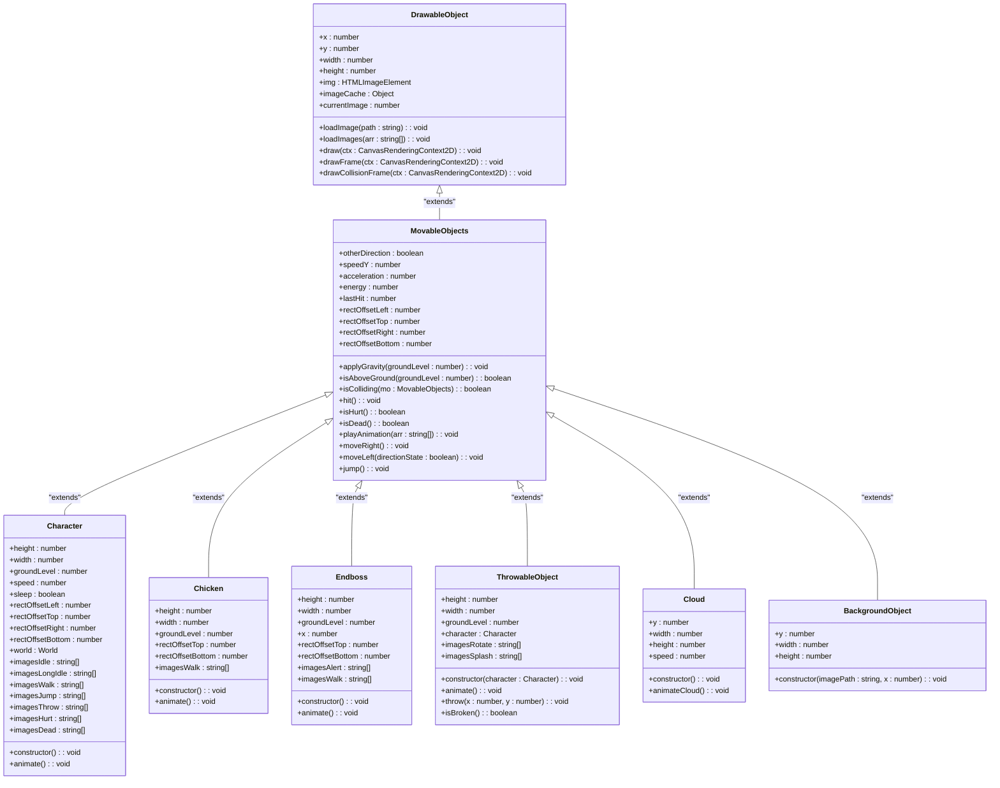

# Class Hierarchy

<cite>
**Referenced Files in This Document**   
- [drawable-object.class.js](file://models/drawable-object.class.js)
- [movable-objects.class.js](file://models/movable-objects.class.js)
- [character.class.js](file://models/character.class.js)
- [chicken.class.js](file://models/chicken.class.js)
- [endboss.class.js](file://models/endboss.class.js)
- [thowable-object.class.js](file://models/thowable-object.class.js)
- [clouds.class.js](file://models/clouds.class.js)
- [background-object.class.js](file://models/background-object.class.js)
</cite>

## Table of Contents
1. [Introduction](#introduction)
2. [Base Class: DrawableObject](#base-class-drawableobject)
3. [Intermediate Class: MovableObjects](#intermediate-class-movableobjects)
4. [Inheritance Hierarchy Overview](#inheritance-hierarchy-overview)
5. [Detailed Component Analysis](#detailed-component-analysis)
6. [Polymorphic Behavior in addObjectsToMap()](#polymorphic-behavior-in-addobjectstomap)
7. [Common Inheritance Issues](#common-inheritance-issues)
8. [Conclusion](#conclusion)

## Introduction
This document provides a comprehensive analysis of the class inheritance structure in the game, detailing how all game entities are organized through a hierarchical system starting from the base `DrawableObject` class. The inheritance model enables code reuse, consistent behavior across objects, and modular design. The hierarchy includes intermediate classes like `MovableObjects` and specific implementations for characters, enemies, projectiles, and decorative elements.

## Base Class: DrawableObject
The `DrawableObject` class serves as the foundation for all visual entities in the game. It encapsulates core rendering functionality and image management, providing a consistent interface for drawing and loading assets.

### Key Properties
- `x`, `y`: Position coordinates
- `width`, `height`: Dimensions of the object
- `img`: Current image reference
- `imageCache`: Storage for preloaded images
- `currentImage`: Index tracker for animation sequences

### Core Methods
- `loadImage(path)`: Loads a single image from the specified path
- `loadImages(arr)`: Preloads multiple images into the cache
- `draw(ctx)`: Renders the object on the canvas context
- `drawFrame(ctx)`: Draws a blue bounding box around the object (for debugging)
- `drawCollisionFrame(ctx)`: Draws a red collision detection frame (for debugging)

These methods are designed to be inherited and used by all subclasses, ensuring uniform rendering behavior across the game.

**Section sources**
- [drawable-object.class.js](file://models/drawable-object.class.js#L0-L43)

## Intermediate Class: MovableObjects
The `MovableObjects` class extends `DrawableObject` and introduces physics-based movement, collision detection, and animation capabilities. It acts as a common parent for all dynamic game entities.

### Key Properties
- `speed`, `acceleration`: Movement physics parameters
- `speedY`: Vertical speed for gravity simulation
- `energy`: Health or durability value
- `lastHit`: Timestamp of the last hit (for invulnerability)
- `rectOffset*`: Collision box adjustment values
- `otherDirection`: Direction state flag

### Core Methods
- `applyGravity(groundLevel)`: Implements gravity with interval-based updates
- `isAboveGround(groundLevel)`: Determines if object is airborne
- `isColliding(mo)`: Checks collision with another movable object
- `hit()`: Reduces energy and records hit time
- `isHurt()`: Determines if object is in hurt state
- `isDead()`: Checks if energy is depleted
- `playAnimation(arr)`: Cycles through animation frames
- `moveRight()`, `moveLeft(directionState)`: Horizontal movement
- `jump()`: Initiates upward movement

This class provides the essential mechanics for interactive game objects while maintaining the rendering capabilities from its parent.

**Section sources**
- [movable-objects.class.js](file://models/movable-objects.class.js#L0-L75)

## Inheritance Hierarchy Overview
The game's object system follows a clear inheritance pattern that promotes code reuse and consistent behavior. The hierarchy enables specialized functionality while maintaining common interfaces.

**Diagram sources**
- [drawable-object.class.js](file://models/drawable-object.class.js#L0-L43)
- [movable-objects.class.js](file://models/movable-objects.class.js#L0-L75)
- [character.class.js](file://models/character.class.js#L0-L150)
- [chicken.class.js](file://models/chicken.class.js#L0-L34)
- [endboss.class.js](file://models/endboss.class.js#L0-L40)
- [thowable-object.class.js](file://models/thowable-object.class.js#L0-L82)
- [clouds.class.js](file://models/clouds.class.js#L0-L17)
- [background-object.class.js](file://models/background-object.class.js#L0-L9)

## Detailed Component Analysis

### Character Class
The `Character` class represents the player-controlled entity and inherits all movement and rendering capabilities from `MovableObjects`. It adds specialized animations and input handling.

**Key Features:**
- Multiple animation sequences (idle, walking, jumping, throwing, hurt, dead)
- Sleep/idle state management with timer
- Keyboard input integration for movement and actions
- Camera tracking system
- Comprehensive animation state machine

The class demonstrates how specialized behavior can be added while leveraging the base functionality for physics and rendering.

**Section sources**
- [character.class.js](file://models/character.class.js#L0-L150)

### Enemy Classes: Chicken and Endboss
Both enemy types inherit from `MovableObjects` but implement different behaviors and visual characteristics.

#### Chicken
- Simple leftward movement pattern
- Randomized starting position and speed
- Basic walking animation
- Minimal collision detection

#### Endboss
- Alert and walking animation states
- Fixed starting position
- More complex visual representation
- Larger hitbox and energy pool

These classes show how the same base functionality can be adapted for different enemy types with varying complexity.

**Section sources**
- [chicken.class.js](file://models/chicken.class.js#L0-L34)
- [endboss.class.js](file://models/endboss.class.js#L0-L40)

### ThrowableObject Class
This class represents projectiles (salsa bottles) thrown by the character and demonstrates specialized physics and animation.

**Key Features:**
- Constructor takes character reference for positioning
- Direction-based throwing mechanics
- Rotation animation while airborne
- Splash animation on ground impact
- Dynamic size adjustment based on image dimensions

The class shows how game mechanics can be encapsulated in specialized objects that still share the core inheritance structure.

**Section sources**
- [thowable-object.class.js](file://models/thowable-object.class.js#L0-L82)

### Decorative Elements: Clouds and BackgroundObject
These classes represent non-interactive visual elements that enhance the game environment.

#### Cloud
- Large background clouds with slow leftward movement
- Randomized starting positions
- Simple animation loop

#### BackgroundObject
- Static background elements
- Constructor accepts image path and position
- No animation or physics required

These classes demonstrate how even non-interactive elements share the same rendering system, ensuring visual consistency.

**Section sources**
- [clouds.class.js](file://models/clouds.class.js#L0-L17)
- [background-object.class.js](file://models/background-object.class.js#L0-L9)

## Polymorphic Behavior in addObjectsToMap()
The inheritance structure enables polymorphic behavior in the game's rendering and update systems. The `addObjectsToMap()` method (or similar rendering loop) can treat all objects uniformly despite their different types.

When iterating through game objects, the system can:
1. Call `draw(ctx)` on any object regardless of its specific type
2. Use `isColliding()` for collision detection between different object types
3. Apply gravity uniformly through `applyGravity()`
4. Handle animations through `playAnimation()`

This polymorphism allows the game engine to process diverse entities through a common interface, reducing code complexity and improving maintainability. For example, the same rendering loop can handle characters, enemies, projectiles, and decorative elements without type-specific logic.

The instanceof checks in `drawFrame()` and `drawCollisionFrame()` demonstrate controlled polymorphic behavior where certain visualizations are only applied to specific object types (Character, Chicken, Endboss).

**Section sources**
- [drawable-object.class.js](file://models/drawable-object.class.js#L27-L41)
- [movable-objects.class.js](file://models/movable-objects.class.js#L55-L60)

## Common Inheritance Issues

### Method Overriding Conflicts
The current implementation avoids method overriding conflicts by generally extending rather than replacing parent methods. However, potential issues could arise if:
- Subclasses need to modify core physics behavior
- Animation systems require different timing mechanisms
- Collision detection needs type-specific adjustments

The architecture mitigates these risks by using composition (animation arrays) rather than overriding core methods.

### Property Shadowing
Property shadowing occurs when subclasses redefine properties from parent classes:
- `height` and `width` are redefined in all subclasses
- `rectOffset*` properties are redefined with specific values
- `groundLevel` is recalculated based on height

This pattern is intentional and allows each entity type to have appropriate dimensions while maintaining the same property interface.

### Tight Coupling
The inheritance hierarchy creates some tight coupling between classes:
- `ThrowableObject` depends on `Character` for throwing mechanics
- Animation arrays are hardcoded in constructors
- Ground level calculations are repeated across classes

While this coupling enables consistent behavior, it reduces flexibility for future modifications. The use of setInterval in multiple classes also creates potential memory leak risks if objects are not properly cleaned up.

**Section sources**
- [character.class.js](file://models/character.class.js#L0-L150)
- [thowable-object.class.js](file://models/thowable-object.class.js#L0-L82)
- [movable-objects.class.js](file://models/movable-objects.class.js#L0-L75)

## Conclusion
The class inheritance structure in this game provides a robust foundation for object-oriented game development. By organizing entities through a clear hierarchy starting from `DrawableObject` and extending through `MovableObjects`, the system achieves significant code reuse and consistent behavior across all game entities.

The architecture effectively separates concerns:
- Rendering in `DrawableObject`
- Physics and movement in `MovableObjects`
- Specialized behavior in concrete classes

This design enables polymorphic treatment of diverse game objects while allowing for specialized functionality where needed. The system demonstrates effective use of inheritance for game development, though some tight coupling and property shadowing could be addressed in future refactors.

The inheritance model successfully reduces code duplication, maintains consistent behavior, and provides a clear structure for adding new game entities.