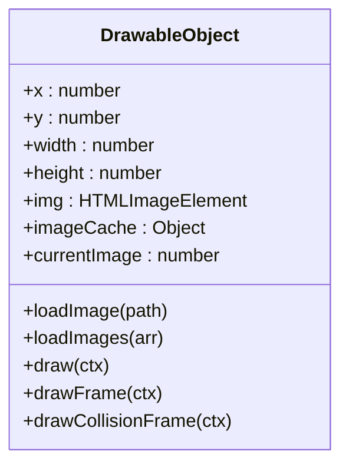
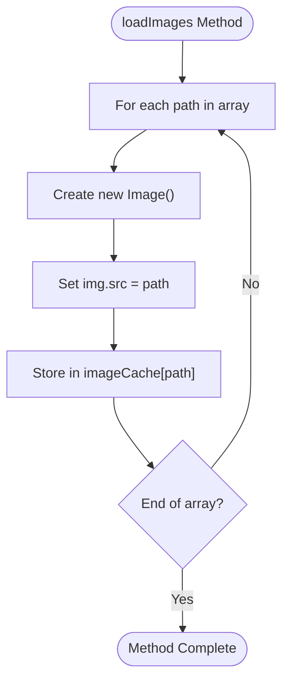
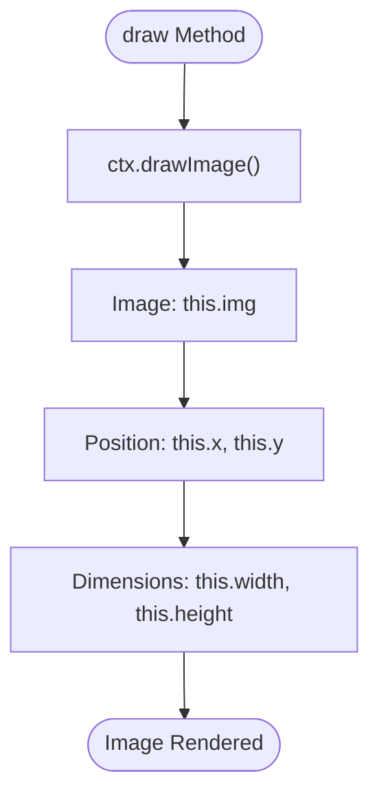
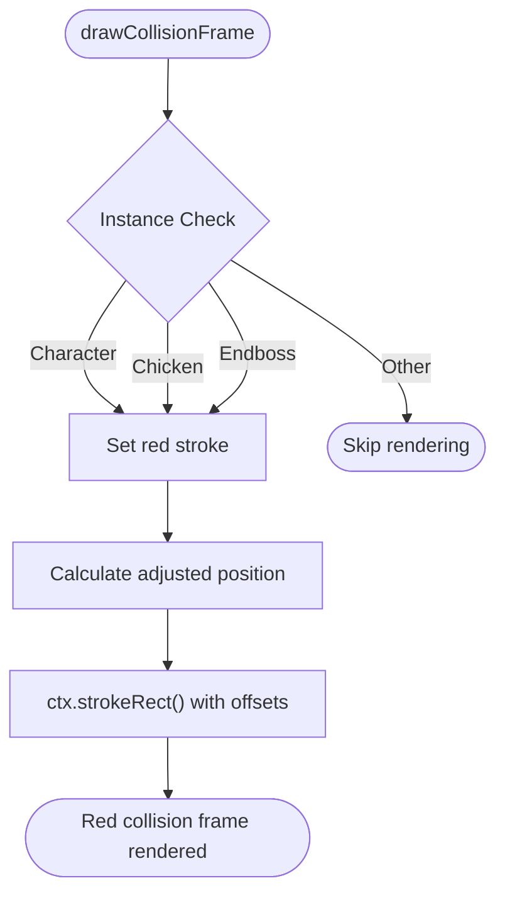
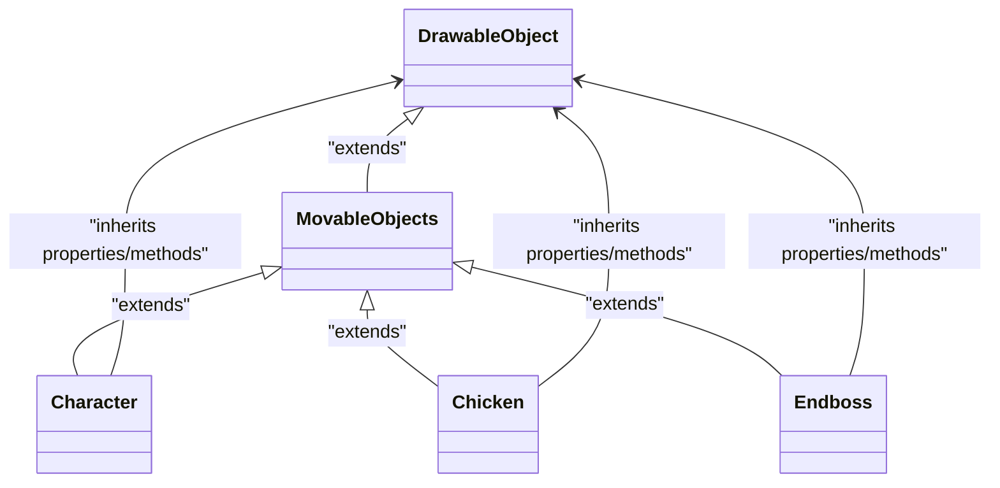
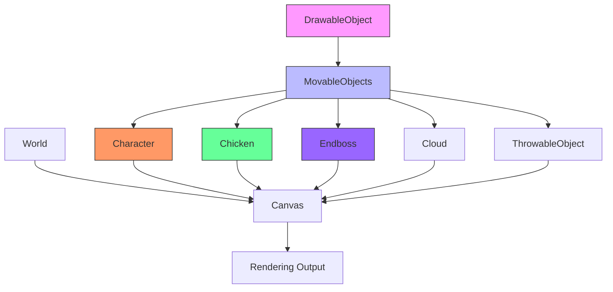

# DrawableObject Base Class

<cite>
**Referenced Files in This Document**   
- [drawable-object.class.js](file://models/drawable-object.class.js)
- [character.class.js](file://models/character.class.js)
- [chicken.class.js](file://models/chicken.class.js)
- [endboss.class.js](file://models/endboss.class.js)
- [movable-objects.class.js](file://models/movable-objects.class.js)
- [1-game.js](file://js/1-game.js)
</cite>

## Table of Contents
1. [Introduction](#introduction)
2. [Core Properties](#core-properties)
3. [Image Loading System](#image-loading-system)
4. [Rendering Methods](#rendering-methods)
5. [Debug Visualization](#debug-visualization)
6. [Inheritance and Child Classes](#inheritance-and-child-classes)
7. [Performance Considerations](#performance-considerations)
8. [Implementation Examples](#implementation-examples)
9. [Architecture Overview](#architecture-overview)

## Introduction

The DrawableObject class serves as the foundational base class for all visual entities in the game, providing essential functionality for image management, rendering, and debug visualization. As the root of the game's visual hierarchy, it establishes shared properties and methods that enable consistent behavior across all drawable game elements. This documentation provides a comprehensive analysis of the DrawableObject class, detailing its role in managing visual components, image loading, and rendering operations.

**Section sources**
- [drawable-object.class.js](file://models/drawable-object.class.js#L0-L45)

## Core Properties

The DrawableObject class defines fundamental properties that establish the basic characteristics of all visual game entities. These properties include position coordinates (x, y), dimensional attributes (width, height), and visual state management (img, currentImage). The class also maintains an imageCache object for efficient sprite management, allowing child classes to preload and access multiple images without redundant loading operations. These shared properties create a consistent interface for positioning and sizing visual elements throughout the game world.

**Diagram sources**
- [drawable-object.class.js](file://models/drawable-object.class.js#L0-L45)

**Section sources**
- [drawable-object.class.js](file://models/drawable-object.class.js#L0-L45)

## Image Loading System

The DrawableObject class implements a dual-image loading system through the loadImage and loadImages methods, enabling both single image loading and batch sprite preloading. The loadImage method creates a new Image object and sets its source to the specified path, while the loadImages method iterates through an array of image paths, creating and caching each image in the imageCache object. This caching mechanism prevents redundant image loading operations and improves performance by ensuring images are loaded only once and reused across animation sequences.

**Diagram sources**
- [drawable-object.class.js](file://models/drawable-object.class.js#L15-L21)

**Section sources**
- [drawable-object.class.js](file://models/drawable-object.class.js#L10-L21)

## Rendering Methods

The draw method provides the fundamental rendering capability for all drawable objects, utilizing the canvas 2D context to render the current image at the object's specified position and dimensions. This method serves as the primary interface between the game's visual elements and the rendering engine, ensuring consistent drawing behavior across all child classes. The method leverages the canvas drawImage function with four parameters: the image source, x-coordinate, y-coordinate, width, and height, enabling proper scaling and positioning of visual elements.

**Diagram sources**
- [drawable-object.class.js](file://models/drawable-object.class.js#L23-L25)

**Section sources**
- [drawable-object.class.js](file://models/drawable-object.class.js#L23-L25)

## Debug Visualization

The DrawableObject class includes two specialized methods for debug visualization: drawFrame and drawCollisionFrame. These methods render visual overlays that assist in development and debugging by displaying hitboxes and collision boundaries. The drawFrame method renders a blue rectangle representing the object's full bounding box, while the drawCollisionFrame method renders a red rectangle representing the adjusted collision area that accounts for sprite padding offsets. Both methods conditionally render only for specific object types (Character, Chicken, Endboss), ensuring debug visuals appear only where needed.

**Diagram sources**
- [drawable-object.class.js](file://models/drawable-object.class.js#L35-L41)

**Section sources**
- [drawable-object.class.js](file://models/drawable-object.class.js#L27-L41)

## Inheritance and Child Classes

The DrawableObject class serves as the foundation for a hierarchy of game entities through inheritance. The MovableObjects class extends DrawableObject, adding physics and movement capabilities, while Character, Chicken, and Endboss classes further extend this hierarchy with specialized behaviors. Child classes leverage the image loading system by preloading animation frames in their constructors, demonstrating the reusability of the base class functionality. The inheritance chain enables code reuse while allowing specialized classes to override or extend base functionality as needed.

**Diagram sources**
- [drawable-object.class.js](file://models/drawable-object.class.js#L0-L45)
- [movable-objects.class.js](file://models/movable-objects.class.js#L0-L75)
- [character.class.js](file://models/character.class.js#L0-L150)
- [chicken.class.js](file://models/chicken.class.js#L0-L34)
- [endboss.class.js](file://models/endboss.class.js#L0-L40)

**Section sources**
- [movable-objects.class.js](file://models/movable-objects.class.js#L0-L75)
- [character.class.js](file://models/character.class.js#L0-L150)
- [chicken.class.js](file://models/chicken.class.js#L0-L34)
- [endboss.class.js](file://models/endboss.class.js#L0-L40)

## Performance Considerations

The DrawableObject class incorporates several performance optimizations, particularly in image management and rendering operations. The imageCache system prevents redundant image loading by storing loaded images for reuse, reducing network requests and memory usage. The conditional rendering of debug frames ensures that performance-intensive drawing operations occur only when necessary and only for specific object types. Additionally, the separation of image loading from rendering allows for asynchronous resource loading, preventing frame drops during gameplay. These optimizations collectively contribute to smooth game performance while maintaining visual fidelity.

**Section sources**
- [drawable-object.class.js](file://models/drawable-object.class.js#L10-L45)

## Implementation Examples

Child classes demonstrate practical implementation of the DrawableObject's functionality through image preloading and animation management. The Character class, for example, preloads multiple animation sequences (idle, walking, jumping) in its constructor, utilizing both loadImage and loadImages methods to prepare all necessary sprites. Similarly, the Chicken and Endboss classes preload their respective animation frames, establishing a consistent pattern of resource preparation at object initialization. These implementations showcase how the base class methods are leveraged to create efficient, performant visual entities.

**Section sources**
- [character.class.js](file://models/character.class.js#L100-L115)
- [chicken.class.js](file://models/chicken.class.js#L20-L25)
- [endboss.class.js](file://models/endboss.class.js#L20-L25)

## Architecture Overview

The DrawableObject class sits at the base of the game's visual entity hierarchy, providing essential rendering and image management capabilities to all visual components. Its design follows the inheritance pattern, with specialized classes building upon its foundation to create diverse game entities. The class interacts with the canvas rendering context to display visual elements and maintains a cache of loaded images to optimize performance. This architectural approach enables code reuse, consistent behavior across game objects, and efficient resource management throughout the game lifecycle.

**Diagram sources**
- [drawable-object.class.js](file://models/drawable-object.class.js#L0-L45)
- [movable-objects.class.js](file://models/movable-objects.class.js#L0-L75)
- [character.class.js](file://models/character.class.js#L0-L150)
- [chicken.class.js](file://models/chicken.class.js#L0-L34)
- [endboss.class.js](file://models/endboss.class.js#L0-L40)

**Section sources**
- [drawable-object.class.js](file://models/drawable-object.class.js#L0-L45)
- [movable-objects.class.js](file://models/movable-objects.class.js#L0-L75)