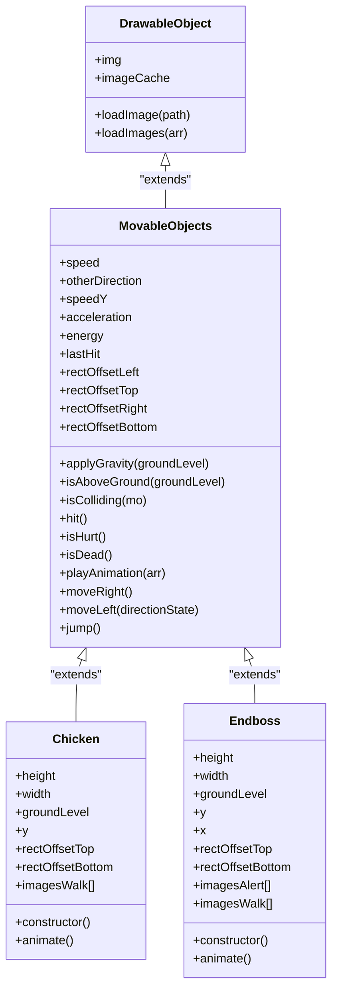
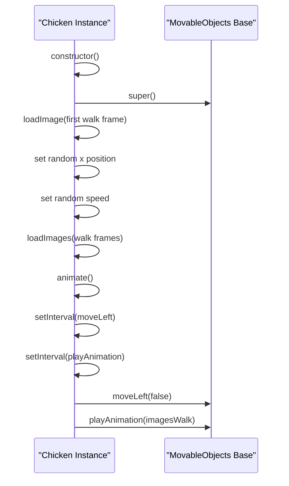
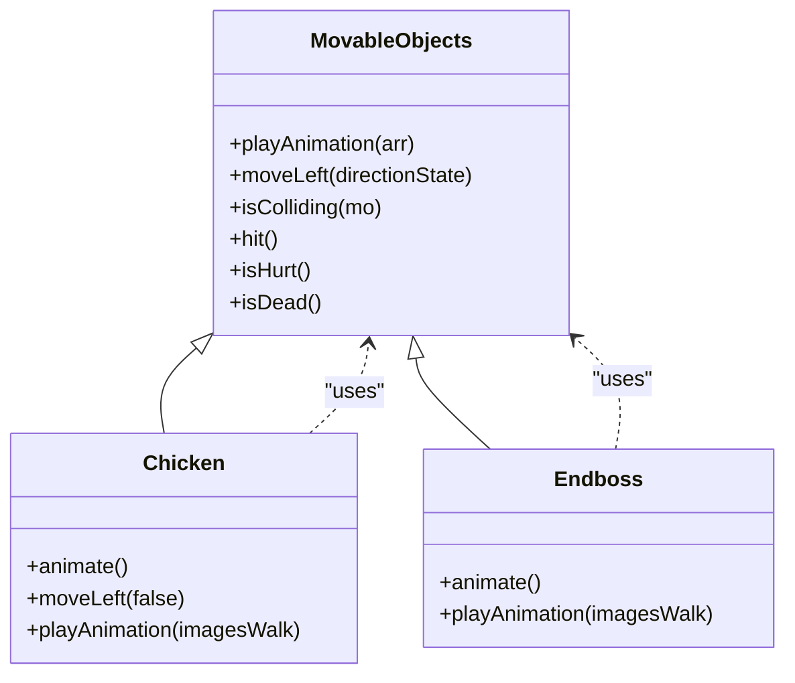
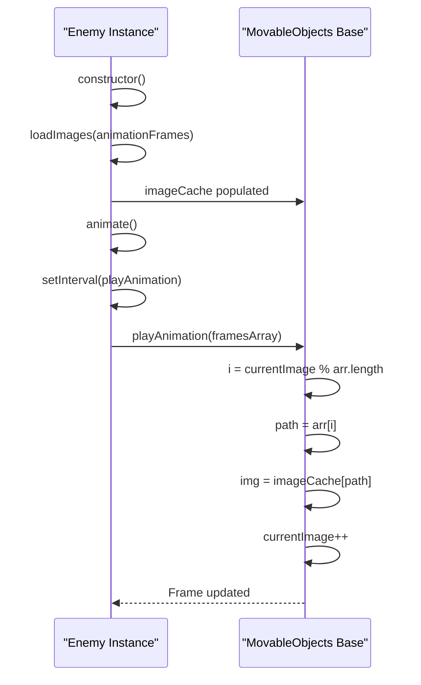
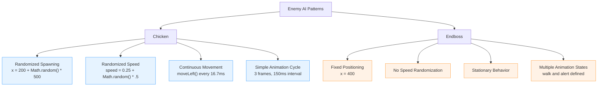
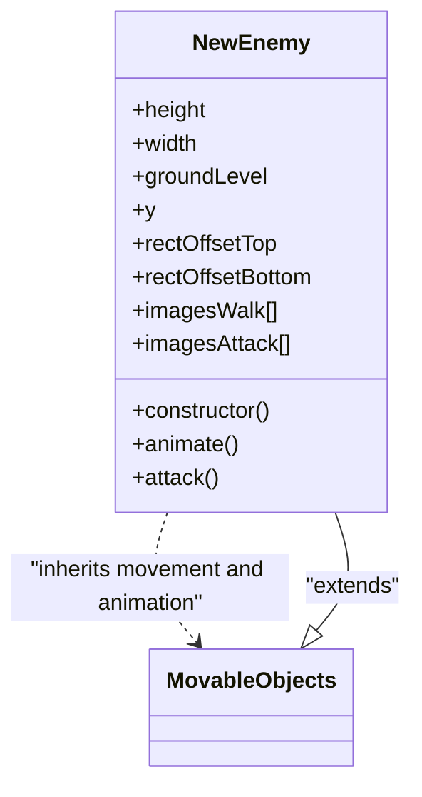

# Enemy Classes (Chicken and Endboss)

<cite>
**Referenced Files in This Document**   
- [chicken.class.js](file://models/chicken.class.js)
- [endboss.class.js](file://models/endboss.class.js)
- [movable-objects.class.js](file://models/movable-objects.class.js)
</cite>

## Table of Contents
1. [Introduction](#introduction)
2. [Core Inheritance Structure](#core-inheritance-structure)
3. [Chicken Class Implementation](#chicken-class-implementation)
4. [Endboss Class Implementation](#endboss-class-implementation)
5. [Shared Behavior Patterns](#shared-behavior-patterns)
6. [Animation System](#animation-system)
7. [Enemy AI Comparison](#enemy-ai-comparison)
8. [Development Considerations](#development-considerations)
9. [Extending Enemy Types](#extending-enemy-types)
10. [Conclusion](#conclusion)

## Introduction
This document provides comprehensive documentation for the enemy entity classes in the game: Chicken and Endboss. Both classes inherit from the MovableObjects base class and implement autonomous behavior through animation loops and movement patterns. The Chicken represents a basic enemy type with randomized spawning and leftward movement, while the Endboss serves as a specialized enemy with fixed positioning and distinct animation states. This documentation explains their implementation details, compares their approaches, and provides guidance for creating new enemy variants.

## Core Inheritance Structure

The enemy classes follow an object-oriented inheritance pattern where both Chicken and Endboss extend the MovableObjects class, which itself inherits from DrawableObject. This hierarchical structure enables code reuse and consistent behavior across different entity types in the game.



**Diagram sources**
- [movable-objects.class.js](file://models/movable-objects.class.js#L1-L77)
- [chicken.class.js](file://models/chicken.class.js#L1-L34)
- [endboss.class.js](file://models/endboss.class.js#L1-L41)

**Section sources**
- [movable-objects.class.js](file://models/movable-objects.class.js#L1-L77)
- [chicken.class.js](file://models/chicken.class.js#L1-L34)
- [endboss.class.js](file://models/endboss.class.js#L1-L41)

## Chicken Class Implementation

The Chicken class represents a basic enemy type that moves from right to left across the game screen. It implements autonomous behavior through its constructor and animation methods, inheriting core functionality from MovableObjects.

### Constructor Initialization
The Chicken constructor initializes the enemy with randomized properties for variety in gameplay. It sets a random x position within a specified range (200 to 700 pixels) and assigns a random speed value between 0.25 and 0.75. This randomization creates unpredictable enemy patterns, enhancing game dynamics.

### Movement Pattern
The Chicken moves continuously to the left using the moveLeft method inherited from MovableObjects. The movement is updated at 60 frames per second through a setInterval loop, ensuring smooth animation. The directionState parameter is set to false, indicating the enemy is facing left.

### Animation Cycle
The Chicken has a walk animation cycle consisting of three frames that loop continuously. The animation plays at 150ms intervals, creating a natural walking motion. The images are preloaded into the imageCache during initialization for optimal performance.



**Diagram sources**
- [chicken.class.js](file://models/chicken.class.js#L15-L34)

**Section sources**
- [chicken.class.js](file://models/chicken.class.js#L1-L34)

## Endboss Class Implementation

The Endboss class represents a specialized enemy type with distinct characteristics compared to basic enemies like Chicken. It implements unique behavior patterns suitable for a boss character while still leveraging the shared inheritance structure.

### Constructor Initialization
The Endboss constructor initializes the boss enemy with fixed positioning at x=400, creating a stationary challenge for the player. Unlike the Chicken, it does not have randomized properties, ensuring consistent boss placement. The initial image is set to the first frame of the walk animation sequence.

### Fixed Position Behavior
Unlike mobile enemies, the Endboss maintains a fixed x position throughout gameplay. This design choice makes it a stationary obstacle that the player must approach, changing the gameplay dynamic compared to chasing mobile enemies.

### Animation States
The Endboss features two distinct animation sequences: walk and alert. Currently, only the walk animation is implemented in the animation loop. The alert animation sequence is defined but not yet utilized, providing a clear extension point for future boss behavior implementation.

```mermaid
flowchart TD
Start([Endboss Creation]) --> Constructor["Endboss Constructor"]
Constructor --> LoadImage["Load Initial Image"]
Constructor --> LoadWalkImages["Load Walk Animation Frames"]
Constructor --> LoadAlertImages["Load Alert Animation Frames"]
Constructor --> StartAnimation["Start Animation Loop"]
StartAnimation --> PlayWalk["Play Walk Animation"]
PlayWalk --> Loop["Loop Every 150ms"]
Loop --> PlayWalk
style LoadAlertImages stroke:#f66,stroke-width:2px
style PlayWalk stroke:#6f6,stroke-width:2px
note right of LoadAlertImages: "Defined but not used<br/>Future extension point"
```

**Diagram sources**
- [endboss.class.js](file://models/endboss.class.js#L25-L41)

**Section sources**
- [endboss.class.js](file://models/endboss.class.js#L1-L41)

## Shared Behavior Patterns

Both enemy classes implement common patterns through inheritance from MovableObjects, ensuring consistency in core functionality while allowing for specialized behavior.

### Inherited Movement Methods
Both classes utilize the moveLeft method from MovableObjects for horizontal movement. The Chicken actively uses this method in its animation loop, while the Endboss could potentially use it for future movement patterns.

### Animation System
Both classes leverage the playAnimation method from MovableObjects to cycle through their respective image arrays. This shared implementation ensures consistent animation timing and frame management across different enemy types.

### Collision Detection
Both enemies inherit the isColliding method from MovableObjects, enabling consistent collision detection with other game entities. The rectOffset properties allow for precise hitbox customization for each enemy type.



**Diagram sources**
- [movable-objects.class.js](file://models/movable-objects.class.js#L50-L77)
- [chicken.class.js](file://models/chicken.class.js#L25-L34)
- [endboss.class.js](file://models/endboss.class.js#L35-L41)

**Section sources**
- [movable-objects.class.js](file://models/movable-objects.class.js#L50-L77)
- [chicken.class.js](file://models/chicken.class.js#L25-L34)
- [endboss.class.js](file://models/endboss.class.js#L35-L41)

## Animation System

The animation system in both enemy classes follows a consistent pattern that enables smooth visual transitions between frames.

### Animation Timing
Both classes use setInterval to control animation timing, but with different intervals based on their visual requirements. The Chicken updates its animation every 150ms, creating a moderate walking pace suitable for a small enemy.

### Frame Management
The playAnimation method in MovableObjects handles frame cycling by using the currentImage counter modulo the array length. This ensures seamless looping of animation sequences without index overflow.

### Image Preloading
Both classes preload their animation frames using the loadImages method during initialization. This prevents rendering delays during gameplay when switching between animation frames.



**Diagram sources**
- [movable-objects.class.js](file://models/movable-objects.class.js#L50-L58)
- [chicken.class.js](file://models/chicken.class.js#L30-L34)
- [endboss.class.js](file://models/endboss.class.js#L35-L41)

## Enemy AI Comparison

The implementation approaches for Chicken and Endboss demonstrate different design philosophies for enemy behavior in the game.

### Mobility Patterns
The Chicken implements dynamic mobility with randomized spawning and continuous leftward movement, creating a flowing stream of basic enemies. In contrast, the Endboss uses static positioning, serving as a fixed obstacle that requires different player strategies.

### Complexity Levels
The Chicken represents a simple enemy type with minimal state management, focusing on basic movement and animation. The Endboss, while currently simple, is designed for greater complexity with multiple animation states (walk and alert) that can be expanded for sophisticated boss behaviors.

### Scalability Design
Both classes demonstrate scalable design patterns. The Chicken's randomized parameters can be easily adjusted to create variations in speed and spawn frequency. The Endboss's defined but unused alert animation provides a clear path for implementing state-based behavior transitions.



**Diagram sources**
- [chicken.class.js](file://models/chicken.class.js#L15-L25)
- [endboss.class.js](file://models/endboss.class.js#L10-L25)

## Development Considerations

When working with the enemy classes, several development issues and considerations should be addressed.

### Pathing Limitations
The current implementation lacks boundary checking for enemy movement. The Chicken will continue moving left indefinitely, potentially leaving the visible game area. Future implementations should include position validation to either remove off-screen enemies or implement patrol patterns.

### Animation Timing
The animation intervals (150ms) may need adjustment based on performance testing. On lower-end devices, these intervals might cause animation stuttering. Consider implementing frame-rate independent animation timing using requestAnimationFrame.

### Resource Management
Both classes load their images during construction, which could lead to memory issues with large numbers of enemies. Implement lazy loading or object pooling to optimize resource usage in high-density enemy scenarios.

### Code Duplication
The animation setup pattern (loadImage followed by loadImages) is duplicated in both constructors. Consider moving this to a base class method or creating a utility function to reduce code duplication.

## Extending Enemy Types

Creating new enemy variants follows a consistent pattern that leverages the existing inheritance structure.

### Base Extension Pattern
New enemy types should extend MovableObjects and implement their unique behavior through constructor initialization and animation methods. The basic pattern includes:
1. Define enemy-specific properties (height, width, groundLevel)
2. Set up animation frame arrays
3. Initialize in constructor with position and speed parameters
4. Implement animate method with appropriate movement and animation loops

### Customization Points
Key customization points for new enemy types include:
- **Spawning behavior**: Randomized vs. fixed positioning
- **Movement patterns**: Linear, patrol, or complex paths
- **Animation states**: Multiple animation sequences for different behaviors
- **Collision properties**: Custom hitbox dimensions via rectOffset values

### Example Implementation Structure


**Diagram sources**
- [movable-objects.class.js](file://models/movable-objects.class.js#L1-L77)

## Conclusion

The Chicken and Endboss enemy classes demonstrate effective use of inheritance and encapsulation to create diverse enemy behaviors within a consistent framework. By extending the MovableObjects base class, both enemies share core functionality while implementing specialized behavior patterns suited to their roles in the game. The Chicken provides a basic mobile enemy with randomized attributes, while the Endboss offers a foundation for more complex boss mechanics with its multiple animation states. The architecture supports easy extension for additional enemy types, following the established patterns of constructor initialization, animation setup, and autonomous behavior through timed loops. Future development should focus on enhancing the Endboss with state-based behavior and addressing pathing limitations in mobile enemies to create a more engaging gameplay experience.