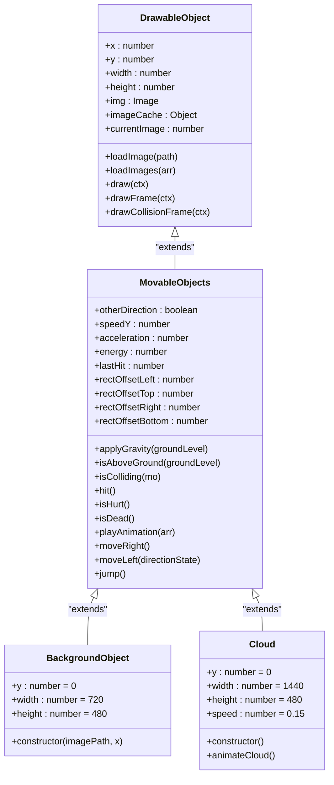
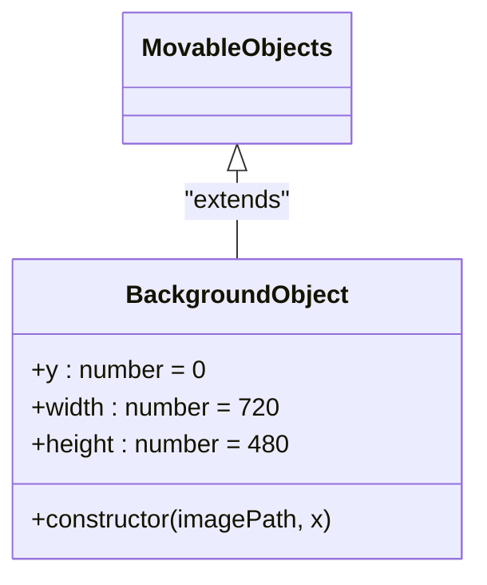
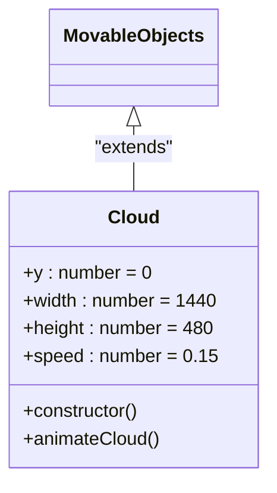
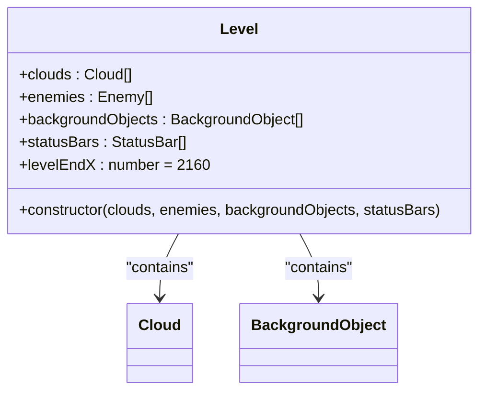

# Environment Classes (BackgroundObject and Clouds)

<cite>
**Referenced Files in This Document**   
- [background-object.class.js](file://models/background-object.class.js)
- [clouds.class.js](file://models/clouds.class.js)
- [movable-objects.class.js](file://models/movable-objects.class.js)
- [drawable-object.class.js](file://models/drawable-object.class.js)
- [level1.js](file://levels/level1.js)
- [level.class.js](file://models/level.class.js)
</cite>

## Table of Contents
1. [Introduction](#introduction)
2. [Core Components](#core-components)
3. [Architecture Overview](#architecture-overview)
4. [Detailed Component Analysis](#detailed-component-analysis)
5. [Level Integration](#level-integration)
6. [Extension Possibilities](#extension-possibilities)
7. [Conclusion](#conclusion)

## Introduction
The Environment Classes (BackgroundObject and Clouds) are fundamental components in creating the visual backdrop and atmospheric depth of the game world. These classes implement static and dynamic background elements that contribute to the game's immersive environment through layered rendering and parallax effects. By extending the MovableObjects class, they leverage existing rendering capabilities while eliminating the need for complex physics or collision detection. This documentation provides a comprehensive analysis of their implementation, integration, and potential for future enhancements.

## Core Components

The BackgroundObject and Clouds classes serve as specialized implementations of the game's visual environment system. BackgroundObject manages static background layers, while Clouds introduces animated atmospheric elements. Both classes inherit from MovableObjects, allowing them to participate in the game's rendering pipeline without requiring physics calculations or collision detection. Their design emphasizes performance efficiency through simple rendering operations and strategic positioning within the canvas layering system.

**Section sources**
- [background-object.class.js](file://models/background-object.class.js#L0-L9)
- [clouds.class.js](file://models/clouds.class.js#L0-L17)

## Architecture Overview

The environment classes operate within a hierarchical architecture that enables layered background rendering and parallax effects. The inheritance chain from DrawableObject to MovableObjects to the specialized environment classes creates a clean separation of concerns, where rendering capabilities are shared while specific behaviors are implemented at the appropriate level.

**Diagram sources**
- [drawable-object.class.js](file://models/drawable-object.class.js#L0-L45)
- [movable-objects.class.js](file://models/movable-objects.class.js#L0-L76)
- [background-object.class.js](file://models/background-object.class.js#L0-L9)
- [clouds.class.js](file://models/clouds.class.js#L0-L17)

## Detailed Component Analysis

### BackgroundObject Analysis
The BackgroundObject class is designed to position static background elements within the game world. It extends MovableObjects to inherit rendering capabilities while specializing in background layer management. The class maintains a fixed y-coordinate at 0 and standard dimensions of 720x480 pixels, ensuring consistent positioning across the canvas.

#### Class Implementation

**Diagram sources**
- [background-object.class.js](file://models/background-object.class.js#L0-L9)
- [movable-objects.class.js](file://models/movable-objects.class.js#L0-L76)

The constructor accepts two parameters: imagePath for loading the background image and x for horizontal positioning. It calls the parent's loadImage method through super() to initialize the image resource, then sets the x-coordinate. This implementation allows for precise placement of background layers at different horizontal positions to create a seamless, tiled effect across the game world.

**Section sources**
- [background-object.class.js](file://models/background-object.class.js#L0-L9)

### Clouds Analysis
The Cloud class implements animated atmospheric elements that enhance the game's visual depth through movement. Like BackgroundObject, it extends MovableObjects but adds animation functionality to create drifting cloud effects.

#### Class Implementation

**Diagram sources**
- [clouds.class.js](file://models/clouds.class.js#L0-L17)
- [movable-objects.class.js](file://models/movable-objects.class.js#L0-L76)

The Cloud constructor initializes the object with a specific cloud image and assigns a random x-coordinate between 0 and 500 pixels to create natural variation in cloud positioning. It immediately invokes animateCloud() to start the animation loop. The animateCloud method uses setInterval to call moveLeft(false) at 60 frames per second, creating smooth horizontal movement across the screen.

**Section sources**
- [clouds.class.js](file://models/clouds.class.js#L0-L17)

## Level Integration

The environment classes are integrated into the game world through the Level class, which manages collections of background objects and clouds. The level1.js file demonstrates how these classes are instantiated and organized to create a cohesive game environment.

**Diagram sources**
- [level.class.js](file://models/level.class.js#L0-L13)
- [clouds.class.js](file://models/clouds.class.js#L0-L17)
- [background-object.class.js](file://models/background-object.class.js#L0-L9)

In level1.js, multiple BackgroundObject instances are created with different image paths and x-coordinates to form layered background elements. The pattern repeats air, third_layer, second_layer, and first_layer images at x-coordinates of -1440, -720, 0, 720, 1440, and 2160, creating a seamless horizontal tiling effect that spans the entire level width. This strategic placement ensures continuous background rendering as the player character moves through the game world.

**Section sources**
- [level1.js](file://levels/level1.js#L7-L30)
- [level.class.js](file://models/level.class.js#L7-L12)

## Extension Possibilities

The current implementation of the environment classes provides a solid foundation for future enhancements. The inheritance structure and modular design allow for various extension possibilities to enrich the game's visual experience.

### Animated Backgrounds
The existing architecture could be extended to support animated backgrounds by adding animation methods similar to Cloud.animateCloud(). For example, water surfaces could have wave animations, or foliage could have wind effects. These could be implemented by creating new classes that extend BackgroundObject and add animation loops.

### Dynamic Weather Effects
The environment system could be enhanced with dynamic weather effects by introducing state management and conditional rendering. This could include:
- Rain or snow particle systems
- Day-night cycle transitions
- Weather-specific background variations
- Conditional cloud behavior based on weather state

These effects could be managed by a WeatherManager class that coordinates changes across multiple environment elements, maintaining visual consistency while enhancing immersion.

**Section sources**
- [background-object.class.js](file://models/background-object.class.js#L0-L9)
- [clouds.class.js](file://models/clouds.class.js#L0-L17)

## Conclusion

The BackgroundObject and Clouds classes play a crucial role in creating the game's visual composition through efficient rendering of static and animated background elements. By extending MovableObjects, they leverage existing rendering capabilities while avoiding unnecessary physics calculations, contributing to optimal performance. The strategic use of canvas layering and coordinate management ensures visual consistency across the game world, while the modular design allows for future enhancements such as animated backgrounds and dynamic weather effects. These environment classes exemplify effective object-oriented design principles, providing a scalable foundation for creating immersive game worlds.