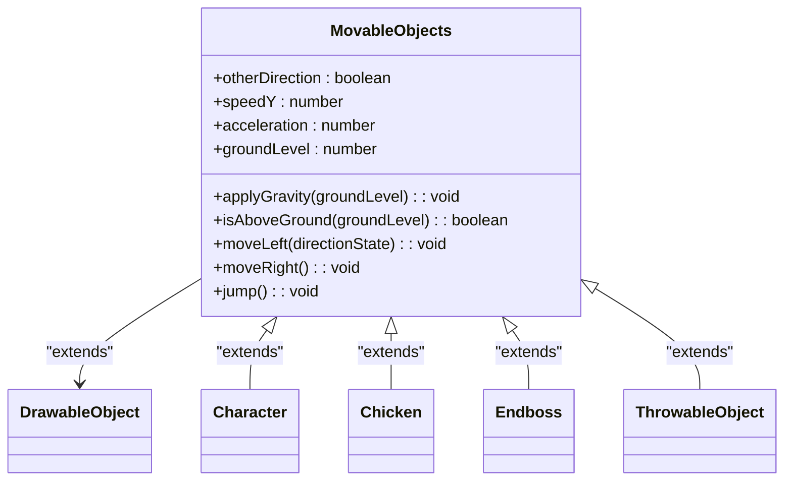
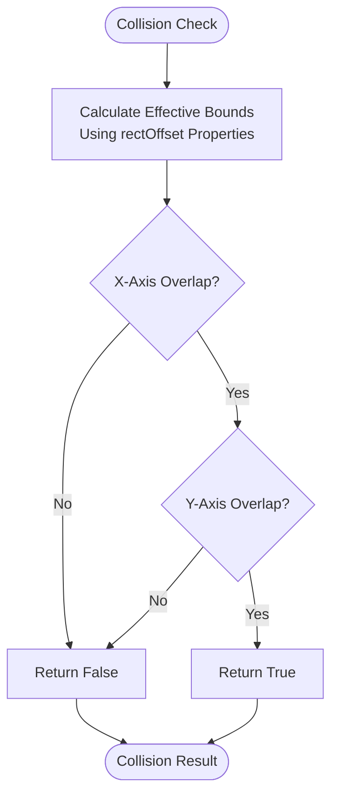
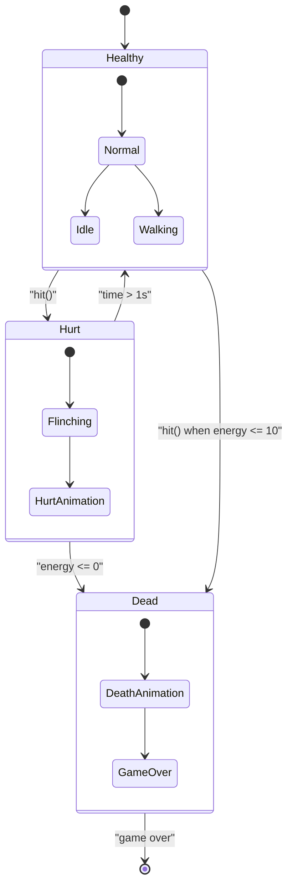
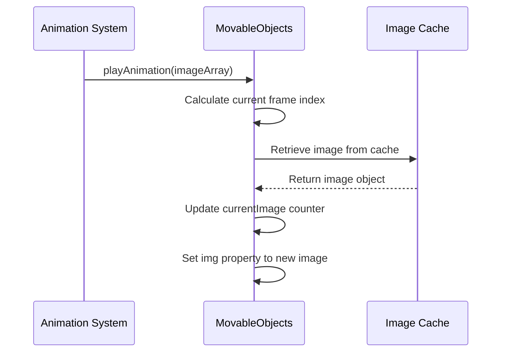
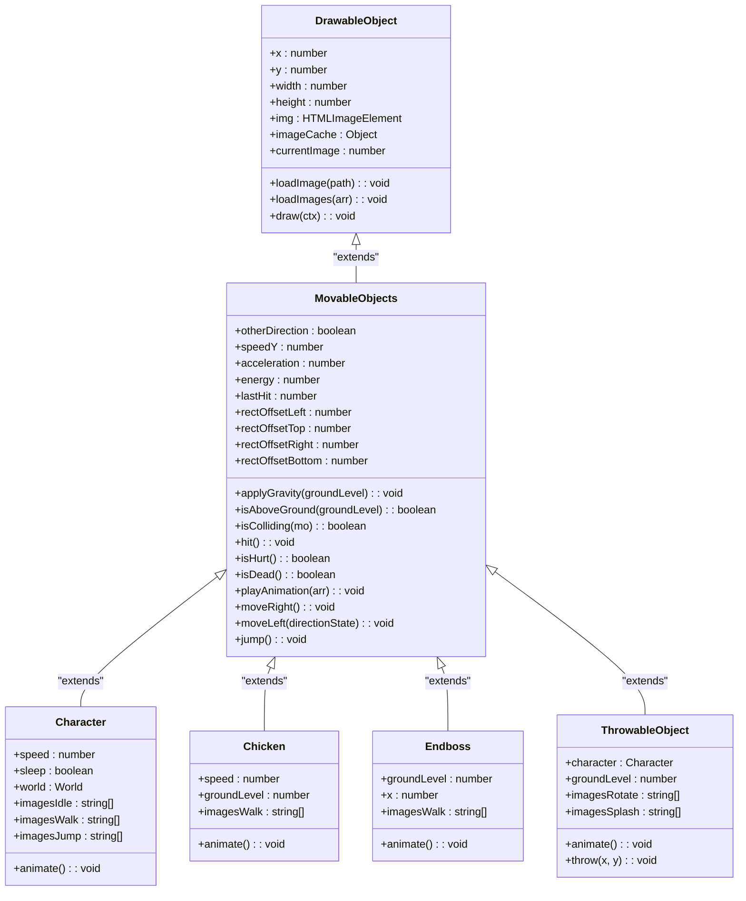
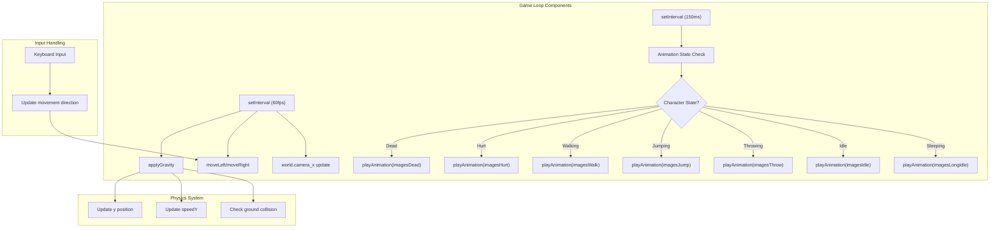

# MovableObjects Intermediate Class

<cite>
**Referenced Files in This Document**   
- [movable-objects.class.js](file://models/movable-objects.class.js)
- [drawable-object.class.js](file://models/drawable-object.class.js)
- [character.class.js](file://models/character.class.js)
- [chicken.class.js](file://models/chicken.class.js)
- [endboss.class.js](file://models/endboss.class.js)
- [thowable-object.class.js](file://models/thowable-object.class.js)
</cite>

## Table of Contents
1. [Introduction](#introduction)
2. [Core Components](#core-components)
3. [Physics and Movement System](#physics-and-movement-system)
4. [Collision Detection and Response](#collision-detection-and-response)
5. [Health and Damage System](#health-and-damage-system)
6. [Animation System](#animation-system)
7. [Inheritance and Class Hierarchy](#inheritance-and-class-hierarchy)
8. [Game Loop and Interval Management](#game-loop-and-interval-management)
9. [Performance Considerations](#performance-considerations)
10. [Common Issues and Troubleshooting](#common-issues-and-troubleshooting)

## Introduction
The MovableObjects class serves as a critical intermediate base class in the game architecture, extending the DrawableObject class to introduce physics, movement, and collision capabilities. This class provides the foundation for all dynamic game entities including the player character, enemies, projectiles, and environmental objects. By implementing gravity, directional movement, jumping mechanics, collision detection, health systems, and animation handling, MovableObjects establishes a comprehensive framework for interactive game objects. The class is designed to be extended by specific game entities, allowing for shared functionality while enabling specialized behavior through inheritance.

## Core Components

The MovableObjects class contains several key components that enable dynamic game object behavior:

- **Physics Properties**: speedY, acceleration, and groundLevel parameters that govern vertical movement and gravity
- **Health System**: energy-based health with hit, isHurt, and isDead methods for damage tracking
- **Movement Controls**: moveLeft, moveRight, and jump methods for character navigation
- **Collision Detection**: isColliding method with precise boundary calculations
- **Animation System**: playAnimation method for sprite sequence management
- **Positional Offsets**: rectOffset properties for fine-tuning collision boundaries

These components work together to create a cohesive system for managing dynamic game objects, with the class serving as a template that can be specialized through inheritance for different types of game entities.

**Section sources**
- [movable-objects.class.js](file://models/movable-objects.class.js#L0-L75)

## Physics and Movement System

The physics and movement system in MovableObjects implements a simplified but effective gravity model and directional movement mechanics. The system uses continuous interval-based updates to create smooth motion and realistic physics behavior.

**Diagram sources**
- [movable-objects.class.js](file://models/movable-objects.class.js#L0-L75)
- [drawable-object.class.js](file://models/drawable-object.class.js#L0-L43)

### Gravity Implementation
The gravity system is implemented through the `applyGravity` method, which uses `setInterval` to continuously update the object's vertical position:

- The method creates a 60fps animation loop (1000/60ms interval)
- When above ground, it applies downward acceleration to speedY
- The object's y position is decremented by speedY each frame
- When reaching ground level, vertical movement stops and position is fixed

This creates a realistic falling motion with acceleration due to gravity, while preventing objects from falling through the ground.

### Directional Movement
The class provides two methods for horizontal movement:

- `moveRight()`: Increases x position by speed value and sets otherDirection to false
- `moveLeft(directionState)`: Decreases x position by speed value and sets otherDirection to the provided state

The otherDirection flag is used to track which way the character is facing, which is important for animation and projectile direction.

### Jumping Mechanics
The jump implementation is straightforward but effective:

- The `jump()` method sets speedY to 8, creating an initial upward velocity
- The gravity system then takes over, gradually reducing speedY due to acceleration
- This creates a parabolic jump arc as the object rises (positive speedY) and then falls (negative speedY)

The simplicity of this approach allows for responsive jumping while integrating seamlessly with the gravity system.

**Section sources**
- [movable-objects.class.js](file://models/movable-objects.class.js#L14-L23)
- [movable-objects.class.js](file://models/movable-objects.class.js#L62-L74)
- [character.class.js](file://models/character.class.js#L118-L122)

## Collision Detection and Response

The collision detection system in MovableObjects provides precise boundary checking between game objects using axis-aligned bounding box (AABB) collision detection with adjustable offsets.

**Diagram sources**
- [movable-objects.class.js](file://models/movable-objects.class.js#L29-L34)
- [drawable-object.class.js](file://models/drawable-object.class.js#L38-L43)

### Collision Detection Algorithm
The `isColliding` method implements a comprehensive AABB collision check that accounts for positional offsets:

- The method checks for overlap on both X and Y axes
- It uses rectOffset properties to adjust the effective collision boundaries
- The calculation considers the full bounding box of both objects
- Collision occurs only when there is overlap on both axes

The algorithm uses the following logic for each axis:
- For X-axis: Checks if the right edge of one object is greater than the left edge of the other, and vice versa
- For Y-axis: Same principle applied vertically

### Rectangular Offset System
The rectOffset properties provide fine-grained control over collision boundaries:

- `rectOffsetLeft`, `rectOffsetTop`, `rectOffsetRight`, `rectOffsetBottom`: Define inset values from the object's edges
- These values allow for "hitbox" tuning that differs from the visual sprite boundaries
- This is crucial for gameplay balance, allowing developers to adjust how "hit-friendly" a character is

For example, the Character class uses significant offsets (rectOffsetLeft=50, rectOffsetRight=100) to create a smaller effective collision area than the visual sprite, making gameplay more forgiving.

### Visual Debugging
The parent DrawableObject class includes collision frame visualization:

- `drawCollisionFrame` method draws a red rectangle around the effective collision area
- This is conditional on the object being a Character, Chicken, or Endboss
- The method uses the rectOffset values to position and size the debug frame

This feature is invaluable for debugging collision issues during development.

**Section sources**
- [movable-objects.class.js](file://models/movable-objects.class.js#L29-L34)
- [drawable-object.class.js](file://models/drawable-object.class.js#L38-L43)
- [character.class.js](file://models/character.class.js#L30-L33)

## Health and Damage System

The MovableObjects class implements a simple but effective energy-based health system that tracks damage and provides methods for determining character state.

**Diagram sources**
- [movable-objects.class.js](file://models/movable-objects.class.js#L36-L53)

### Energy-Based Health
The health system uses an energy property initialized to 100:

- The `hit()` method reduces energy by 10 points
- Energy cannot go below 0 (clamped in the method)
- When energy reaches 0, the object is considered dead

This simple system provides a clear health metric that can be easily displayed to players through UI elements.

### Hurt State Management
The `isHurt()` method implements a temporary invulnerability period:

- It calculates the time elapsed since the last hit
- If less than 1 second has passed, returns true
- This creates a "flinching" state where the character cannot be damaged again immediately

This mechanic prevents rapid successive damage from a single attack source and provides visual feedback to the player.

### Death State
The `isDead()` method provides a simple boolean check:

- Returns true when energy equals 0
- Used by game logic to determine when a character has been defeated
- Triggers death animations and game state changes

The simplicity of this approach makes it easy to integrate with game rules and win/lose conditions.

**Section sources**
- [movable-objects.class.js](file://models/movable-objects.class.js#L36-L53)
- [character.class.js](file://models/character.class.js#L131-L133)

## Animation System

The animation system in MovableObjects provides a flexible way to manage sprite sequences for different character states.

**Diagram sources**
- [movable-objects.class.js](file://models/movable-objects.class.js#L55-L60)
- [character.class.js](file://models/character.class.js#L135-L144)

### Animation Playback
The `playAnimation` method handles sprite sequence playback:

- Takes an array of image paths as input
- Uses currentImage counter modulo array length to cycle through frames
- Retrieves images from the pre-loaded imageCache
- Updates the object's img property to the current frame

This creates a continuous animation loop as long as the method is called at regular intervals.

### Animation Integration
Child classes implement animation through setInterval calls in their animate methods:

- Character class switches animation sequences based on game state
- Chicken and Endboss classes continuously play walking animations
- Different intervals are used for different animation speeds

The system allows for different animation frame rates by adjusting the setInterval timing.

**Section sources**
- [movable-objects.class.js](file://models/movable-objects.class.js#L55-L60)
- [character.class.js](file://models/character.class.js#L135-L144)
- [chicken.class.js](file://models/chicken.class.js#L28-L30)

## Inheritance and Class Hierarchy

The MovableObjects class sits at the center of an inheritance hierarchy, extending DrawableObject and serving as a base for various game entities.

**Diagram sources**
- [movable-objects.class.js](file://models/movable-objects.class.js#L0-L75)
- [drawable-object.class.js](file://models/drawable-object.class.js#L0-L43)
- [character.class.js](file://models/character.class.js#L0-L150)
- [chicken.class.js](file://models/chicken.class.js#L0-L34)
- [endboss.class.js](file://models/endboss.class.js#L0-L40)
- [thowable-object.class.js](file://models/thowable-object.class.js#L0-L82)

### Base Class: DrawableObject
The DrawableObject class provides fundamental properties and methods:

- Position (x, y) and dimension (width, height) properties
- Image loading and caching functionality
- Drawing method for rendering to canvas
- Basic structure for all visual game elements

### Derived Classes
Several classes extend MovableObjects for specialized functionality:

- **Character**: Player-controlled entity with multiple animation states
- **Chicken**: Enemy with simple leftward movement
- **Endboss**: Larger enemy with alert and walking animations
- **ThrowableObject**: Projectile with gravity and rotation animation

Each derived class specializes the base functionality while inheriting the core physics and movement systems.

**Section sources**
- [movable-objects.class.js](file://models/movable-objects.class.js#L0-L75)
- [drawable-object.class.js](file://models/drawable-object.class.js#L0-L43)
- [character.class.js](file://models/character.class.js#L0-L150)

## Game Loop and Interval Management

The game loop system relies heavily on setInterval to create continuous animation and movement.

**Diagram sources**
- [character.class.js](file://models/character.class.js#L105-L125)

### Continuous Movement
Movement is maintained through repeated setInterval calls:

- The Character class uses 60fps intervals for smooth movement
- Each interval checks keyboard state and updates position accordingly
- Camera position is also updated in the same loop for synchronization

### Animation Timing
Animation uses different intervals for various effects:

- Character animations use 150ms intervals for appropriate frame timing
- ThrowableObject rotation uses 50ms for faster animation
- This allows different animation speeds for different visual effects

### Interval Coordination
Multiple intervals run simultaneously:

- Physics updates at 60fps for smooth motion
- Animation state checks at 150ms for appropriate timing
- Sleep timer at 100ms for responsive input detection

This multi-interval approach allows different systems to operate at their optimal frequencies.

**Section sources**
- [character.class.js](file://models/character.class.js#L105-L125)
- [thowable-object.class.js](file://models/thowable-object.class.js#L49-L53)

## Performance Considerations

While the current implementation is functional, there are several performance considerations to address:

### Interval Overhead
The extensive use of setInterval creates multiple concurrent timers:

- Each moving object creates its own interval for movement and animation
- This can lead to performance degradation with many objects on screen
- Modern game development typically uses a single game loop instead

**Optimization Recommendation**: Consolidate all game updates into a single requestAnimationFrame loop that updates all objects simultaneously, reducing timer overhead and improving synchronization.

### Collision Detection Efficiency
The current collision system checks all potential collisions:

- With many objects, this creates O(n²) complexity
- Not all object pairs need to be checked (e.g., distant objects)

**Optimization Recommendation**: Implement spatial partitioning (quadtrees or grid-based systems) to reduce the number of collision checks by only testing nearby objects.

### Memory Management
Image caching is implemented but could be optimized:

- All animation frames are pre-loaded into memory
- This increases initial load time and memory usage
- Unused animations still consume memory

**Optimization Recommendation**: Implement lazy loading of animation frames and consider unloading unused animations to reduce memory footprint.

## Common Issues and Troubleshooting

### Floating-Point Precision
Position updates using floating-point arithmetic can lead to precision issues:

- Small rounding errors accumulate over time
- This can cause objects to appear to "vibrate" or have inconsistent movement

**Solution**: Consider rounding position values to a reasonable precision or using integer-based pixel coordinates.

### Timing Conflicts
Multiple setInterval calls can create timing conflicts:

- Different intervals may not be perfectly synchronized
- This can cause visual stuttering or inconsistent behavior

**Solution**: Use requestAnimationFrame for all visual updates to ensure they are synchronized with the browser's refresh rate.

### Collision Detection Accuracy
The current AABB system may not match visual expectations:

- Rectangular hitboxes don't match character sprites perfectly
- Offset values require careful tuning

**Solution**: Use the drawCollisionFrame method during development to visualize hitboxes and adjust rectOffset values until collision behavior feels right.

### Gravity System Limitations
The simple gravity implementation has some limitations:

- Objects snap to ground level rather than landing smoothly
- No terminal velocity or air resistance

**Solution**: For more realistic physics, consider implementing maximum fall speed and smoother landing transitions.