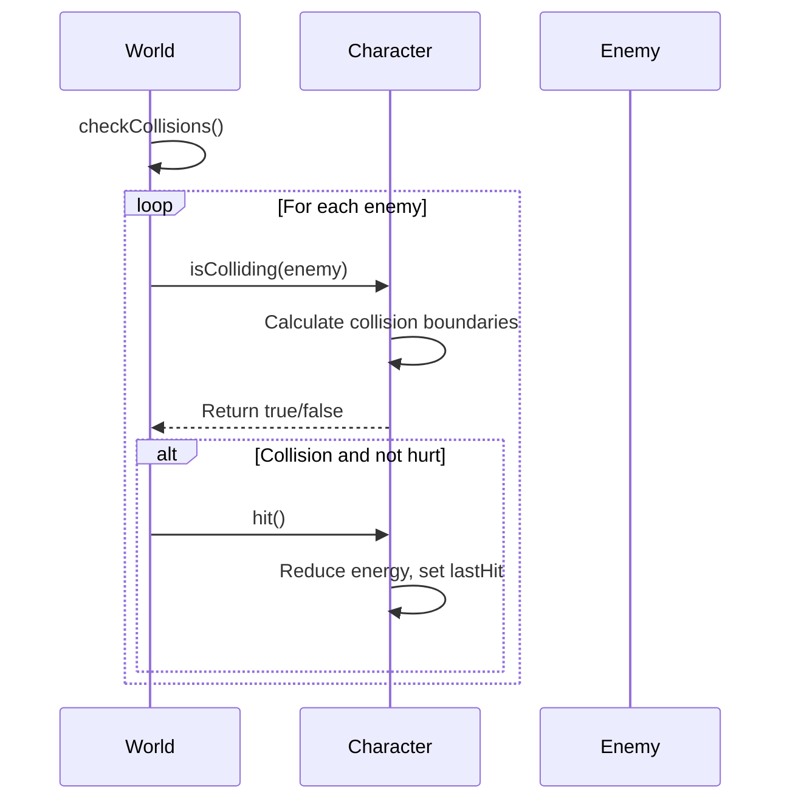
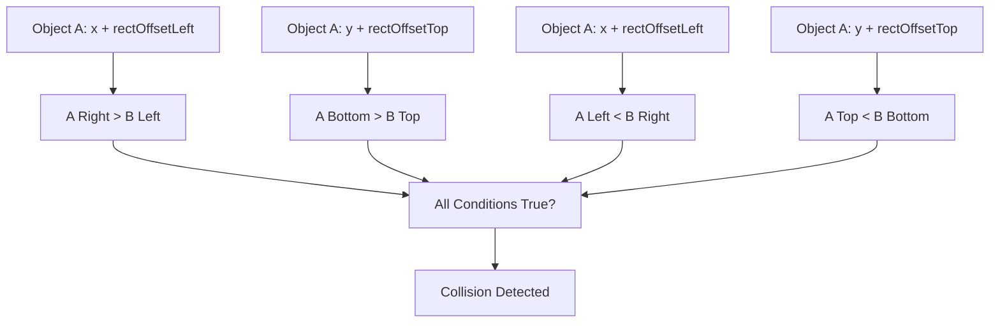
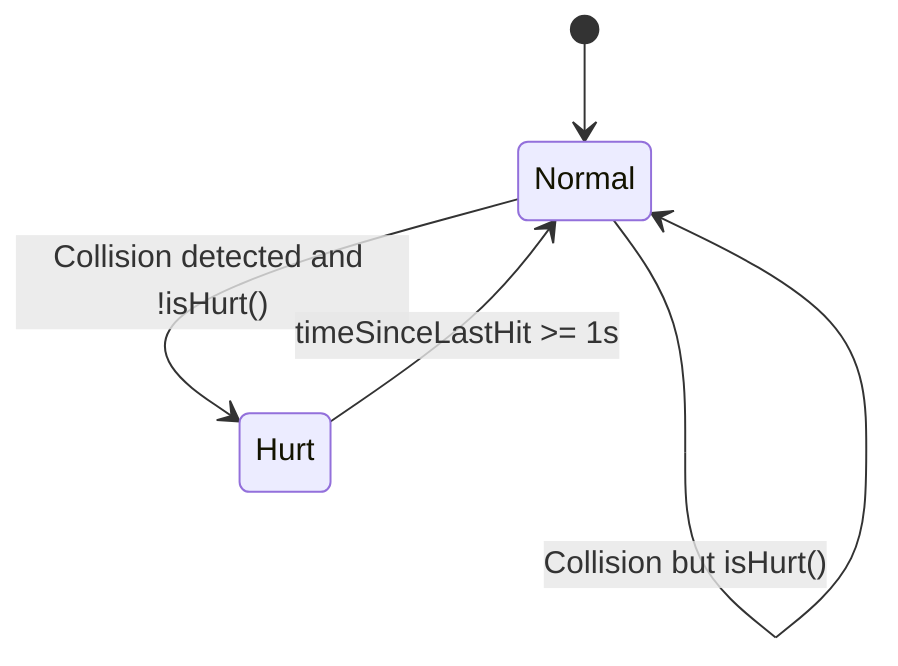

# Collision Detection

<cite>
**Referenced Files in This Document**   
- [2-world.class.js](file://models/2-world.class.js)
- [movable-objects.class.js](file://models/movable-objects.class.js)
- [character.class.js](file://models/character.class.js)
- [chicken.class.js](file://models/chicken.class.js)
- [endboss.class.js](file://models/endboss.class.js)
- [drawable-object.class.js](file://models/drawable-object.class.js)
- [thowable-object.class.js](file://models/thowable-object.class.js)
</cite>

## Table of Contents
1. [Introduction](#introduction)
2. [Collision Detection Workflow](#collision-detection-workflow)
3. [Collision Boundary Calculation](#collision-boundary-calculation)
4. [Hurt State and Invincibility Management](#hurt-state-and-invincibility-management)
5. [Energy Reduction and Hit Response](#energy-reduction-and-hit-response)
6. [Common Collision Issues](#common-collision-issues)
7. [Optimization and Future Extensions](#optimization-and-future-extensions)
8. [Conclusion](#conclusion)

## Introduction
The collision detection system in *el_polo_loco* is a core gameplay mechanic responsible for detecting contact between the player character and enemies. It ensures accurate hit detection, manages player invincibility frames, and handles energy reduction upon impact. This document details the implementation of `World.checkCollisions()`, the `isColliding()` method, hurt state logic, and provides insights into hitbox accuracy, performance, and future scalability.

**Section sources**
- [2-world.class.js](file://models/2-world.class.js#L43-L50)
- [movable-objects.class.js](file://models/movable-objects.class.js#L29-L34)

## Collision Detection Workflow

The collision detection process is initiated by the `World.checkCollisions()` method, which runs every 200 milliseconds via `setInterval` in the `run()` method. It iterates through all enemies in the current level and checks for collision with the player character using the `isColliding()` method.

If a collision is detected and the character is not in a hurt state (i.e., within invincibility frames), the `hit()` method is called to reduce the character's energy and update the hurt timestamp.



**Diagram sources**
- [2-world.class.js](file://models/2-world.class.js#L43-L50)
- [movable-objects.class.js](file://models/movable-objects.class.js#L29-L34)

**Section sources**
- [2-world.class.js](file://models/2-world.class.js#L43-L50)
- [movable-objects.class.js](file://models/movable-objects.class.js#L29-L34)

## Collision Boundary Calculation

Collision detection uses axis-aligned bounding box (AABB) logic with customizable hitbox offsets. The `isColliding(mo)` method in `MovableObjects` compares the adjusted boundaries of two objects using `rectOffsetLeft`, `rectOffsetTop`, `rectOffsetRight`, and `rectOffsetBottom` to define the effective hitbox.

These offsets allow for tighter or looser collision boxes than the visual sprite, improving gameplay feel. For example, the character has a left offset of 50 and right offset of 100, effectively shrinking the hitbox width.



**Diagram sources**
- [movable-objects.class.js](file://models/movable-objects.class.js#L29-L34)
- [character.class.js](file://models/character.class.js#L9-L12)
- [chicken.class.js](file://models/chicken.class.js#L5-L6)
- [endboss.class.js](file://models/endboss.class.js#L6-L7)

**Section sources**
- [movable-objects.class.js](file://models/movable-objects.class.js#L29-L34)
- [character.class.js](file://models/character.class.js#L9-L12)

## Hurt State and Invincibility Management

To prevent rapid successive damage, the character has a 1-second invincibility window after being hit. The `isHurt()` method checks whether the current time is within 1 second of the `lastHit` timestamp.

This mechanism ensures that even if multiple collisions occur in quick succession (e.g., walking through an enemy), the player only takes damage once per encounter.



**Diagram sources**
- [movable-objects.class.js](file://models/movable-objects.class.js#L50-L54)

**Section sources**
- [movable-objects.class.js](file://models/movable-objects.class.js#L50-L54)

## Energy Reduction and Hit Response

When a valid collision occurs, the `hit()` method is called on the character (inherited from `MovableObjects`). It reduces the character's energy by 10 points and updates the `lastHit` timestamp. If energy drops below zero, it is clamped to zero, triggering the death state.

The energy value is logged to the console upon each hit, providing real-time feedback during gameplay.

```mermaid
flowchart TD
Start([hit() called]) --> Reduce["energy -= 10"]
Reduce --> Check["energy < 0?"]
Check --> |Yes| Clamp["energy = 0"]
Check --> |No| SetTime["lastHit = currentTime"]
Clamp --> End([Exit])
SetTime --> End
```

**Diagram sources**
- [movable-objects.class.js](file://models/movable-objects.class.js#L45-L50)

**Section sources**
- [movable-objects.class.js](file://models/movable-objects.class.js#L45-L50)

## Common Collision Issues

### Inaccurate Hitboxes
Due to manually defined `rectOffset` values, some sprites may have misaligned hitboxes. For example, the character’s hitbox is shifted vertically and horizontally, which may not perfectly match the animation frames, leading to false positives or negatives.

### False Collision Triggers
Because `checkCollisions()` runs every 200ms, fast-moving objects may "skip" over collision checks between frames, especially at high speeds. This can result in missed or delayed collision detection.

### Timing Issues with Hurt States
The 1-second hurt window is fixed. If the animation or visual feedback lasts longer, players may perceive a delay between visual hit feedback and regained control.

**Section sources**
- [character.class.js](file://models/character.class.js#L9-L12)
- [movable-objects.class.js](file://models/movable-objects.class.js#L50-L54)
- [2-world.class.js](file://models/2-world.class.js#L43-L50)

## Optimization and Future Extensions

### Performance Optimization for Large Enemy Counts
Currently, collision checks use a simple loop over all enemies (`forEach`), resulting in O(n) complexity per frame. For larger levels, consider:
- **Spatial partitioning** (e.g., grid-based or quadtree) to reduce the number of comparisons.
- **Collision culling** based on distance from the player.
- Reducing the `checkCollisions()` interval dynamically based on enemy count.

### Projectile-Enemy Collision
The game already supports throwable objects (bottles). To extend collision detection:
- Add `checkProjectileCollisions()` to detect when a `ThrowableObject` hits an enemy.
- Implement `enemy.hit()` to reduce enemy health.
- Trigger splash animations and remove the projectile upon impact.

This would require modifying `World.run()` to include projectile-enemy checks and updating enemy classes to support health and death states.

**Section sources**
- [2-world.class.js](file://models/2-world.class.js#L52-L58)
- [thowable-object.class.js](file://models/thowable-object.class.js#L0-L82)
- [movable-objects.class.js](file://models/movable-objects.class.js#L45-L50)

## Conclusion
The collision system in *el_polo_loco* effectively combines bounding box detection with invincibility frames and energy management to create a responsive gameplay experience. While the current implementation is functional, opportunities exist to improve hitbox accuracy, optimize performance, and extend the system to support projectile-based combat. Future enhancements should focus on scalability and visual feedback alignment to ensure a polished player experience.