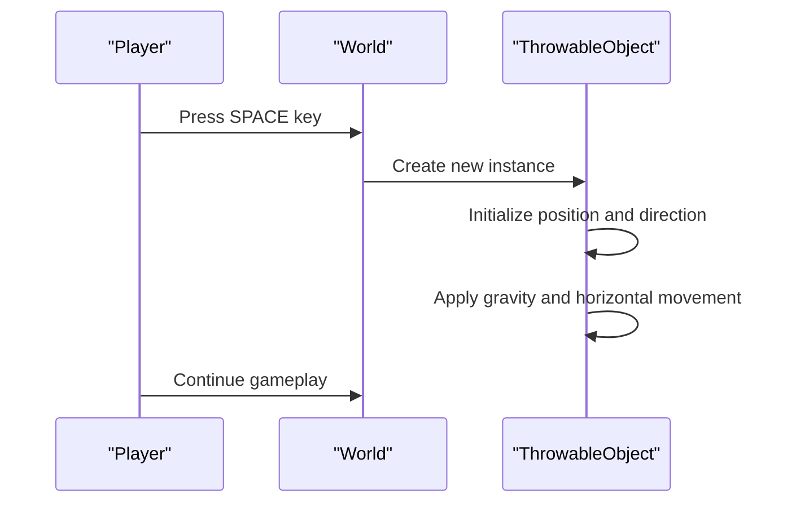
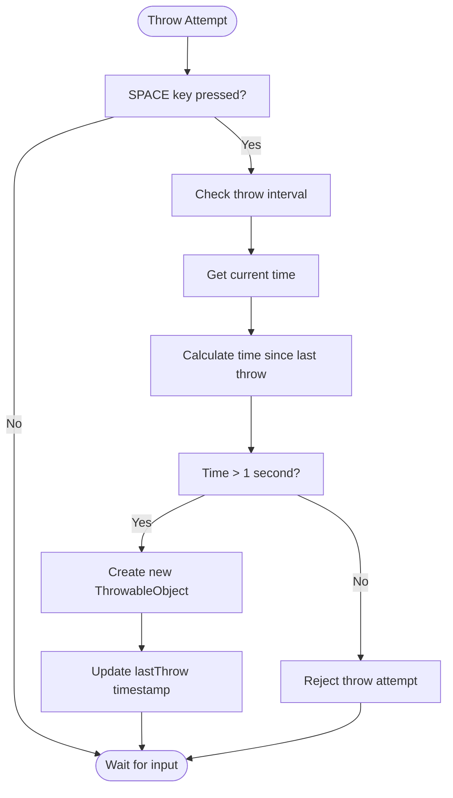
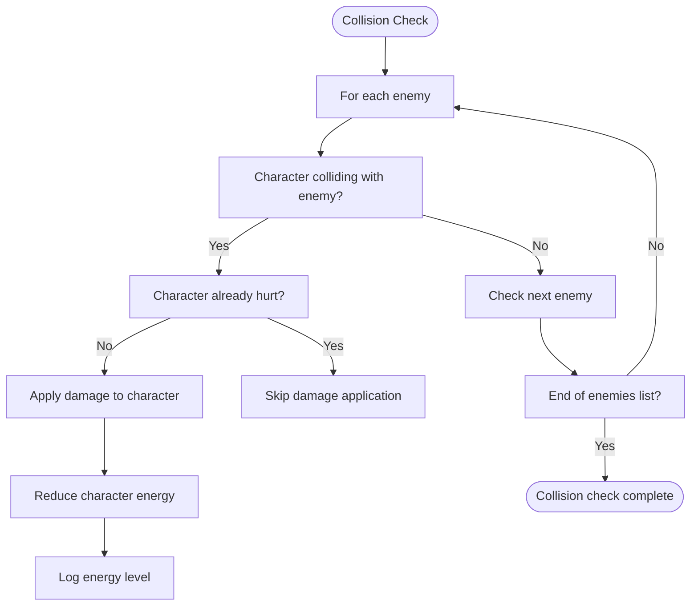
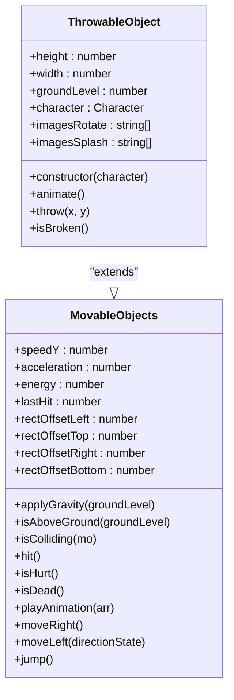
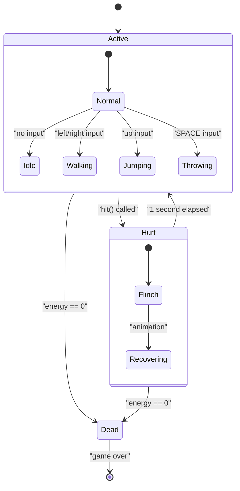

# Combat System

<cite>
**Referenced Files in This Document**   
- [thowable-object.class.js](file://models/thowable-object.class.js)
- [2-world.class.js](file://models/2-world.class.js)
- [character.class.js](file://models/character.class.js)
- [chicken.class.js](file://models/chicken.class.js)
- [movable-objects.class.js](file://models/movable-objects.class.js)
</cite>

## Table of Contents
1. [Introduction](#introduction)
2. [Projectile Mechanics](#projectile-mechanics)
3. [Throw Interval and Cooldown](#throw-interval-and-cooldown)
4. [Collision Detection System](#collision-detection-system)
5. [ThrowableObject Implementation](#throwableobject-implementation)
6. [Enemy Health and Damage System](#enemy-health-and-damage-system)
7. [Combat Issues and Considerations](#combat-issues-and-considerations)
8. [Combat Balancing and Extensions](#combat-balancing-and-extensions)

## Introduction
The combat system in el_polo_loco implements a projectile-based mechanic where players throw bottles to defeat enemies. The system integrates character controls, projectile physics, collision detection, and enemy health management to create an engaging gameplay experience. This document details the implementation of the combat mechanics, focusing on the interaction between the player character, throwable objects, and enemies within the game world.

## Projectile Mechanics
Players initiate bottle throws by pressing the spacebar, which triggers the creation of a new ThrowableObject instance. The projectile's trajectory is determined by the character's current direction and position, with physics-based movement incorporating gravity and horizontal velocity. The system ensures projectiles are launched from the correct position relative to the character's sprite, accounting for the character's facing direction through offset calculations.

**Diagram sources**
- [2-world.class.js](file://models/2-world.class.js#L52-L58)
- [thowable-object.class.js](file://models/thowable-object.class.js#L50-L82)

**Section sources**
- [2-world.class.js](file://models/2-world.class.js#L52-L58)
- [thowable-object.class.js](file://models/thowable-object.class.js#L50-L82)

## Throw Interval and Cooldown
The game prevents players from spamming bottle throws through a cooldown mechanism implemented in the `World.throwInterval()` method. This method calculates the time elapsed since the last throw and only allows a new throw when at least one second has passed. The cooldown system ensures balanced gameplay by limiting the rate at which players can attack, requiring strategic timing in combat situations.

**Diagram sources**
- [2-world.class.js](file://models/2-world.class.js#L60-L64)

**Section sources**
- [2-world.class.js](file://models/2-world.class.js#L60-L64)

## Collision Detection System
The collision detection system operates through the `World.checkCollisions()` method, which iterates through all enemies in the current level and checks for intersections with the player character. The system uses precise bounding box calculations that account for sprite offsets, ensuring accurate collision detection. When a collision is detected and the character is not in a hurt state, the character takes damage through the `hit()` method.

**Diagram sources**
- [2-world.class.js](file://models/2-world.class.js#L43-L50)
- [movable-objects.class.js](file://models/movable-objects.class.js#L29-L34)

**Section sources**
- [2-world.class.js](file://models/2-world.class.js#L43-L50)
- [movable-objects.class.js](file://models/movable-objects.class.js#L29-L34)

## ThrowableObject Implementation
The ThrowableObject class extends MovableObjects to implement bottle projectile behavior. Each throwable object has distinct animation sequences for flight and impact, with separate image arrays for rotation during flight and splash effects upon collision with the ground. The object's physics include gravity application and horizontal movement at a fixed speed, with direction determined by the character's facing orientation at the time of throw.

**Diagram sources**
- [thowable-object.class.js](file://models/thowable-object.class.js#L1-L82)
- [movable-objects.class.js](file://models/movable-objects.class.js#L1-L76)

**Section sources**
- [thowable-object.class.js](file://models/thowable-object.class.js#L1-L82)

## Enemy Health and Damage System
Enemy health management is implemented through the `hit()` method inherited from the MovableObjects base class. Each successful hit reduces the character's energy by 10 points, with a minimum energy value of 0. The system tracks the time of the last hit to implement a brief invulnerability period, preventing rapid successive damage from a single enemy. Character death is determined when energy reaches zero, triggering the appropriate animation sequence.

**Diagram sources**
- [movable-objects.class.js](file://models/movable-objects.class.js#L37-L52)
- [character.class.js](file://models/character.class.js#L1-L152)

**Section sources**
- [movable-objects.class.js](file://models/movable-objects.class.js#L37-L52)

## Combat Issues and Considerations
The combat system faces several technical challenges that affect gameplay quality. Collision box accuracy varies between characters and enemies due to inconsistent rectOffset values, potentially leading to unfair hit detection. Projectile lifetime management is currently unimplemented, with throwable objects persisting in memory after impact, which could cause performance degradation over time. Enemy respawning behavior is not defined in the current codebase, leaving uncertainty about enemy regeneration mechanics during extended gameplay.

Additional considerations include the lack of collision detection between throwable objects and enemies, meaning bottles currently only interact with the ground and the player character. The animation system for bottle break effects does not remove objects from the world's throwableObjects array after splash animation completion, creating potential memory leaks. The fixed 1-second throw cooldown may feel too restrictive or too lenient depending on gameplay balance requirements.

**Section sources**
- [thowable-object.class.js](file://models/thowable-object.class.js#L65-L70)
- [2-world.class.js](file://models/2-world.class.js#L52-L58)

## Combat Balancing and Extensions
To improve combat balance, the throw cooldown could be made configurable through game settings, allowing adjustment based on difficulty level. The damage amount from enemy collisions could be scaled based on enemy type, with larger enemies dealing more damage. Implementing a scoring system that rewards successful bottle throws would encourage strategic gameplay.

For system extensions, the architecture supports adding new weapon types by creating additional classes that extend MovableObjects, similar to ThrowableObject. Different projectile types could have varying speeds, damage values, and visual effects. A weapon pickup system could allow players to collect different bottle types with special properties, such as splash damage or increased velocity. The collision detection system could be enhanced to detect hits between throwable objects and enemies, creating a more dynamic combat experience where players can defeat enemies at range.

**Section sources**
- [thowable-object.class.js](file://models/thowable-object.class.js#L1-L82)
- [2-world.class.js](file://models/2-world.class.js#L52-L58)
- [movable-objects.class.js](file://models/movable-objects.class.js#L1-L76)