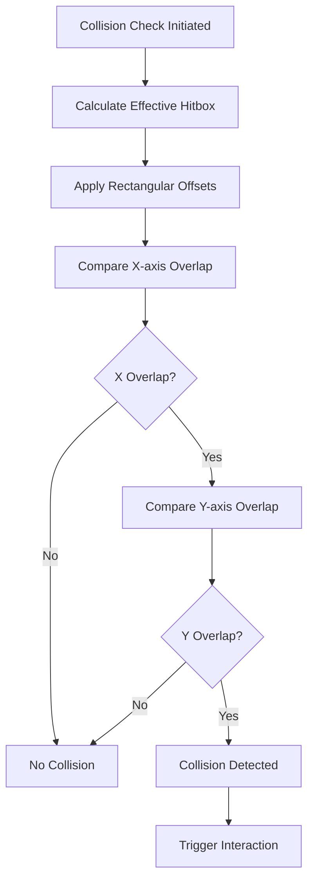
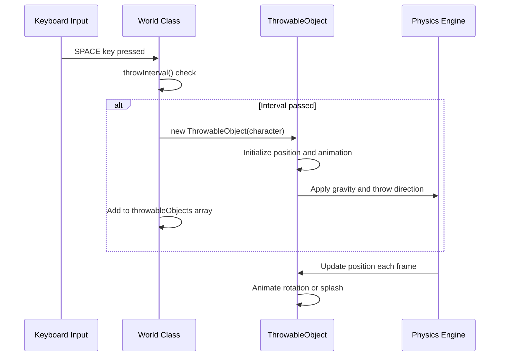
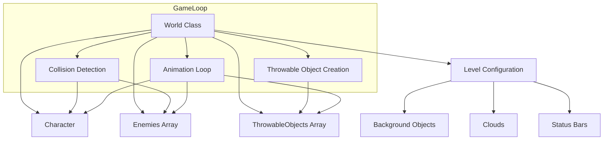

# Enemy Interactions

<cite>
**Referenced Files in This Document**   
- [2-world.class.js](file://models/2-world.class.js)
- [thowable-object.class.js](file://models/thowable-object.class.js)
- [chicken.class.js](file://models/chicken.class.js)
- [endboss.class.js](file://models/endboss.class.js)
- [character.class.js](file://models/character.class.js)
- [movable-objects.class.js](file://models/movable-objects.class.js)
- [drawable-object.class.js](file://models/drawable-object.class.js)
- [1-game.js](file://js/1-game.js)
</cite>

## Table of Contents
1. [Introduction](#introduction)
2. [Core Interaction Framework](#core-interaction-framework)
3. [Collision Detection System](#collision-detection-system)
4. [Throwable Object Mechanics](#throwable-object-mechanics)
5. [Enemy Damage Implementation Patterns](#enemy-damage-implementation-patterns)
6. [World Class Coordination](#world-class-coordination)
7. [Design Considerations](#design-considerations)
8. [Troubleshooting Guide](#troubleshooting-guide)
9. [Testing Strategies](#testing-strategies)
10. [Conclusion](#conclusion)

## Introduction
The el_polo_loco game implements a foundation for enemy interactions through collision detection and throwable objects, though direct enemy damage logic from projectiles is not currently implemented. This document analyzes the existing framework that coordinates interactions between throwable objects and enemies, focusing on the World class's role in managing these game mechanics. The current system demonstrates a clear pattern for character-enemy collisions and damage application, which can be extended to support bottle-enemy interactions. Understanding the collision detection system, throwable object lifecycle, and damage application patterns is essential for implementing combat mechanics that balance gameplay while maintaining code consistency.

## Core Interaction Framework

The game's interaction framework is built around the World class, which serves as the central coordinator for all game objects and their interactions. The framework establishes relationships between the player character, throwable objects, and enemies through a well-defined object hierarchy and collision detection system. While the current implementation only processes character-enemy collisions for damage application, the architecture provides a clear pathway for extending this functionality to include throwable object interactions with enemies.

The core components of the interaction framework include:
- **World class**: Central game state manager that coordinates object interactions
- **ThrowableObject class**: Represents projectile mechanics and animation
- **Enemy classes (Chicken, Endboss)**: Define enemy behavior and properties
- **Character class**: Player-controlled entity with interaction capabilities
- **MovableObjects base class**: Provides shared functionality for collision and damage

This framework demonstrates a consistent pattern of inheritance and composition, with MovableObjects serving as the foundation for both character and enemy entities, ensuring uniform collision and damage behavior across game objects.

**Section sources**
- [2-world.class.js](file://models/2-world.class.js#L0-L131)
- [movable-objects.class.js](file://models/movable-objects.class.js#L0-L76)
- [character.class.js](file://models/character.class.js#L0-L152)

## Collision Detection System

The collision detection system in el_polo_loco is implemented through the `isColliding()` method in the MovableObjects class, which provides a consistent collision detection mechanism for all game entities. This method uses axis-aligned bounding box (AABB) collision detection with offset rectangles that account for sprite padding and hitbox precision.



The collision detection algorithm considers four key parameters for each object:
- **rectOffsetLeft**: Left padding of the hitbox
- **rectOffsetTop**: Top padding of the hitbox  
- **rectOffsetRight**: Right padding of the hitbox
- **rectOffsetBottom**: Bottom padding of the hitbox

These offsets allow for precise hitbox definition that differs from the visual sprite dimensions, enabling more accurate gameplay interactions. The current implementation in `World.checkCollisions()` only processes collisions between the character and enemies, calling `character.hit()` when a collision is detected and the character is not already hurt.

**Diagram sources **
- [movable-objects.class.js](file://models/movable-objects.class.js#L29-L34)
- [2-world.class.js](file://models/2-world.class.js#L43-L50)

**Section sources**
- [movable-objects.class.js](file://models/movable-objects.class.js#L29-L34)
- [2-world.class.js](file://models/2-world.class.js#L43-L50)

## Throwable Object Mechanics

The throwable object system in el_polo_loco manages projectile behavior through the ThrowableObject class, which extends MovableObjects to inherit movement and collision capabilities. When the player presses the SPACE key, a new ThrowableObject (bottle) is instantiated and added to the World's throwableObjects array, where it participates in the game loop and rendering process.



The throwable object lifecycle includes:
1. **Instantiation**: Created with reference to the character for positioning
2. **Positioning**: Placed relative to character position and direction
3. **Animation**: Rotates while airborne, splashes when hitting ground
4. **Physics**: Subject to gravity and horizontal throw velocity
5. **Rendering**: Drawn in the game world until removed

The current implementation lacks collision detection between throwable objects and enemies, focusing instead on ground collision detection through the `isAboveGround()` method. However, the framework is well-positioned to support enemy interactions by extending the collision detection logic.

**Diagram sources **
- [thowable-object.class.js](file://models/thowable-object.class.js#L0-L82)
- [2-world.class.js](file://models/2-world.class.js#L52-L58)

**Section sources**
- [thowable-object.class.js](file://models/thowable-object.class.js#L0-L82)
- [2-world.class.js](file://models/2-world.class.js#L52-L58)

## Enemy Damage Implementation Patterns

While the current codebase does not implement direct damage from throwable objects to enemies, it establishes a clear pattern for damage application through the `hit()` method in the MovableObjects class. This method reduces the entity's energy by 10 points, prevents negative energy values, and records the time of the last hit to manage invulnerability periods.

```mermaid
classDiagram
class MovableObjects {
+energy : number
+lastHit : number
+hit()
+isHurt()
+isDead()
}
class Character {
+hit()
+isHurt()
}
class Chicken {
+hit()
+isHurt()
}
class Endboss {
+hit()
+isHurt()
}
MovableObjects <|-- Character
MovableObjects <|-- Chicken
MovableObjects <|-- Endboss
note right of MovableObjects
Base class provides
shared damage logic
and state management
end note
```

To implement throwable-enemy collisions, the following pattern can be extended:

```javascript
// Proposed extension to World.checkCollisions()
checkThrowableCollisions() {
    this.throwableObjects.forEach(bottle => {
        if (bottle.isBroken()) return; // Skip if already splashed
        
        this.level.enemies.forEach(enemy => {
            if (bottle.isColliding(enemy)) {
                enemy.hit();
                bottle.markAsBroken(); // Trigger splash animation
                this.removeThrowable(bottle);
            }
        });
    });
}
```

Key implementation considerations:
- **Damage scaling**: Adjust energy reduction to balance gameplay
- **Projectile lifetime**: Remove bottles after collision or ground impact
- **Visual feedback**: Synchronize splash animation with collision
- **Audio cues**: Add sound effects for successful hits
- **Score tracking**: Increment player score on enemy hit

The existing `isHurt()` method provides a 1-second invulnerability window, which should be leveraged to prevent rapid successive hits on enemies.

**Diagram sources **
- [movable-objects.class.js](file://models/movable-objects.class.js#L36-L43)
- [movable-objects.class.js](file://models/movable-objects.class.js#L6-L6)
- [movable-objects.class.js](file://models/movable-objects.class.js#L45-L49)

**Section sources**
- [movable-objects.class.js](file://models/movable-objects.class.js#L36-L43)
- [movable-objects.class.js](file://models/movable-objects.class.js#L6-L6)
- [movable-objects.class.js](file://models/movable-objects.class.js#L45-L49)

## World Class Coordination

The World class serves as the central coordinator for all game interactions, managing the relationship between throwableObjects and enemies arrays through its game loop and rendering system. The class maintains references to both arrays and processes them in the draw() method, ensuring proper rendering order and camera positioning.



The coordination mechanism operates on a 200ms interval through the `run()` method, which calls both `checkCollisions()` and `checkThrowableObject()` in sequence. This timing determines the frequency of collision detection and projectile creation, potentially affecting gameplay responsiveness.

Key coordination responsibilities:
- **Object lifecycle management**: Creation and rendering of throwable objects
- **Collision processing**: Detection of character-enemy interactions
- **Camera positioning**: Synchronization of view with character position
- **State propagation**: Setting world reference on all game objects
- **Rendering order**: Proper layering of game elements

The `setWorld()` method ensures that all game objects have a reference to the World instance, enabling bidirectional communication and state access throughout the game system.

**Diagram sources **
- [2-world.class.js](file://models/2-world.class.js#L0-L131)

**Section sources**
- [2-world.class.js](file://models/2-world.class.js#L0-L131)

## Design Considerations

Implementing enemy damage through throwable objects requires careful consideration of several design factors to ensure balanced and enjoyable gameplay. The current framework provides a solid foundation, but specific design decisions must be made to create a compelling combat experience.

### Enemy Health and Difficulty
The MovableObjects base class initializes energy at 100 points, with the `hit()` method reducing it by 10 points per hit. This suggests that enemies would require 10 successful bottle throws to defeat, which may be too high for standard chickens but appropriate for the endboss. Design options include:
- Variable damage values based on enemy type
- Progressive difficulty with fewer hits required for early enemies
- Critical hits with increased damage on precise throws

### Projectile Effectiveness
The throw interval is currently limited to once per second through `throwInterval()`, which balances projectile spam. Additional considerations:
- Limited bottle inventory to prevent infinite throws
- Different bottle types with varying damage or effects
- Accuracy mechanics based on character movement state

### Spawn Mechanics
Enemy spawning is currently handled in the Chicken constructor with random positioning and speed. To support combat balance:
- Adjust spawn frequency based on player progress
- Implement spawn waves with increasing difficulty
- Coordinate enemy types with available projectiles
- Consider spawn locations relative to player position

### Visual and Audio Feedback
Effective combat mechanics require clear feedback:
- Screen shake or visual effects on successful hits
- Distinct sound effects for hits versus misses
- Enemy reaction animations when damaged
- Particle effects for bottle impacts

### Performance Optimization
With multiple throwable objects and enemies on screen:
- Implement object pooling for bottles to reduce instantiation overhead
- Use spatial partitioning to optimize collision detection
- Consider culling off-screen objects from collision checks

## Troubleshooting Guide

When implementing or debugging enemy interaction mechanics, several common issues may arise. This section provides guidance for identifying and resolving these problems.

### Missed Collisions
**Symptoms**: Bottles pass through enemies without registering hits
**Potential causes**:
- Incorrect hitbox offsets in enemy or bottle classes
- Collision check timing mismatch with game loop
- Floating-point precision issues in position calculations
- Objects moving too fast between frames (tunneling)

**Debugging steps**:
1. Enable collision frame visualization by ensuring `drawCollisionFrame()` is called
2. Verify rectOffset values for both throwable objects and enemies
3. Check that collision detection runs at appropriate frequency
4. Test with slower projectile speeds to rule out tunneling

### Improper Damage Application
**Symptoms**: Enemies take damage incorrectly or not at all
**Potential causes**:
- Energy value not properly initialized or updated
- Invulnerability timer not functioning correctly
- Multiple hits registered from single collision
- Damage method not properly inherited or overridden

**Debugging steps**:
1. Verify energy initialization in MovableObjects constructor
2. Check lastHit timestamp updates in hit() method
3. Ensure isHurt() method correctly calculates time since last hit
4. Confirm proper inheritance chain for hit() method

### Animation Synchronization Issues
**Symptoms**: Splash animation plays at wrong time or location
**Potential causes**:
- Collision detection and animation triggers out of sync
- Bottle position miscalculation during flight
- Animation frame rate mismatch with game loop

**Debugging steps**:
1. Verify bottle position at time of collision detection
2. Check animation interval timing (currently 50ms)
3. Ensure splash animation triggers only on enemy or ground collision

### Memory and Performance Problems
**Symptoms**: Game slowdown with multiple projectiles
**Potential causes**:
- Accumulation of unused throwable objects in array
- Excessive collision checks between all objects
- Memory leaks in animation intervals

**Debugging steps**:
1. Implement proper cleanup of throwable objects after use
2. Verify setInterval cleanup or use requestAnimationFrame
3. Monitor throwableObjects array size during gameplay

**Section sources**
- [movable-objects.class.js](file://models/movable-objects.class.js#L36-L43)
- [thowable-object.class.js](file://models/thowable-object.class.js#L0-L82)
- [2-world.class.js](file://models/2-world.class.js#L43-L50)

## Testing Strategies

Effective validation of combat mechanics requires comprehensive testing approaches that cover both functionality and gameplay experience.

### Unit Testing
Implement automated tests for core interaction components:
- **Collision detection**: Verify isColliding() returns correct results for various positions
- **Damage application**: Test hit() method reduces energy correctly and handles edge cases
- **Invulnerability**: Confirm isHurt() returns true for 1 second after hit
- **Projectile physics**: Validate throw() applies correct velocity and direction

### Integration Testing
Test interactions between multiple systems:
- Character throwing bottles while moving
- Multiple enemies on screen with simultaneous collisions
- Camera movement during combat sequences
- Status bar updates reflecting enemy damage

### Gameplay Testing
Evaluate the player experience:
- **Balance testing**: Adjust damage values and throw intervals for appropriate difficulty
- **Flow testing**: Ensure combat feels responsive and rewarding
- **Edge case testing**: Validate behavior at screen boundaries and during rapid inputs
- **Progression testing**: Verify difficulty curve across game levels

### Debug Visualization
Implement temporary debugging tools:
- Toggle collision frame visibility to verify hitbox accuracy
- Display object positions and velocities during gameplay
- Log collision events with timestamps for analysis
- Visualize throwableObjects array size and contents

## Conclusion

The el_polo_loco game provides a robust foundation for implementing enemy interactions through its well-structured World class coordination system and consistent collision detection framework. While direct damage from throwable objects to enemies is not currently implemented, the architecture supports this functionality through the existing MovableObjects inheritance hierarchy and damage application patterns.

The key to successful implementation lies in extending the World class's collision detection to include throwable-enemy interactions, leveraging the established hit() method pattern for damage application. Careful attention to design considerations such as enemy health balancing, projectile effectiveness, and spawn mechanics will ensure a compelling gameplay experience.

By following the troubleshooting guidance and testing strategies outlined in this document, developers can effectively implement and validate combat mechanics that enhance the game's interactivity while maintaining performance and stability. The modular design of the current system allows for incremental improvements and future expansions to the enemy interaction framework.