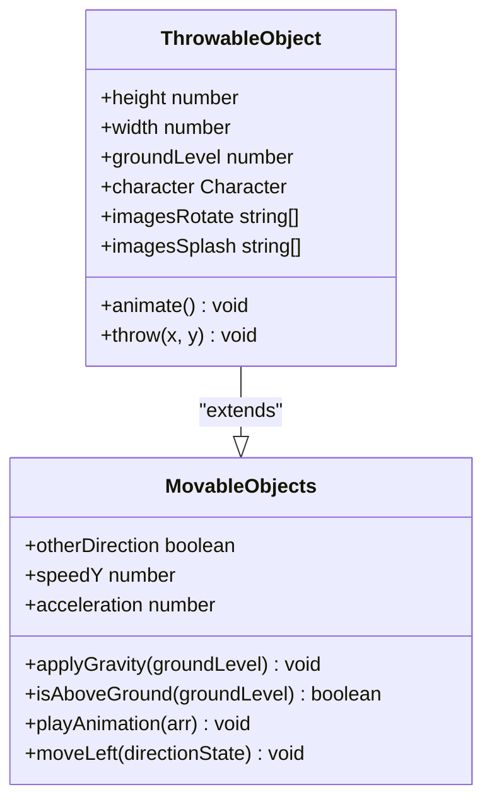
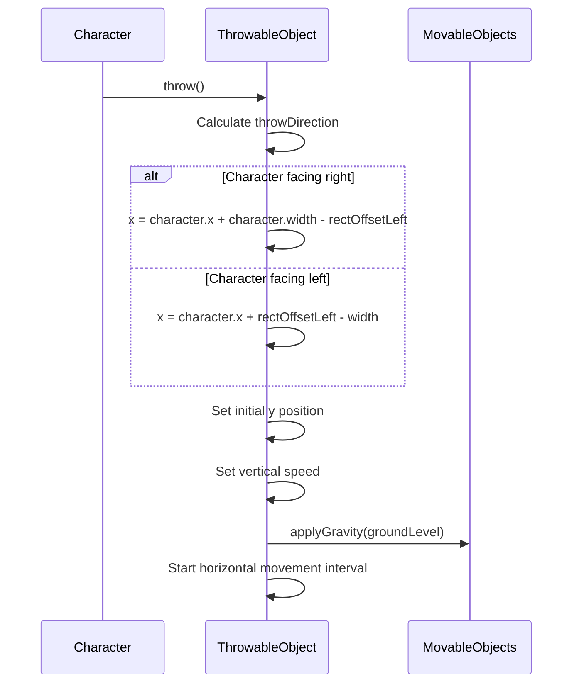
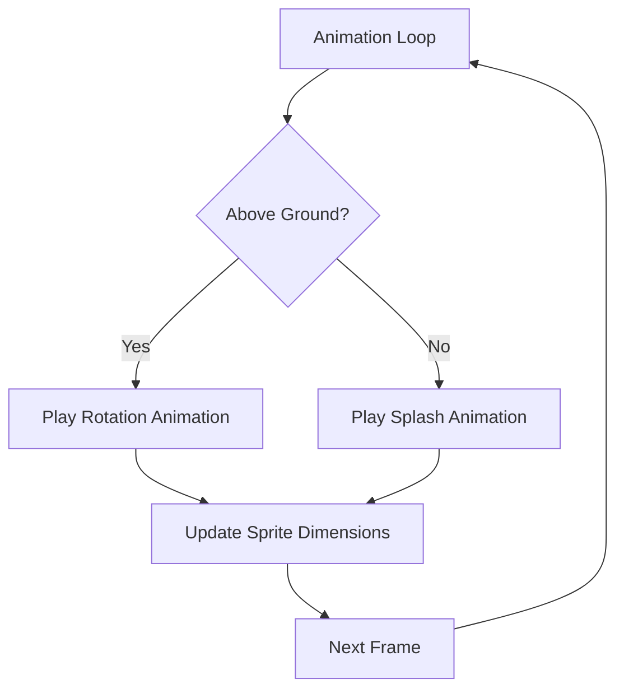

# Throwable Objects

<cite>
**Referenced Files in This Document**   
- [thowable-object.class.js](file://models/thowable-object.class.js)
- [movable-objects.class.js](file://models/movable-objects.class.js)
- [character.class.js](file://models/character.class.js)
</cite>

## Table of Contents
1. [Introduction](#introduction)
2. [Inheritance and Base Class](#inheritance-and-base-class)
3. [Constructor Initialization](#constructor-initialization)
4. [Throw Mechanics Implementation](#throw-mechanics-implementation)
5. [Animation System](#animation-system)
6. [Projectile Physics](#projectile-physics)
7. [Common Issues and Solutions](#common-issues-and-solutions)
8. [Extending the System](#extending-the-system)

## Introduction
The ThrowableObject class in el_polo_loco implements projectile mechanics for throwable items in the game, specifically designed for the salsa bottle weapon. This class extends the MovableObjects base class to inherit movement and physics capabilities while adding specialized behavior for throwing animations, trajectory calculation, and ground collision detection. The system integrates with the character's state to determine throw direction and positioning, creating a cohesive gameplay experience.

**Section sources**
- [thowable-object.class.js](file://models/thowable-object.class.js#L1-L10)

## Inheritance and Base Class
The ThrowableObject class inherits from MovableObjects, which provides fundamental movement and physics functionality. This inheritance relationship enables throwable objects to utilize gravity simulation, collision detection, and animation systems already implemented in the base class. The MovableObjects class contains essential methods like applyGravity() for physics simulation and playAnimation() for sprite management, which are critical for the throwable object's behavior.

**Diagram sources**
- [thowable-object.class.js](file://models/thowable-object.class.js#L1-L5)
- [movable-objects.class.js](file://models/movable-objects.class.js#L1-L10)

**Section sources**
- [thowable-object.class.js](file://models/thowable-object.class.js#L1-L5)
- [movable-objects.class.js](file://models/movable-objects.class.js#L1-L15)

## Constructor Initialization
The constructor initializes a new throwable object by receiving a reference to the character instance that will throw it. It sets the initial position based on the character's current coordinates and loads both rotation and splash animation image sets. The constructor immediately triggers both the animate() and throw() methods to start the object's behavior cycle upon creation. This design ensures that every throwable object begins its lifecycle with proper animation and movement immediately after instantiation.

**Section sources**
- [thowable-object.class.js](file://models/thowable-object.class.js#L25-L35)

## Throw Mechanics Implementation
The throw() method implements directional movement based on the character's orientation. It calculates horizontal velocity using the character's otherDirection property, applying positive or negative values to determine throw direction. The method positions the throwable object relative to the character's rectOffsetLeft value, ensuring proper alignment with the character's sprite. When facing right (otherDirection = false), the object spawns at the character's right side; when facing left, it spawns at the left side. This positioning logic accounts for the character's width and offset values to create realistic throw mechanics.

**Diagram sources**
- [thowable-object.class.js](file://models/thowable-object.class.js#L61-L76)
- [movable-objects.class.js](file://models/movable-objects.class.js#L14-L23)

**Section sources**
- [thowable-object.class.js](file://models/thowable-object.class.js#L61-L76)
- [character.class.js](file://models/character.class.js#L9-L9)

## Animation System
The animate() method manages the visual state of the throwable object by switching between rotation and splash animations based on ground collision. While the object is above ground, it plays the rotation animation sequence; upon hitting the ground, it transitions to the splash animation. The method also dynamically adjusts the sprite dimensions using the natural height and width of the current image, scaled by a factor of 0.2. This creates a realistic visual effect as the bottle spins through the air and splashes upon impact.

**Diagram sources**
- [thowable-object.class.js](file://models/thowable-object.class.js#L47-L59)
- [movable-objects.class.js](file://models/movable-objects.class.js#L55-L60)

**Section sources**
- [thowable-object.class.js](file://models/thowable-object.class.js#L47-L59)

## Projectile Physics
The throwable object implements projectile physics through a combination of horizontal velocity and gravity simulation. The throw() method sets an initial vertical speed (speedY = 9) and calls applyGravity() from the MovableObjects base class, which continuously updates the object's Y position based on acceleration. Horizontal movement is achieved through a setInterval loop that increments the X position by the throwDirection value at 60fps. The groundLevel property (445 - height) defines the collision boundary, ensuring objects rest on the game's ground plane when they descend.

**Section sources**
- [thowable-object.class.js](file://models/thowable-object.class.js#L61-L76)
- [movable-objects.class.js](file://models/movable-objects.class.js#L14-L23)

## Common Issues and Solutions
Several common issues can arise with the throwable object implementation. Incorrect positioning may occur if rectOffset values are not properly configured in the character class, causing bottles to spawn in unnatural locations relative to the character. Animation flickering can happen due to the 50ms animation interval potentially conflicting with the game's rendering cycle. Memory leaks are a concern as setInterval calls in both animate() and throw() methods are never cleared, which could accumulate over time with multiple throws. To address this, consider implementing a cleanup mechanism that clears intervals when the object is destroyed or when animations complete.

**Section sources**
- [thowable-object.class.js](file://models/thowable-object.class.js#L47-L76)
- [character.class.js](file://models/character.class.js#L9-L9)

## Extending the System
The throwable object system can be extended to support new throwable types by modifying the image sets or adding physics variations. Developers can create subclasses of ThrowableObject to implement different behaviors, such as bouncing projectiles or explosive items. The current architecture supports easy replacement of the imagesRotate and imagesSplash arrays with new sprite sequences. Physics parameters like speedY, acceleration, and throwDirection magnitude can be customized per throwable type to create varied gameplay experiences. The inheritance from MovableObjects ensures that any new throwable types will automatically benefit from the existing physics and animation systems.

**Section sources**
- [thowable-object.class.js](file://models/thowable-object.class.js#L15-L23)
- [movable-objects.class.js](file://models/movable-objects.class.js#L1-L10)