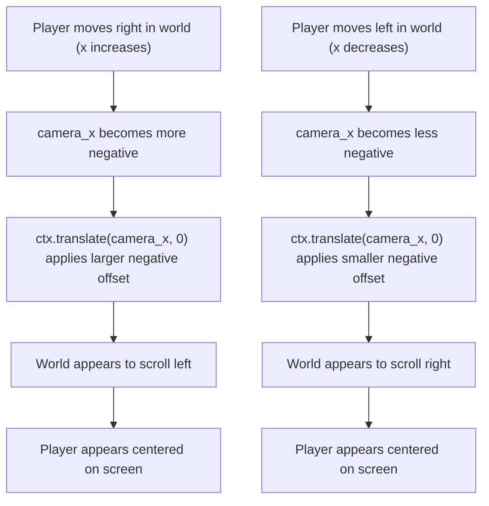
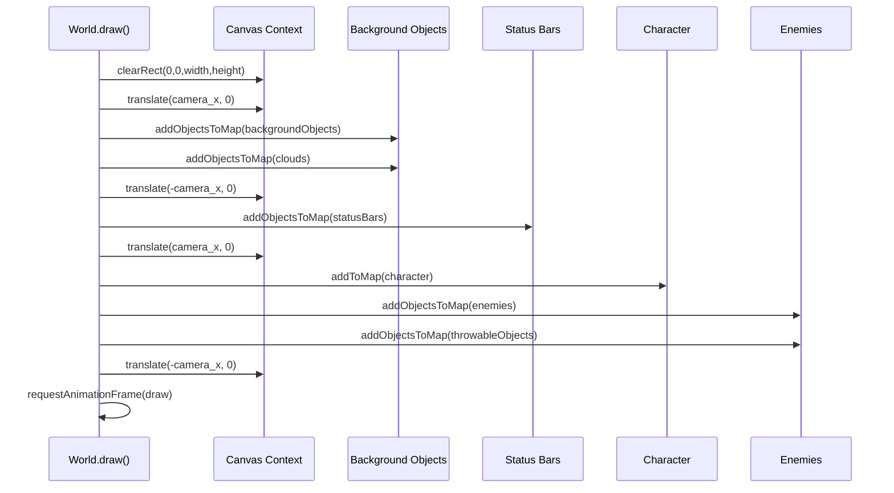
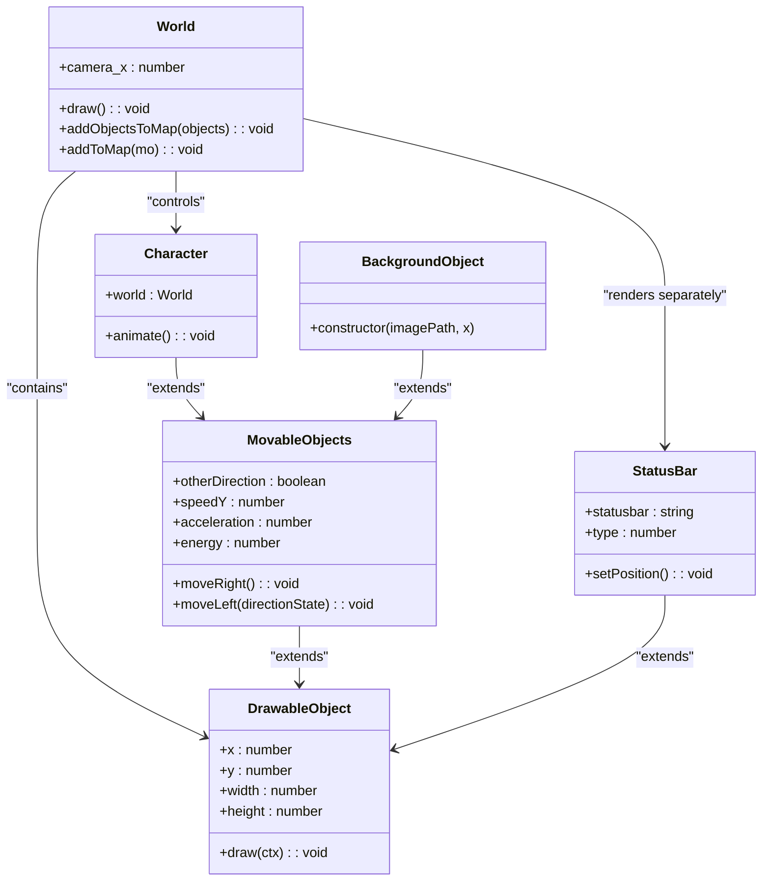
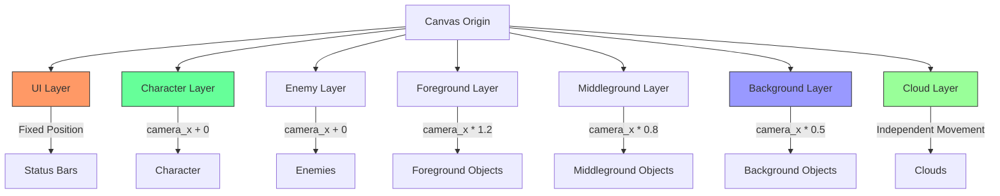

# Camera System

<cite>
**Referenced Files in This Document**   
- [2-world.class.js](file://models/2-world.class.js)
- [character.class.js](file://models/character.class.js)
- [1-game.js](file://js/1-game.js)
- [level1.js](file://levels/level1.js)
- [background-object.class.js](file://models/background-object.class.js)
- [status-bar.class.js](file://models/status-bar.class.js)
- [clouds.class.js](file://models/clouds.class.js)
</cite>

## Table of Contents
1. [Introduction](#introduction)
2. [Camera Coordinate System](#camera-coordinate-system)
3. [Camera Implementation in World Class](#camera-implementation-in-world-class)
4. [Character Position and Camera Tracking](#character-position-and-camera-tracking)
5. [Rendering Order and Layering](#rendering-order-and-layering)
6. [Parallax Scrolling Effect](#parallax-scrolling-effect)
7. [Boundary Management](#boundary-management)
8. [Performance Considerations](#performance-considerations)
9. [Troubleshooting Common Issues](#troubleshooting-common-issues)
10. [Conclusion](#conclusion)

## Introduction
The camera system in el_polo_loco implements a side-scrolling mechanism that follows the player character through the game world. This system uses canvas coordinate transformations to create the illusion of camera movement while the character remains relatively centered on screen. The core implementation revolves around the `camera_x` property in the `World` class, which controls the horizontal translation of the rendering context. This document details the technical implementation, coordinate system transformations, rendering strategies, and performance considerations of this camera system.

**Section sources**
- [2-world.class.js](file://models/2-world.class.js#L13-L15)
- [character.class.js](file://models/character.class.js#L4-L5)

## Camera Coordinate System
The camera system operates on a coordinate transformation principle where the canvas context is translated relative to the game world. Instead of moving all game objects, the rendering context itself is shifted, creating the illusion of camera movement. The `camera_x` property in the `World` class serves as the primary control for horizontal camera positioning. This value represents the offset applied to the canvas context, effectively moving the entire coordinate system left or right.

The coordinate system follows standard canvas conventions where the origin (0,0) is at the top-left corner, with positive x-values extending rightward and positive y-values extending downward. When `camera_x` is negative, the world appears to move rightward (objects shift left on screen), and when positive, the world appears to move leftward (objects shift right on screen). This inverse relationship is crucial for maintaining the player's perspective as they move through the environment.



**Diagram sources**
- [2-world.class.js](file://models/2-world.class.js#L68-L69)
- [character.class.js](file://models/character.class.js#L145-L148)

## Camera Implementation in World Class
The camera system is implemented within the `World` class, which manages the primary rendering loop and coordinate transformations. The `camera_x` property is initialized to 0 and dynamically updated based on the player character's position. The core rendering method `draw()` implements the camera transformation through strategic use of `ctx.translate()` calls that temporarily shift the coordinate system.

The implementation follows a pattern of translating the context, rendering specific object groups, then restoring the coordinate system for subsequent rendering operations. This approach allows for selective application of camera transformations to different layers of game objects. The rendering sequence carefully manages the transformation state to ensure proper layering and positioning of all visual elements.



**Diagram sources**
- [2-world.class.js](file://models/2-world.class.js#L66-L85)

**Section sources**
- [2-world.class.js](file://models/2-world.class.js#L13-L15)
- [2-world.class.js](file://models/2-world.class.js#L66-L85)

## Character Position and Camera Tracking
The camera tracking mechanism is directly tied to the player character's x-position through a calculated offset. In the character's animation loop, the camera position is continuously updated with the formula `world.camera_x = -this.x + 100`. This calculation ensures that as the character moves right (increasing x), the camera_x value becomes more negative, translating the entire scene leftward and keeping the character approximately 100 pixels from the left edge of the canvas.

The offset value of 100 pixels creates a leading space in front of the character, providing visibility of upcoming terrain while maintaining focus on the player. This dynamic calculation occurs at 60 frames per second (via setInterval with 1000/60 ms interval), ensuring smooth camera movement that closely follows the character's motion. The negative sign in the calculation is essential for the inverse relationship between character position and camera translation.

```mermaid
graph LR
A[Character.x Position] --> B[Camera Calculation]
B --> C[world.camera_x = -Character.x + 100]
C --> D[Canvas Translation]
D --> E[ctx.translate(camera_x, 0)]
E --> F[Visual Result: Character Centered]
style A fill:#f9f,stroke:#333
style F fill:#bbf,stroke:#333
```

**Diagram sources**
- [character.class.js](file://models/character.class.js#L145-L148)

**Section sources**
- [character.class.js](file://models/character.class.js#L4-L5)
- [character.class.js](file://models/character.class.js#L145-L148)

## Rendering Order and Layering
The camera system implements a sophisticated rendering order that manages different object layers with varying transformation states. The `draw()` method follows a specific sequence: first applying the camera translation to render background elements, then temporarily removing the translation to render UI elements at fixed screen positions, reapplying the translation for the character and dynamic game objects, and finally restoring the original coordinate system.

This layered approach creates a visual hierarchy where background objects scroll with the camera, UI elements remain fixed on screen, and game entities move relative to both. The strategic use of inverse translations (`ctx.translate(-camera_x, 0)`) allows for this mixed rendering behavior within a single animation frame. The order of operations is critical for proper visual composition, with background elements rendered first (bottom layer), followed by enemies and throwable objects, and the character rendered last (top layer) to ensure correct overlapping.



**Diagram sources**
- [2-world.class.js](file://models/2-world.class.js#L66-L85)
- [drawable-object.class.js](file://models/drawable-object.class.js#L0-L45)
- [movable-objects.class.js](file://models/movable-objects.class.js#L0-L76)

**Section sources**
- [2-world.class.js](file://models/2-world.class.js#L70-L78)
- [status-bar.class.js](file://models/status-bar.class.js#L50-L65)

## Parallax Scrolling Effect
The camera system enables a parallax scrolling effect by rendering multiple background layers that move at different speeds relative to the camera. Although the current implementation applies the same `camera_x` translation to all background objects, the foundation exists for differential scrolling speeds. The level design in `level1.js` includes multiple background layers (air, third_layer, second_layer, first_layer) that could be enhanced with individual speed multipliers to create depth perception.

The cloud objects already implement independent movement through their `animateCloud()` method, which calls `moveLeft(false)` at 60fps with a fixed speed. This creates a subtle parallax effect where clouds drift slowly across the sky independent of the main camera movement. By extending this principle to background layers with different speed coefficients, the illusion of depth could be significantly enhanced, with distant mountains moving slowly and foreground elements moving quickly.



**Diagram sources**
- [level1.js](file://levels/level1.js#L5-L28)
- [clouds.class.js](file://models/clouds.class.js#L14-L17)
- [background-object.class.js](file://models/background-object.class.js#L0-L10)

**Section sources**
- [level1.js](file://levels/level1.js#L5-L28)
- [clouds.class.js](file://models/clouds.class.js#L14-L17)

## Boundary Management
The camera system includes boundary checks to prevent the view from extending beyond the playable area. In the character's movement logic, constraints are applied to the x-position with conditions `this.x < this.world.level.levelEndX + 100` for right movement and `this.x > -1340` for left movement. These boundaries correspond to the extent of the level geometry defined in `level1.js`, which spans from x = -1440 to x = 2160.

The camera itself does not have explicit boundary limits in the `World` class, relying instead on the character's position constraints to indirectly control the viewable area. This approach ensures that the player cannot move beyond the designed level boundaries, which in turn prevents the camera from showing empty space or incomplete scenery. The offset values (+100 and -1340) provide slight overreach beyond the exact level edges, allowing for smooth transitions near boundaries while maintaining gameplay integrity.

**Section sources**
- [character.class.js](file://models/character.class.js#L142-L144)
- [level1.js](file://levels/level1.js#L2-L51)

## Performance Considerations
The camera system employs several performance-conscious design choices. The primary rendering loop uses `requestAnimationFrame()` for optimal timing synchronization with the browser's refresh rate, ensuring smooth animation at up to 60fps. The canvas context transformations (`translate`) are lightweight operations that avoid the computational expense of recalculating positions for hundreds of individual objects.

However, the implementation includes multiple `ctx.save()` and `ctx.restore()` calls in the `flipImage()` and `flipImageBack()` methods for character direction handling, which can impact performance when many objects are being rendered. Each save/restore operation adds to the call stack and consumes memory. The current architecture processes all objects every frame regardless of visibility, representing a potential optimization opportunity through view-frustum culling.

The separation of camera-transformed and fixed-position rendering (for status bars) requires additional translation operations, but this trade-off is justified by the visual design requirements. The system maintains a clean separation between game logic (object positions in world coordinates) and presentation (rendered positions via transformations), which enhances code maintainability despite minor performance overhead.

**Section sources**
- [2-world.class.js](file://models/2-world.class.js#L66-L85)
- [2-world.class.js](file://models/2-world.class.js#L115-L125)
- [character.class.js](file://models/character.class.js#L140-L150)

## Troubleshooting Common Issues
Common camera issues in this system typically manifest as jitter, incorrect offsets, or rendering artifacts. Jitter can occur when the camera update frequency (60fps) is not perfectly synchronized with the rendering loop, which can be mitigated by using delta-time based movement calculations. Incorrect offsets often result from miscalibrated camera formulas; the current `world.camera_x = -this.x + 100` may need adjustment based on character dimensions and desired screen positioning.

Rendering artifacts can appear when the canvas state management becomes inconsistent, particularly with the `save()`/`restore()` pairs in sprite flipping. Ensuring that every `save()` has a corresponding `restore()` in all execution paths is critical. Another common issue is status bars not appearing fixed on screen, which occurs if the inverse translation (`ctx.translate(-camera_x, 0)`) is not properly applied before rendering UI elements.

Boundary-related issues may arise if the level dimensions in `level1.js` do not match the movement constraints in `character.class.js`. Developers should ensure that the `levelEndX` property (2160) and the hard-coded boundary values (-1340) are consistent with the actual background object positions. Performance issues can be addressed by implementing object pooling for throwable items and adding visibility checks to skip rendering for objects far outside the camera view.

**Section sources**
- [2-world.class.js](file://models/2-world.class.js#L115-L125)
- [character.class.js](file://models/character.class.js#L142-L144)
- [2-world.class.js](file://models/2-world.class.js#L70-L78)

## Conclusion
The camera system in el_polo_loco effectively implements side-scrolling gameplay through strategic canvas coordinate transformations. By leveraging the `camera_x` property and `ctx.translate()` operations, the system creates the illusion of camera movement while maintaining a focused view on the player character. The implementation demonstrates thoughtful layering of game elements, with background objects scrolling with the camera, UI elements remaining fixed, and dynamic objects positioned relative to both.

The architecture balances visual requirements with performance considerations, though opportunities exist for optimization through view culling and more sophisticated parallax effects. The tight integration between character movement and camera tracking ensures responsive gameplay, while boundary constraints maintain the integrity of the game world. This camera system provides a solid foundation that could be extended with features like camera easing, dynamic focus points, and enhanced depth effects through differential layer scrolling speeds.