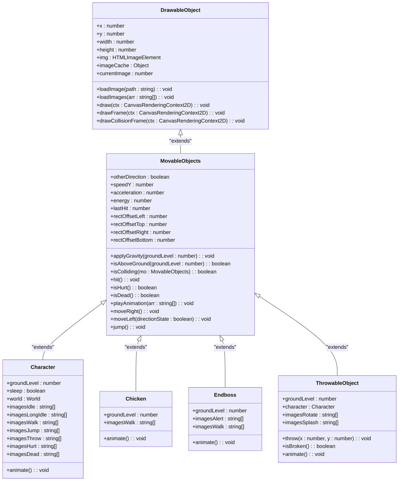
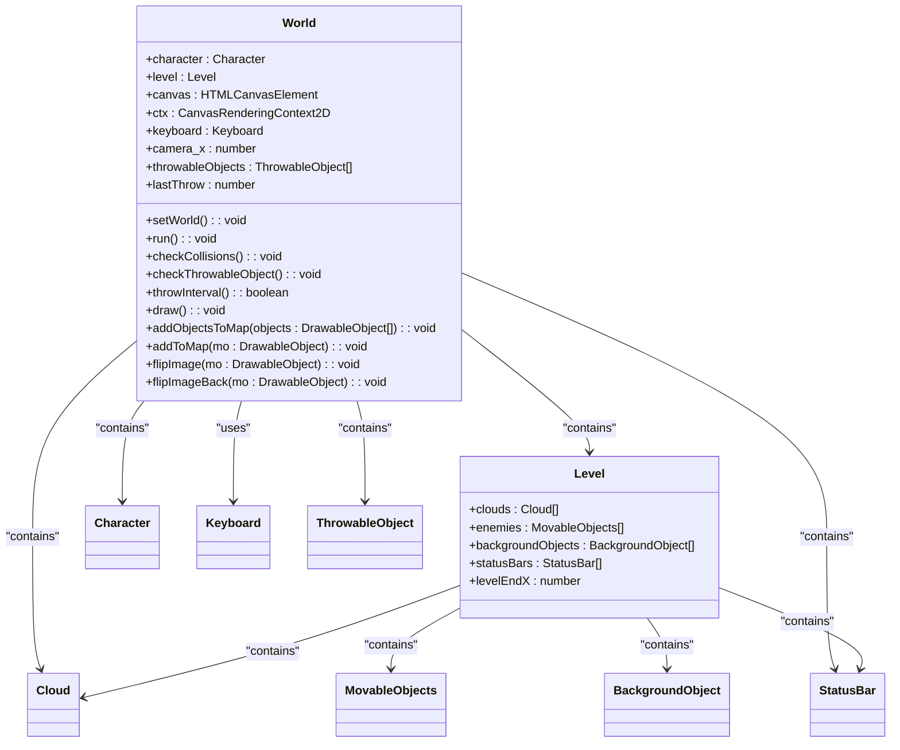
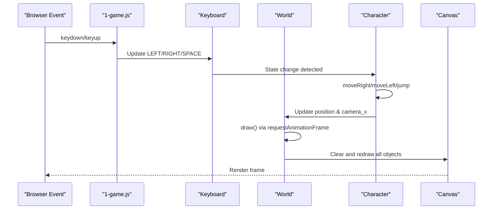

# Core Architecture

<cite>
**Referenced Files in This Document**   
- [drawable-object.class.js](file://models/drawable-object.class.js)
- [movable-objects.class.js](file://models/movable-objects.class.js)
- [character.class.js](file://models/character.class.js)
- [chicken.class.js](file://models/chicken.class.js)
- [endboss.class.js](file://models/endboss.class.js)
- [thowable-object.class.js](file://models/thowable-object.class.js)
- [2-world.class.js](file://models/2-world.class.js)
- [keyboard.class.js](file://models/keyboard.class.js)
- [status-bar.class.js](file://models/status-bar.class.js)
- [level.class.js](file://models/level.class.js)
- [1-game.js](file://js/1-game.js)
- [level1.js](file://levels/level1.js)
</cite>

## Table of Contents
1. [Introduction](#introduction)
2. [Object-Oriented Design Pattern](#object-oriented-design-pattern)
3. [Composition in the World Class](#composition-in-the-world-class)
4. [Game Loop Implementation](#game-loop-implementation)
5. [Data Flow from Input to Rendering](#data-flow-from-input-to-rendering)
6. [Coordinate System and Camera Following](#coordinate-system-and-camera-following)
7. [Technical Decisions and Trade-offs](#technical-decisions-and-trade-offs)
8. [Performance Considerations](#performance-considerations)
9. [Component Diagrams](#component-diagrams)
10. [Conclusion](#conclusion)

## Introduction
The el_polo_loco game is built on a clear object-oriented architecture using vanilla JavaScript. The core design revolves around a class hierarchy rooted in `DrawableObject`, extended by `MovableObjects`, and further specialized into game entities such as `Character`, `Chicken`, `Endboss`, and `ThrowableObject`. The `World` class acts as the central coordinator, managing all game objects and their interactions. This document details the architectural structure, design patterns, data flow, and performance characteristics of the game.

**Section sources**
- [2-world.class.js](file://models/2-world.class.js#L0-L131)
- [drawable-object.class.js](file://models/drawable-object.class.js#L0-L43)

## Object-Oriented Design Pattern

The game employs a class inheritance hierarchy to model game entities. At the base is `DrawableObject`, which provides fundamental properties and methods for rendering images on the canvas. This class defines the `x`, `y`, `width`, and `height` coordinates, image loading via `loadImage()` and `loadImages()`, and drawing functionality through `draw()`, `drawFrame()`, and `drawCollisionFrame()`.

`MovableObjects` extends `DrawableObject`, adding physics and movement capabilities such as gravity application, collision detection, and animation control. It introduces methods like `applyGravity()`, `isAboveGround()`, `isColliding()`, and `playAnimation()`, enabling dynamic behavior for all moving entities.

Specialized classes like `Character`, `Chicken`, `Endboss`, and `ThrowableObject` inherit from `MovableObjects`, each defining unique visual assets, movement logic, and state transitions. For example, `Character` manages walking, jumping, throwing, and idle animations based on user input, while `Chicken` and `Endboss` implement enemy-specific behaviors.



**Diagram sources**
- [drawable-object.class.js](file://models/drawable-object.class.js#L0-L43)
- [movable-objects.class.js](file://models/movable-objects.class.js#L0-L76)
- [character.class.js](file://models/character.class.js#L0-L150)
- [chicken.class.js](file://models/chicken.class.js#L0-L34)
- [endboss.class.js](file://models/endboss.class.js#L0-L40)
- [thowable-object.class.js](file://models/thowable-object.class.js#L0-L82)

**Section sources**
- [drawable-object.class.js](file://models/drawable-object.class.js#L0-L43)
- [movable-objects.class.js](file://models/movable-objects.class.js#L0-L76)

## Composition in the World Class

The `World` class exemplifies the composition pattern by aggregating all game objects and managing their coordination. It holds references to the `character`, `level`, `throwableObjects`, and `keyboard`, and orchestrates their interactions. The `setWorld()` method ensures that each object has access to the world context, enabling bidirectional communication.

The `addObjectsToMap()` and `addToMap()` methods handle rendering, applying transformations such as flipping for left-moving entities using `flipImage()` and `flipImageBack()`. This encapsulation allows the `World` to control the visual presentation and spatial relationships of all entities.



**Diagram sources**
- [2-world.class.js](file://models/2-world.class.js#L0-L131)
- [level.class.js](file://models/level.class.js#L0-L13)

**Section sources**
- [2-world.class.js](file://models/2-world.class.js#L0-L131)
- [level.class.js](file://models/level.class.js#L0-L13)

## Game Loop Implementation

The game loop is implemented using a combination of `requestAnimationFrame()` for rendering and `setInterval()` for game logic updates. The `draw()` method in the `World` class is called recursively via `requestAnimationFrame()`, ensuring smooth 60 FPS rendering. This method clears the canvas, applies camera translation, and draws all game objects in the correct order.

Separate `setInterval()` calls handle collision detection and throwable object creation every 200ms. The `checkCollisions()` method iterates through enemies and checks for collisions with the character using the `isColliding()` method. The `checkThrowableObject()` method monitors the `SPACE` key and enforces a cooldown via `throwInterval()` before spawning a new `ThrowableObject`.

**Section sources**
- [2-world.class.js](file://models/2-world.class.js#L36-L58)
- [2-world.class.js](file://models/2-world.class.js#L66-L85)

## Data Flow from Input to Rendering

User input is captured through event listeners in `1-game.js`, which update the state of the global `keyboard` object. Arrow keys and spacebar set corresponding boolean flags (`LEFT`, `RIGHT`, `UP`, `SPACE`) on the `Keyboard` instance.

The `Character` class polls this state during its `animate()` loop, triggering movement (`moveRight`, `moveLeft`, `jump`) or animation changes accordingly. The `World` class uses the character's position to update the camera (`camera_x = -this.x + 100`), creating a follow-camera effect. Visual updates are rendered through the `draw()` loop, which redraws all objects in their current state.



**Diagram sources**
- [1-game.js](file://js/1-game.js#L0-L55)
- [keyboard.class.js](file://models/keyboard.class.js#L0-L7)
- [character.class.js](file://models/character.class.js#L99-L149)
- [2-world.class.js](file://models/2-world.class.js#L66-L85)

**Section sources**
- [1-game.js](file://js/1-game.js#L0-L55)
- [keyboard.class.js](file://models/keyboard.class.js#L0-L7)

## Coordinate System and Camera Following

The game uses a canvas coordinate system where the origin (0,0) is at the top-left. The camera follows the character using `ctx.translate(this.camera_x, 0)`, which shifts the entire coordinate system so that the character remains near the center of the screen. The translation is applied before drawing background elements and reversed before drawing UI elements like status bars.

This technique allows the game world to extend far beyond the visible canvas, with only a portion rendered at any time. The `camera_x` value is updated based on the character's `x` position, creating a smooth scrolling effect as the player moves.

**Section sources**
- [2-world.class.js](file://models/2-world.class.js#L66-L85)

## Technical Decisions and Trade-offs

The decision to use vanilla JavaScript without frameworks offers simplicity and direct control over the DOM and canvas. This approach minimizes dependencies and bundle size, making the game lightweight and fast to load. However, it lacks the modularity, state management, and tooling of modern frameworks, potentially limiting scalability for larger projects.

The use of `setInterval()` for game logic introduces potential timing inaccuracies compared to `requestAnimationFrame()`. Additionally, object creation and garbage collection (e.g., for thrown bottles) may impact performance over time. The current implementation does not explicitly remove used `ThrowableObject` instances, which could lead to memory bloat.

**Section sources**
- [2-world.class.js](file://models/2-world.class.js#L36-L58)
- [thowable-object.class.js](file://models/thowable-object.class.js#L0-L82)

## Performance Considerations

The game targets 60 FPS rendering using `requestAnimationFrame()`, synchronized with the display refresh rate. Canvas clearing is performed once per frame with `clearRect()`, minimizing redraw overhead. Image assets are preloaded into an `imageCache` to prevent flickering during animation.

Collision detection is optimized by limiting checks to active enemies and using bounding box logic with offset adjustments for hitboxes. However, the lack of object pooling or cleanup for `ThrowableObject` instances may lead to performance degradation over extended play sessions. Future improvements could include removing objects after splash animation or reusing instances.

**Section sources**
- [2-world.class.js](file://models/2-world.class.js#L66-L85)
- [movable-objects.class.js](file://models/movable-objects.class.js#L29-L34)
- [drawable-object.class.js](file://models/drawable-object.class.js#L23-L41)

## Component Diagrams

```mermaid
graph TD
A[User Input] --> B[Keyboard State]
B --> C[Character Movement]
C --> D[World Camera Update]
D --> E[Canvas Translation]
E --> F[Render Objects]
F --> G[Display Frame]
H[Game Logic] --> I[Collision Detection]
H --> J[Throwable Object Creation]
I --> C
J --> F
K[Animation] --> L[playAnimation()]
L --> F
```

**Diagram sources**
- [2-world.class.js](file://models/2-world.class.js#L66-L85)
- [movable-objects.class.js](file://models/movable-objects.class.js#L55-L60)

## Conclusion

The el_polo_loco game demonstrates a well-structured object-oriented design with clear inheritance and composition patterns. The `World` class effectively coordinates game entities, while the rendering and game logic loops ensure smooth gameplay. Despite the simplicity of vanilla JavaScript, the architecture supports a functional 2D platformer with animation, physics, and input handling. Future enhancements could focus on memory management, performance optimization, and modularization for scalability.