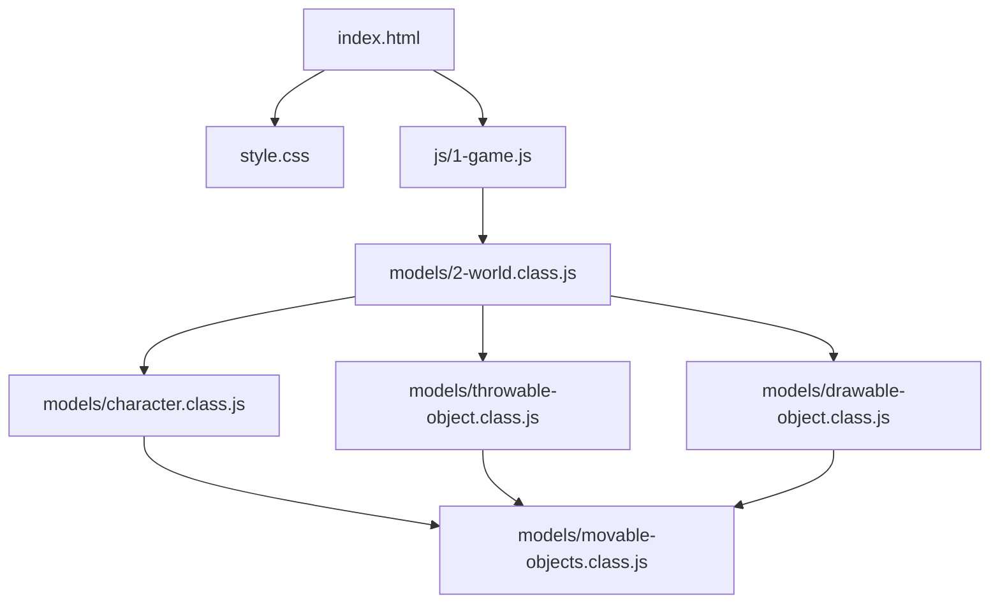
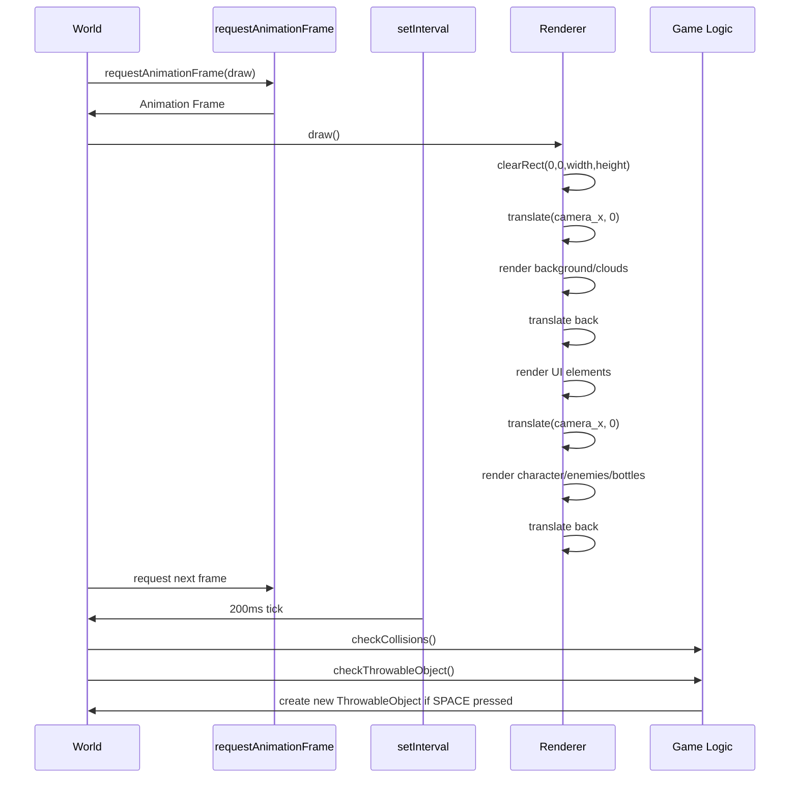
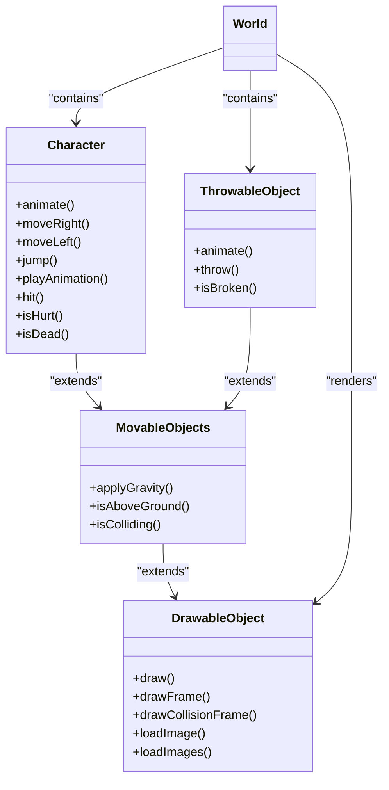
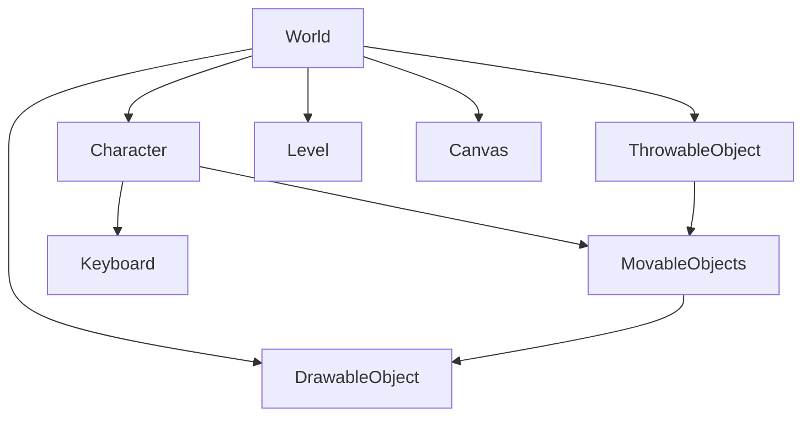

# Game Loop

<cite>
**Referenced Files in This Document**   
- [1-game.js](file://js/1-game.js)
- [2-world.class.js](file://models/2-world.class.js)
- [character.class.js](file://models/character.class.js)
- [movable-objects.class.js](file://models/movable-objects.class.js)
- [throwable-object.class.js](file://models/thowable-object.class.js)
- [drawable-object.class.js](file://models/drawable-object.class.js)
</cite>

## Table of Contents
1. [Introduction](#introduction)
2. [Project Structure](#project-structure)
3. [Core Components](#core-components)
4. [Architecture Overview](#architecture-overview)
5. [Detailed Component Analysis](#detailed-component-analysis)
6. [Dependency Analysis](#dependency-analysis)
7. [Performance Considerations](#performance-considerations)
8. [Troubleshooting Guide](#troubleshooting-guide)
9. [Conclusion](#conclusion)

## Introduction
The el_polo_loco game implements a dual-timing game loop architecture that separates rendering from game logic updates. This document analyzes the coordination between visual rendering at 60fps using `requestAnimationFrame` and game state updates occurring at 200ms intervals via `setInterval`. The system ensures smooth animations while efficiently managing collision detection, throwable object creation, and character movement. This architectural approach balances performance with gameplay responsiveness, leveraging canvas-based rendering with coordinate translation for camera movement.

## Project Structure
The project follows a modular structure with clear separation of concerns. JavaScript files are organized into functional directories: core game logic in `js/`, game world definitions in `models/`, and level configurations in `levels/`. The entry point `1-game.js` initializes the game environment, while the `models/` directory contains class definitions for all game entities including the World, Character, and various movable and drawable objects.



**Diagram sources**
- [1-game.js](file://js/1-game.js#L1-L55)
- [2-world.class.js](file://models/2-world.class.js#L1-L132)

**Section sources**
- [1-game.js](file://js/1-game.js#L1-L55)
- [2-world.class.js](file://models/2-world.class.js#L1-L132)

## Core Components
The game loop system centers around the World class which orchestrates rendering and game logic. The Character class manages player input and animation states, while MovableObjects provides shared physics functionality. ThrowableObject handles projectile behavior with gravity and collision detection. The DrawableObject base class enables consistent rendering across all visual elements. These components work together through the World instance which maintains references to all active game objects and coordinates their updates.

**Section sources**
- [2-world.class.js](file://models/2-world.class.js#L1-L132)
- [character.class.js](file://models/character.class.js#L1-L152)
- [movable-objects.class.js](file://models/movable-objects.class.js#L1-L76)

## Architecture Overview
The game architecture implements a hybrid timing model that combines the browser's rendering cycle with fixed-interval game logic updates. The World object serves as the central coordinator, managing both the visual rendering pipeline and the game state update cycle. This separation allows the game to maintain smooth 60fps animations while performing less frequent but critical game logic operations.

```mermaid
graph TD
A[Game Initialization] --> B[World Constructor]
B --> C[Start Rendering Loop]
B --> D[Start Logic Intervals]
C --> E[requestAnimationFrame]
E --> F[draw() Method]
F --> G[Clear Canvas]
G --> H[Translate Coordinates]
H --> I[Render Objects]
I --> J[Recursive Animation Frame]
D --> K[setInterval 200ms]
K --> L[Collision Detection]
K --> M[Throwable Object Check]
L --> N[Character Hit Logic]
M --> O[Create New Bottle]
```

**Diagram sources**
- [2-world.class.js](file://models/2-world.class.js#L1-L132)
- [1-game.js](file://js/1-game.js#L1-L55)

## Detailed Component Analysis

### World Game Loop Analysis
The World class implements the core game loop with distinct rendering and logic update mechanisms. The rendering loop uses `requestAnimationFrame` to achieve 60fps updates, while game logic runs on 200ms intervals using `setInterval`. This dual approach ensures smooth visual performance while efficiently managing computational load.

#### Game Loop Coordination


**Diagram sources**
- [2-world.class.js](file://models/2-world.class.js#L66-L85)
- [2-world.class.js](file://models/2-world.class.js#L36-L41)

**Section sources**
- [2-world.class.js](file://models/2-world.class.js#L36-L85)

### Rendering Pipeline Analysis
The rendering system implements a sophisticated coordinate management approach to enable camera movement while maintaining proper object layering. The draw() method carefully manages canvas state through strategic save/restore operations and coordinate translations.

#### Canvas Rendering Flow
```mermaid
flowchart TD
Start([draw() Entry]) --> Clear["ctx.clearRect(0,0,width,height)"]
Clear --> TranslateCamera["ctx.translate(camera_x, 0)"]
TranslateCamera --> RenderBackground["Render Background Objects"]
RenderBackground --> RenderClouds["Render Clouds"]
RenderClouds --> TranslateBack["ctx.translate(-camera_x, 0)"]
TranslateBack --> RenderUI["Render Status Bars"]
RenderUI --> TranslateCamera2["ctx.translate(camera_x, 0)"]
TranslateCamera2 --> RenderCharacter["Render Character"]
RenderCharacter --> RenderEnemies["Render Enemies"]
RenderEnemies --> RenderBottles["Render Throwable Objects"]
RenderBottles --> TranslateBack2["ctx.translate(-camera_x, 0)"]
TranslateBack2 --> RequestFrame["requestAnimationFrame(draw)"]
RequestFrame --> End([Next Frame])
```

**Diagram sources**
- [2-world.class.js](file://models/2-world.class.js#L66-L85)

**Section sources**
- [2-world.class.js](file://models/2-world.class.js#L66-L85)

### Game Logic Components
The game logic components operate on independent timing intervals, allowing for efficient processing of collision detection and player actions without interfering with the rendering pipeline.

#### Character Animation and Movement


**Diagram sources**
- [character.class.js](file://models/character.class.js#L1-L152)
- [movable-objects.class.js](file://models/movable-objects.class.js#L1-L76)
- [throwable-object.class.js](file://models/thowable-object.class.js#L1-L83)
- [drawable-object.class.js](file://models/drawable-object.class.js#L1-L45)

**Section sources**
- [character.class.js](file://models/character.class.js#L99-L149)
- [movable-objects.class.js](file://models/movable-objects.class.js#L14-L23)
- [throwable-object.class.js](file://models/thowable-object.class.js#L45-L83)

## Dependency Analysis
The game components exhibit a clear inheritance hierarchy with proper separation of rendering and game logic concerns. The World class maintains direct dependencies on all active game objects, while the character and throwable objects inherit shared functionality from MovableObjects. This dependency structure enables code reuse while maintaining clear responsibilities.



**Diagram sources**
- [2-world.class.js](file://models/2-world.class.js#L1-L132)
- [character.class.js](file://models/character.class.js#L1-L152)
- [movable-objects.class.js](file://models/movable-objects.class.js#L1-L76)

**Section sources**
- [2-world.class.js](file://models/2-world.class.js#L1-L132)
- [character.class.js](file://models/character.class.js#L1-L152)

## Performance Considerations
The dual-timing architecture provides several performance benefits but also introduces potential challenges. The 60fps rendering loop ensures smooth animations, while the 200ms game logic interval reduces computational overhead. However, long-running operations in either loop could cause jank or missed frames. The system minimizes layout thrashing by batching canvas operations and using efficient redraw regions through selective coordinate translation. Off-screen throwable objects are automatically garbage collected when they fall below the ground level, preventing memory leaks. The animation intervals are carefully tuned to balance responsiveness with performance, with character movement updates at 60fps and animation state changes at 150ms intervals.

**Section sources**
- [2-world.class.js](file://models/2-world.class.js#L66-L85)
- [character.class.js](file://models/character.class.js#L99-L149)
- [movable-objects.class.js](file://models/movable-objects.class.js#L14-L23)

## Troubleshooting Guide
Common issues in the game loop system typically involve timing conflicts or rendering artifacts. If animation appears choppy, verify that the `requestAnimationFrame` chain is properly maintained in the World.draw() method. For collision detection problems, ensure that the 200ms interval is sufficient for the game's requirements. Camera movement issues often stem from incorrect coordinate translation sequences in the draw() method. Memory leaks may occur if throwable objects are not properly cleaned up when they fall below the ground level. Performance bottlenecks can be identified by monitoring the execution time of the draw() method and ensuring it completes within 16ms for 60fps rendering.

**Section sources**
- [2-world.class.js](file://models/2-world.class.js#L66-L85)
- [2-world.class.js](file://models/2-world.class.js#L36-L41)
- [throwable-object.class.js](file://models/thowable-object.class.js#L45-L83)

## Conclusion
The el_polo_loco game loop system effectively combines `requestAnimationFrame` for smooth 60fps rendering with `setInterval` for efficient game logic updates at 200ms intervals. This dual-timing approach ensures responsive gameplay while maintaining visual smoothness. The architecture demonstrates thoughtful coordination between visual updates and state changes, with careful management of canvas state and coordinate translation for camera movement. The inheritance hierarchy promotes code reuse while maintaining clear separation of concerns. Future optimizations could include dynamic interval adjustment based on system performance and more sophisticated object pooling for throwable objects to further reduce garbage collection overhead.