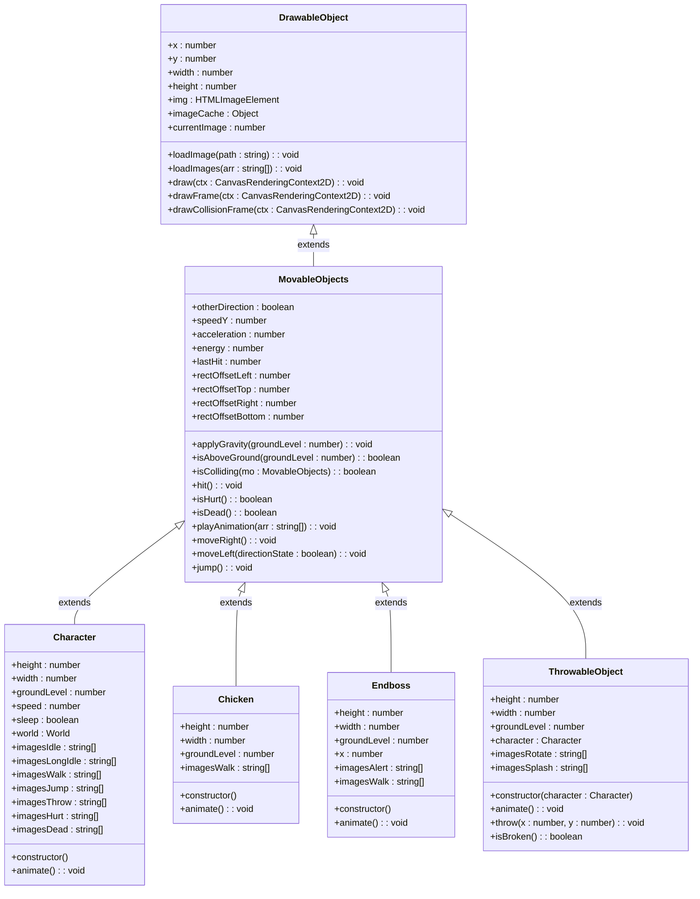

# Inheritance Hierarchy

<cite>
**Referenced Files in This Document**   
- [drawable-object.class.js](file://models/drawable-object.class.js)
- [movable-objects.class.js](file://models/movable-objects.class.js)
- [character.class.js](file://models/character.class.js)
- [chicken.class.js](file://models/chicken.class.js)
- [endboss.class.js](file://models/endboss.class.js)
- [thowable-object.class.js](file://models/thowable-object.class.js)
</cite>

## Table of Contents
1. [Introduction](#introduction)
2. [Base Class: DrawableObject](#base-class-drawableobject)
3. [Intermediate Class: MovableObjects](#intermediate-class-movableobjects)
4. [Specialized Classes](#specialized-classes)
   - [Character](#character)
   - [Chicken](#chicken)
   - [Endboss](#endboss)
   - [ThrowableObject](#throwableobject)
5. [Inheritance Hierarchy Diagram](#inheritance-hierarchy-diagram)
6. [Initialization Flow](#initialization-flow)
7. [Design Rationale](#design-rationale)
8. [Potential Pitfalls](#potential-pitfalls)
9. [Extension Patterns](#extension-patterns)
10. [Conclusion](#conclusion)

## Introduction
This document provides a comprehensive analysis of the class inheritance hierarchy in the el_polo_loco game project. The architecture follows a hierarchical object-oriented design pattern where specialized game entities inherit from more general base classes, enabling code reuse, polymorphism, and organized game object management. The hierarchy begins with DrawableObject as the foundational class for all visual elements, extends through MovableObjects to add physics and animation capabilities, and culminates in specialized classes like Character, Chicken, Endboss, and ThrowableObject that implement unique game behaviors.

## Base Class: DrawableObject
The DrawableObject class serves as the foundation for all visual elements in the game, providing essential rendering capabilities that are inherited by all game objects. This base class encapsulates the core functionality needed for displaying sprites on the canvas.

The class defines fundamental properties including position (x, y), dimensions (width, height), and image handling (img, imageCache). It implements three key methods: loadImage for loading a single image, loadImages for preloading multiple frames into the image cache, and draw for rendering the current image at the specified position with appropriate dimensions.

Notably, DrawableObject includes debugging visualization methods drawFrame and drawCollisionFrame that render bounding boxes in blue and red respectively. These methods use instanceof checks to determine whether to display frames, indicating a design decision to limit debugging visuals to character and enemy entities rather than all drawable objects.

This base class establishes the fundamental contract for all visual game elements, ensuring consistent rendering behavior across the entire game world while remaining lightweight and focused on its primary responsibility of image display.

**Section sources**
- [drawable-object.class.js](file://models/drawable-object.class.js#L0-L43)

## Intermediate Class: MovableObjects
MovableObjects extends DrawableObject to introduce physics, animation, and collision detection capabilities, serving as the intermediate class for all dynamic game entities. This class adds significant functionality that transforms static visual elements into interactive game objects with movement and state.

The class introduces physics properties including speedY for vertical velocity, acceleration for gravity effects, and groundLevel for collision detection with the game world. The applyGravity method implements a continuous gravity simulation through setInterval, adjusting the object's y position based on its current speedY and acceleration, while ensuring objects rest on the ground level when appropriate.

For animation, MovableObjects implements the playAnimation method that cycles through preloaded image arrays, creating the illusion of movement. This method uses the currentImage counter to determine which frame to display, enabling smooth animation sequences for walking, jumping, and other actions.

Collision detection is handled through the isColliding method, which performs axis-aligned bounding box collision checks between two movable objects. The method accounts for collision rectangles defined by rectOffset properties, allowing for more precise hit detection than using the full sprite dimensions. Additional methods like isHurt and isDead manage entity state based on energy levels and timing, while hit implements damage mechanics.

Movement controls are provided through moveRight, moveLeft, and jump methods, establishing a consistent interface for horizontal and vertical movement across all inheriting classes.

**Section sources**
- [movable-objects.class.js](file://models/movable-objects.class.js#L0-L75)

## Specialized Classes

### Character
The Character class represents the player-controlled protagonist, extending MovableObjects with specific behaviors and animations. It defines precise dimensions, positioning, and movement speed tailored to the main character.

The class declares multiple image arrays for different animation states: idle, longIdle (for extended periods of inactivity), walk, jump, throw, hurt, and dead. These arrays contain paths to sprite sheets that enable rich visual feedback for various game states.

In its constructor, Character initializes by loading the initial idle image and preloading all animation frames into the image cache. It then applies gravity and starts the animation system. The animate method implements sophisticated behavior including a sleep timer that triggers the long idle animation after 3 seconds of inactivity, movement controls tied to keyboard input, and camera tracking that follows the character's position.

The animation logic prioritizes states based on game conditions: dead animations take precedence, followed by hurt states, then movement-based animations (walking, jumping, throwing), with idle states as the default. This hierarchical state management ensures appropriate visual feedback for the character's current situation.

**Section sources**
- [character.class.js](file://models/character.class.js#L0-L150)

### Chicken
The Chicken class represents basic enemy units, extending MovableObjects with simple patrol behavior. It defines appropriate dimensions and positioning for a small enemy character.

The class includes a single imagesWalk array containing three frames for a walking animation. In its constructor, Chicken initializes with a random starting position within a specified range and a randomly determined speed between 0.25 and 0.75, creating variation among enemy instances.

The animate method implements continuous leftward movement and cycling through the walking animation frames. This simple behavior creates the effect of chickens patrolling from right to left across the game world. The class inherits all collision and health mechanics from MovableObjects, allowing it to interact with the player character and respond to attacks.

By keeping the implementation minimal, the Chicken class demonstrates how specialized entities can leverage the shared functionality of the inheritance hierarchy while adding only the specific behaviors needed for their role in the game.

**Section sources**
- [chicken.class.js](file://models/chicken.class.js#L0-L34)

### Endboss
The Endboss class represents the final enemy in the game, extending MovableObjects with boss-specific characteristics. It defines larger dimensions appropriate for a significant enemy, with a fixed starting position at x=400.

The class includes two image arrays: imagesWalk for regular movement and imagesAlert for an alert state (though the alert animation is not currently implemented in the animate method). The constructor initializes the boss with the first walking frame and preloads all walking animation images.

The animate method currently only cycles through the walking animation frames at a 150ms interval, creating continuous movement. Like other entities, it inherits physics, collision detection, and health management from the inheritance chain.

The Endboss implementation suggests potential for more complex behavior that could be added later, such as transitioning to an alert state when the player approaches, or implementing special attack patterns, while maintaining compatibility with the existing game systems through inheritance.

**Section sources**
- [endboss.class.js](file://models/endboss.class.js#L0-L40)

### ThrowableObject
The ThrowableObject class represents projectiles that can be thrown by the player, extending MovableObjects with throwing mechanics. It defines dimensions for a small throwable item (salsa bottle) and includes two image arrays: imagesRotate for the spinning animation while airborne, and imagesSplash for the impact effect when hitting the ground.

The constructor accepts a character reference, positioning the throwable object relative to the character's current position and direction. It initializes with gravity applied and immediately begins the throwing animation. The throw method calculates the initial trajectory based on the character's facing direction and applies horizontal movement.

The animate method implements conditional animation: displaying the rotating bottle while in the air (above ground level) and switching to the splash animation upon impact. It also dynamically adjusts the object's dimensions based on the natural size of the current image, ensuring proper visual scaling.

This class demonstrates how the inheritance hierarchy supports specialized behaviors while maintaining consistency with the shared animation and physics systems. The throwable object interacts with the game world through the same collision detection system used by other entities.

**Section sources**
- [thowable-object.class.js](file://models/thowable-object.class.js#L0-L82)

## Inheritance Hierarchy Diagram

**Diagram sources**
- [drawable-object.class.js](file://models/drawable-object.class.js#L0-L43)
- [movable-objects.class.js](file://models/movable-objects.class.js#L0-L75)
- [character.class.js](file://models/character.class.js#L0-L150)
- [chicken.class.js](file://models/chicken.class.js#L0-L34)
- [endboss.class.js](file://models/endboss.class.js#L0-L40)
- [thowable-object.class.js](file://models/thowable-object.class.js#L0-L82)

## Initialization Flow
The initialization flow in this inheritance hierarchy follows a constructor chaining pattern that ensures proper setup of objects from the base class upward. When a specialized class instance is created, the process begins with the most derived constructor, which immediately calls super() to invoke the parent class constructor.

For example, when creating a Character instance, the Character constructor first calls super() to initialize the MovableObjects properties and methods. This, in turn, implicitly calls the DrawableObject constructor to establish the foundational rendering capabilities. Only after the parent constructors have completed does the derived constructor continue with its specific initialization.

Each class in the hierarchy contributes to the initialization process: DrawableObject sets up the basic rendering framework, MovableObjects adds physics and animation systems, and specialized classes like Character load their specific image assets and start their unique animation loops. This sequential initialization ensures that each layer of functionality is properly established before the next layer builds upon it.

The flow demonstrates proper object-oriented design principles, with each class responsible for initializing its own specific properties while relying on the inheritance chain to handle more general functionality. This approach prevents initialization order issues and ensures that all objects are fully configured before they become active in the game world.

**Section sources**
- [character.class.js](file://models/character.class.js#L100-L115)
- [chicken.class.js](file://models/chicken.class.js#L20-L28)
- [endboss.class.js](file://models/endboss.class.js#L25-L30)
- [thowable-object.class.js](file://models/thowable-object.class.js#L25-L35)

## Design Rationale
The inheritance model in el_polo_loco follows a logical progression from general to specific, maximizing code reuse while maintaining clear responsibilities for each class. The design leverages inheritance to establish a consistent interface for all game objects while allowing specialized behaviors where needed.

Code reuse is achieved through the hierarchical structure: DrawableObject provides universal rendering capabilities used by all visual elements, MovableObjects adds shared physics and animation systems for dynamic objects, and specialized classes inherit these capabilities while adding unique behaviors. This eliminates redundancy and ensures consistent behavior across similar entity types.

Polymorphism is evident in the draw() method calls throughout the game loop. The rendering system can treat all objects as DrawableObjects, calling draw() without knowing their specific types, while each object renders appropriately based on its current state. This allows the game to handle diverse entities through a unified interface.

Shared collision logic in MovableObjects ensures consistent interaction rules across all collidable entities. The isColliding method uses a standardized approach that works for any combination of movable objects, simplifying collision resolution and preventing inconsistent behavior between different entity types.

The design also facilitates maintenance and extension. Adding new enemy types requires only creating a new class that extends MovableObjects, automatically inheriting movement, physics, and animation systems. This modular approach reduces the risk of introducing bugs when expanding game content.

**Section sources**
- [drawable-object.class.js](file://models/drawable-object.class.js#L0-L43)
- [movable-objects.class.js](file://models/movable-objects.class.js#L0-L75)
- [character.class.js](file://models/character.class.js#L0-L150)

## Potential Pitfalls
While the inheritance hierarchy provides significant benefits, it also introduces potential pitfalls that should be considered for future development. The deep inheritance tree creates tight coupling between classes, making it difficult to modify base classes without potentially affecting all derived classes.

Changes to MovableObjects, for example, could inadvertently break specialized behaviors in Character, Chicken, Endboss, or ThrowableObject. This tight coupling reduces flexibility and increases the risk of unintended side effects when refactoring or adding features.

The deep hierarchy may also lead to the "fragile base class" problem, where modifications to DrawableObject or MovableObjects could destabilize the entire object system. Methods like drawFrame and drawCollisionFrame that use instanceof checks violate the Liskov Substitution Principle by treating derived classes differently based on their specific types.

Performance could be impacted by the constructor chaining and the multiple layers of method calls. Each object creation requires traversing the entire inheritance chain, and method calls may involve multiple levels of inheritance resolution.

Additionally, the current design may encourage "inheritance abuse" where new features are added through inheritance rather than composition, potentially leading to increasingly complex and unwieldy class hierarchies as the game expands.

**Section sources**
- [movable-objects.class.js](file://models/movable-objects.class.js#L0-L75)
- [drawable-object.class.js](file://models/drawable-object.class.js#L30-L43)

## Extension Patterns
To extend the game with new entities while maintaining the existing architecture, several patterns can be followed. For new character types or enemies, create classes that extend MovableObjects, defining appropriate dimensions, animation frames, and behavior in the constructor and animate method.

For entities with similar behaviors to existing classes, consider extending those classes directly. For example, a flying enemy could extend Chicken but override the applyGravity method to implement flight mechanics, or a stronger enemy could extend Endboss with additional health and attack patterns.

When adding entities that don't fit well within the current hierarchy, consider using composition over inheritance. Create utility classes for specific behaviors (e.g., AIBehavior, ProjectilePhysics) that can be incorporated into objects without deepening the inheritance tree.

For visual effects or items that don't require physics, extend DrawableObject directly instead of MovableObjects to avoid unnecessary overhead. This keeps the object lightweight while still integrating with the rendering system.

When modifying base classes, follow the open/closed principle by extending functionality rather than changing existing behavior. Add new methods or properties instead of altering existing ones to minimize the impact on derived classes.

These patterns allow for flexible expansion of the game while preserving the benefits of the existing inheritance model and avoiding its potential pitfalls.

**Section sources**
- [character.class.js](file://models/character.class.js#L0-L150)
- [chicken.class.js](file://models/chicken.class.js#L0-L34)
- [endboss.class.js](file://models/endboss.class.js#L0-L40)

## Conclusion
The inheritance hierarchy in el_polo_loco demonstrates a well-structured object-oriented design that effectively organizes game entities from general to specific. The progression from DrawableObject to MovableObjects to specialized classes creates a logical architecture that promotes code reuse, enables polymorphism, and provides a consistent interface for game object management.

The design successfully encapsulates rendering, physics, animation, and collision detection in appropriate layers, allowing specialized entities to focus on their unique behaviors while inheriting shared functionality. This approach simplifies development and maintenance, making it easier to understand and modify the game's object system.

While the deep inheritance tree introduces some potential pitfalls related to tight coupling and fragility, the overall architecture provides a solid foundation for the game. By following established extension patterns and considering composition for complex behaviors, developers can continue to expand the game while maintaining code quality and system stability.

The inheritance model exemplifies effective object-oriented design principles in a game development context, balancing the benefits of code reuse and polymorphism with the practical needs of a dynamic, interactive game world.