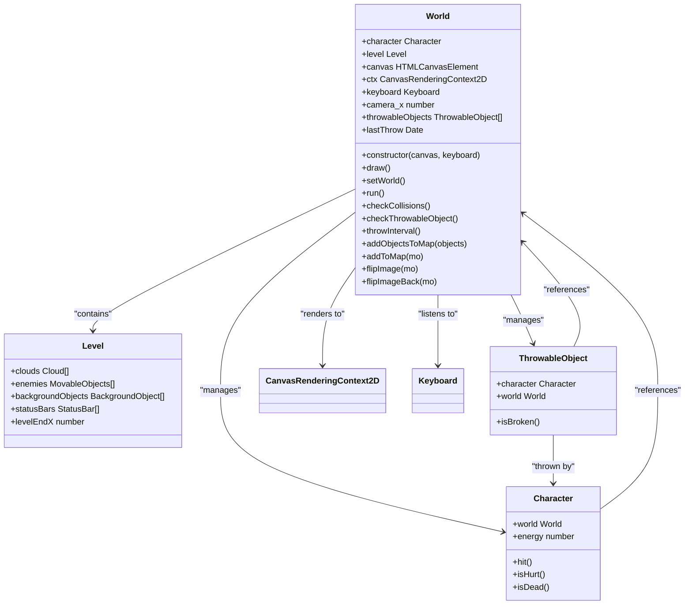
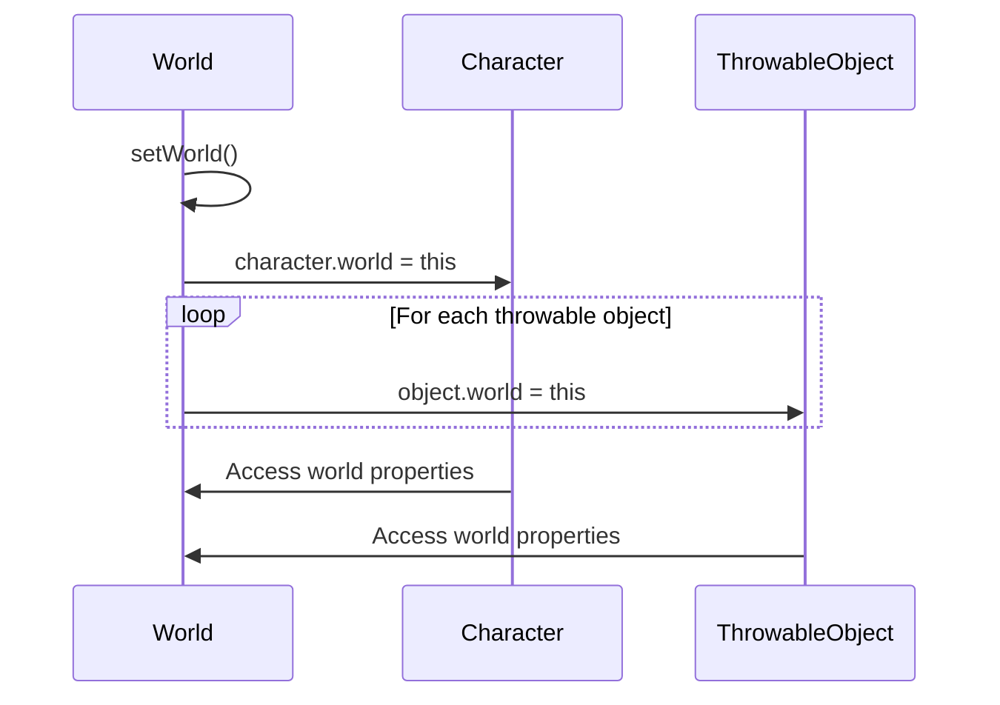
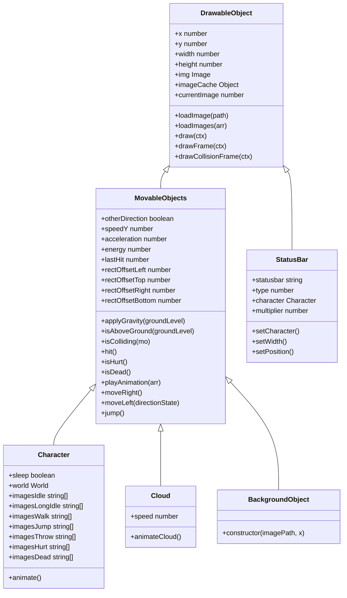
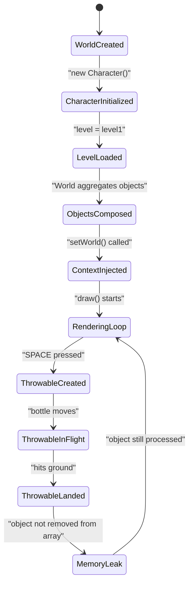

# Object Composition

<cite>
**Referenced Files in This Document**   
- [2-world.class.js](file://models/2-world.class.js)
- [level1.js](file://levels/level1.js)
- [character.class.js](file://models/character.class.js)
- [thowable-object.class.js](file://models/thowable-object.class.js)
- [level.class.js](file://models/level.class.js)
- [status-bar.class.js](file://models/status-bar.class.js)
- [clouds.class.js](file://models/clouds.class.js)
- [background-object.class.js](file://models/background-object.class.js)
- [movable-objects.class.js](file://models/movable-objects.class.js)
- [drawable-object.class.js](file://models/drawable-object.class.js)
</cite>

## Table of Contents
1. [Introduction](#introduction)
2. [World Class as Central Coordinator](#world-class-as-central-coordinator)
3. [World Context Injection via setWorld()](#world-context-injection-via-setworld)
4. [Rendering Orchestration with draw()](#rendering-orchestration-with-draw)
5. [Composition vs Inheritance Benefits](#composition-vs-inheritance-benefits)
6. [Level Configuration Integration](#level-configuration-integration)
7. [Object Lifecycle Management](#object-lifecycle-management)
8. [Best Practices for Object Disposal](#best-practices-for-object-disposal)
9. [Conclusion](#conclusion)

## Introduction
The object composition pattern in this game architecture centers around the World class as the primary coordinator that manages all game entities. This document explores how the World class aggregates and orchestrates game objects including Character, enemies, status bars, clouds, background objects, and throwable objects through composition rather than inheritance. The analysis covers the setWorld() method for context injection, the draw() method for rendering orchestration, and the benefits of composition over inheritance for flexible game object configuration and dynamic level construction.

## World Class as Central Coordinator

The World class serves as the central game coordinator that aggregates and manages all game objects through composition. It maintains references to the character, level configuration, canvas context, keyboard input, camera position, and collections of throwable objects. The constructor initializes the rendering context and establishes the world reference globally through window.world, enabling cross-object communication.



**Diagram sources**
- [2-world.class.js](file://models/2-world.class.js#L1-L131)
- [character.class.js](file://models/character.class.js#L1-L150)
- [level.class.js](file://models/level.class.js#L1-L13)
- [thowable-object.class.js](file://models/thowable-object.class.js#L1-L82)

**Section sources**
- [2-world.class.js](file://models/2-world.class.js#L1-L131)

## World Context Injection via setWorld()

The setWorld() method implements context injection by establishing bidirectional references between the World instance and its managed objects. This enables cross-object communication by giving game entities access to the global world state, including other objects, input state, and game logic. The method injects the world reference into the character and all throwable objects, allowing them to access world properties and methods.



**Diagram sources**
- [2-world.class.js](file://models/2-world.class.js#L25-L32)

**Section sources**
- [2-world.class.js](file://models/2-world.class.js#L25-L32)

## Rendering Orchestration with draw()

The draw() method orchestrates the rendering process by coordinating the drawing of all game objects through the addObjectsToMap() and addToMap() methods. It manages the canvas transformation for camera movement and sequences the rendering of different object collections in the correct z-order. The method uses requestAnimationFrame for smooth animation and clears the canvas before each frame.

```mermaid
flowchart TD
Start([draw() called]) --> ClearCanvas["Clear canvas with clearRect()"]
ClearCanvas --> TranslateCamera["Translate context by camera_x"]
TranslateCamera --> DrawBackground["addObjectsToMap(backgroundObjects)"]
DrawBackground --> DrawClouds["addObjectsToMap(clouds)"]
DrawClouds --> ResetCamera1["Translate back to origin"]
ResetCamera1 --> DrawStatusBars["addObjectsToMap(statusBars)"]
DrawStatusBars --> RestoreCamera1["Translate back to camera space"]
RestoreCamera1 --> DrawCharacter["addToMap(character)"]
DrawCharacter --> DrawEnemies["addObjectsToMap(enemies)"]
DrawEnemies --> DrawThrowables["addObjectsToMap(throwableObjects)"]
DrawThrowables --> ResetCamera2["Translate back to origin"]
ResetCamera2 --> RequestNextFrame["requestAnimationFrame(draw)"]
RequestNextFrame --> End([Next frame])
```

**Diagram sources**
- [2-world.class.js](file://models/2-world.class.js#L66-L85)
- [2-world.class.js](file://models/2-world.class.js#L87-L91)
- [2-world.class.js](file://models/2-world.class.js#L106-L117)

**Section sources**
- [2-world.class.js](file://models/2-world.class.js#L66-L85)

## Composition vs Inheritance Benefits

The architecture employs composition over inheritance to provide greater flexibility in object configuration and dynamic level construction. This approach offers several advantages:

1. **Flexible Object Configuration**: Game objects can be composed from various components without being constrained by inheritance hierarchies. The World class can manage diverse object types through shared interfaces rather than inheritance.

2. **Dynamic Level Construction**: Levels can be configured by composing different collections of objects without requiring class inheritance changes. The level1.js configuration demonstrates this by defining arrays of clouds, enemies, background objects, and status bars.

3. **Easier Maintenance**: Changes to one component don't affect unrelated components, reducing coupling and making the codebase more maintainable.

4. **Runtime Flexibility**: Objects can be added or removed from the game world at runtime, enabling dynamic gameplay elements like throwable objects.



**Diagram sources**
- [drawable-object.class.js](file://models/drawable-object.class.js#L1-L43)
- [movable-objects.class.js](file://models/movable-objects.class.js#L1-L75)
- [character.class.js](file://models/character.class.js#L1-L150)
- [clouds.class.js](file://models/clouds.class.js#L1-L17)
- [background-object.class.js](file://models/background-object.class.js#L1-L9)
- [status-bar.class.js](file://models/status-bar.class.js#L1-L132)

**Section sources**
- [drawable-object.class.js](file://models/drawable-object.class.js#L1-L43)
- [movable-objects.class.js](file://models/movable-objects.class.js#L1-L75)

## Level Configuration Integration

The level configuration from level1.js is integrated into the World instance through direct composition. The level1.js file defines a Level instance with arrays of clouds, enemies, background objects, and status bars that are directly assigned to the World's level property. This approach enables modular level design where different levels can be created by composing different object collections.

```mermaid
erDiagram
WORLD ||--o{ LEVEL : "has"
LEVEL ||--o{ CLOUD : "contains"
LEVEL ||--o{ ENEMY : "contains"
LEVEL ||--o{ BACKGROUND_OBJECT : "contains"
LEVEL ||--o{ STATUS_BAR : "contains"
WORLD ||--o{ THROWABLE_OBJECT : "manages"
WORLD ||--o{ CHARACTER : "manages"
class WORLD {
canvas
ctx
keyboard
camera_x
}
class LEVEL {
clouds
enemies
backgroundObjects
statusBars
levelEndX
}
class CLOUD {
y
width
height
speed
}
class ENEMY {
height
width
groundLevel
y
x
}
class BACKGROUND_OBJECT {
y
width
height
}
class STATUS_BAR {
x
y
width
height
gap
statusbar
type
}
class CHARACTER {
height
width
groundLevel
x
y
speed
}
class THROWABLE_OBJECT {
height
width
groundLevel
character
}
```

**Diagram sources**
- [level1.js](file://levels/level1.js#L1-L51)
- [level.class.js](file://models/level.class.js#L1-L13)
- [2-world.class.js](file://models/2-world.class.js#L1-L131)

**Section sources**
- [level1.js](file://levels/level1.js#L1-L51)

## Object Lifecycle Management

The architecture addresses object lifecycle management through several mechanisms, particularly for dynamically created throwable objects. The throwableObjects array in the World class tracks all active throwable objects, but the current implementation lacks explicit disposal mechanisms. This can lead to memory leaks as objects accumulate in memory even after they are no longer visible or relevant to gameplay.

The checkThrowableObject() method creates new ThrowableObject instances when the SPACE key is pressed, but there is no corresponding cleanup mechanism to remove objects that have completed their animation (e.g., bottles that have hit the ground and splashed). This results in objects remaining in memory and being processed in subsequent game loops, consuming CPU resources unnecessarily.



**Diagram sources**
- [2-world.class.js](file://models/2-world.class.js#L52-L58)
- [thowable-object.class.js](file://models/thowable-object.class.js#L1-L82)

**Section sources**
- [2-world.class.js](file://models/2-world.class.js#L52-L58)

## Best Practices for Object Disposal

To address memory leaks and improve object lifecycle management, several best practices should be implemented:

1. **Implement Object Cleanup**: Add a mechanism to remove throwable objects from the throwableObjects array once they have completed their lifecycle (e.g., when they hit the ground).

2. **Use Object Pooling**: Instead of creating and destroying objects frequently, implement an object pool for throwable objects to reuse instances.

3. **Add Removal Conditions**: Monitor throwable objects for completion conditions (e.g., isAboveGround() returns false for a sufficient duration) and remove them from the array.

4. **Implement Proper Reference Cleanup**: Ensure all references to removed objects are cleared to allow garbage collection.

5. **Add Memory Monitoring**: Implement monitoring to track the number of active objects and detect potential memory issues.

The current implementation shows a commented approach in the ThrowableObject's animate() method that suggests removing objects from the world's throwableObjects array, but this functionality is not implemented. Proper disposal would prevent unbounded memory growth and maintain optimal game performance.

**Section sources**
- [thowable-object.class.js](file://models/thowable-object.class.js#L45-L55)

## Conclusion
The object composition pattern implemented in the World class provides a flexible and maintainable architecture for game object management. By using composition over inheritance, the system achieves greater flexibility in object configuration and dynamic level construction. The setWorld() method enables cross-object communication through context injection, while the draw() method orchestrates rendering through coordinated object drawing. However, the current implementation requires improvements in object lifecycle management to prevent memory leaks, particularly for dynamically created throwable objects. Implementing proper disposal mechanisms and object pooling would enhance performance and memory efficiency in the game.