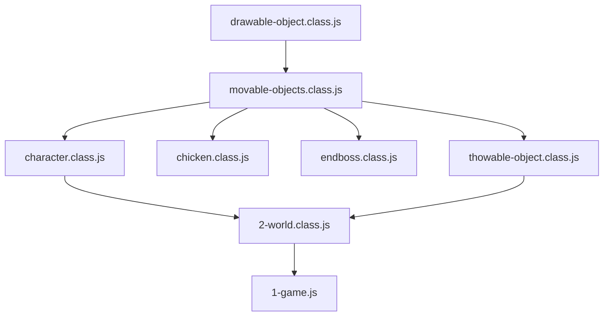
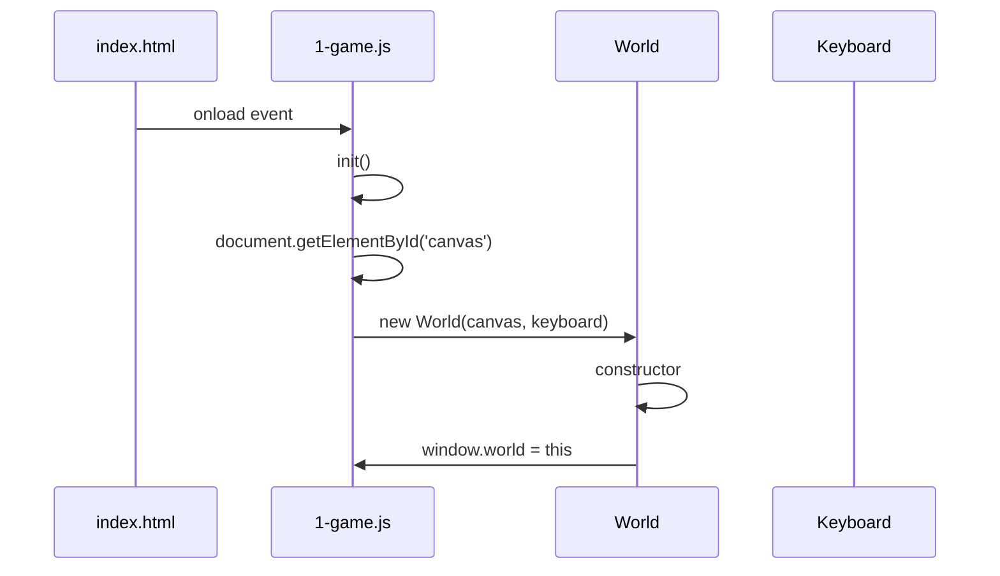
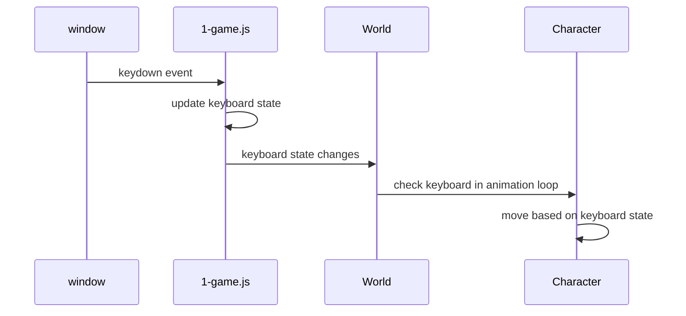
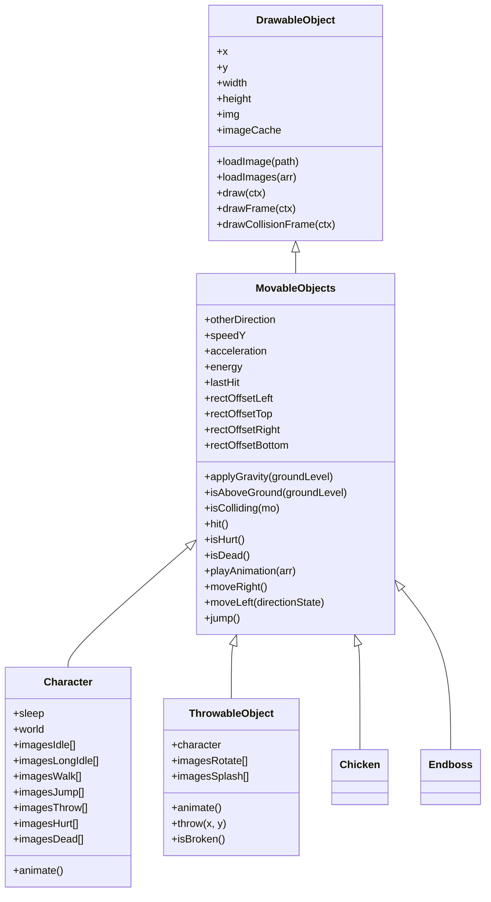

# Game Initialization

<cite>
**Referenced Files in This Document**   
- [index.html](file://index.html)
- [1-game.js](file://js/1-game.js)
- [2-world.class.js](file://models/2-world.class.js)
- [keyboard.class.js](file://models/keyboard.class.js)
- [character.class.js](file://models/character.class.js)
- [thowable-object.class.js](file://models/thowable-object.class.js)
- [movable-objects.class.js](file://models/movable-objects.class.js)
- [drawable-object.class.js](file://models/drawable-object.class.js)
</cite>

## Table of Contents
1. [Introduction](#introduction)
2. [Script Loading and Dependency Management](#script-loading-and-dependency-management)
3. [Initialization Function Analysis](#initialization-function-analysis)
4. [World Object Construction](#world-object-construction)
5. [Keyboard Input System](#keyboard-input-system)
6. [Game Loop and Rendering](#game-loop-and-rendering)
7. [Object Hierarchy and Inheritance](#object-hierarchy-and-inheritance)
8. [Common Initialization Issues](#common-initialization-issues)
9. [Best Practices for Extension](#best-practices-for-extension)
10. [Conclusion](#conclusion)

## Introduction
The game initialization process establishes the foundation for the El Polo Loco game environment by orchestrating the loading of assets, creation of core objects, and setup of the game loop. This document provides a comprehensive analysis of how the HTML page loads JavaScript files in dependency order, how the `init()` function bootstraps the game, and how the World object coordinates game state and rendering. The initialization sequence ensures that parent classes are defined before child classes, canvas elements are properly referenced, and input systems are correctly bound to user events.

## Script Loading and Dependency Management

The game's dependency management is implemented through the HTML script loading order in index.html. The script tags are arranged to ensure that base classes are loaded before their inheritors, following a bottom-up inheritance hierarchy pattern.



**Diagram sources**
- [index.html](file://index.html#L10-L24)

**Section sources**
- [index.html](file://index.html#L10-L24)

The loading sequence follows these principles:
1. **Base Classes First**: `drawable-object.class.js` is loaded first as it contains the foundational `DrawableObject` class that all visual elements inherit from
2. **Intermediate Classes**: `movable-objects.class.js` extends `DrawableObject` and provides movement and collision functionality
3. **Specific Game Objects**: Character, chicken, endboss, and throwable objects extend `MovableObjects` with specialized behaviors
4. **World and Game Logic**: `2-world.class.js` depends on all game objects and is loaded after them
5. **Initialization Script**: `1-game.js` is loaded last as it contains the `init()` function that starts the game

This explicit loading order prevents "class not defined" errors and ensures that inheritance chains are properly established before instantiation.

## Initialization Function Analysis

The `init()` function in 1-game.js serves as the entry point for game execution, triggered by the `onload` event in the HTML body tag. This function performs three critical initialization tasks: retrieving the canvas element, creating the World instance, and establishing global access.



**Diagram sources**
- [index.html](file://index.html#L27)
- [1-game.js](file://js/1-game.js#L6-L11)

**Section sources**
- [1-game.js](file://js/1-game.js#L6-L11)

The `init()` function executes in the following sequence:
1. **Canvas Retrieval**: `document.getElementById('canvas')` obtains a reference to the HTML canvas element defined in index.html
2. **World Instantiation**: Creates a new `World` instance, passing the canvas and keyboard objects as parameters
3. **Global Reference**: The World constructor assigns `window.world = this`, creating a global reference for debugging and external access

This initialization pattern ensures that all core game components are created and connected before the game loop begins.

## World Object Construction

The World class constructor performs comprehensive setup of the game environment, initializing rendering context, game state variables, and starting the game loop. The constructor accepts two parameters: the canvas element and the keyboard input object.

```mermaid
classDiagram
class World {
+canvas
+ctx
+keyboard
+camera_x
+throwableObjects[]
+lastThrow
+character
+level
+constructor(canvas, keyboard)
+draw()
+run()
+setWorld()
+checkCollisions()
+checkThrowableObject()
+throwInterval()
+addObjectsToMap(objects)
+addToMap(mo)
+flipImage(mo)
+flipImageBack(mo)
}
class Character {
+world
+animate()
+moveRight()
+moveLeft()
+jump()
}
class Keyboard {
+LEFT
+RIGHT
+UP
+DOWN
+SPACE
+ANY
}
World --> Character : "contains"
World --> Keyboard : "uses"
World --> "level1" : "uses"
```

**Diagram sources**
- [2-world.class.js](file://models/2-world.class.js#L15-L33)

**Section sources**
- [2-world.class.js](file://models/2-world.class.js#L15-L33)

The World constructor performs these initialization tasks:
1. **Rendering Context Setup**: `this.ctx = canvas.getContext('2d')` creates the 2D rendering context for drawing game elements
2. **Property Assignment**: Stores references to canvas, keyboard, and initializes game state variables including `camera_x`, `throwableObjects` array, and `lastThrow` timestamp
3. **Character Initialization**: Creates a new `Character` instance with keyboard reference (defined in the class properties)
4. **Global Access**: Assigns `window.world = this` to enable global access to the World instance
5. **Game Loop Start**: Immediately invokes `draw()`, `setWorld()`, and `run()` methods to begin rendering and game logic

The constructor's design follows the principle of "fail fast" by attempting to set up all critical components immediately, making initialization errors apparent during startup rather than during gameplay.

## Keyboard Input System

The keyboard input system is implemented as a state-tracking object that monitors key press and release events. The system uses a global Keyboard instance that is shared between the event listeners and game logic.



**Diagram sources**
- [1-game.js](file://js/1-game.js#L13-L55)
- [keyboard.class.js](file://models/keyboard.class.js#L1-L7)

**Section sources**
- [1-game.js](file://js/1-game.js#L13-L55)
- [keyboard.class.js](file://models/keyboard.class.js#L1-L7)

The keyboard system operates through these components:
1. **Keyboard Class**: Defines boolean properties for each relevant key (LEFT, RIGHT, UP, DOWN, SPACE) and a special ANY flag
2. **Event Listeners**: `window.addEventListener` for 'keydown' and 'keyup' events that update the keyboard state
3. **State Management**: The 'keydown' listener sets the corresponding key property to true, while 'keyup' sets it to false
4. **ANY Flag Logic**: The ANY flag is set to true on any keydown and only reset to false when no keys are pressed, enabling idle animation detection

This polling-based input system provides reliable state tracking that can be checked at any point in the game loop, avoiding issues with rapid key presses that might be missed in event-driven systems.

## Game Loop and Rendering

The game loop is implemented through a combination of `requestAnimationFrame` for rendering and `setInterval` for game logic updates. This dual-loop approach separates visual updates from physics and collision detection.

```mermaid
flowchart TD
A[requestAnimationFrame] --> B[draw()]
B --> C[clear canvas]
C --> D[translate camera]
D --> E[draw background]
E --> F[draw character]
F --> G[draw enemies]
G --> H[draw throwable objects]
H --> I[restore camera]
I --> J[recursive draw call]
K[setInterval 200ms] --> L[checkCollisions()]
L --> M[character hit detection]
M --> N[update energy]
K --> O[checkThrowableObject()]
O --> P[create bottle if SPACE]
P --> Q[add to throwableObjects]
```

**Diagram sources**
- [2-world.class.js](file://models/2-world.class.js#L66-L85)
- [2-world.class.js](file://models/2-world.class.js#L36-L41)

**Section sources**
- [2-world.class.js](file://models/2-world.class.js#L36-L85)

The rendering system operates as follows:
1. **Animation Frame Loop**: The `draw()` method uses `requestAnimationFrame` to create a smooth 60fps rendering loop
2. **Canvas Management**: Clears the canvas, applies camera translation, draws all game objects, and restores the context
3. **Object Rendering**: Uses `addObjectsToMap()` and `addToMap()` methods to render background, character, enemies, and throwable objects
4. **Game Logic Loop**: `setInterval` runs every 200ms to check collisions and throwable object creation
5. **Collision Detection**: Iterates through enemies to detect collisions with the character
6. **Throwable Object Management**: Checks if SPACE is pressed and sufficient time has passed since the last throw

This architecture separates concerns between rendering (visual updates) and game logic (physics, collisions), improving code maintainability and performance.

## Object Hierarchy and Inheritance

The game's object-oriented design follows a clear inheritance hierarchy that promotes code reuse and modularity. The class structure forms a pyramid with general functionality at the base and specialized behaviors at the top.



**Diagram sources**
- [drawable-object.class.js](file://models/drawable-object.class.js#L1-L43)
- [movable-objects.class.js](file://models/movable-objects.class.js#L1-L75)
- [character.class.js](file://models/character.class.js#L1-L150)
- [thowable-object.class.js](file://models/thowable-object.class.js#L1-L82)

**Section sources**
- [drawable-object.class.js](file://models/drawable-object.class.js#L1-L43)
- [movable-objects.class.js](file://models/movable-objects.class.js#L1-L75)

The inheritance hierarchy provides:
1. **DrawableObject**: Base class with image loading, drawing, and frame rendering capabilities
2. **MovableObjects**: Adds movement, gravity, collision detection, and animation functionality
3. **Specialized Classes**: Character, ThrowableObject, Chicken, and Endboss add game-specific behaviors and animations

This design enables code reuse while allowing each game object to have unique characteristics and behaviors.

## Common Initialization Issues

Several common issues can occur during game initialization, primarily related to timing, references, and dependencies.

### Null Canvas Reference
A null canvas reference occurs when `document.getElementById('canvas')` returns null, typically because:
- The HTML document hasn't fully loaded
- The canvas element ID has been changed or removed
- The script runs before the DOM is ready

**Solution**: Ensure the script runs after DOMContentLoaded or use the body onload event as implemented.

### Script Loading Order Errors
Loading scripts in incorrect order can cause "ReferenceError: Cannot access 'X' before initialization" errors when:
- Child classes are loaded before parent classes
- The World class is loaded before its dependencies
- The initialization script runs before all game objects are defined

**Solution**: Follow the dependency hierarchy in the HTML script tags, loading base classes first.

### Timing Problems with Object Initialization
Timing issues can occur when:
- The World object tries to access the keyboard before it's fully initialized
- Animation loops start before images are loaded
- Global references are accessed before assignment

**Solution**: Initialize objects in the correct sequence and use defensive programming to check for null references.

### Global Namespace Pollution
Creating `window.world` adds to the global namespace, which can cause conflicts in larger applications.

**Solution**: Consider using a module pattern or namespace to encapsulate game objects.

## Best Practices for Extension

When extending the initialization pattern with additional game elements, follow these best practices:

### Maintain Dependency Order
When adding new classes, ensure they are loaded after their parent classes:
```html
<!-- Correct order -->
<script src="models/drawable-object.class.js"></script>
<script src="models/movable-objects.class.js"></script>
<script src="models/new-game-object.class.js"></script>
<script src="2-world.class.js"></script>
```

### Use Modular Initialization
Consider breaking initialization into separate methods for better organization:
```javascript
init() {
    setupCanvas();
    setupInput();
    createWorld();
    startGameLoop();
}
```

### Implement Error Handling
Add validation to prevent silent failures:
```javascript
function init() {
    const canvas = document.getElementById('canvas');
    if (!canvas) {
        console.error('Canvas element not found');
        return;
    }
    // ... rest of initialization
}
```

### Consider Asynchronous Loading
For larger games, implement module loading to reduce initial load time:
```javascript
async function loadGameAssets() {
    await Promise.all([
        loadScript('models/drawable-object.class.js'),
        loadScript('models/movable-objects.class.js')
    ]);
    init();
}
```

### Use Configuration Objects
Pass configuration through objects rather than multiple parameters:
```javascript
function init(config = {}) {
    const { canvasId = 'canvas', debug = false } = config;
    // ... initialization logic
}
```

## Conclusion
The game initialization process in El Polo Loco demonstrates a well-structured approach to bootstrapping a JavaScript game. By carefully managing script loading order, establishing clear object hierarchies, and implementing robust initialization patterns, the codebase provides a solid foundation for game execution. The separation of concerns between rendering, input handling, and game logic promotes maintainability and extensibility. Understanding this initialization sequence is crucial for debugging startup issues and extending the game with new features. The patterns demonstrated here—dependency management, global state coordination, and game loop architecture—represent effective practices for browser-based game development.