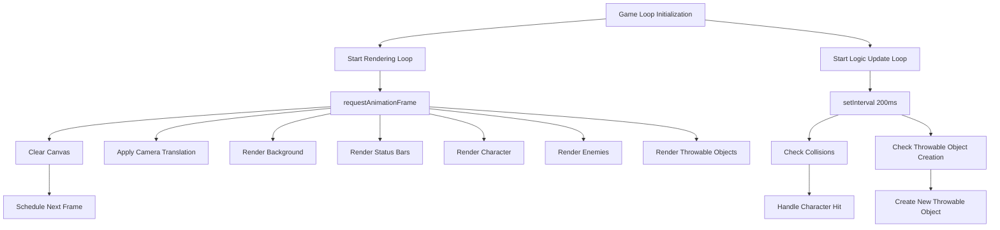
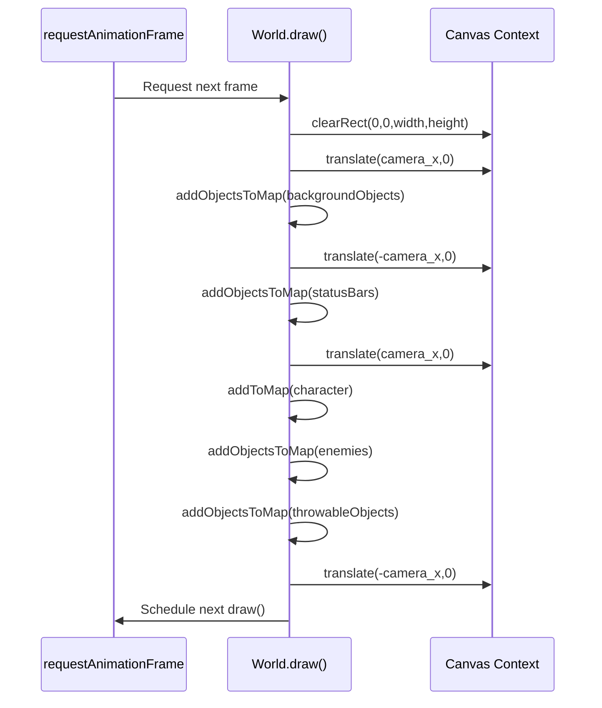
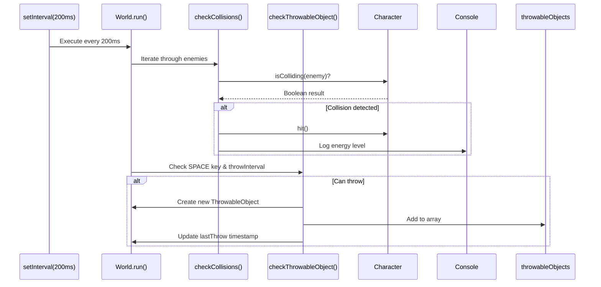
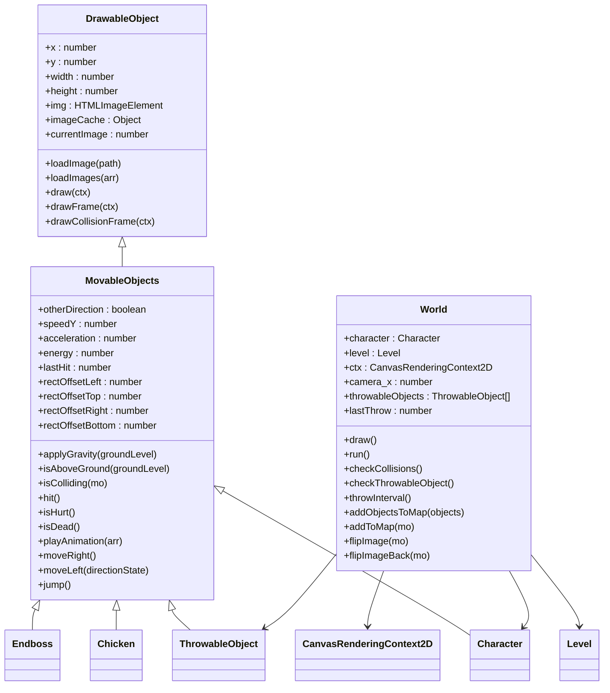

# Game Loop

<cite>
**Referenced Files in This Document**   
- [2-world.class.js](file://models/2-world.class.js)
- [character.class.js](file://models/character.class.js)
- [thowable-object.class.js](file://models/thowable-object.class.js)
- [movable-objects.class.js](file://models/movable-objects.class.js)
- [drawable-object.class.js](file://models/drawable-object.class.js)
- [chicken.class.js](file://models/chicken.class.js)
- [endboss.class.js](file://models/endboss.class.js)
- [index.html](file://index.html)
- [style.css](file://style.css)
</cite>

## Table of Contents
1. [Introduction](#introduction)
2. [Dual-Loop Architecture](#dual-loop-architecture)
3. [Rendering Loop with requestAnimationFrame](#rendering-loop-with-requestanimationframe)
4. [Game Logic Loop with setInterval](#game-logic-loop-with-setinterval)
5. [Object Rendering and Z-Order Management](#object-rendering-and-z-order-management)
6. [Character Movement and Physics](#character-movement-and-physics)
7. [Performance Considerations](#performance-considerations)
8. [Common Loop Issues and Solutions](#common-loop-issues-and-solutions)
9. [Debugging and Optimization](#debugging-and-optimization)
10. [Conclusion](#conclusion)

## Introduction

The game loop is the central mechanism that drives all real-time interactions in the El Polo Loco game. It orchestrates the rendering of visual elements, updates game state, processes user input, and manages physics and collision detection. The implementation employs a dual-loop system that separates high-frequency rendering from lower-frequency game logic updates, optimizing performance while maintaining smooth gameplay. This document provides a comprehensive analysis of the game loop architecture, its components, and performance characteristics.

**Section sources**
- [2-world.class.js](file://models/2-world.class.js#L36-L85)

## Dual-Loop Architecture

The game loop implements a dual-loop architecture consisting of two independent but coordinated timing mechanisms. The first loop uses `requestAnimationFrame` to achieve a target of 60 frames per second for smooth visual rendering, while the second loop uses `setInterval` to update game logic at a fixed interval of 200 milliseconds (5 times per second). This separation allows the game to maintain fluid animation while conserving computational resources for intensive operations like collision detection and object creation.

This architectural pattern prevents performance bottlenecks by decoupling visual updates from game state changes. The rendering loop can continue to provide smooth visual feedback even when game logic processing experiences minor delays, while the less frequent game logic updates reduce CPU load and prevent excessive object creation.



**Diagram sources**
- [2-world.class.js](file://models/2-world.class.js#L36-L41)
- [2-world.class.js](file://models/2-world.class.js#L66-L85)

**Section sources**
- [2-world.class.js](file://models/2-world.class.js#L36-L85)

## Rendering Loop with requestAnimationFrame

The rendering loop is implemented through the `World.draw()` method, which is recursively scheduled using `requestAnimationFrame`. This browser-native API synchronizes rendering with the display's refresh rate, typically 60Hz, to achieve smooth animation without unnecessary redraws. Each frame begins by clearing the canvas to prevent visual artifacts from previous frames, then applies camera translation to create the illusion of character movement through the game world.

The rendering process follows a specific sequence to ensure proper layering of game elements. Background objects are rendered first, followed by clouds, status bars, the character, enemies, and finally throwable objects. This z-order management ensures that objects appear in the correct visual hierarchy, with foreground elements properly obscuring background elements.



**Diagram sources**
- [2-world.class.js](file://models/2-world.class.js#L66-L85)
- [2-world.class.js](file://models/2-world.class.js#L106-L117)

**Section sources**
- [2-world.class.js](file://models/2-world.class.js#L66-L85)

## Game Logic Loop with setInterval

The game logic loop is implemented in the `World.run()` method using `setInterval` with a 200-millisecond interval, resulting in 5 updates per second. This lower frequency is appropriate for game logic operations that don't require the same responsiveness as visual rendering. The loop primarily handles two critical functions: collision detection between the character and enemies, and the creation of throwable objects when the player presses the space bar.

By separating these operations from the rendering loop, the game prevents performance degradation that could occur if collision detection and object creation were performed 60 times per second. The 200-millisecond interval also serves as a cooldown mechanism for throwable object creation, preventing the player from spamming bottles excessively.



**Diagram sources**
- [2-world.class.js](file://models/2-world.class.js#L36-L41)
- [2-world.class.js](file://models/2-world.class.js#L43-L58)

**Section sources**
- [2-world.class.js](file://models/2-world.class.js#L36-L58)

## Object Rendering and Z-Order Management

The game employs a systematic approach to object rendering through the `addToMap()` and `addObjectsToMap()` methods, which handle the drawing of individual objects and collections of objects respectively. These methods implement sprite flipping for characters moving in different directions by manipulating the canvas transformation matrix. When an object has its `otherDirection` property set to true, the canvas is translated and scaled to render the object as a mirror image, creating the visual effect of facing left instead of right.

Z-order management is achieved through the deliberate sequence in which object collections are rendered within the `draw()` method. The rendering order follows the visual hierarchy of the game world: background objects and clouds are rendered first, followed by status bars, then the character, enemies, and throwable objects. This ensures that foreground elements properly obscure background elements, maintaining visual consistency throughout gameplay.



**Diagram sources**
- [drawable-object.class.js](file://models/drawable-object.class.js#L0-L43)
- [movable-objects.class.js](file://models/movable-objects.class.js#L0-L75)
- [2-world.class.js](file://models/2-world.class.js#L0-L132)

**Section sources**
- [2-world.class.js](file://models/2-world.class.js#L87-L117)
- [drawable-object.class.js](file://models/drawable-object.class.js#L0-L43)
- [movable-objects.class.js](file://models/movable-objects.class.js#L0-L75)

## Character Movement and Physics

Character movement and physics are updated on each render frame through setInterval calls within the Character class. The character's position is updated 60 times per second based on keyboard input, with movement to the right increasing the x-coordinate and movement to the left decreasing it. The camera follows the character by adjusting the `camera_x` property, creating the illusion of scrolling through the game world.

Physics simulation is implemented through the `applyGravity` method inherited from MovableObjects, which uses a setInterval loop running at approximately 60fps to adjust the character's vertical position based on gravity and collision with the ground. The character's jump mechanics are handled by setting an initial upward velocity (`speedY`) that is gradually reduced by acceleration until the character returns to the ground level.

```mermaid
flowchart TD
A[Character Movement Input] --> B{Keyboard.RIGHT pressed?}
B --> |Yes| C[moveRight()]
B --> |No| D{Keyboard.LEFT pressed?}
D --> |Yes| E[moveLeft(true)]
D --> |No| F[No horizontal movement]
C --> G[Increase x by speed]
G --> H[Set otherDirection = false]
E --> I[Decrease x by speed]
I --> J[Set otherDirection = true]
H --> K[Update camera_x]
J --> K
K --> L[Render character at new position]
M[Jump Mechanics] --> N{Keyboard.UP pressed?}
N --> |Yes| O{On ground?}
O --> |Yes| P[jump()]
O --> |No| Q[Cannot jump]
P --> R[Set speedY = 8]
R --> S[applyGravity updates y position]
S --> T[Decrease speedY by acceleration]
T --> U{y >= groundLevel?}
U --> |Yes| V[Land on ground]
U --> |No| S
```

**Section sources**
- [character.class.js](file://models/character.class.js#L0-L150)
- [movable-objects.class.js](file://models/movable-objects.class.js#L15-L25)

## Performance Considerations

The game loop implementation incorporates several performance optimizations to ensure smooth gameplay. The separation of rendering and game logic into independent loops reduces CPU load by preventing expensive operations like collision detection from occurring at the full 60fps refresh rate. Canvas operations are optimized by minimizing state changes and using efficient clearing methods.

The rendering process avoids layout thrashing by batching all drawing operations within a single animation frame callback. Object pooling is implicitly implemented through the reuse of image resources via the `imageCache` property in DrawableObject, reducing memory allocation and garbage collection overhead. The 200-millisecond interval for game logic updates serves as a natural throttle on object creation, preventing excessive memory usage from unbounded arrays of throwable objects.

However, potential performance issues exist in the current implementation. Multiple setInterval calls throughout the codebase could lead to timing drift and increased memory usage over time. The lack of explicit garbage collection for throwable objects that have fallen to the ground may result in memory leaks as these objects accumulate in the `throwableObjects` array without being removed.

**Section sources**
- [2-world.class.js](file://models/2-world.class.js#L36-L85)
- [movable-objects.class.js](file://models/movable-objects.class.js#L15-L25)
- [thowable-object.class.js](file://models/thowable-object.class.js#L48-L71)

## Common Loop Issues and Solutions

The current game loop implementation faces several common issues that could affect gameplay stability. Frame skipping may occur if the rendering or logic operations take longer than their allocated time intervals, particularly on lower-end devices. The use of multiple setInterval calls with fixed intervals does not account for variable system performance, potentially leading to inconsistent update rates across different hardware configurations.

Memory leaks are a significant concern due to the accumulation of throwable objects in the `throwableObjects` array without any mechanism for removal after they have fallen to the ground or moved off-screen. Over time, this unbounded array growth will increase memory usage and eventually degrade performance.

To address these issues, the game could implement a more sophisticated timing system using `requestAnimationFrame` timestamps to calculate delta time and ensure consistent game speed regardless of frame rate. For memory management, a cleanup mechanism should be added to remove throwable objects that are no longer visible or active, either through a定期 purge or by reusing objects from a pool.

**Section sources**
- [2-world.class.js](file://models/2-world.class.js#L36-L85)
- [thowable-object.class.js](file://models/thowable-object.class.js#L0-L82)
- [2-world.class.js](file://models/2-world.class.js#L52-L58)

## Debugging and Optimization

Debugging the game loop timing can be accomplished by adding performance monitoring to measure actual frame rates and update intervals. Developers can use `performance.now()` to log the time between frames and identify performance bottlenecks. The existing console.log statement in the collision detection method provides basic feedback on character energy levels, which can be expanded to include timing information.

For optimization, the game could benefit from consolidating multiple setInterval calls into fewer, more efficient loops. The character animation intervals could be combined, and a centralized game loop manager could coordinate all time-based operations. Implementing object pooling for throwable objects would reduce garbage collection overhead and prevent memory leaks.

Performance profiling should focus on the canvas rendering operations, particularly the frequency of canvas state changes and the efficiency of image drawing. The current implementation could be enhanced with canvas layering, where static background elements are rendered to an offscreen canvas and only the dynamic elements are redrawn each frame, significantly reducing rendering workload.

**Section sources**
- [2-world.class.js](file://models/2-world.class.js#L43-L50)
- [character.class.js](file://models/character.class.js#L111-L130)
- [thowable-object.class.js](file://models/thowable-object.class.js#L48-L71)

## Conclusion

The game loop in El Polo Loco effectively implements a dual-loop architecture that separates high-frequency rendering from lower-frequency game logic updates. This design choice optimizes performance by aligning visual updates with the display refresh rate while conserving resources for intensive game mechanics. The rendering loop achieves smooth animation through requestAnimationFrame, while the logic loop manages collision detection and object creation at a sustainable 5 updates per second.

While the current implementation provides a functional foundation, opportunities for improvement exist in timing consistency, memory management, and performance optimization. Addressing these areas would enhance gameplay stability and ensure a smooth experience across a wider range of devices. The modular design of the game components facilitates future enhancements and demonstrates a solid architectural approach to real-time game development.