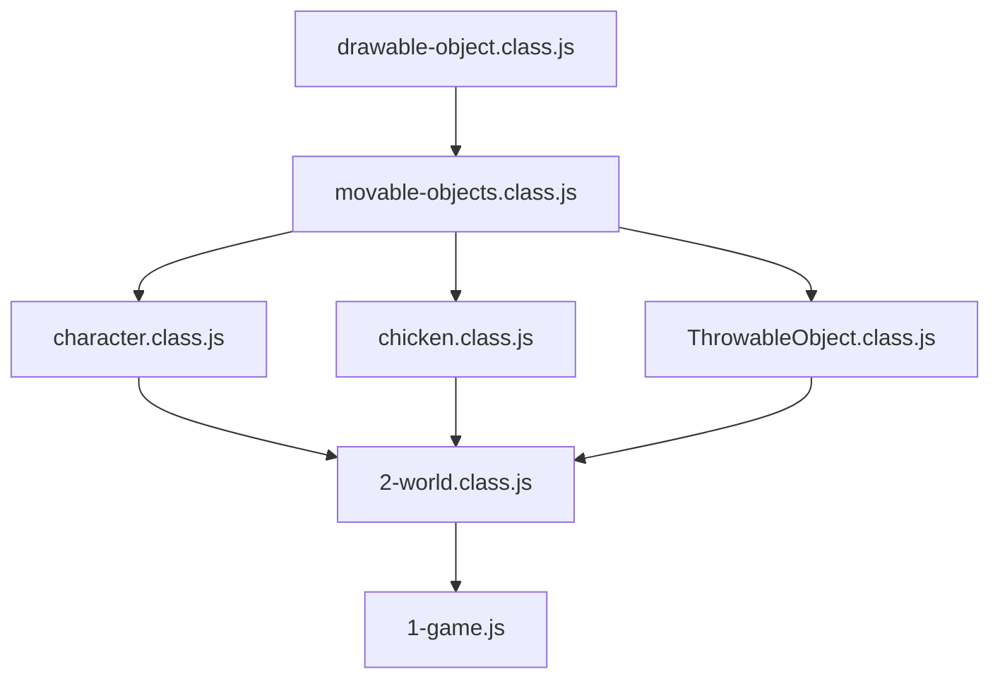
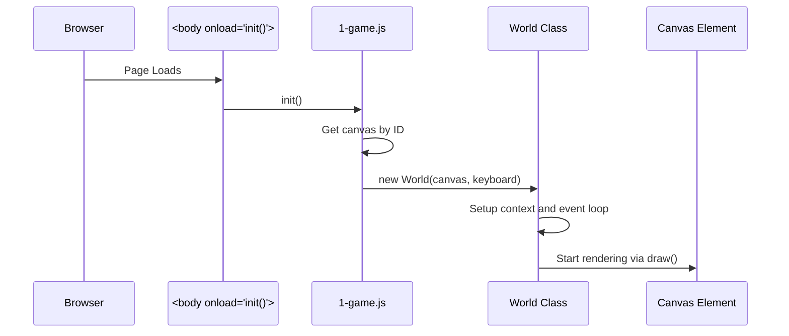
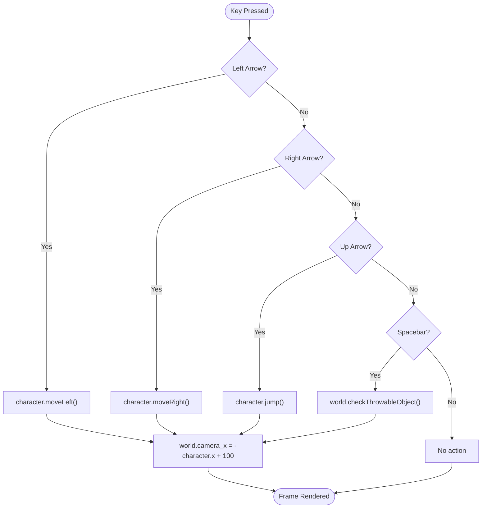

# Getting Started

<cite>
**Referenced Files in This Document**   
- [index.html](file://index.html)
- [js/1-game.js](file://js/1-game.js)
- [models/2-world.class.js](file://models/2-world.class.js)
- [models/keyboard.class.js](file://models/keyboard.class.js)
- [models/character.class.js](file://models/character.class.js)
- [models/thowable-object.class.js](file://models/thowable-object.class.js)
- [models/level.class.js](file://models/level.class.js)
- [models/movable-objects.class.js](file://models/movable-objects.class.js)
- [models/drawable-object.class.js](file://models/drawable-object.class.js)
- [levels/level1.js](file://levels/level1.js)
</cite>

## Table of Contents
1. [Introduction](#introduction)
2. [Running the Game](#running-the-game)
3. [Script Loading and Dependencies](#script-loading-and-dependencies)
4. [Initialization Sequence](#initialization-sequence)
5. [Game Controls and Actions](#game-controls-and-actions)
6. [Common Issues and Troubleshooting](#common-issues-and-troubleshooting)
7. [Strict Mode in JavaScript](#strict-mode-in-javascript)
8. [Conclusion](#conclusion)

## Introduction
This guide provides comprehensive instructions for setting up and running the el_polo_loco game. The game is designed to be simple to launch—requiring only a modern web browser and no build process or server setup. The documentation explains the initialization flow, script dependencies, user controls, and common troubleshooting steps to ensure a smooth experience for both players and developers.

## Running the Game
To launch the el_polo_loco game, follow these simple steps:

1. Open the `index.html` file in any modern web browser (Chrome, Firefox, Edge, or Safari).
2. The game will automatically initialize when the page loads.
3. Use the keyboard controls to interact with the game (detailed in the controls section).

No additional setup, compilation, or server configuration is required. The game runs entirely client-side using HTML5 Canvas and JavaScript.

**Section sources**
- [index.html](file://index.html#L1-L32)

## Script Loading and Dependencies
The `index.html` file includes multiple `<script>` tags that load JavaScript files in a specific order. This order is critical because later scripts depend on classes and objects defined in earlier ones.

The script loading sequence in `index.html` follows a dependency hierarchy:
- Base classes like `DrawableObject` and `MovableObjects` are loaded first.
- Character, enemy, and object classes (e.g., `Character`, `Chicken`, `ThrowableObject`) are loaded next.
- The `World` class, which orchestrates the game, is loaded after its dependencies.
- Finally, `1-game.js` initializes the game loop and event listeners.

Loading scripts in the wrong order would result in "undefined class" errors, as JavaScript executes scripts in the order they appear in the HTML.

**Diagram sources**
- [index.html](file://index.html#L10-L24)
- [models/drawable-object.class.js](file://models/drawable-object.class.js#L1-L45)
- [models/movable-objects.class.js](file://models/movable-objects.class.js#L1-L76)
- [models/character.class.js](file://models/character.class.js#L1-L152)

**Section sources**
- [index.html](file://index.html#L10-L24)

## Initialization Sequence
When the game starts, the following initialization sequence occurs:

1. The `body` element's `onload="init()"` attribute triggers the `init()` function in `1-game.js`.
2. The `init()` function retrieves the canvas element and creates a new `World` instance.
3. The `World` constructor sets up the rendering context, assigns the keyboard object, and starts the game loop.
4. The `World` class initializes the character, level, and status bars, then begins continuous rendering via `requestAnimationFrame`.

This sequence ensures that all game components are properly connected before rendering begins.

**Diagram sources**
- [index.html](file://index.html#L26)
- [js/1-game.js](file://js/1-game.js#L6-L11)
- [models/2-world.class.js](file://models/2-world.class.js#L10-L25)

**Section sources**
- [index.html](file://index.html#L26)
- [js/1-game.js](file://js/1-game.js#L6-L11)
- [models/2-world.class.js](file://models/2-world.class.js#L10-L25)

## Game Controls and Actions
The game supports keyboard controls for character movement and actions:

- **Arrow Left**: Move character left
- **Arrow Right**: Move character right
- **Arrow Up**: Jump
- **Spacebar**: Throw a bottle

When the Spacebar is pressed, the game checks if at least one second has passed since the last throw (to prevent spamming). If the interval condition is met, a new `ThrowableObject` (bottle) is created and added to the game world. The bottle's trajectory depends on the character's direction.

The character's animation changes based on input:
- Idle or long idle (after 3 seconds of inactivity)
- Walking (when moving left or right)
- Jumping (when pressing up)
- Throwing (when pressing spacebar)

**Diagram sources**
- [js/1-game.js](file://js/1-game.js#L13-L55)
- [models/2-world.class.js](file://models/2-world.class.js#L50-L65)
- [models/character.class.js](file://models/character.class.js#L100-L150)

**Section sources**
- [js/1-game.js](file://js/1-game.js#L13-L55)
- [models/2-world.class.js](file://models/2-world.class.js#L50-L65)
- [models/character.class.js](file://models/character.class.js#L100-L150)

## Common Issues and Troubleshooting
Users may encounter the following issues when running the game:

### Script Loading Errors
If the browser console shows "Uncaught ReferenceError: Class is not defined", this indicates a script loading problem. Check:
- All file paths in `index.html` are correct
- All JavaScript files exist in their specified locations
- Scripts are loaded in the correct dependency order

### Missing Assets
If images do not appear, verify that the `assets` folder is present and contains all required image files. The game expects specific image paths as defined in the character and object classes.

### Keyboard Input Not Responding
Ensure that:
- The canvas has focus (click on the game area if needed)
- No browser extensions are intercepting keyboard events
- The keyboard event listeners are properly attached in `1-game.js`

**Section sources**
- [index.html](file://index.html#L10-L24)
- [js/1-game.js](file://js/1-game.js#L13-L55)

## Strict Mode in JavaScript
The `1-game.js` file begins with `'use strict';`, which enables strict mode in JavaScript. Strict mode helps catch common coding errors by:
- Preventing the use of undeclared variables
- Making silent errors throw exceptions
- Disallowing duplicate parameter names
- Restricting certain syntax that may be problematic

This improves code reliability and helps prevent bugs during development. For example, without strict mode, accidentally creating a global variable by omitting `var`, `let`, or `const` would fail silently. With strict mode, it throws an error, making issues easier to identify.

**Section sources**
- [js/1-game.js](file://js/1-game.js#L1)

## Conclusion
The el_polo_loco game is designed for simplicity and ease of use. By opening `index.html` in a modern browser, users can immediately start playing without any additional setup. The game's architecture relies on a clear dependency chain between JavaScript classes, with initialization triggered by the `onload` event. Keyboard controls enable character movement and actions, while strict mode ensures more robust code execution. Following the guidance in this document will help users successfully launch and troubleshoot the game.