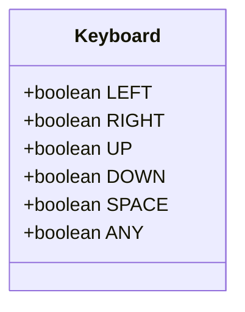
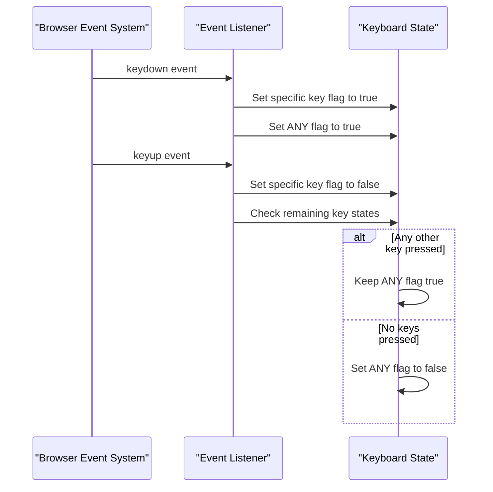
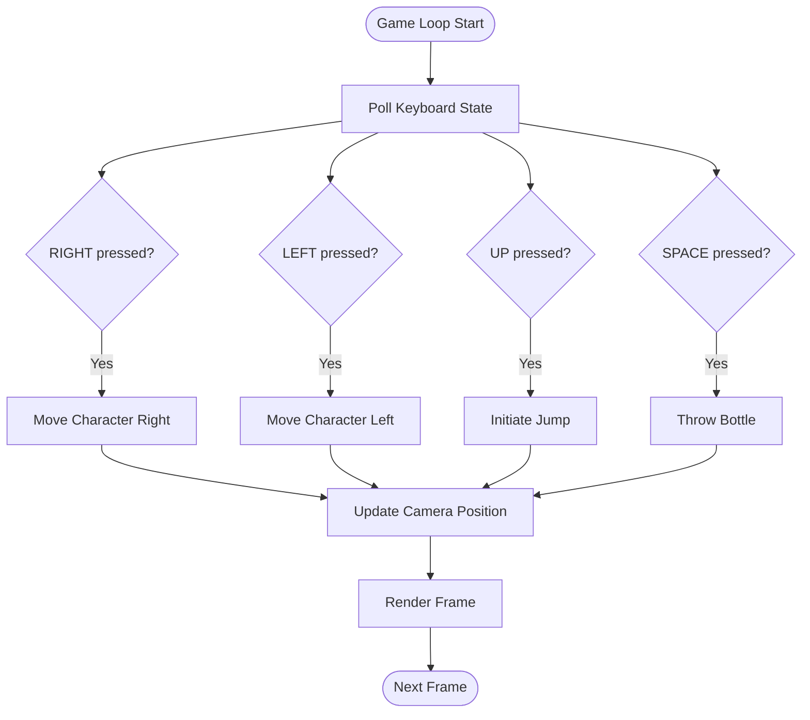
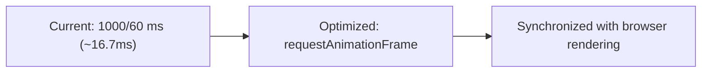

# Input Handling

<cite>
**Referenced Files in This Document**   
- [js/1-game.js](file://js/1-game.js)
- [models/keyboard.class.js](file://models/keyboard.class.js)
- [models/2-world.class.js](file://models/2-world.class.js)
- [models/character.class.js](file://models/character.class.js)
</cite>

## Table of Contents
1. [Introduction](#introduction)
2. [Keyboard State Management](#keyboard-state-management)
3. [Event Listener Implementation](#event-listener-implementation)
4. [Game State Polling Mechanism](#game-state-polling-mechanism)
5. [Character Movement and Actions](#character-movement-and-actions)
6. [Input Handling Challenges](#input-handling-challenges)
7. [Enhancing Input Responsiveness](#enhancing-input-responsiveness)
8. [Alternative Input Methods](#alternative-input-methods)
9. [Conclusion](#conclusion)

## Introduction
The keyboard input system in this game implements a state-based approach to handle user interactions. Rather than responding directly to keyboard events, the game uses a centralized Keyboard class that maintains the current state of key presses. This design enables smooth, continuous movement and complex interactions by allowing game objects to poll the keyboard state at regular intervals. The system captures arrow key presses for character movement and spacebar input for special actions like throwing bottles, while also tracking whether any key is currently pressed to manage character animations.

## Keyboard State Management

The Keyboard class serves as a state container that tracks the current status of key presses through boolean flags. This approach decouples input detection from game logic execution, allowing for more predictable and testable behavior.

**Diagram sources**
- [models/keyboard.class.js](file://models/keyboard.class.js#L1-L8)

**Section sources**
- [models/keyboard.class.js](file://models/keyboard.class.js#L1-L8)

## Event Listener Implementation

The event listeners in 1-game.js update the Keyboard instance's state flags when keys are pressed or released. The implementation includes special handling for the ANY flag, which tracks whether any keyboard input is currently active. This is particularly useful for managing character idle animations and sleep states.

**Diagram sources**
- [js/1-game.js](file://js/1-game.js#L6-L55)

**Section sources**
- [js/1-game.js](file://js/1-game.js#L6-L55)

## Game State Polling Mechanism

Rather than responding to events directly, the World and Character classes poll the keyboard state at regular intervals. This polling mechanism enables smooth continuous movement and prevents issues with key repeat limitations. The Character class checks the keyboard state approximately 60 times per second to determine movement direction and actions.

**Diagram sources**
- [models/character.class.js](file://models/character.class.js#L99-L149)
- [models/2-world.class.js](file://models/2-world.class.js#L52-L58)

**Section sources**
- [models/character.class.js](file://models/character.class.js#L99-L149)
- [models/2-world.class.js](file://models/2-world.class.js#L52-L58)

## Character Movement and Actions

The character's movement and actions are directly controlled by the keyboard state. Arrow keys translate to directional movement, while the spacebar triggers bottle throwing. The system implements boundary checks to prevent the character from moving beyond the level limits.

### Movement Controls
- **LEFT Arrow**: Moves character left, with boundary check at x > -1340
- **RIGHT Arrow**: Moves character right, with boundary check at x < levelEndX + 100
- **UP Arrow**: Initiates jump when character is on ground level
- **SPACE**: Triggers bottle throwing action with cooldown interval

### Animation State Management
The character's animation state is determined by the current keyboard input:
- Walking animation when LEFT or RIGHT is pressed
- Jumping animation when in mid-air
- Throwing animation when SPACE is pressed
- Idle or long-idle (sleep) animation when no movement keys are pressed

**Section sources**
- [models/character.class.js](file://models/character.class.js#L99-L149)

## Input Handling Challenges

The current input system faces several common challenges that affect gameplay experience:

### Key Repeat Limitations
Browser key repeat rates can cause inconsistent input detection, particularly noticeable during rapid key presses. The polling interval of 1000/60 milliseconds may miss brief key presses.

### Simultaneous Key Presses
While the system supports multiple key presses (e.g., moving and jumping), some keyboard hardware has limitations on how many keys can be registered simultaneously (known as "rollover" limitations).

### Cross-Browser Event Differences
Different browsers may handle keyboard events slightly differently, particularly regarding key codes and event timing, which can lead to inconsistent behavior across platforms.

**Section sources**
- [js/1-game.js](file://js/1-game.js#L6-L55)
- [models/character.class.js](file://models/character.class.js#L99-L149)

## Enhancing Input Responsiveness

Several strategies can improve the input responsiveness of the game:

### Optimized Polling Intervals
Adjust the animation interval timing to better match typical monitor refresh rates and reduce input lag:

### Input Buffering
Implement a small input buffer to capture key presses between polling cycles, ensuring no inputs are missed during fast gameplay.

### Predictive Movement
Use the time since last input to calculate more accurate movement distances, compensating for variable frame rates.

**Section sources**
- [models/character.class.js](file://models/character.class.js#L99-L149)

## Alternative Input Methods

To improve accessibility and player experience, the game could support alternative input methods:

### Touch Controls
Implement on-screen buttons for mobile devices:
- Virtual D-pad for movement
- Action buttons for jumping and throwing
- Touch gestures for special actions

### Gamepad Support
Add support for standard game controllers using the Gamepad API:
- Map controller buttons to keyboard equivalents
- Use analog sticks for smoother movement control
- Support vibration feedback for in-game events

### Accessibility Features
- Remappable controls to accommodate different player needs
- Adjustable input sensitivity settings
- Alternative input devices support (switch controls, eye tracking)

**Section sources**
- [models/keyboard.class.js](file://models/keyboard.class.js#L1-L8)
- [js/1-game.js](file://js/1-game.js#L6-L55)

## Conclusion
The keyboard input system provides a solid foundation for game controls by using a state-based approach that decouples input detection from game logic. The Keyboard class effectively serves as a central state container, while the polling mechanism in the Character class enables smooth, continuous movement. To enhance the player experience, future improvements could focus on optimizing input responsiveness, addressing cross-browser compatibility issues, and adding support for alternative input methods like touch controls and gamepads. These enhancements would make the game more accessible and enjoyable across different devices and player preferences.