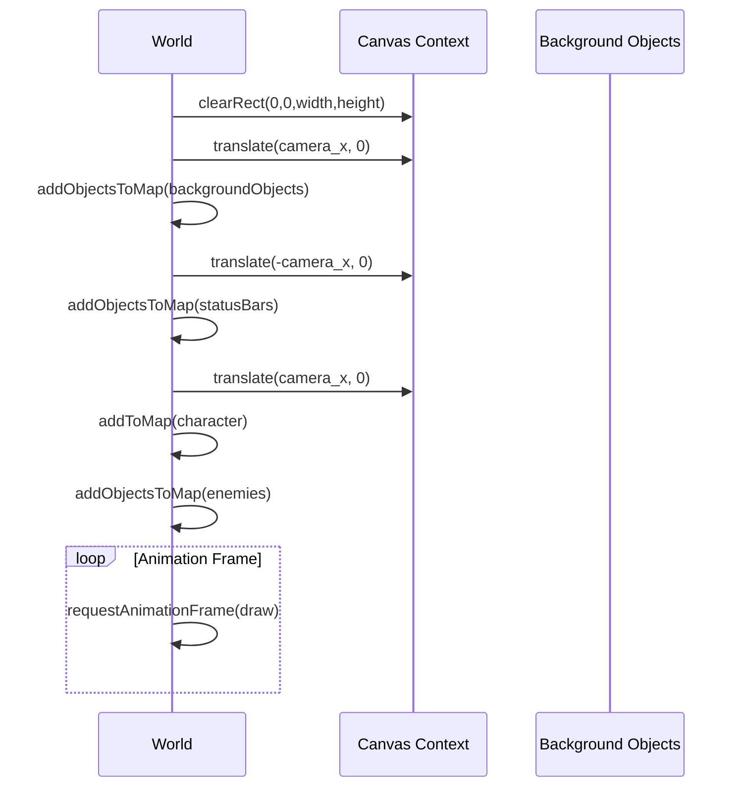
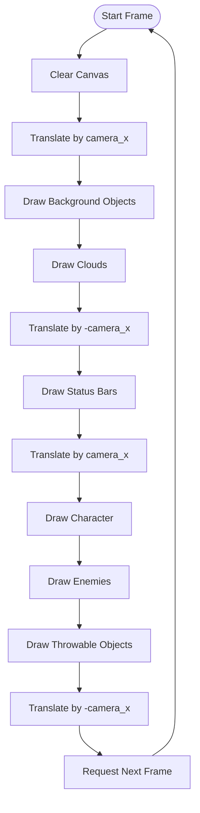

# Background Rendering

<cite>
**Referenced Files in This Document**   
- [level1.js](file://levels/level1.js)
- [2-world.class.js](file://models/2-world.class.js)
- [background-object.class.js](file://models/background-object.class.js)
- [drawable-object.class.js](file://models/drawable-object.class.js)
- [level.class.js](file://models/level.class.js)
</cite>

## Table of Contents
1. [Introduction](#introduction)
2. [Background Object Positioning](#background-object-positioning)
3. [Coordinate System Translation](#coordinate-system-translation)
4. [Layered Background Structure](#layered-background-structure)
5. [Rendering Sequence and Object Management](#rendering-sequence-and-object-management)
6. [Performance Considerations](#performance-considerations)
7. [Extending the Background System](#extending-the-background-system)
8. [Conclusion](#conclusion)

## Introduction
The background rendering system in this game implements a seamless parallax scrolling effect through strategic object positioning and canvas coordinate manipulation. By instantiating multiple background segments at specific x-coordinates and using camera-based translation, the system creates the illusion of continuous movement across a wide game world. This document explains the technical implementation of this system, focusing on how background objects are positioned, rendered, and managed to produce a visually cohesive experience.

## Background Object Positioning
BackgroundObject instances in level1.js are strategically positioned at x-coordinates of -1440, -720, 0, 720, 1440, and 2160 to create a continuous, repeating background that spans the entire level width. Each BackgroundObject has a fixed width of 720 pixels, which determines the spacing between consecutive segments. This tiling approach ensures complete coverage of the level's 2160-pixel width as defined in the Level class.

The positioning pattern creates overlapping layers where multiple background segments appear side by side, eliminating gaps and visual discontinuities. As the camera moves across the game world, these pre-positioned segments are revealed sequentially, creating the illusion of an infinitely scrolling environment. The negative x-coordinates (-1440 and -720) ensure the background is visible immediately when the game starts, with the character positioned at x=0.

**Section sources**
- [level1.js](file://levels/level1.js#L1-L52)
- [background-object.class.js](file://models/background-object.class.js#L0-L9)

## Coordinate System Translation
The World class implements camera-based movement through canvas coordinate translation in its draw() method. The camera_x property controls the horizontal position of the view, and the canvas context's translate() method shifts the entire coordinate system accordingly. When camera_x increases (as the character moves right), the background objects appear to move left, creating the illusion of forward movement.

The translation process is carefully orchestrated to ensure proper rendering order. The method first clears the canvas, then applies a positive translation by camera_x before drawing background elements and clouds. After drawing the status bars (which remain fixed on screen), it applies a negative translation to return to the original coordinate system before rendering the character, enemies, and throwable objects. This technique allows background elements to scroll while keeping UI elements stationary.

**Diagram sources**
- [2-world.class.js](file://models/2-world.class.js#L66-L85)

**Section sources**
- [2-world.class.js](file://models/2-world.class.js#L66-L85)

## Layered Background Structure
The background system employs a layered architecture with four distinct layers: air, third_layer, second_layer, and first_layer. These layers are rendered in a specific order to create depth through the parallax effect. Each layer serves a different visual purpose:

- **air**: The topmost layer, typically containing sky elements
- **third_layer**: Mid-distance background elements
- **second_layer**: Closer background details
- **first_layer**: Foreground elements closest to the player

The rendering order follows painter's algorithm, with distant layers drawn first and closer layers drawn on top. This creates a natural depth perception where background elements appear behind foreground elements. The parallax effect is achieved because all layers move at the same speed in this implementation, though the layered structure provides the foundation for implementing differential scrolling speeds to enhance the depth illusion.

**Section sources**
- [level1.js](file://levels/level1.js#L5-L52)
- [background-object.class.js](file://models/background-object.class.js#L0-L9)

## Rendering Sequence and Object Management
The addObjectsToMap() method in the World class orchestrates the rendering of all background objects in sequence. It iterates through an array of objects and calls addToMap() for each one, which in turn invokes the draw() method on each object. This modular approach allows for consistent rendering across different object types while maintaining separation of concerns.

The rendering sequence is critical to visual correctness. Background objects are drawn first, followed by clouds, then status bars (with coordinate reset), and finally the character and enemies. This z-ordering ensures that gameplay elements appear in front of the background while UI elements remain fixed on screen. The use of requestAnimationFrame creates a continuous animation loop that updates the display at the browser's optimal frame rate.

**Diagram sources**
- [2-world.class.js](file://models/2-world.class.js#L66-L91)

**Section sources**
- [2-world.class.js](file://models/2-world.class.js#L87-L91)
- [drawable-object.class.js](file://models/drawable-object.class.js#L23-L25)

## Performance Considerations
The current background rendering system is optimized for performance through several design choices. The tiling approach with pre-positioned BackgroundObject instances minimizes runtime calculations, as object positions are set during initialization rather than computed each frame. With each background segment being 720 pixels wide, only 6 segments are needed to cover the 2160-pixel level width, limiting the number of draw operations.

However, adding more background layers or increasing level length would proportionally increase memory usage and rendering overhead. Each additional layer doubles the number of background objects (from 24 to 48 for two full sets), increasing both memory footprint and draw calls. For longer levels, consider implementing object pooling or dynamic loading/unloading of background segments based on camera position to maintain performance.

Asset sizing should match the BackgroundObject dimensions (720×480 pixels) to avoid unnecessary scaling operations. Using appropriately sized images reduces GPU processing overhead and prevents quality degradation. The current implementation loads all background assets at startup, which is efficient for small levels but may need optimization for larger game worlds.

**Section sources**
- [background-object.class.js](file://models/background-object.class.js#L2-L3)
- [level.class.js](file://models/level.class.js#L6)
- [2-world.class.js](file://models/2-world.class.js#L66-L85)

## Extending the Background System
The background system can be extended in several ways to create more complex visual effects. To add new images, create additional asset files in the appropriate layer directories and instantiate new BackgroundObject instances with the corresponding image paths at the desired x-coordinates in level1.js.

To implement true parallax scrolling with differential layer speeds, modify the draw() method to apply different translation factors to each layer based on depth. For example, distant layers could move at 50% of camera speed while foreground layers move at 100%, enhancing the depth perception.

New layer configurations can be implemented by creating specialized background classes that extend BackgroundObject with custom properties. The modular design allows for easy addition of animated backgrounds, dynamic lighting effects, or interactive background elements without disrupting the core rendering pipeline.

**Section sources**
- [level1.js](file://levels/level1.js#L5-L52)
- [2-world.class.js](file://models/2-world.class.js#L66-L85)
- [background-object.class.js](file://models/background-object.class.js#L0-L9)

## Conclusion
The background rendering system effectively creates a seamless, scrolling game world through strategic object positioning and canvas coordinate manipulation. By leveraging a layered architecture with pre-positioned background segments and camera-based translation, the system produces a convincing parallax effect that enhances the game's visual depth. The modular design of the World class and BackgroundObject components provides a solid foundation for future enhancements while maintaining optimal performance for the current level dimensions.