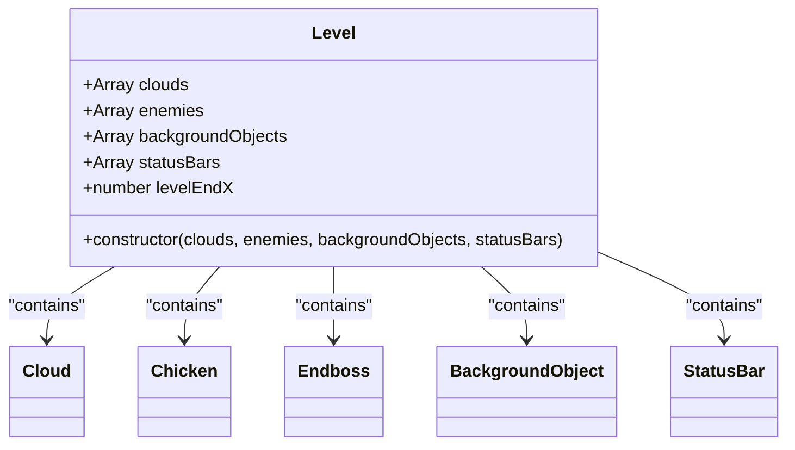
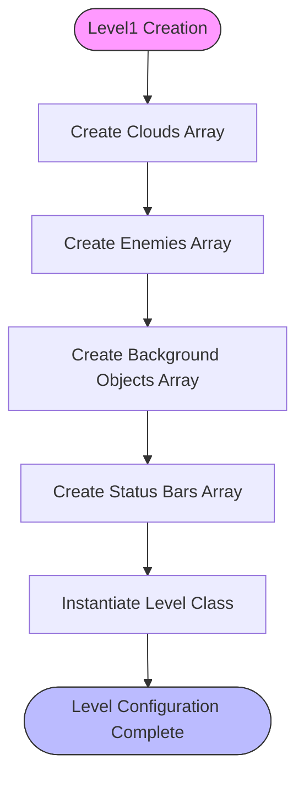
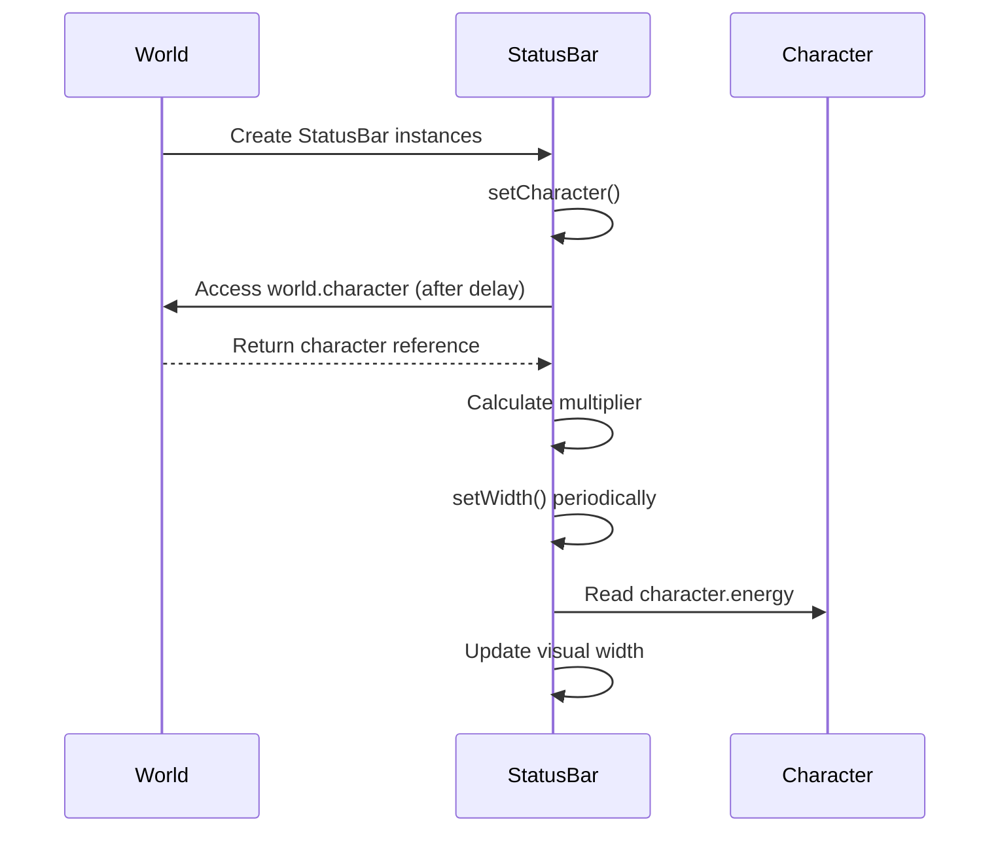

# Level Configuration

<cite>
**Referenced Files in This Document**   
- [level.class.js](file://models/level.class.js)
- [level1.js](file://levels/level1.js)
- [status-bar.class.js](file://models/status-bar.class.js)
- [chicken.class.js](file://models/chicken.class.js)
- [endboss.class.js](file://models/endboss.class.js)
</cite>

## Table of Contents
1. [Introduction](#introduction)
2. [Level Class Structure](#level-class-structure)
3. [Level Constructor and Properties](#level-constructor-and-properties)
4. [Level 1 Configuration](#level-1-configuration)
5. [Status Bar System](#status-bar-system)
6. [Creating New Levels](#creating-new-levels)
7. [Common Configuration Issues](#common-configuration-issues)
8. [Conclusion](#conclusion)

## Introduction
The level configuration system in this game organizes all game elements into structured arrays that define the composition and layout of the game world. The Level class serves as a central data container that groups clouds, enemies, background objects, and status bars into a cohesive structure. This document explains how the level system works, how level1.js instantiates the Level class with specific game objects, and provides guidance on creating new levels and troubleshooting common configuration issues.

**Section sources**
- [level.class.js](file://models/level.class.js#L0-L13)
- [level1.js](file://levels/level1.js#L0-L51)

## Level Class Structure

The Level class is designed as a data container that organizes game elements into structured arrays. It defines five main properties: clouds, enemies, backgroundObjects, statusBars, and levelEndX. These properties are initialized through the constructor and represent the core components of the game world.

**Diagram sources**
- [level.class.js](file://models/level.class.js#L0-L13)

**Section sources**
- [level.class.js](file://models/level.class.js#L0-L13)

## Level Constructor and Properties

The Level class constructor accepts four parameters: clouds, enemies, backgroundObjects, and statusBars. These parameters are assigned directly to instance properties, creating a structured organization of game elements. The levelEndX property is predefined with a value of 2160, establishing the boundary for the level's horizontal extent. This property determines when the character has reached the end of the level and is critical for game progression logic.

The constructor pattern enables flexible level creation by allowing different combinations of game objects to be passed in. Each array parameter contains instances of specific game entities that will be rendered and managed within the game world. This design promotes reusability and makes it easy to create variations of levels by modifying the object arrays.

**Section sources**
- [level.class.js](file://models/level.class.js#L0-L13)

## Level 1 Configuration

The level1.js file demonstrates the instantiation of the Level class with specific arrays of game objects. The clouds array contains a single Cloud instance, creating the atmospheric layer of the game world. The enemies array includes multiple Chicken instances and one Endboss instance, defining the enemy composition for this level. The backgroundObjects array contains a series of BackgroundObject instances with specific x-coordinates, creating a parallax scrolling effect as the player moves through the level.

The statusBars array is particularly complex, containing twelve StatusBar instances that represent different UI elements. These include health bars for the character and endboss, bottle collection indicators, and coin collection indicators. Each StatusBar is configured with a specific type and position to create a comprehensive UI system that displays the player's status throughout the game.

**Diagram sources**
- [level1.js](file://levels/level1.js#L0-L51)

**Section sources**
- [level1.js](file://levels/level1.js#L0-L51)

## Status Bar System

The StatusBar class implements a flexible system for displaying various game metrics. Each StatusBar instance is configured with a specific type (imagesHealthBar, imagesBottleBar, imagesCoinBar, or imagesHealthBarEndboss) and a position type (0, 1, or 2). The constructor uses these parameters to determine which image to load from the corresponding array property.

The setCharacter method establishes a connection with the game world by accessing the character object after a short delay, allowing the status bar to synchronize with the character's energy level. The setWidth method dynamically updates the width of the health bar based on the character's current energy, creating a visual representation of health status. The setPosition method configures the exact coordinates for each status bar element based on its type, ensuring proper layout of the UI components.

**Diagram sources**
- [status-bar.class.js](file://models/status-bar.class.js#L72-L83)
- [status-bar.class.js](file://models/status-bar.class.js#L85-L95)

**Section sources**
- [status-bar.class.js](file://models/status-bar.class.js#L0-L133)

## Creating New Levels

To create new levels, developers can instantiate the Level class with different combinations of game objects. The process involves creating arrays for clouds, enemies, backgroundObjects, and statusBars, then passing them to the Level constructor. For example, a new level might include different enemy types, additional cloud instances, or modified background objects to create a unique visual environment.

When extending levels with additional entities, developers can create new object types that extend existing classes (like MovableObjects) and include them in the appropriate arrays. The modular design of the Level class makes it easy to experiment with different configurations without modifying the core level structure. Developers should ensure that the levelEndX property is adjusted appropriately to match the length of the new level layout.

**Section sources**
- [level.class.js](file://models/level.class.js#L0-L13)
- [level1.js](file://levels/level1.js#L0-L51)

## Common Configuration Issues

Several common issues can arise when configuring levels. Missing object types can cause runtime errors if the game attempts to access undefined properties. Incorrect array ordering may affect rendering priority or collision detection, as objects are typically processed in the order they appear in their arrays.

Synchronization issues between UI elements and game logic can occur if status bars are not properly connected to their corresponding game objects. This is particularly important for the character energy display, which relies on the setCharacter method successfully accessing the world.character reference. Developers should verify that all status bar instances are correctly configured with the appropriate type and position parameters to ensure proper visual representation.

Another potential issue is incorrect level boundaries, which can happen if the levelEndX property does not match the actual length of the level layout. This can prevent the player from completing the level or cause unexpected behavior at the edge of the game world.

**Section sources**
- [level.class.js](file://models/level.class.js#L0-L13)
- [status-bar.class.js](file://models/status-bar.class.js#L72-L83)

## Conclusion

The level configuration system provides a structured and flexible approach to organizing game elements. The Level class serves as an effective data container that groups related game objects into coherent arrays, making it easy to define and modify level layouts. The integration of status bars with game logic ensures that UI elements remain synchronized with the player's status throughout gameplay. By understanding the constructor parameters and property assignments, developers can create diverse levels with varying compositions of clouds, enemies, background objects, and UI elements while avoiding common configuration pitfalls.

**Section sources**
- [level.class.js](file://models/level.class.js#L0-L13)
- [level1.js](file://levels/level1.js#L0-L51)
- [status-bar.class.js](file://models/status-bar.class.js#L0-L133)