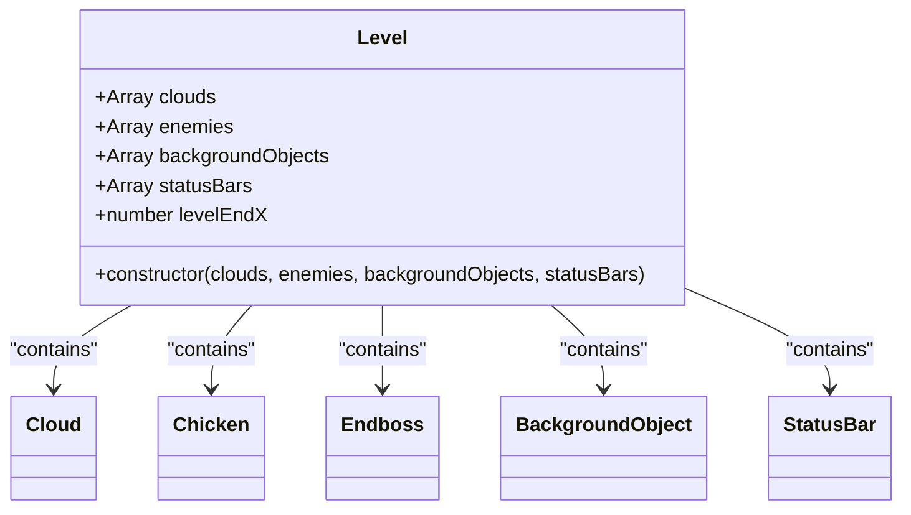
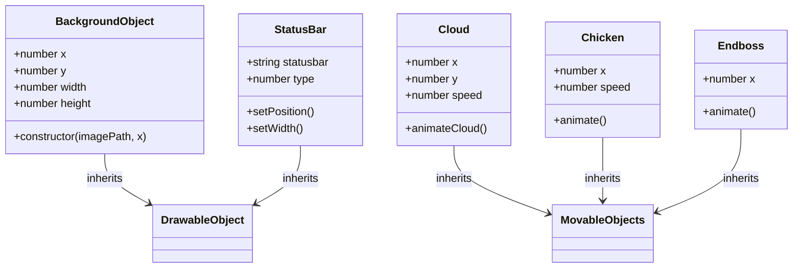
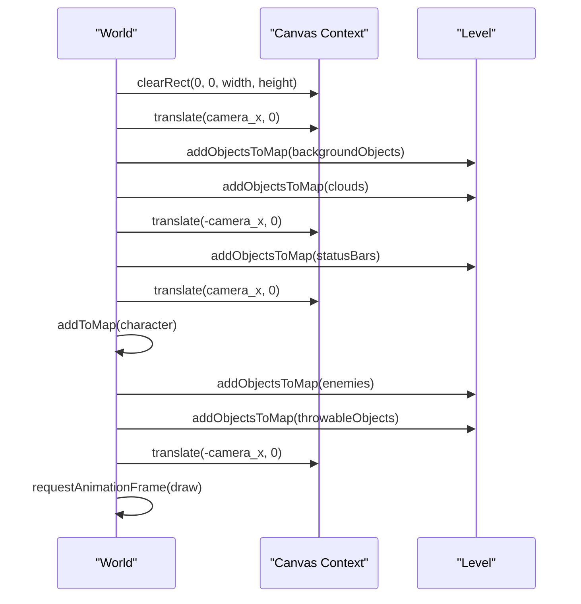

# Level System

<cite>
**Referenced Files in This Document**   
- [level1.js](file://levels/level1.js)
- [level.class.js](file://models/level.class.js)
- [background-object.class.js](file://models/background-object.class.js)
- [clouds.class.js](file://models/clouds.class.js)
- [chicken.class.js](file://models/chicken.class.js)
- [endboss.class.js](file://models/endboss.class.js)
- [status-bar.class.js](file://models/status-bar.class.js)
- [2-world.class.js](file://models/2-world.class.js)
- [drawable-object.class.js](file://models/drawable-object.class.js)
</cite>

## Table of Contents
1. [Introduction](#introduction)
2. [Level Configuration Structure](#level-configuration-structure)
3. [Object Types and Their Roles](#object-types-and-their-roles)
4. [Coordinate-Based Placement System](#coordinate-based-placement-system)
5. [Rendering and Parallax Effects](#rendering-and-parallax-effects)
6. [Creating and Modifying Levels](#creating-and-modifying-levels)
7. [Common Level Design Issues](#common-level-design-issues)
8. [Best Practices for Balanced Level Design](#best-practices-for-balanced-level-design)
9. [Conclusion](#conclusion)

## Introduction
The level configuration and rendering system in this game is built around a modular, object-oriented architecture that enables dynamic world construction through declarative instantiation of game elements. The `level1.js` file defines the layout of the first level by instantiating arrays of background objects, clouds, enemies, and status bars, which are then used by the `World` class to render the scrolling environment. This document explains how the `Level` class organizes these components, how coordinate-based positioning creates a coherent game world, and how different object types contribute to gameplay mechanics such as visual depth, atmosphere, and combat challenges.

**Section sources**
- [level1.js](file://levels/level1.js#L1-L51)
- [level.class.js](file://models/level.class.js#L1-L14)

## Level Configuration Structure
The `Level` class serves as a container for all major game elements within a level. It is instantiated with four primary arrays: clouds, enemies, backgroundObjects, and statusBars. Each array holds instances of their respective object types, allowing for structured and reusable level definitions. The `level1.js` file uses this pattern to define the first level by creating a new `Level` instance with specific configurations for each category.

The `Level` class constructor assigns these arrays to instance properties, enabling the `World` to access and render them during gameplay. Additionally, the `levelEndX` property defines the horizontal boundary of the level (set to 2160), which determines when the player has reached the end of the level.



**Diagram sources**
- [level.class.js](file://models/level.class.js#L1-L14)
- [level1.js](file://levels/level1.js#L1-L51)

**Section sources**
- [level.class.js](file://models/level.class.js#L1-L14)
- [level1.js](file://levels/level1.js#L1-L51)

## Object Types and Their Roles
Each object type in the level contributes uniquely to the gameplay experience:

- **Background Objects**: These provide the visual foundation of the game world. Instances of `BackgroundObject` are positioned at specific x-coordinates to create a seamless, repeating background across multiple layers (air, third_layer, second_layer, first_layer). The parallax effect is achieved by rendering these layers at different speeds relative to camera movement.

- **Clouds**: Represented by the `Cloud` class, these objects add atmospheric depth. They are randomly positioned along the x-axis and move slowly from right to left, creating a sense of motion and environmental richness.

- **Enemies**: The `Chicken` and `Endboss` classes represent hostile entities. Chickens are randomly placed with variable speeds, introducing dynamic combat challenges. The Endboss is fixed at x = 400 and serves as the final obstacle.

- **Status Bars**: The `StatusBar` class manages UI elements such as health, bottle, and coin bars. These are positioned on-screen using conditional logic in the `setPosition()` method and are updated dynamically based on character state.



**Diagram sources**
- [background-object.class.js](file://models/background-object.class.js#L1-L9)
- [clouds.class.js](file://models/clouds.class.js#L1-L17)
- [chicken.class.js](file://models/chicken.class.js#L1-L34)
- [endboss.class.js](file://models/endboss.class.js#L1-L40)
- [status-bar.class.js](file://models/status-bar.class.js#L1-L132)

**Section sources**
- [background-object.class.js](file://models/background-object.class.js#L1-L9)
- [clouds.class.js](file://models/clouds.class.js#L1-L17)
- [chicken.class.js](file://models/chicken.class.js#L1-L34)
- [endboss.class.js](file://models/endboss.class.js#L1-L40)
- [status-bar.class.js](file://models/status-bar.class.js#L1-L132)

## Coordinate-Based Placement System
Objects in the level are positioned using a coordinate-based system where the x and y values determine their location in the 2D game space. The x-coordinate controls horizontal placement across the scrolling world, while the y-coordinate sets vertical alignment.

For background objects, x-values are set at intervals of 720 pixels (e.g., -1440, -720, 0, 720, etc.) to create a tiled effect that spans the entire level width. Clouds use random x-values within a range (0–500) to avoid uniform patterns. Enemies like chickens are placed between 200 and 700 pixels on the x-axis with randomized speeds, ensuring varied encounter timing.

This system allows precise control over object density and spacing, enabling designers to balance visual appeal with gameplay difficulty.

**Section sources**
- [level1.js](file://levels/level1.js#L1-L51)
- [background-object.class.js](file://models/background-object.class.js#L1-L9)
- [clouds.class.js](file://models/clouds.class.js#L1-L17)
- [chicken.class.js](file://models/chicken.class.js#L1-L34)

## Rendering and Parallax Effects
The `World` class renders the level by translating the canvas context based on the `camera_x` value, which follows the player's movement. This creates the illusion of a scrolling world.

The `draw()` method in `World` uses `ctx.translate()` to shift the rendering origin, ensuring that only the visible portion of the level is drawn. Background objects and clouds are rendered within the translated context, while status bars are drawn in fixed screen coordinates by temporarily resetting the translation.

The parallax effect is achieved implicitly through the layered background images, each moving at the same speed but contributing to a sense of depth due to their visual stacking. The continuous animation of clouds and enemies (via `setInterval`) ensures smooth motion across the screen.



**Diagram sources**
- [2-world.class.js](file://models/2-world.class.js#L66-L85)
- [drawable-object.class.js](file://models/drawable-object.class.js#L23-L25)

**Section sources**
- [2-world.class.js](file://models/2-world.class.js#L66-L85)
- [drawable-object.class.js](file://models/drawable-object.class.js#L23-L25)

## Creating and Modifying Levels
To create a new level, instantiate a new `Level` object with custom arrays of objects. For example:

```javascript
const level2 = new Level(
    [new Cloud(), new Cloud()], // Add more clouds
    [new Chicken(), new Chicken(), new Endboss()], // Increase enemy density
    [ /* Define new background layout */ ],
    [ /* Define UI bars */ ]
);
```

To modify an existing level, adjust object positions or counts in `level1.js`. For instance, increasing the number of chickens improves challenge, while changing x-values alters encounter timing. Status bar positions can be fine-tuned in the `setPosition()` method of `StatusBar`.

**Section sources**
- [level1.js](file://levels/level1.js#L1-L51)
- [status-bar.class.js](file://models/status-bar.class.js#L1-L132)

## Common Level Design Issues
- **Object Density**: Too many enemies or background elements can degrade performance. Limit active enemies to 5–6 at a time.
- **Performance Impact**: Excessive `setInterval` calls (e.g., in `animate()`) can cause lag. Ensure intervals are optimized (e.g., 60 FPS for movement).
- **Enemy Spacing**: Poor spacing between chickens may lead to unfair combat scenarios. Maintain minimum 200px gaps.
- **Visual Clutter**: Overlapping status bars or icons can confuse players. Use `setPosition()` to align UI elements cleanly.

**Section sources**
- [chicken.class.js](file://models/chicken.class.js#L1-L34)
- [status-bar.class.js](file://models/status-bar.class.js#L1-L132)
- [2-world.class.js](file://models/2-world.class.js#L66-L85)

## Best Practices for Balanced Level Design
- **Progressive Difficulty**: Start with fewer enemies and gradually introduce more complex patterns.
- **Visual Hierarchy**: Use background layers to guide player attention toward gameplay-critical areas.
- **Performance Optimization**: Reuse object instances where possible and avoid unnecessary DOM operations.
- **Consistent Spacing**: Ensure enemies are spaced to allow player reaction time.
- **Testing**: Validate level flow by playing through and adjusting object positions based on real-time feedback.

**Section sources**
- [level1.js](file://levels/level1.js#L1-L51)
- [chicken.class.js](file://models/chicken.class.js#L1-L34)
- [endboss.class.js](file://models/endboss.class.js#L1-L40)

## Conclusion
The level system is a well-structured, modular framework that enables flexible and dynamic game world creation. By leveraging the `Level` class and coordinate-based object placement, developers can design rich, engaging environments with balanced gameplay. Understanding the roles of each object type, the rendering pipeline, and common design pitfalls allows for the creation of polished, performant levels that enhance the overall player experience.