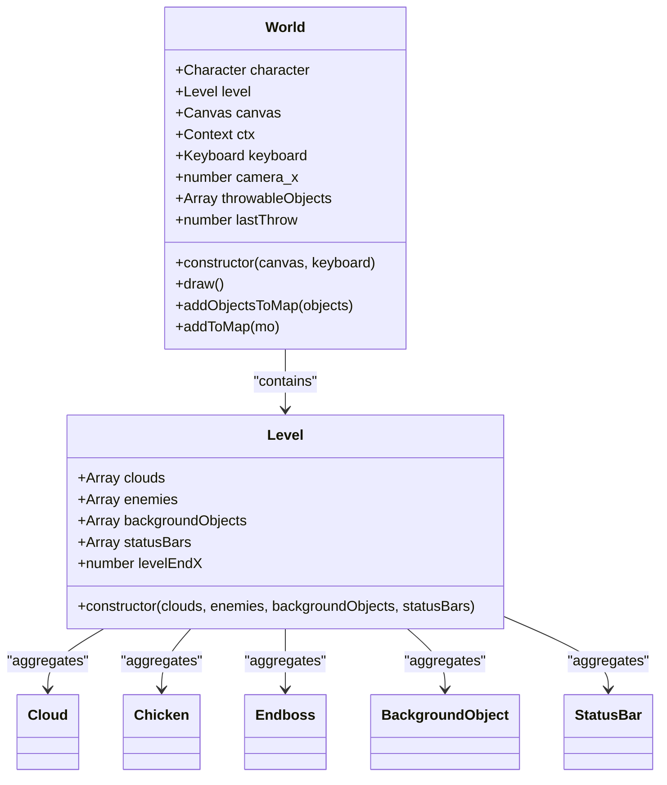
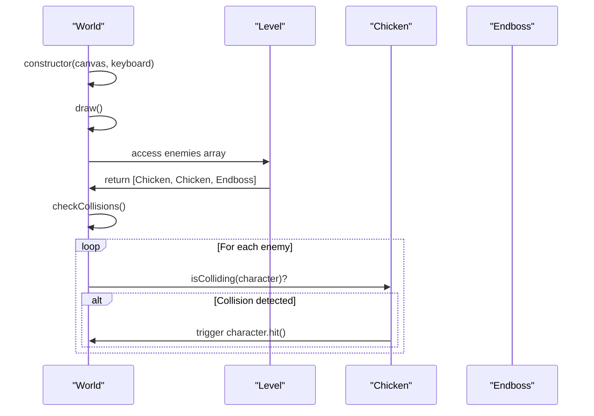
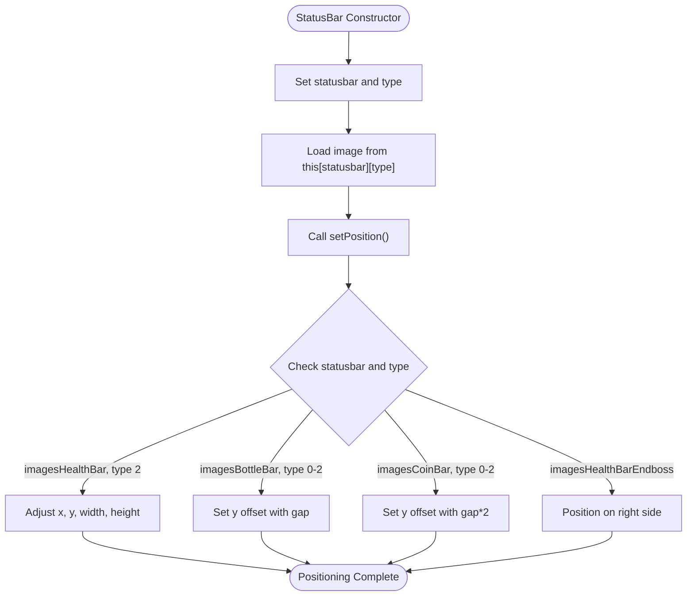

# Object Placement

<cite>
**Referenced Files in This Document**   
- [level1.js](file://levels/level1.js)
- [level.class.js](file://models/level.class.js)
- [2-world.class.js](file://models/2-world.class.js)
- [chicken.class.js](file://models/chicken.class.js)
- [endboss.class.js](file://models/endboss.class.js)
- [clouds.class.js](file://models/clouds.class.js)
- [status-bar.class.js](file://models/status-bar.class.js)
- [drawable-object.class.js](file://models/drawable-object.class.js)
</cite>

## Table of Contents
1. [Introduction](#introduction)
2. [Level Configuration and Object Aggregation](#level-configuration-and-object-aggregation)
3. [Enemy Placement and Combat Challenges](#enemy-placement-and-combat-challenges)
4. [Atmospheric Object Distribution](#atmospheric-object-distribution)
5. [UI Element Positioning with Status Bars](#ui-element-positioning-with-status-bars)
6. [Rendering Pipeline and Draw Cycle Integration](#rendering-pipeline-and-draw-cycle-integration)
7. [Practical Configuration and Balancing](#practical-configuration-and-balancing)
8. [Common Issues and Performance Considerations](#common-issues-and-performance-considerations)
9. [Conclusion](#conclusion)

## Introduction
This document details the object placement system in the El Pollo Loco game, focusing on how various game entities are positioned and managed within the level configuration. The system leverages the Level and World classes to organize enemies, atmospheric elements, and UI components in world coordinates, enabling structured rendering and gameplay mechanics. The architecture ensures that visual, interactive, and user interface elements are correctly positioned and updated throughout the game loop.

## Level Configuration and Object Aggregation

The Level class serves as the central configuration container for all game objects within a level. It aggregates different types of entities into dedicated arrays that are later accessed by the World class during rendering and collision detection. The Level constructor accepts four primary arrays: clouds, enemies, backgroundObjects, and statusBars. These arrays are stored as instance properties, enabling centralized access to all level elements.

The level configuration is instantiated in level1.js, where a new Level object is created with predefined arrays of game objects. This declarative approach allows designers to define the spatial layout of the game world by specifying object instances directly in the level configuration. The Level class does not handle object behavior or rendering logic but acts as a data structure that organizes objects for the game engine.



**Diagram sources**
- [level.class.js](file://models/level.class.js#L1-L13)
- [2-world.class.js](file://models/2-world.class.js#L1-L131)

**Section sources**
- [level.class.js](file://models/level.class.js#L1-L13)
- [level1.js](file://levels/level1.js#L1-L51)

## Enemy Placement and Combat Challenges

Enemies such as Chicken and Endboss instances are strategically placed along the x-axis to create combat challenges at specific locations within the level. The placement is defined in the level1.js configuration file, where each enemy instance is added to the enemies array. The Endboss is positioned at a fixed x-coordinate of 400, creating a significant encounter point, while Chicken instances are distributed with randomized x-positions between 200 and 700 units.

The Chicken class implements randomized placement through its constructor, which sets the x-position using `200 + Math.random() * 500`. This creates natural variation in enemy distribution, preventing predictable patterns and enhancing replayability. The Endboss, in contrast, has a fixed position at x=400, establishing it as a stationary final challenge. Both enemy types are positioned on the ground level, with their y-coordinates calculated based on their height to ensure proper alignment with the game's terrain.

The World class handles collision detection by iterating through the level's enemies array and checking for collisions with the player character. This integration ensures that enemy placement directly affects gameplay, as the spatial distribution determines when and where combat encounters occur.



**Diagram sources**
- [chicken.class.js](file://models/chicken.class.js#L1-L34)
- [endboss.class.js](file://models/endboss.class.js#L1-L40)
- [2-world.class.js](file://models/2-world.class.js#L66-L85)

**Section sources**
- [chicken.class.js](file://models/chicken.class.js#L25-L34)
- [endboss.class.js](file://models/endboss.class.js#L25-L30)
- [level1.js](file://levels/level1.js#L7-L12)

## Atmospheric Object Distribution

Clouds are distributed throughout the level to enhance the visual atmosphere without impacting gameplay mechanics. The Cloud class extends MovableObjects and is instantiated in the level configuration with randomized x-positions. In level1.js, a single Cloud instance is added to the clouds array, but the system supports multiple instances for denser atmospheric effects.

The Cloud constructor sets the initial x-position using `Math.random() * 500`, creating variation in cloud placement across different game sessions. Clouds have a fixed y-position at 0 and span the full height of the game canvas (480 pixels), creating a backdrop effect. The animateCloud method moves clouds slowly from right to left at a speed of 0.15 pixels per frame, creating a subtle parallax effect that enhances the sense of depth.

Unlike gameplay-affecting entities, clouds are rendered in the background layer and do not participate in collision detection. They are positioned before other game objects in the draw cycle, ensuring they appear behind characters and enemies. This separation of atmospheric elements from interactive gameplay objects allows designers to enhance visual appeal without complicating game mechanics.

**Section sources**
- [clouds.class.js](file://models/clouds.class.js#L1-L17)
- [level1.js](file://levels/level1.js#L2-L5)

## UI Element Positioning with Status Bars

Status bars are instantiated with type identifiers and position indices to control their screen placement and visual representation. The StatusBar class constructor accepts two parameters: a statusbar string (e.g., 'imagesHealthBar', 'imagesBottleBar') and a type number that determines the specific visual element within that category. Each status bar type corresponds to different UI components: health, bottles, coins, and endboss health.

The setPosition method in the StatusBar class implements complex positioning logic based on the statusbar type combination. For example, health bar icons (type 2) are positioned with adjusted x and y offsets and scaled dimensions, while bottle and coin bars are vertically stacked with a gap of 35 pixels between rows. The endboss health bar is positioned on the right side of the screen using a calculation that subtracts the width from 720 minus the x-offset, creating a mirrored layout to the player's health bar.

This type-based positioning system allows for flexible UI configuration without requiring separate classes for each status element. The statusbar parameter determines the image set to load, while the type parameter controls both the visual variant and screen position, enabling a compact yet expressive UI system.



**Diagram sources**
- [status-bar.class.js](file://models/status-bar.class.js#L93-L131)
- [status-bar.class.js](file://models/status-bar.class.js#L45-L55)

**Section sources**
- [status-bar.class.js](file://models/status-bar.class.js#L93-L131)
- [level1.js](file://levels/level1.js#L45-L51)

## Rendering Pipeline and Draw Cycle Integration

The World class iterates through object arrays during the draw() cycle, integrating them into the game loop through a structured rendering pipeline. The draw method implements a multi-phase rendering process that respects z-ordering and camera positioning. It begins by clearing the canvas and applying camera translation to create a scrolling effect as the player moves through the world.

The rendering sequence follows a specific order: background objects and clouds are drawn first with camera translation applied, followed by status bars which are rendered in screen space (without camera translation). The player character, enemies, and throwable objects are then drawn with camera translation restored, ensuring they appear in world coordinates. This layered approach creates proper visual hierarchy, with UI elements always appearing on top of gameplay elements.

The addObjectsToMap method iterates through any array of objects and calls addToMap for each item. The addToMap method handles individual object rendering, including sprite flipping for characters moving in the opposite direction. Each object's draw method is called with the canvas context, rendering the visual representation at its current coordinates.

```mermaid
flowchart TD
A[draw() Cycle] --> B[Clear Canvas]
B --> C[Translate Camera X]
C --> D[Draw Background Objects]
D --> E[Draw Clouds]
E --> F[Restore Camera Translation]
F --> G[Draw Status Bars]
G --> H[Reapply Camera Translation]
H --> I[Draw Character]
I --> J[Draw Enemies]
J --> K[Draw Throwable Objects]
K --> L[Restore Camera Translation]
L --> M[Request Next Animation Frame]
M --> A
```

**Diagram sources**
- [2-world.class.js](file://models/2-world.class.js#L66-L85)
- [2-world.class.js](file://models/2-world.class.js#L87-L91)
- [drawable-object.class.js](file://models/drawable-object.class.js#L23-L25)

**Section sources**
- [2-world.class.js](file://models/2-world.class.js#L66-L85)
- [2-world.class.js](file://models/2-world.class.js#L87-L91)

## Practical Configuration and Balancing

Adjusting enemy density, repositioning UI elements, and balancing encounter spacing can be accomplished through direct modifications to the level configuration and class constructors. To increase enemy density, additional Chicken instances can be added to the enemies array in level1.js, or the randomization range in the Chicken constructor can be expanded.

Repositioning UI elements requires modifying the conditional logic in the StatusBar.setPosition method. For example, changing the gap value from 35 to 40 would increase vertical spacing between status bar rows, while modifying the x-offset calculations would reposition icons horizontally. The endboss health bar can be moved to a different screen location by altering the 720 constant in its positioning logic.

Balancing encounter spacing involves adjusting the fixed x-positions of enemies like the Endboss or modifying the randomization parameters in enemy constructors. Placing enemies at strategic intervals creates pacing in gameplay, with clusters of chickens providing frequent challenges and the endboss representing a climactic encounter. The levelEndX property in the Level class (set to 2160) defines the level boundaries, which can be extended to accommodate additional encounters.

**Section sources**
- [level1.js](file://levels/level1.js#L1-L51)
- [chicken.class.js](file://models/chicken.class.js#L25-L34)
- [status-bar.class.js](file://models/status-bar.class.js#L93-L131)

## Common Issues and Performance Considerations

Common issues in the object placement system include overlapping objects, incorrect rendering order, and performance degradation from excessive entity counts. Overlapping objects occur when multiple entities are assigned similar coordinates, which can be resolved by adjusting placement values in the level configuration or enhancing randomization algorithms.

Incorrect rendering order typically manifests when objects appear in front of or behind unintended layers. This is controlled by the sequence of draw calls in the World.draw method, where the order of addObjectsToMap invocations determines z-indexing. Background elements must be drawn first, followed by world objects, with UI elements rendered last.

Performance degradation can occur when excessive entities are present in the level, particularly with large numbers of throwable objects or animated enemies. The current implementation uses setInterval for animations, which creates multiple concurrent timers. A more efficient approach would consolidate animations into a single game loop update, reducing CPU overhead. Additionally, object pooling for frequently created/destroyed entities like bottles could improve performance by minimizing garbage collection.

**Section sources**
- [2-world.class.js](file://models/2-world.class.js#L66-L85)
- [chicken.class.js](file://models/chicken.class.js#L25-L34)
- [2-world.class.js](file://models/2-world.class.js#L45-L55)

## Conclusion
The object placement system in El Pollo Loco effectively organizes game entities through a clear separation of concerns between configuration (Level class) and execution (World class). By aggregating objects into typed arrays and processing them through a structured rendering pipeline, the system enables flexible level design while maintaining performance and visual coherence. Understanding the interplay between world coordinates, screen coordinates, and rendering order is essential for effective game development and optimization.