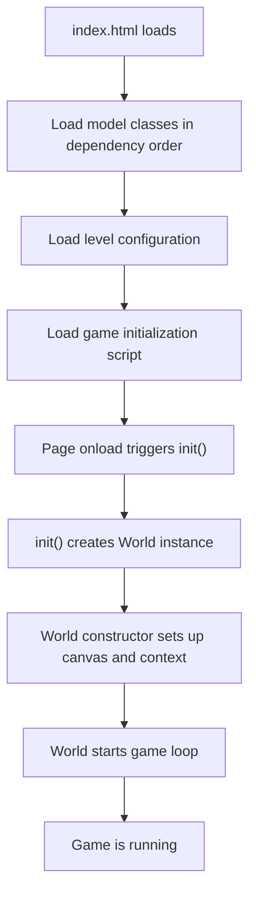
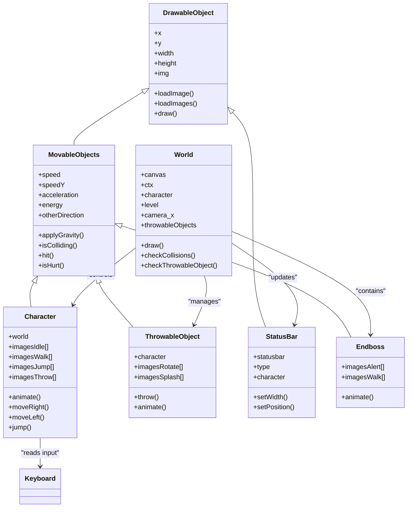
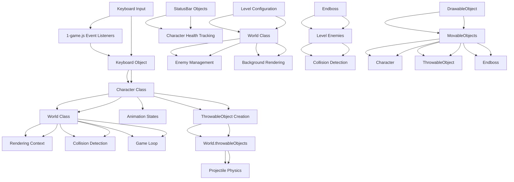

# Project Overview

<cite>
**Referenced Files in This Document**   
- [index.html](file://index.html)
- [js/1-game.js](file://js/1-game.js)
- [models/2-world.class.js](file://models/2-world.class.js)
- [models/character.class.js](file://models/character.class.js)
- [models/thowable-object.class.js](file://models/thowable-object.class.js)
- [models/status-bar.class.js](file://models/status-bar.class.js)
- [models/endboss.class.js](file://models/endboss.class.js)
- [models/movable-objects.class.js](file://models/movable-objects.class.js)
- [models/drawable-object.class.js](file://models/drawable-object.class.js)
- [models/keyboard.class.js](file://models/keyboard.class.js)
- [models/level.class.js](file://models/level.class.js)
- [levels/level1.js](file://levels/level1.js)
</cite>

## Table of Contents
1. [Introduction](#introduction)
2. [Technology Stack](#technology-stack)
3. [File Structure](#file-structure)
4. [Game Initialization](#game-initialization)
5. [Core Gameplay Mechanics](#core-gameplay-mechanics)
6. [Main Components Architecture](#main-components-architecture)
7. [Component Relationships](#component-relationships)
8. [Running the Game](#running-the-game)

## Introduction

The el_polo_loco game project is a 2D side-scrolling browser-based game developed using vanilla JavaScript and HTML5 Canvas technology. This game features a character navigating through a scrolling environment, engaging with enemies, and progressing toward an endboss encounter. The gameplay combines platforming mechanics with combat elements, creating an engaging experience that demonstrates core game development concepts without relying on external frameworks or build tools.

The game is designed to run directly in web browsers, leveraging the HTML5 Canvas element for rendering graphics and JavaScript for handling game logic, physics, user input, and animation. The codebase follows object-oriented principles with a clear hierarchy of classes that represent game entities and systems.

**Section sources**
- [index.html](file://index.html)
- [js/1-game.js](file://js/1-game.js)

## Technology Stack

The el_polo_loco game is built entirely with vanilla JavaScript, utilizing HTML5 Canvas for rendering and CSS for styling. This pure JavaScript approach eliminates dependencies on external frameworks, libraries, or build tools, making the codebase accessible and easy to understand for beginners while demonstrating fundamental game development techniques.

The technology stack consists of:
- **HTML5**: Provides the canvas element for game rendering and structure
- **CSS3**: Handles basic styling and layout of the game interface
- **Vanilla JavaScript**: Implements all game logic, physics, animation, and user interaction
- **HTML5 Canvas API**: Manages 2D graphics rendering and drawing operations

This minimalist technology stack allows the game to run in any modern web browser without requiring additional installations or configurations. The use of pure JavaScript ensures maximum compatibility and provides a clear understanding of how game mechanics are implemented at a fundamental level.

**Section sources**
- [index.html](file://index.html)
- [js/1-game.js](file://js/1-game.js)
- [style.css](file://style.css)

## File Structure

The project follows a logical directory structure that organizes files by their functionality and role within the game architecture:

- **js/**: Contains the main game initialization script (1-game.js) that sets up the game environment and handles user input
- **levels/**: Stores level configuration files (currently level1.js) that define the game world's composition including enemies, background elements, and UI components
- **models/**: Houses all class definitions for game entities and systems, following object-oriented design principles

The models directory contains the core classes that define game behavior:
- Character and enemy classes (character.class.js, chicken.class.js, endboss.class.js)
- Object base classes (drawable-object.class.js, movable-objects.class.js)
- Game state and UI components (status-bar.class.js, keyboard.class.js)
- World and level management (2-world.class.js, level.class.js)
- Interactive elements (thowable-object.class.js)

This organization separates concerns and makes the codebase maintainable by grouping related functionality together.

**Section sources**
- [index.html](file://index.html)
- [levels/level1.js](file://levels/level1.js)
- [models/2-world.class.js](file://models/2-world.class.js)

## Game Initialization

The game initializes through a well-defined sequence starting with the index.html file, which loads all necessary JavaScript files in dependency order and triggers the game startup when the page loads. The initialization process follows a specific execution order to ensure proper dependency resolution and game state setup.

When the page loads, the onload attribute in the body tag calls the init() function defined in 1-game.js. This function retrieves the canvas element and creates a new World instance, passing the canvas and a Keyboard object as parameters. The World class constructor then sets up the rendering context, establishes the game world reference, and starts the primary game loop.

The script loading order in index.html is critical, as classes are defined before they are instantiated. The sequence ensures that base classes like DrawableObject and MovableObjects are available before more specialized classes like Character and Endboss that extend them. This dependency management allows the game to initialize properly without runtime errors.

**Diagram sources**
- [index.html](file://index.html#L10-L24)
- [js/1-game.js](file://js/1-game.js#L5-L12)
- [models/2-world.class.js](file://models/2-world.class.js#L13-L25)

**Section sources**
- [index.html](file://index.html)
- [js/1-game.js](file://js/1-game.js)
- [models/2-world.class.js](file://models/2-world.class.js)

## Core Gameplay Mechanics

The el_polo_loco game implements several core gameplay mechanics that create an engaging player experience. These mechanics are handled through event listeners, game loops, and object interactions that respond to user input and game state changes.

Character movement is controlled via arrow keys, with the left and right arrows moving the character horizontally across the scrolling game world. The up arrow triggers jumping mechanics, which apply upward velocity and gravity physics to create realistic jumping behavior. The space bar allows the character to throw projectiles (salsa bottles) to defeat enemies.

The game features collision detection that determines when the character makes contact with enemies, triggering damage responses and health reduction. The ThrowableObject class manages projectile physics, including trajectory, gravity effects, and collision with the ground. Status bars provide visual feedback for the character's health, bottle count, and coin collection, with the endboss having a separate health indicator.

Enemy AI is implemented through simple movement patterns and animation cycles. The endboss progresses through different states as the player advances through the level. The camera system follows the character's movement, creating the side-scrolling effect by adjusting the rendering offset based on the character's position.

**Section sources**
- [js/1-game.js](file://js/1-game.js)
- [models/2-world.class.js](file://models/2-world.class.js)
- [models/character.class.js](file://models/character.class.js)
- [models/thowable-object.class.js](file://models/thowable-object.class.js)
- [models/status-bar.class.js](file://models/status-bar.class.js)

## Main Components Architecture

The game architecture centers around the World class, which serves as the main game controller and coordinates all game elements. The World class manages the game loop, rendering, collision detection, and object updates, acting as the central hub that connects all game components.

The Character class extends MovableObjects and represents the player-controlled entity with properties for position, velocity, health, and animation states. It handles user input responses and updates its state accordingly. The ThrowableObject class manages projectile behavior, including throwing mechanics, rotation animation, and splash effects when hitting the ground.

StatusBar components provide UI feedback for game state, with separate bars for health, bottles, and coins. These visual elements update dynamically based on the character's status. The Endboss class represents the final challenge with its own movement patterns and health tracking.

All drawable entities inherit from DrawableObject, which provides basic rendering capabilities, while MovableObjects adds physics properties like gravity, velocity, and collision detection. This inheritance hierarchy creates a consistent interface for game objects while allowing specialized behavior through class extensions.

**Diagram sources**
- [models/2-world.class.js](file://models/2-world.class.js)
- [models/character.class.js](file://models/character.class.js)
- [models/thowable-object.class.js](file://models/thowable-object.class.js)
- [models/status-bar.class.js](file://models/status-bar.class.js)
- [models/endboss.class.js](file://models/endboss.class.js)
- [models/movable-objects.class.js](file://models/movable-objects.class.js)
- [models/drawable-object.class.js](file://models/drawable-object.class.js)

**Section sources**
- [models/2-world.class.js](file://models/2-world.class.js)
- [models/character.class.js](file://models/character.class.js)
- [models/thowable-object.class.js](file://models/thowable-object.class.js)
- [models/status-bar.class.js](file://models/status-bar.class.js)
- [models/endboss.class.js](file://models/endboss.class.js)

## Component Relationships

The game components interact through a well-defined relationship structure that enables cohesive gameplay. The World class serves as the central coordinator, maintaining references to the Character, level data, and throwable objects, and updating their states during each game loop iteration.

User input is captured by event listeners in 1-game.js and stored in a global Keyboard object, which is then accessed by the Character class to determine movement and actions. The Character's position affects the camera_x offset in the World class, creating the side-scrolling effect as the character moves through the level.

Collision detection occurs between the Character and enemies from the level data, with the World class checking for intersections and triggering the hit() method on collision. When the player throws a bottle, a new ThrowableObject is instantiated and added to the World's throwableObjects array, where it's rendered and updated alongside other game elements.

StatusBar components are initialized with the level data and maintain references to the Character to display current health and resource levels. The endboss entity follows its own animation cycle while remaining part of the level's enemy array for collision detection purposes.

This component relationship model creates a modular architecture where each class has a specific responsibility, and interactions occur through well-defined interfaces and method calls.

**Diagram sources**
- [js/1-game.js](file://js/1-game.js)
- [models/2-world.class.js](file://models/2-world.class.js)
- [models/character.class.js](file://models/character.class.js)
- [models/thowable-object.class.js](file://models/thowable-object.class.js)
- [models/status-bar.class.js](file://models/status-bar.class.js)
- [models/endboss.class.js](file://models/endboss.class.js)
- [models/movable-objects.class.js](file://models/movable-objects.class.js)
- [models/drawable-object.class.js](file://models/drawable-object.class.js)
- [levels/level1.js](file://levels/level1.js)

**Section sources**
- [js/1-game.js](file://js/1-game.js)
- [models/2-world.class.js](file://models/2-world.class.js)
- [models/character.class.js](file://models/character.class.js)
- [models/thowable-object.class.js](file://models/thowable-object.class.js)

## Running the Game

To run the el_polo_loco game, no special prerequisites or installations are required beyond a modern web browser. The game can be launched by opening the index.html file directly in a browser or serving it through a local web server.

For direct file access, simply navigate to the project directory and double-click on index.html to open it in your default browser. Alternatively, you can use a simple HTTP server to serve the files, which can be done using Python's built-in server (python -m http.server) or Node.js tools like http-server.

The game requires no compilation or build process since it uses vanilla JavaScript without frameworks. All assets are loaded relative to the project structure, so maintaining the directory hierarchy is important for proper resource loading. The game should run on any device with a modern browser that supports HTML5 Canvas, including desktop and mobile platforms.

Common troubleshooting steps include ensuring all files are in their correct directories, verifying that image assets are properly referenced, and checking browser developer tools for any JavaScript errors that might prevent the game from initializing correctly.

**Section sources**
- [index.html](file://index.html)
- [js/1-game.js](file://js/1-game.js)
- [models/2-world.class.js](file://models/2-world.class.js)