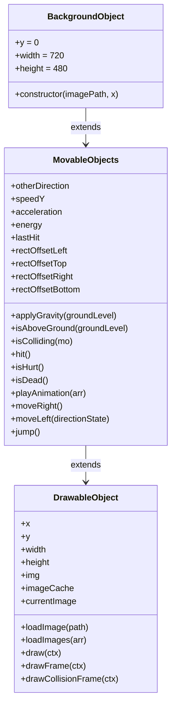
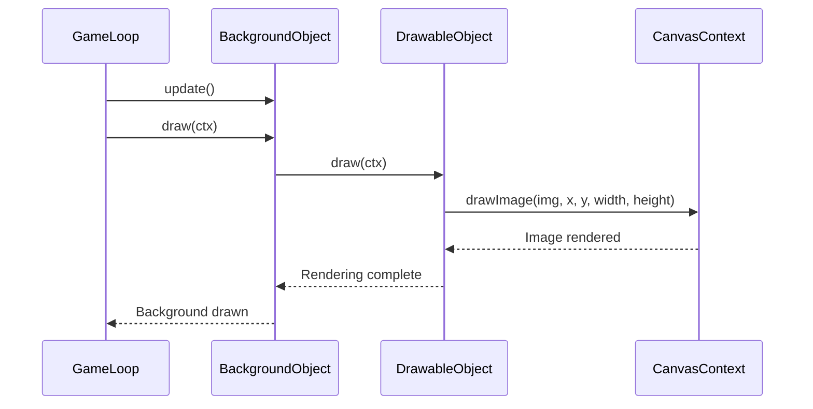
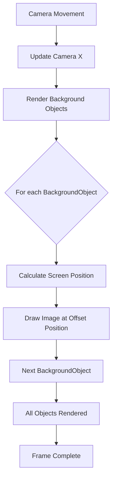
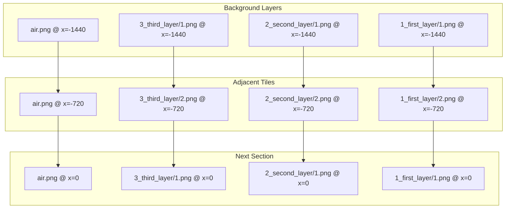

# BackgroundObject Class Reference

<cite>
**Referenced Files in This Document**   
- [background-object.class.js](file://models/background-object.class.js)
- [movable-objects.class.js](file://models/movable-objects.class.js)
- [drawable-object.class.js](file://models/drawable-object.class.js)
- [level1.js](file://levels/level1.js)
- [level.class.js](file://models/level.class.js)
</cite>

## Table of Contents
1. [Introduction](#introduction)
2. [Class Inheritance and Architecture](#class-inheritance-and-architecture)
3. [Fixed Dimensions and Properties](#fixed-dimensions-and-properties)
4. [Constructor Parameters](#constructor-parameters)
5. [Rendering Capabilities](#rendering-capabilities)
6. [Positioning and Movement Behavior](#positioning-and-movement-behavior)
7. [Parallax Scrolling Implementation](#parallax-scrolling-implementation)
8. [Usage Examples](#usage-examples)
9. [Potential Extensions](#potential-extensions)
10. [Conclusion](#conclusion)

## Introduction

The `BackgroundObject` class is a specialized component within the game architecture designed to represent static background elements in the game world. As an extension of the `MovableObjects` class, it inherits core functionality while being optimized for background rendering. This class plays a crucial role in creating immersive environments through seamless background composition and parallax scrolling effects. Unlike typical movable objects, `BackgroundObject` instances maintain fixed positions relative to the game world, enabling camera-based movement illusions that enhance the player's experience.

**Section sources**
- [background-object.class.js](file://models/background-object.class.js#L0-L9)

## Class Inheritance and Architecture

The `BackgroundObject` class follows a hierarchical inheritance pattern, extending `MovableObjects`, which itself inherits from `DrawableObject`. This design enables `BackgroundObject` to leverage rendering capabilities while maintaining the structural benefits of the game's object system. Despite inheriting movement methods from `MovableObjects`, `BackgroundObject` is conceptually designed as a static element, with its position controlled through initialization parameters rather than dynamic movement.

**Diagram sources**
- [background-object.class.js](file://models/background-object.class.js#L0-L9)
- [movable-objects.class.js](file://models/movable-objects.class.js#L0-L75)
- [drawable-object.class.js](file://models/drawable-object.class.js#L0-L43)

**Section sources**
- [background-object.class.js](file://models/background-object.class.js#L0-L9)
- [movable-objects.class.js](file://models/movable-objects.class.js#L0-L75)
- [drawable-object.class.js](file://models/drawable-object.class.js#L0-L43)

## Fixed Dimensions and Properties

The `BackgroundObject` class has fixed dimensions of 720x480 pixels, which correspond to the standard background tile size used throughout the game environment. These dimensions are defined as class properties, ensuring consistency across all instances. The y-coordinate is fixed at 0, anchoring all background elements to the top of the game viewport. This standardized sizing enables seamless tiling and alignment when creating continuous backgrounds across the game world.

**Section sources**
- [background-object.class.js](file://models/background-object.class.js#L2-L4)

## Constructor Parameters

The `BackgroundObject` constructor accepts two parameters: `imagePath` and `x`. The `imagePath` parameter specifies the source path for the background image, allowing different visual layers to be instantiated with specific assets. The `x` parameter determines the horizontal positioning of the background element within the game world. During construction, the class calls `super().loadImage(imagePath)` to initialize the inherited rendering functionality with the specified image asset.

**Section sources**
- [background-object.class.js](file://models/background-object.class.js#L6-L9)

## Rendering Capabilities

`BackgroundObject` inherits rendering capabilities from the `DrawableObject` base class, specifically the `draw(ctx)` method. This method uses the HTML5 Canvas API to render the background image at the object's specified coordinates with its defined dimensions. The rendering process is optimized for performance, allowing multiple background layers to be drawn efficiently during each animation frame. The inherited `loadImage` method ensures asynchronous image loading and caching for smooth rendering.

**Diagram sources**
- [background-object.class.js](file://models/background-object.class.js#L6-L9)
- [drawable-object.class.js](file://models/drawable-object.class.js#L23-L25)

**Section sources**
- [drawable-object.class.js](file://models/drawable-object.class.js#L23-L25)

## Positioning and Movement Behavior

While `BackgroundObject` inherits movement methods from `MovableObjects`, it is designed to maintain a fixed position in the game world. The x-coordinate is set during construction and remains constant, creating the illusion of movement through camera manipulation rather than object translation. This approach optimizes performance by avoiding unnecessary position updates for static background elements. The fixed y-coordinate of 0 ensures all background layers align at the top of the viewport.

**Section sources**
- [background-object.class.js](file://models/background-object.class.js#L2-L4)
- [movable-objects.class.js](file://models/movable-objects.class.js#L62-L65)

## Parallax Scrolling Implementation

The `BackgroundObject` class is fundamental to implementing parallax scrolling effects, where multiple background layers move at different speeds to create depth perception. By arranging multiple `BackgroundObject` instances with different image assets and x-coordinates, developers can create multi-layered backgrounds. When combined with camera movement, these static elements produce the illusion of depth, with foreground layers appearing to move faster than background layers. This technique enhances the visual richness of the game environment without requiring complex animation logic.

**Diagram sources**
- [level1.js](file://levels/level1.js#L4-L24)

**Section sources**
- [level1.js](file://levels/level1.js#L4-L24)

## Usage Examples

Multiple `BackgroundObject` instances are arranged in the `level1.js` file to create a seamless, tiled background. Each instance is initialized with a specific image path and x-coordinate, creating a continuous landscape that spans the entire level. The pattern repeats every 720 pixels, matching the width of each background tile. Different layers (air, third_layer, second_layer, first_layer) are stacked to create depth, with identical x-coordinates ensuring proper alignment across layers.

**Diagram sources**
- [level1.js](file://levels/level1.js#L4-L24)
- [level.class.js](file://models/level.class.js#L6-L13)

**Section sources**
- [level1.js](file://levels/level1.js#L4-L24)

## Potential Extensions

The `BackgroundObject` class can be extended to support advanced visual effects and gameplay features. Potential extensions include implementing parallax layers with different scroll speeds by introducing a speed multiplier property, enabling animated background elements through frame-based animation sequences, or adding dynamic lighting effects. Additional properties could control layer depth for automatic parallax calculation, or support for animated spritesheets to create moving water, clouds, or other environmental effects. These extensions would maintain backward compatibility while enhancing visual fidelity.

**Section sources**
- [background-object.class.js](file://models/background-object.class.js#L0-L9)
- [movable-objects.class.js](file://models/movable-objects.class.js#L0-L75)

## Conclusion

The `BackgroundObject` class serves as a foundational component for creating immersive game environments through efficient background rendering and parallax scrolling effects. By extending the `MovableObjects` class while functioning as a static element, it demonstrates a flexible inheritance pattern that balances code reuse with specialized functionality. Its fixed dimensions and constructor-based positioning enable consistent, predictable background composition, while its integration with the game's rendering system ensures optimal performance. The class's design supports both current requirements and future enhancements, making it a versatile element in the game's architecture.

**Section sources**
- [background-object.class.js](file://models/background-object.class.js#L0-L9)
- [level1.js](file://levels/level1.js#L4-L24)