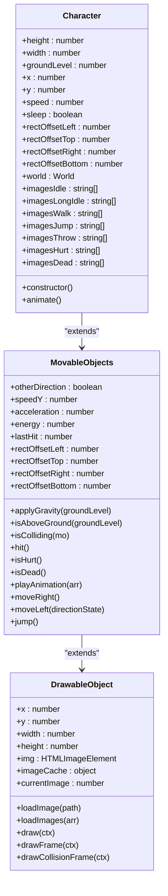
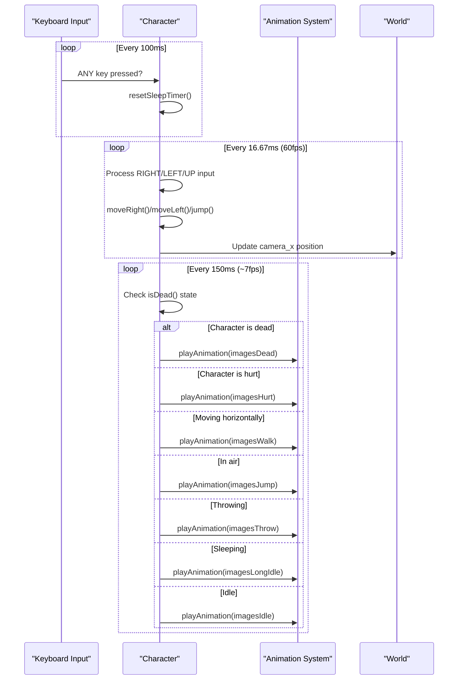
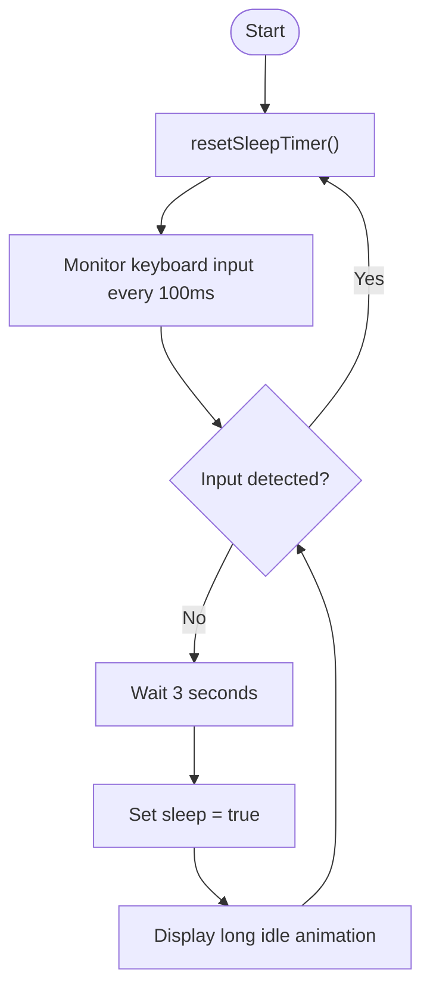

# Character Class Reference

<cite>
**Referenced Files in This Document**   
- [character.class.js](file://models/character.class.js)
- [movable-objects.class.js](file://models/movable-objects.class.js)
- [2-world.class.js](file://models/2-world.class.js)
- [drawable-object.class.js](file://models/drawable-object.class.js)
- [keyboard.class.js](file://models/keyboard.class.js)
- [level1.js](file://levels/level1.js)
</cite>

## Table of Contents
1. [Introduction](#introduction)
2. [Core Properties](#core-properties)
3. [Constructor Responsibilities](#constructor-responsibilities)
4. [Animation System](#animation-system)
5. [Input Handling and Movement](#input-handling-and-movement)
6. [Animation State Selection](#animation-state-selection)
7. [Sleep/Idle Transition Logic](#sleepidle-transition-logic)
8. [Integration with World System](#integration-with-world-system)
9. [Extensibility Guidelines](#extensibility-guidelines)

## Introduction
The Character class represents the player-controlled entity in the game, extending the MovableObjects base class to provide comprehensive movement, animation, and interaction capabilities. This documentation details the class structure, behavior, and integration points with the game world, providing developers with complete understanding of the character's functionality and extensibility options.

**Section sources**
- [character.class.js](file://models/character.class.js#L1-L152)

## Core Properties
The Character class defines several key properties that determine its appearance, position, and behavior in the game world:

- **Dimensions**: The character has a fixed height of 280 pixels, with width calculated as half the height (140 pixels)
- **Positioning**: Initial x-position set to 50, with y-position calculated based on groundLevel
- **Ground Level**: Calculated as 445 minus character height, establishing the baseline for movement and jumping
- **Movement Speed**: Fixed speed value of 5 pixels per movement step
- **Collision Rectangles**: Four offset values (rectOffsetLeft, rectOffsetTop, rectOffsetRight, rectOffsetBottom) define the collision detection boundaries
- **Animation States**: Arrays of image paths for different animation states (idle, walking, jumping, throwing, hurt, dead, and long idle)
- **State Flags**: The sleep boolean flag tracks whether the character should display the long idle animation

**Section sources**
- [character.class.js](file://models/character.class.js#L3-L25)

## Constructor Responsibilities
The Character constructor performs several critical initialization tasks to prepare the character for gameplay:

1. **Image Loading**: Loads the initial idle image and preloads all animation sprites using the loadImages method inherited from DrawableObject
2. **Gravity Application**: Activates the gravity system by calling applyGravity with the character's groundLevel
3. **Animation Initialization**: Starts the animation system by invoking the animate method

The constructor ensures all visual assets are loaded into memory before gameplay begins, preventing animation stuttering during runtime.

**Diagram sources**
- [character.class.js](file://models/character.class.js#L27-L45)
- [movable-objects.class.js](file://models/movable-objects.class.js#L2-L76)
- [drawable-object.class.js](file://models/drawable-object.class.js#L1-L45)

**Section sources**
- [character.class.js](file://models/character.class.js#L47-L58)

## Animation System
The animate method implements a sophisticated animation system using multiple setInterval calls to handle different aspects of character behavior at appropriate frequencies:

- **Sleep Timer Management**: A dedicated interval (100ms) monitors keyboard input to reset the sleep timer whenever any key is pressed
- **Movement and Camera Updates**: A high-frequency interval (60fps) processes movement input, updates position, and adjusts camera tracking
- **Animation State Selection**: A moderate-frequency interval (approximately 7fps) determines the appropriate animation based on current game conditions

This multi-interval approach ensures smooth gameplay while efficiently managing different update requirements.

**Diagram sources**
- [character.class.js](file://models/character.class.js#L60-L152)

**Section sources**
- [character.class.js](file://models/character.class.js#L60-L152)

## Input Handling and Movement
The character's movement is controlled through keyboard input from the World object, with specific behaviors for each direction:

- **Right Movement**: Increases x-position by speed value when RIGHT key is pressed and character is within level boundaries
- **Left Movement**: Decreases x-position by speed value when LEFT key is pressed and character is above minimum x-position
- **Jumping**: Initiates upward movement by setting speedY to 8 when UP key is pressed and character is on the ground
- **Camera Tracking**: The world's camera_x position is updated to follow the character, creating a scrolling effect

The movement system respects level boundaries defined in the Level class, preventing the character from moving beyond the game world.

**Section sources**
- [character.class.js](file://models/character.class.js#L90-L98)
- [2-world.class.js](file://models/2-world.class.js#L30-L35)
- [level1.js](file://levels/level1.js#L1-L13)

## Animation State Selection
The animation system selects the appropriate sprite sequence based on the character's current state and player input:

1. **Death State**: Highest priority - displays death animation when energy reaches zero
2. **Hurt State**: Second priority - shows hurt animation when recently damaged
3. **Movement States**: 
   - Walking animation when moving horizontally on the ground
   - Jumping animation when in the air
   - Throwing animation when SPACE key is pressed
4. **Idle States**: 
   - Long idle animation after 3 seconds of inactivity (sleep state)
   - Regular idle animation when no input is detected but not sleeping

The state selection uses a cascading if-else structure to ensure proper animation priority.

**Section sources**
- [character.class.js](file://models/character.class.js#L100-L130)

## Sleep/Idle Transition Logic
The character implements a sleep/idle transition system that enhances gameplay immersion:

- A sleepTimer variable tracks inactivity duration
- The resetSleepTimer function clears the existing timer and sets a new 3-second timeout
- Whenever ANY keyboard input is detected, the sleep timer is reset
- After 3 seconds of no input, the sleep flag is set to true, triggering the long idle animation
- Any subsequent input immediately resets the sleep state and returns to regular idle animation

This system creates a natural transition between active and inactive states, providing visual feedback to the player.

**Diagram sources**
- [character.class.js](file://models/character.class.js#L62-L88)

**Section sources**
- [character.class.js](file://models/character.class.js#L62-L88)

## Integration with World System
The Character class integrates tightly with the World system through several key mechanisms:

- **World Reference**: The character maintains a reference to the World instance, allowing access to keyboard state and level information
- **Camera Synchronization**: The character's position directly controls the world's camera_x value for scrolling
- **Collision Detection**: Uses the isColliding method inherited from MovableObjects to detect interactions with enemies
- **Energy Management**: The character's energy level is monitored by StatusBar instances for UI updates

The World object sets the character's world reference during initialization, establishing the bidirectional relationship.

**Section sources**
- [character.class.js](file://models/character.class.js#L24)
- [2-world.class.js](file://models/2-world.class.js#L25-L28)
- [status-bar.class.js](file://models/status-bar.class.js#L50-L55)

## Extensibility Guidelines
The Character class can be extended with new animation states or modified movement behavior while maintaining compatibility with existing systems:

### Adding New Animation States
1. Define a new image array property with sprite paths
2. Add the loadImages call in the constructor
3. Update the animation state selection logic in the animate method
4. Ensure the new state respects the existing priority hierarchy

### Modifying Movement Behavior
1. Override movement methods (moveRight, moveLeft, jump) with custom logic
2. Adjust speed, acceleration, or gravity values as needed
3. Maintain boundary checks to prevent level escape
4. Ensure camera tracking remains synchronized

### Compatibility Considerations
- Preserve the existing collision rectangle offsets for accurate hit detection
- Maintain the energy and lastHit properties for damage system compatibility
- Keep the playAnimation interface consistent for animation rendering
- Respect the World object's expectations for camera and input handling

**Section sources**
- [character.class.js](file://models/character.class.js#L1-L152)
- [movable-objects.class.js](file://models/movable-objects.class.js#L2-L76)
- [2-world.class.js](file://models/2-world.class.js#L1-L132)