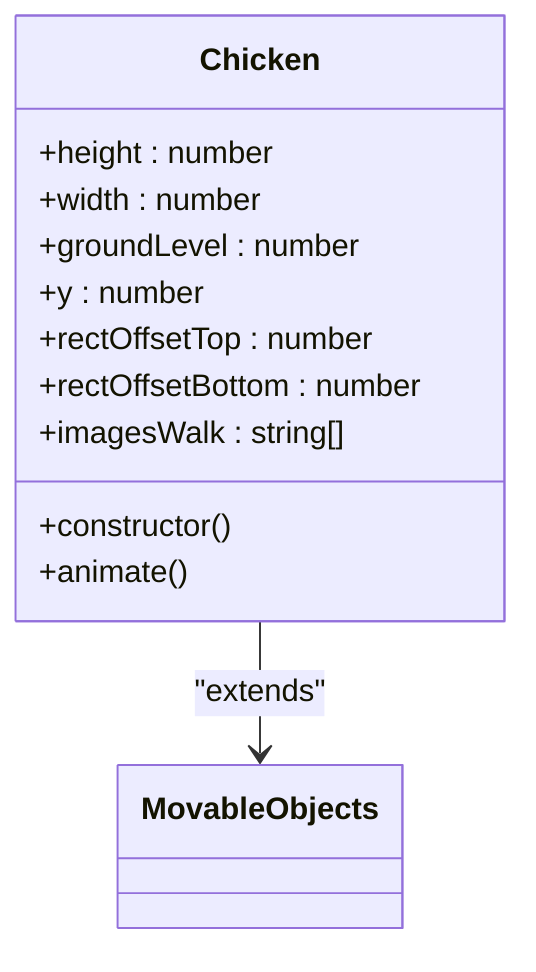
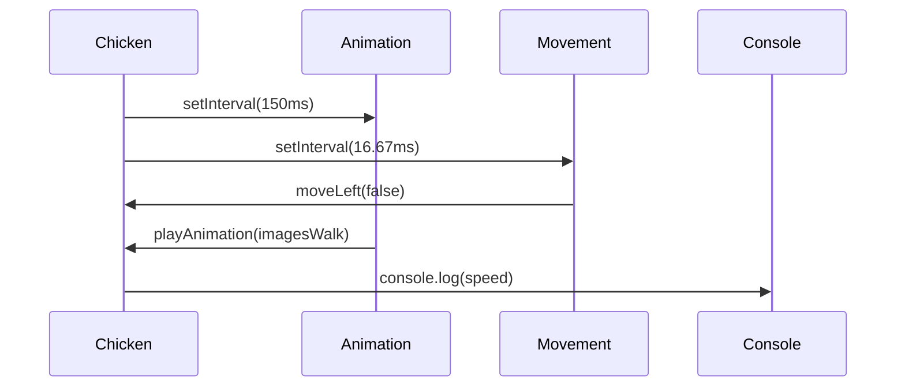
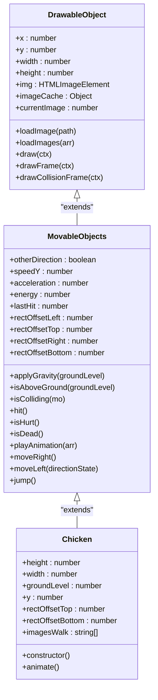

# Chicken Class Reference

<cite>
**Referenced Files in This Document**  
- [chicken.class.js](file://models/chicken.class.js)
- [movable-objects.class.js](file://models/movable-objects.class.js)
- [drawable-object.class.js](file://models/drawable-object.class.js)
</cite>

## Table of Contents
1. [Introduction](#introduction)
2. [Core Properties](#core-properties)
3. [Constructor Implementation](#constructor-implementation)
4. [Animation and Movement](#animation-and-movement)
5. [Inheritance and Base Functionality](#inheritance-and-base-functionality)
6. [Potential Extensions](#potential-extensions)

## Introduction
The Chicken class represents basic enemy units within the game environment. As a fundamental enemy type, chickens move continuously from right to left across the game world, providing challenges for the player character. This documentation details the implementation of the Chicken class, including its properties, constructor logic, animation system, and movement behavior. The class inherits essential physics and collision capabilities from its parent classes, enabling realistic interactions within the game world.

**Section sources**
- [chicken.class.js](file://models/chicken.class.js#L0-L34)

## Core Properties
The Chicken class defines several key properties that determine its appearance and behavior in the game world:

- **height**: Fixed at 75 pixels, establishing the vertical dimension of the chicken
- **width**: Calculated as 80% of the height (60 pixels), maintaining proportional scaling
- **groundLevel**: Computed as 440 minus the height, positioning the chicken on the ground plane at y = 365
- **y**: Initialized to groundLevel, setting the vertical position where chickens walk
- **rectOffsetTop**: Set to 25 pixels, defining the top collision boundary offset
- **rectOffsetBottom**: Calculated as 30 pixels (5 + rectOffsetTop), defining the bottom collision boundary offset
- **imagesWalk**: Array containing three sprite image paths for the walking animation sequence

These properties establish the chicken's physical dimensions, position, and visual assets within the game environment.

**Section sources**
- [chicken.class.js](file://models/chicken.class.js#L2-L15)

## Constructor Implementation
The Chicken constructor initializes each instance with randomized positioning and movement characteristics:

- Calls `super()` to initialize inherited properties from MovableObjects
- Loads the initial sprite image using `loadImage()`
- Randomizes the starting x-position between 200 and 700 pixels from the left edge
- Randomizes movement speed between 0.25 and 0.75 pixels per frame
- Pre-loads all walking animation sprites into the image cache
- Initiates the animation loop by calling the `animate()` method

This initialization process ensures that chickens appear at varying positions across the game world with different movement speeds, creating a more dynamic and unpredictable gameplay experience.

**Diagram sources**
- [chicken.class.js](file://models/chicken.class.js#L0-L34)

**Section sources**
- [chicken.class.js](file://models/chicken.class.js#L17-L23)

## Animation and Movement
The `animate()` method orchestrates both the movement and visual animation of chicken instances through two independent setInterval loops:

- **Movement Loop**: Executes every 16.67 milliseconds (60 times per second), calling `moveLeft(false)` to advance the chicken horizontally while maintaining its left-facing orientation
- **Animation Loop**: Executes every 150 milliseconds, cycling through the walking animation sprites using `playAnimation(imagesWalk)`
- **Speed Logging**: Outputs the current speed value to the console for debugging purposes

The chicken moves continuously from right to left across the screen at its randomized speed until it exits the visible game area or interacts with the player character. The animation system seamlessly cycles through the three walking sprites to create the illusion of movement.

**Diagram sources**
- [chicken.class.js](file://models/chicken.class.js#L25-L33)
- [movable-objects.class.js](file://models/movable-objects.class.js#L67-L70)
- [movable-objects.class.js](file://models/movable-objects.class.js#L55-L60)

**Section sources**
- [chicken.class.js](file://models/chicken.class.js#L25-L33)

## Inheritance and Base Functionality
The Chicken class inherits essential functionality from a hierarchy of parent classes:

- **MovableObjects**: Provides physics-based movement, collision detection, and animation capabilities
- **DrawableObject**: Supplies rendering methods and image management functions

Through inheritance, chickens gain access to critical game mechanics:
- Movement methods like `moveLeft()` for horizontal navigation
- Animation system via `playAnimation()` for sprite cycling
- Collision detection through inherited boundary calculation
- Image loading and caching mechanisms for efficient rendering
- Physics properties including speed and positioning

This inheritance structure allows the Chicken class to focus on enemy-specific behavior while leveraging shared functionality across all movable game objects.

**Diagram sources**
- [chicken.class.js](file://models/chicken.class.js#L0-L34)
- [movable-objects.class.js](file://models/movable-objects.class.js#L0-L75)
- [drawable-object.class.js](file://models/drawable-object.class.js#L0-L43)

**Section sources**
- [movable-objects.class.js](file://models/movable-objects.class.js#L0-L75)
- [drawable-object.class.js](file://models/drawable-object.class.js#L0-L43)

## Potential Extensions
The Chicken class provides a foundation that can be extended with additional gameplay features:

- **Attack Behaviors**: Implement attack patterns when the player approaches within a certain range
- **Variable Movement Patterns**: Introduce random pauses, direction changes, or speed variations
- **Drop Mechanics**: Add functionality to drop items or points when defeated by the player
- **Enhanced AI**: Implement pathfinding or avoidance behaviors to navigate around obstacles
- **State Management**: Add different states (wandering, chasing, fleeing) based on game conditions
- **Visual Effects**: Incorporate death animations or special effects when eliminated
- **Sound Integration**: Add audio cues for movement, attacks, or defeat

These extensions could enhance gameplay depth while maintaining the core functionality established in the base Chicken implementation.

**Section sources**
- [chicken.class.js](file://models/chicken.class.js#L0-L34)
- [movable-objects.class.js](file://models/movable-objects.class.js#L0-L75)