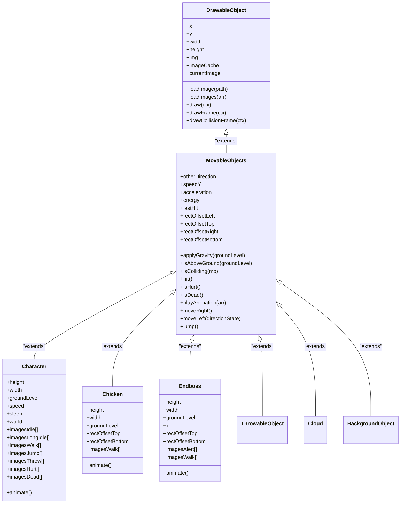

# DrawableObject Class Reference

<cite>
**Referenced Files in This Document**   
- [drawable-object.class.js](file://models/drawable-object.class.js)
- [movable-objects.class.js](file://models/movable-objects.class.js)
- [character.class.js](file://models/character.class.js)
- [chicken.class.js](file://models/chicken.class.js)
- [endboss.class.js](file://models/endboss.class.js)
- [2-world.class.js](file://models/2-world.class.js)
- [1-game.js](file://js/1-game.js)
</cite>

## Table of Contents
1. [Introduction](#introduction)
2. [Core Properties](#core-properties)
3. [Image Loading and Caching](#image-loading-and-caching)
4. [Rendering Methods](#rendering-methods)
5. [Coordinate System and Canvas Rendering](#coordinate-system-and-canvas-rendering)
6. [Usage Examples](#usage-examples)
7. [Collision Debugging](#collision-debugging)
8. [Inheritance and Child Classes](#inheritance-and-child-classes)
9. [Architecture Overview](#architecture-overview)

## Introduction
The DrawableObject class serves as the foundational base class for all visual elements in the el_polo_loco game. It provides essential rendering capabilities and image management functionality that are inherited by all game objects requiring visual representation. This class establishes the core rendering pipeline and coordinate system used throughout the game's visual components.

**Section sources**
- [drawable-object.class.js](file://models/drawable-object.class.js#L0-L43)

## Core Properties
The DrawableObject class defines several key properties that establish the fundamental visual characteristics of all game objects:

- **x, y**: Position coordinates that determine the object's location in the game world using a top-left origin coordinate system
- **width, height**: Dimensions that define the object's size in pixels
- **img**: Reference to the current Image object being rendered
- **imageCache**: Object that stores preloaded images for efficient access during animation sequences
- **currentImage**: Index tracker for animation sequences, used by child classes to manage frame progression

These properties form the foundation for positioning and sizing all visual elements within the game environment.

**Section sources**
- [drawable-object.class.js](file://models/drawable-object.class.js#L2-L8)

## Image Loading and Caching
The DrawableObject class provides two primary methods for managing image assets:

### loadImage(path)
Loads a single image from the specified path into the object's img property. This method creates a new Image object and sets its src attribute, triggering asynchronous loading.

### loadImages(arr)
Preloads multiple images from an array of paths into the imageCache object. This enables efficient animation by eliminating load delays during frame transitions. Each image is stored in the cache using its path as the key, allowing quick retrieval during animation cycles.

The image caching mechanism is essential for smooth animation performance, as it ensures all animation frames are loaded and ready before gameplay begins.

**Section sources**
- [drawable-object.class.js](file://models/drawable-object.class.js#L10-L21)

## Rendering Methods
The DrawableObject class implements the core rendering functionality used by all visual game elements.

### draw(ctx)
Renders the object's current image onto the provided 2D canvas context using the standard drawImage method. The rendering respects the object's x, y, width, and height properties to position and scale the image appropriately within the game world.

**Section sources**
- [drawable-object.class.js](file://models/drawable-object.class.js#L23-L25)

## Coordinate System and Canvas Rendering
The game employs a standard 2D Cartesian coordinate system with the origin (0,0) positioned at the top-left corner of the canvas. The DrawableObject class works within this system, with x increasing to the right and y increasing downward. The rendering process is managed by the World class, which orchestrates the drawing sequence for all game objects, applying camera translation to create the scrolling effect as the character moves through the game world.

**Section sources**
- [2-world.class.js](file://models/2-world.class.js#L70-L130)
- [1-game.js](file://js/1-game.js#L1-L55)

## Usage Examples
To instantiate and render a DrawableObject, child classes typically follow this pattern:

```javascript
// Example from Character class
constructor() {
    super();
    this.loadImage(this.imagesIdle[0]);
    this.loadImages(this.imagesIdle);
    this.loadImages(this.imagesWalk);
    // Additional image loading...
}
```

The rendering process is automatically handled by the World class's draw method, which iterates through all game objects and calls their draw, drawFrame, and drawCollisionFrame methods in sequence. Objects are rendered in layers according to their position in the game world, with background elements drawn first and foreground elements drawn last.

**Section sources**
- [character.class.js](file://models/character.class.js#L50-L70)
- [2-world.class.js](file://models/2-world.class.js#L90-L100)

## Collision Debugging
The DrawableObject class includes specialized methods for visualizing collision zones during development and debugging:

### drawFrame(ctx)
Renders a blue rectangle outlining the object's full bounding box (x, y, width, height). This visualization is conditionally enabled only for Character, Chicken, and Endboss instances.

### drawCollisionFrame(ctx)
Renders a red rectangle representing the adjusted collision zone, accounting for rectOffset properties that define the active collision area within the overall bounding box. This method is also restricted to Character, Chicken, and Endboss instances.

The conditional rendering logic prevents unnecessary debug visuals for background elements and other non-interactive objects.

**Section sources**
- [drawable-object.class.js](file://models/drawable-object.class.js#L27-L41)
- [movable-objects.class.js](file://models/movable-objects.class.js#L10-L13)

## Inheritance and Child Classes
The DrawableObject class serves as the root of an inheritance hierarchy, with MovableObjects extending it to add physics and movement capabilities. Key child classes include:

- **MovableObjects**: Adds gravity, collision detection, and movement methods
- **Character**: Player-controlled character with animation states and input handling
- **Chicken**: Enemy character with autonomous movement patterns
- **Endboss**: Special enemy with unique behaviors and visual elements

Child classes interact with the base rendering methods by calling the parent's draw functionality while adding their specific behaviors. The inheritance chain enables code reuse while allowing specialized functionality for different game object types.



**Diagram sources**
- [drawable-object.class.js](file://models/drawable-object.class.js#L0-L43)
- [movable-objects.class.js](file://models/movable-objects.class.js#L0-L75)
- [character.class.js](file://models/character.class.js#L0-L150)
- [chicken.class.js](file://models/chicken.class.js#L0-L34)
- [endboss.class.js](file://models/endboss.class.js#L0-L40)

**Section sources**
- [movable-objects.class.js](file://models/movable-objects.class.js#L0-L75)
- [character.class.js](file://models/character.class.js#L0-L150)
- [chicken.class.js](file://models/chicken.class.js#L0-L34)
- [endboss.class.js](file://models/endboss.class.js#L0-L40)

## Architecture Overview
The DrawableObject class is integrated into the game's architecture through the World class, which manages the rendering loop and coordinates the display of all visual elements. The rendering process follows a layered approach, with objects drawn in a specific order to maintain proper visual hierarchy. The coordinate system and camera translation enable the scrolling effect as the player character moves through the game world.

```mermaid
graph TB
subgraph "Rendering System"
World[World Class] --> DrawableObject[DrawableObject Base Class]
DrawableObject --> MovableObjects[MovableObjects Class]
MovableObjects --> Character[Character]
MovableObjects --> Chicken[Chicken]
MovableObjects --> Endboss[Endboss]
MovableObjects --> ThrowableObject[ThrowableObject]
MovableObjects --> Cloud[Cloud]
MovableObjects --> BackgroundObject[BackgroundObject]
end
subgraph "Game Loop"
World --> DrawLoop[draw() Method]
DrawLoop --> Clear[clearRect()]
DrawLoop --> Translate[ctx.translate()]
DrawLoop --> AddToMap[addObjectsToMap()]
AddToMap --> Draw[mo.draw(ctx)]
Draw --> DrawFrame[mo.drawFrame(ctx)]
Draw --> DrawCollisionFrame[mo.drawCollisionFrame(ctx)]
end
subgraph "Input System"
Keyboard[Keyboard Input] --> World
World --> Character
end
World --> Animation[Animation System]
Animation --> PlayAnimation[playAnimation(arr)]
PlayAnimation --> ImageCache[imageCache[path]]
```

**Diagram sources**
- [2-world.class.js](file://models/2-world.class.js#L0-L131)
- [drawable-object.class.js](file://models/drawable-object.class.js#L0-L43)
- [movable-objects.class.js](file://models/movable-objects.class.js#L0-L75)

**Section sources**
- [2-world.class.js](file://models/2-world.class.js#L0-L131)
- [1-game.js](file://js/1-game.js#L1-L55)