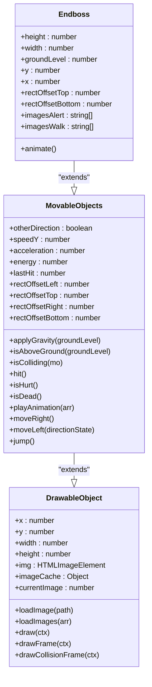
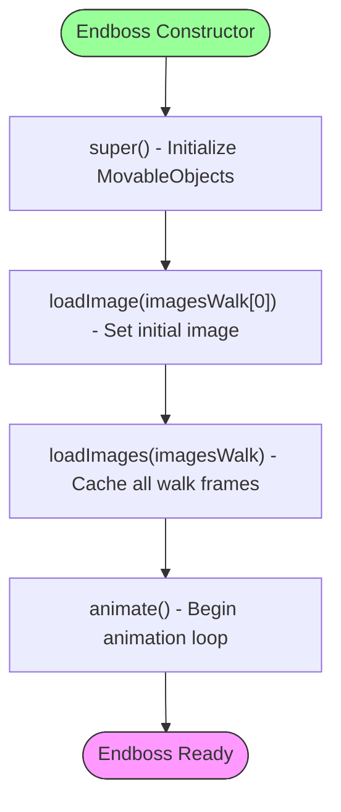
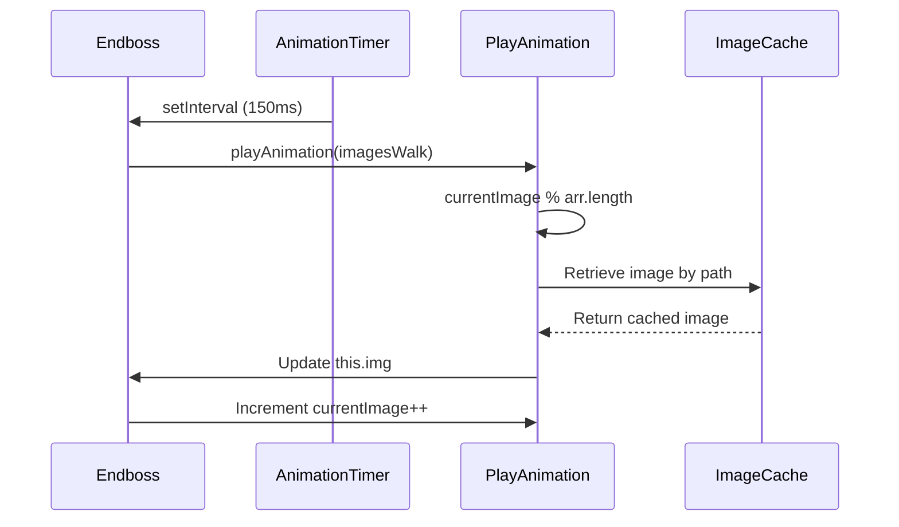
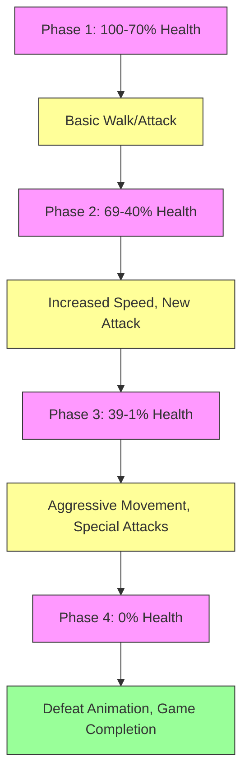

# Endboss Class Reference

<cite>
**Referenced Files in This Document**   
- [endboss.class.js](file://models/endboss.class.js)
- [movable-objects.class.js](file://models/movable-objects.class.js)
- [drawable-object.class.js](file://models/drawable-object.class.js)
</cite>

## Table of Contents
1. [Introduction](#introduction)
2. [Core Properties](#core-properties)
3. [Inheritance and Base Functionality](#inheritance-and-base-functionality)
4. [Constructor Initialization](#constructor-initialization)
5. [Animation System](#animation-system)
6. [Current Implementation Limitations](#current-implementation-limitations)
7. [Extension Points and Advanced Behaviors](#extension-points-and-advanced-behaviors)
8. [Collision and Performance Considerations](#collision-and-performance-considerations)

## Introduction
The Endboss class represents the final enemy in the game, serving as a specialized implementation of the MovableObjects base class. This documentation provides a comprehensive reference for the Endboss class, detailing its properties, initialization process, animation system, and potential extension points for advanced gameplay mechanics. The Endboss is designed to be a challenging final encounter with room for sophisticated behaviors while maintaining integration with the existing game object system.

**Section sources**
- [endboss.class.js](file://models/endboss.class.js#L1-L40)

## Core Properties
The Endboss class defines several key properties that determine its appearance, position, and interaction with the game world:

- **Dimensions**: Fixed height of 400 pixels with width calculated as 80% of height
- **Positioning**: Ground level dynamically calculated as 450 minus height, with fixed starting x-position at 400
- **Collision Boundaries**: Custom rectOffset values defining precise collision detection areas
- **Animation Sequences**: Two distinct image arrays for different states:
  - `imagesWalk`: Contains 4 frames for walking/locomotion animation
  - `imagesAlert`: Contains 8 frames for alert/idle animation sequence

These properties establish the Endboss as a large, ground-based enemy with defined visual states and collision characteristics.

**Section sources**
- [endboss.class.js](file://models/endboss.class.js#L2-L25)

## Inheritance and Base Functionality
The Endboss class inherits core functionality from the MovableObjects class, which itself extends DrawableObject. This inheritance hierarchy provides essential game object capabilities:



**Diagram sources**
- [endboss.class.js](file://models/endboss.class.js#L1-L40)
- [movable-objects.class.js](file://models/movable-objects.class.js#L1-L75)
- [drawable-object.class.js](file://models/drawable-object.class.js#L1-L45)

This inheritance provides the Endboss with:
- Visual rendering capabilities from DrawableObject
- Movement, gravity, and collision detection from MovableObjects
- Health tracking and damage response systems
- Animation playback infrastructure

**Section sources**
- [endboss.class.js](file://models/endboss.class.js#L1-L40)
- [movable-objects.class.js](file://models/movable-objects.class.js#L1-L75)

## Constructor Initialization
The Endboss constructor performs essential setup operations to prepare the enemy for gameplay:



**Diagram sources**
- [endboss.class.js](file://models/endboss.class.js#L34-L38)

The initialization sequence ensures the Endboss is immediately visible and animated upon creation, with all necessary resources pre-loaded for smooth performance.

**Section sources**
- [endboss.class.js](file://models/endboss.class.js#L34-L38)

## Animation System
The Endboss implements a simple animation system through the animate() method, which drives the visual state of the enemy:



**Diagram sources**
- [endboss.class.js](file://models/endboss.class.js#L34-L38)
- [movable-objects.class.js](file://models/movable-objects.class.js#L55-L60)

The animation system:
- Uses setInterval to trigger frame updates every 150 milliseconds
- Cycles through the imagesWalk array using the inherited playAnimation method
- Relies on the imageCache system from DrawableObject for efficient image retrieval
- Automatically increments the currentImage counter to advance through frames

**Section sources**
- [endboss.class.js](file://models/endboss.class.js#L34-L38)
- [movable-objects.class.js](file://models/movable-objects.class.js#L55-L60)

## Current Implementation Limitations
The current Endboss implementation has several limitations that represent opportunities for enhancement:

- **Single Animation State**: Only the walk animation is implemented and played continuously
- **No Alert State Utilization**: The imagesAlert array is defined but not used in any animation logic
- **Static Positioning**: The Endboss remains stationary at x=400 without movement logic
- **No Health System Integration**: While inheriting energy properties, there is no specific health management
- **Limited Behavior**: No attack patterns, phase transitions, or defeat animations
- **No Player Interaction**: No tracking or response to player position or actions

These limitations define the current scope of the Endboss as primarily a visual element rather than a fully interactive enemy.

**Section sources**
- [endboss.class.js](file://models/endboss.class.js#L1-L40)

## Extension Points and Advanced Behaviors
The Endboss class provides several natural extension points for implementing advanced gameplay mechanics:

### Alert State Implementation
The unused imagesAlert array can be incorporated to create an alert/idle state that plays when the player approaches:

```mermaid
stateDiagram-v2
[*] --> Walking
Walking --> Alert : "playerInRange"
Alert --> Walking : "timeout"
Alert --> Attacking : "attackCondition"
Attacking --> Walking : "attackComplete"
Walking --> Defeated : "energy == 0"
Alert --> Defeated : "energy == 0"
Attacking --> Defeated : "energy == 0"
state Walking {
[*] --> PlayWalkAnimation
}
state Alert {
[*] --> PlayAlertAnimation
}
state Attacking {
[*] --> ExecuteAttackPattern
}
state Defeated {
[*] --> PlayDefeatAnimation
--> RemoveFromGame
}
```

**Diagram sources**
- [endboss.class.js](file://models/endboss.class.js#L15-L25)

### Phase-Based Combat System
The Endboss could implement a multi-phase combat system that changes behavior based on health thresholds:



**Diagram sources**
- [endboss.class.js](file://models/endboss.class.js#L1-L40)
- [movable-objects.class.js](file://models/movable-objects.class.js#L15-L20)

### Advanced Behavior Implementation
Key extension points include:
- **Player Tracking**: Implement methods to detect and respond to player position
- **Attack Patterns**: Create timed attack sequences with visual and collision effects
- **Health Management**: Override hit() method to trigger state changes at specific thresholds
- **Defeat Sequence**: Implement a victory condition with special animation and rewards
- **Sound Integration**: Add audio cues for different states and actions

**Section sources**
- [endboss.class.js](file://models/endboss.class.js#L1-L40)
- [movable-objects.class.js](file://models/movable-objects.class.js#L45-L50)

## Collision and Performance Considerations
When extending the Endboss functionality, several technical considerations must be maintained:

- **Collision Integrity**: The rectOffset properties must be carefully managed to ensure accurate hit detection
- **Animation Performance**: Additional animation sequences should be pre-loaded to prevent frame drops
- **Memory Management**: Image caching should be monitored to prevent excessive memory usage
- **Update Loop Efficiency**: Complex behaviors should be optimized to maintain 60fps performance
- **State Transition Smoothness**: Animation blending between states should be seamless

The existing inheritance from MovableObjects provides a solid foundation for collision detection and movement physics that should be preserved in any extensions.

**Section sources**
- [endboss.class.js](file://models/endboss.class.js#L8-L10)
- [movable-objects.class.js](file://models/movable-objects.class.js#L25-L35)
- [drawable-object.class.js](file://models/drawable-object.class.js#L25-L30)