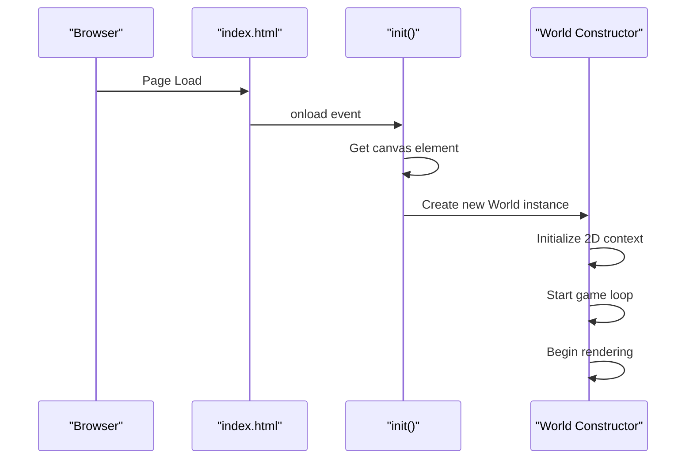
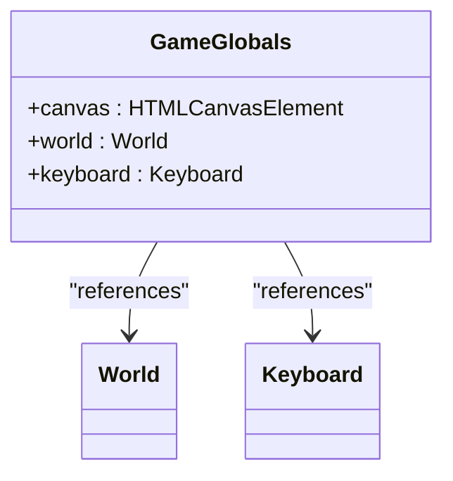
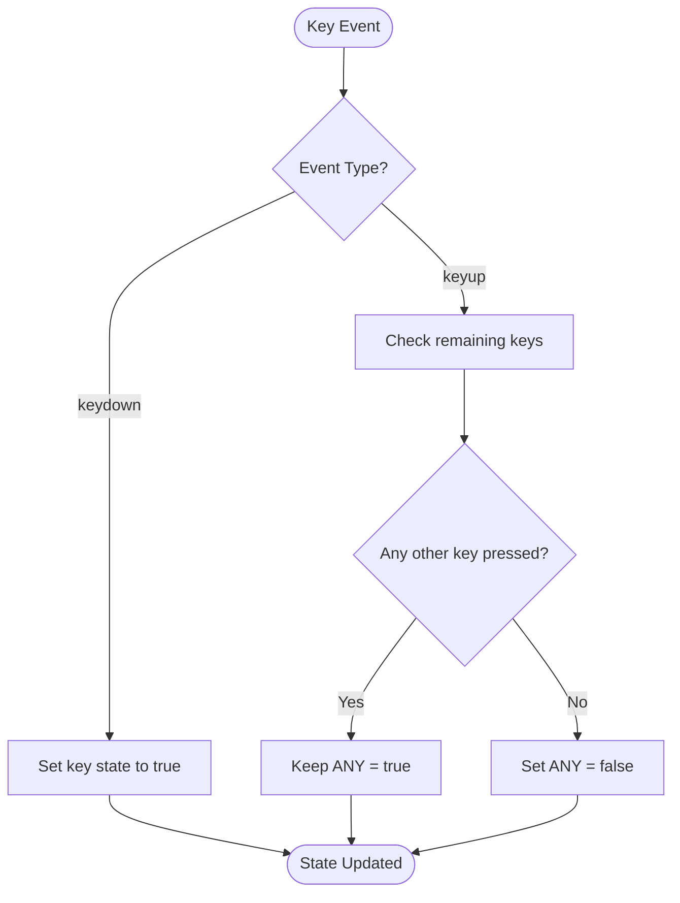

# Game Initialization Reference

<cite>
**Referenced Files in This Document**   
- [1-game.js](file://js/1-game.js)
- [2-world.class.js](file://models/2-world.class.js)
- [keyboard.class.js](file://models/keyboard.class.js)
- [character.class.js](file://models/character.class.js)
- [level1.js](file://levels/level1.js)
- [index.html](file://index.html)
</cite>

## Table of Contents
1. [Introduction](#introduction)
2. [Initialization Process](#initialization-process)
3. [Global Variables](#global-variables)
4. [Keyboard Event Handling](#keyboard-event-handling)
5. [World Constructor Execution](#world-constructor-execution)
6. [Component Relationships](#component-relationships)
7. [Customization and Extension](#customization-and-extension)
8. [Troubleshooting Guide](#troubleshooting-guide)
9. [Conclusion](#conclusion)

## Introduction
This document provides comprehensive documentation for the game initialization system in the El Polo Loco game. The initialization process establishes the foundation for game execution by setting up the rendering environment, creating core game objects, and establishing input handling mechanisms. The system is designed to be straightforward yet extensible, allowing for easy modification and enhancement of the game's startup behavior.

## Initialization Process

The game initialization process begins when the browser loads the index.html page and triggers the body's onload event. This event calls the init() function defined in 1-game.js, which serves as the entry point for the entire game application. The init() function performs two critical operations: retrieving the canvas element from the DOM and creating a new World instance that manages the game state.

The canvas element, identified by the ID 'canvas' in the HTML document, provides the drawing surface for the game's 2D graphics. When the World constructor is called with the canvas and keyboard objects, it initializes the 2D rendering context, sets up the game loop, and begins the continuous rendering process through requestAnimationFrame.



**Diagram sources**
- [index.html](file://index.html#L20)
- [1-game.js](file://js/1-game.js#L6-L12)
- [2-world.class.js](file://models/2-world.class.js#L14-L22)

**Section sources**
- [1-game.js](file://js/1-game.js#L6-L12)
- [index.html](file://index.html#L20)

## Global Variables

The initialization script declares four global variables that serve as central access points for the game's core components throughout the application lifecycle. These variables are accessible from any script in the game, providing a simple way to reference essential game objects.

The `canvas` variable stores a reference to the HTMLCanvasElement retrieved from the DOM, which is used for rendering all game graphics. The `world` variable holds the main game state manager instance that coordinates character movement, collision detection, and object rendering. The `keyboard` variable contains an instance of the Keyboard class that tracks the current state of key presses. These global references enable different parts of the game code to interact with the core systems without requiring complex dependency injection.



**Diagram sources**
- [1-game.js](file://js/1-game.js#L2-L5)
- [2-world.class.js](file://models/2-world.class.js#L2-L13)
- [keyboard.class.js](file://models/keyboard.class.js#L1-L8)

**Section sources**
- [1-game.js](file://js/1-game.js#L2-L5)

## Keyboard Event Handling

The game implements a comprehensive keyboard input system that captures keydown and keyup events from the browser window. Event listeners are attached to the window object to monitor arrow keys (LEFT, RIGHT, UP, DOWN) and the SPACE key, updating the corresponding properties in the global keyboard object. This approach creates a state-based input system where the keyboard object maintains the current state of each relevant key.

The implementation includes special handling for the ANY property, which tracks whether any game-related key is currently pressed. This is determined by checking all directional and action keys after each keyup event, ensuring accurate state representation. The system automatically prevents default browser behaviors like scrolling when arrow keys and spacebar are pressed during gameplay, maintaining focus on the game canvas.



**Diagram sources**
- [1-game.js](file://js/1-game.js#L14-L55)

**Section sources**
- [1-game.js](file://js/1-game.js#L14-L55)
- [keyboard.class.js](file://models/keyboard.class.js#L2-L8)

## World Constructor Execution

When the World constructor is invoked during initialization, it performs several critical setup operations that establish the game environment. The constructor first retrieves the 2D rendering context from the provided canvas element, which is stored in the ctx property for use in all drawing operations. It then assigns the canvas and keyboard references to instance properties, making them available throughout the World object's methods.

The constructor sets up the primary game loop by calling the draw() method, which implements the animation frame cycle using requestAnimationFrame. This creates a continuous rendering process that updates the game display approximately 60 times per second. Additional setup includes initializing the throwableObjects array for managing projectiles and setting the lastThrow timestamp for cooldown management. The world instance is also assigned to the global window object, making it accessible from debugging tools and other scripts.

**Section sources**
- [2-world.class.js](file://models/2-world.class.js#L14-L22)

## Component Relationships

The initialization process establishes critical relationships between the game's core components, creating a cohesive system where objects can interact effectively. The World instance becomes the central coordinator, maintaining references to the canvas, rendering context, and keyboard state. It also contains the main character instance and level data, which are essential for gameplay mechanics.

The Character class, instantiated within the World object, receives a reference to the keyboard object during its construction, allowing it to respond to player input. The World object also sets itself as a property on the character instance through the setWorld() method, enabling bidirectional communication. This relationship allows the character to access world state while the world can control character behavior and animation.

```mermaid
classDiagram
class World {
+canvas : HTMLCanvasElement
+ctx : CanvasRenderingContext2D
+keyboard : Keyboard
+character : Character
+level : Level
}
class Character {
+world : World
+keyboard : Keyboard
}
class Keyboard {
+LEFT : boolean
+RIGHT : boolean
+UP : boolean
+DOWN : boolean
+SPACE : boolean
+ANY : boolean
}
World --> Character : "contains"
World --> Keyboard : "uses"
World --> "level1" : "references"
Character --> World : "references"
Character --> Keyboard : "uses"
```

**Diagram sources**
- [2-world.class.js](file://models/2-world.class.js#L2-L13)
- [character.class.js](file://models/character.class.js#L1-L150)
- [keyboard.class.js](file://models/keyboard.class.js#L1-L8)
- [level1.js](file://levels/level1.js#L1-L51)

**Section sources**
- [2-world.class.js](file://models/2-world.class.js#L2-L13)
- [character.class.js](file://models/character.class.js#L1-L150)

## Customization and Extension

The initialization system can be extended to support additional features or modified to change game behavior. To add new keyboard controls, developers can extend the Keyboard class with additional boolean properties and update the event listeners to handle new key codes. For example, adding a 'C' key for crouching would require adding a CRAWL property to the Keyboard class and including a condition for 'KeyC' in both event listeners.

To modify initialization parameters, developers can pass configuration options to the World constructor or create a setup function that prepares game data before world creation. The canvas dimensions and position can be adjusted in the HTML or through JavaScript, while the initial character position and game difficulty can be configured through the level data structure. The game loop timing in the run() method can also be adjusted to change the frequency of collision and projectile checks.

**Section sources**
- [1-game.js](file://js/1-game.js#L6-L12)
- [2-world.class.js](file://models/2-world.class.js#L30-L34)

## Troubleshooting Guide

Common initialization issues typically fall into two categories: missing elements and unresponsive controls. If the game fails to start with a console error about a null canvas, verify that the HTML contains a canvas element with the ID 'canvas' and that all script files are loaded in the correct order. The 1-game.js script should be loaded after all model classes to ensure dependencies are available.

For unresponsive keyboard controls, check that the event listeners are properly attached by verifying the window.addEventListener calls in 1-game.js. Ensure that no other scripts are preventing default events for keyboard input or that browser extensions aren't interfering with key capture. If character movement is not responding, confirm that the keyboard object is correctly passed to the World and Character instances, and that the animation intervals in the Character class are properly set up to check keyboard state.

**Section sources**
- [1-game.js](file://js/1-game.js#L14-L55)
- [index.html](file://index.html#L1-L31)
- [2-world.class.js](file://models/2-world.class.js#L14-L22)

## Conclusion

The game initialization system in 1-game.js provides a robust foundation for the El Polo Loco game by establishing the rendering environment, creating core game objects, and setting up input handling. Through the init() function and World constructor, the system creates a cohesive game state that coordinates character movement, object rendering, and player interaction. The global variable declarations provide accessible entry points for game components, while the keyboard event system enables responsive player control. This initialization architecture balances simplicity with extensibility, allowing for straightforward modifications and enhancements while maintaining a clear structure for game execution.