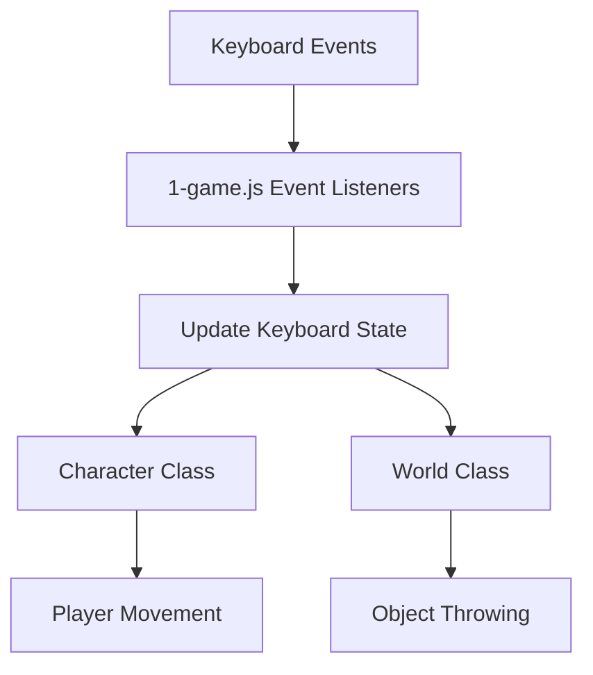
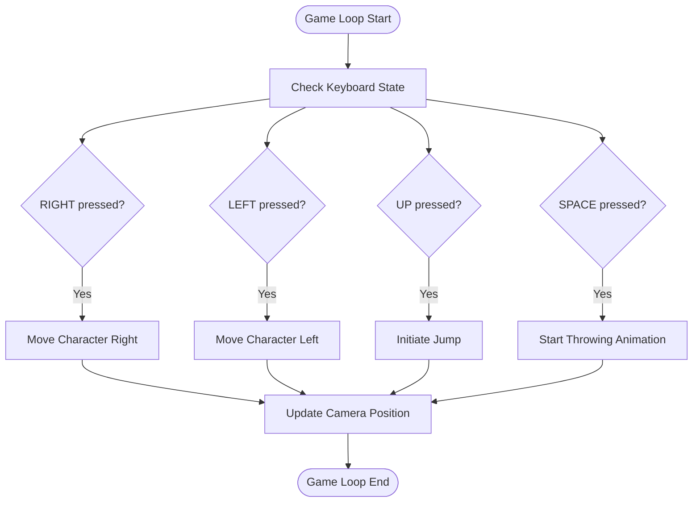

# Keyboard Class Reference

<cite>
**Referenced Files in This Document**   
- [keyboard.class.js](file://models/keyboard.class.js)
- [1-game.js](file://js/1-game.js)
- [character.class.js](file://models/character.class.js)
- [2-world.class.js](file://models/2-world.class.js)
</cite>

## Table of Contents
1. [Introduction](#introduction)
2. [Core Properties](#core-properties)
3. [Architecture and Integration](#architecture-and-integration)
4. [State Management Mechanism](#state-management-mechanism)
5. [Usage in Game Loop](#usage-in-game-loop)
6. [Best Practices for Extension](#best-practices-for-extension)
7. [Conclusion](#conclusion)

## Introduction

The Keyboard class serves as a central state container for managing user input in the game application. Unlike traditional event-driven input systems, this implementation follows an observable state pattern where game components poll the current state of input flags rather than responding to discrete events. This design choice enables deterministic input handling within the game loop and simplifies state management across multiple game systems. The class is instantiated globally and passed to the World object during initialization, establishing a shared reference that allows various game components to access the current input state.

**Section sources**
- [keyboard.class.js](file://models/keyboard.class.js#L1-L7)
- [1-game.js](file://js/1-game.js#L4-L6)

## Core Properties

The Keyboard class exposes six boolean properties that represent the current state of specific input controls:

- **LEFT**: Indicates whether the left arrow key is currently pressed
- **RIGHT**: Indicates whether the right arrow key is currently pressed  
- **UP**: Indicates whether the up arrow key is currently pressed
- **DOWN**: Indicates whether the down arrow key is currently pressed
- **SPACE**: Indicates whether the space bar is currently pressed
- **ANY**: Indicates whether any input key is currently active

These properties are initialized to `false` by default and are updated synchronously by event listeners in the main game file. The properties serve as flags that other game components can check during their update cycles to determine appropriate actions.

**Section sources**
- [keyboard.class.js](file://models/keyboard.class.js#L1-L7)

## Architecture and Integration

The input system follows a clear separation of concerns between event handling and state consumption. The Keyboard class itself contains no event listeners or DOM manipulation code. Instead, it functions purely as a data container. The actual event binding occurs in `1-game.js`, where global `keydown` and `keyup` event listeners update the Keyboard instance properties based on the detected key codes.

This architectural pattern creates a clean dependency flow: the DOM events update the shared Keyboard state, and game logic components (such as Character and World) consume this state during their update cycles. This approach decouples input detection from input processing, allowing for more predictable behavior and easier testing of game mechanics.

**Diagram sources**
- [1-game.js](file://js/1-game.js#L15-L52)
- [character.class.js](file://models/character.class.js#L117-L123)
- [2-world.class.js](file://models/2-world.class.js#L53-L55)

**Section sources**
- [1-game.js](file://js/1-game.js#L15-L52)
- [2-world.class.js](file://models/2-world.class.js#L53-L55)

## State Management Mechanism

The Keyboard class implements a sophisticated state management system that goes beyond simple key state tracking. The `ANY` property serves as a meta-flag that indicates general input activity, which is particularly useful for interrupting idle animations or managing player presence detection.

The state updates follow a precise logic pattern:
- On `keydown` events, the corresponding directional or action property is set to `true`, and the `ANY` flag is always set to `true`
- On `keyup` events, the specific key property is set to `false`, but the `ANY` flag remains `true` if any other key is still pressed
- The `ANY` flag is only set to `false` when all other keys have been released

This ensures that transient key combinations are handled correctly and prevents premature reset of activity indicators when players are actively pressing multiple keys in sequence.

**Section sources**
- [1-game.js](file://js/1-game.js#L25-L26)
- [1-game.js](file://js/1-game.js#L44-L52)

## Usage in Game Loop

Game components poll the Keyboard state within their animation and update loops to determine appropriate actions. The Character class, for example, checks these boolean flags at regular intervals (approximately 60 times per second) to control movement, jumping, and animation states.

The polling mechanism is implemented through `setInterval` callbacks that evaluate the current Keyboard state and trigger corresponding behaviors:
- Movement commands are executed when directional keys are pressed
- Jumping is initiated when the UP key is pressed and the character is on the ground
- Throwing animations are triggered when the SPACE key is pressed
- Animation states are updated based on the combination of pressed keys

This polling approach ensures that input is processed at a consistent rate aligned with the game's frame rate, providing smooth and responsive gameplay.

**Diagram sources**
- [character.class.js](file://models/character.class.js#L117-L126)
- [character.class.js](file://models/character.class.js#L135-L140)

**Section sources**
- [character.class.js](file://models/character.class.js#L117-L145)

## Best Practices for Extension

When extending the Keyboard class with additional controls or alternative input methods, several best practices should be followed to maintain compatibility with existing game logic:

1. **Maintain Backward Compatibility**: Any new properties should follow the same boolean flag pattern and should not modify the behavior of existing properties.

2. **Preserve the ANY Flag Logic**: When adding new input types (such as gamepad support), ensure that the `ANY` property accurately reflects overall input activity by updating it appropriately in both press and release handlers.

3. **Centralize Event Binding**: Follow the existing pattern of keeping event listeners in `1-game.js` rather than distributing them across multiple files. This maintains a single point of truth for input mapping.

4. **Use Consistent Naming**: New properties should use uppercase names that clearly describe their function (e.g., `SHIFT`, `ENTER`, `GAMEPAD_A`).

5. **Consider Input Mapping Abstraction**: For complex extensions, consider implementing an input mapping layer that translates various input sources (keyboard, gamepad, touch) into the existing Keyboard state properties, rather than adding numerous new properties.

6. **Maintain Atomic Updates**: Ensure that state updates are atomic and thread-safe, particularly when dealing with multiple input sources that might update the same properties.

These practices ensure that new input methods integrate seamlessly with the existing game logic without requiring modifications to character behavior, animation systems, or other components that depend on the Keyboard state.

**Section sources**
- [keyboard.class.js](file://models/keyboard.class.js#L1-L7)
- [1-game.js](file://js/1-game.js#L15-L52)

## Conclusion

The Keyboard class exemplifies a clean, state-based approach to input management in game development. By separating event handling from state consumption, it creates a robust and predictable input system that supports smooth gameplay and easy extension. The observable state pattern allows multiple game components to access input data without complex event propagation, while the `ANY` property provides valuable meta-information about player activity. This architecture demonstrates effective application of separation of concerns and provides a solid foundation for future enhancements, including support for additional input devices and more sophisticated input processing.