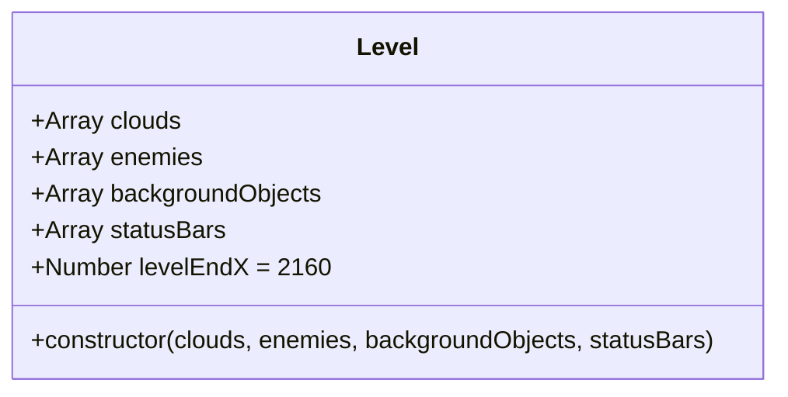
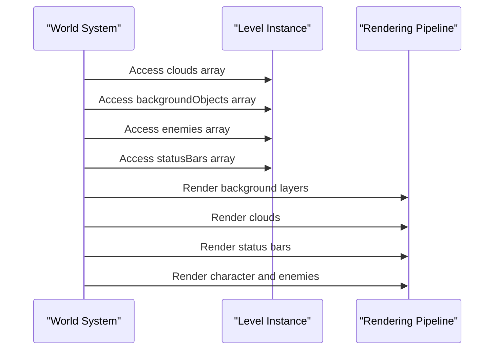
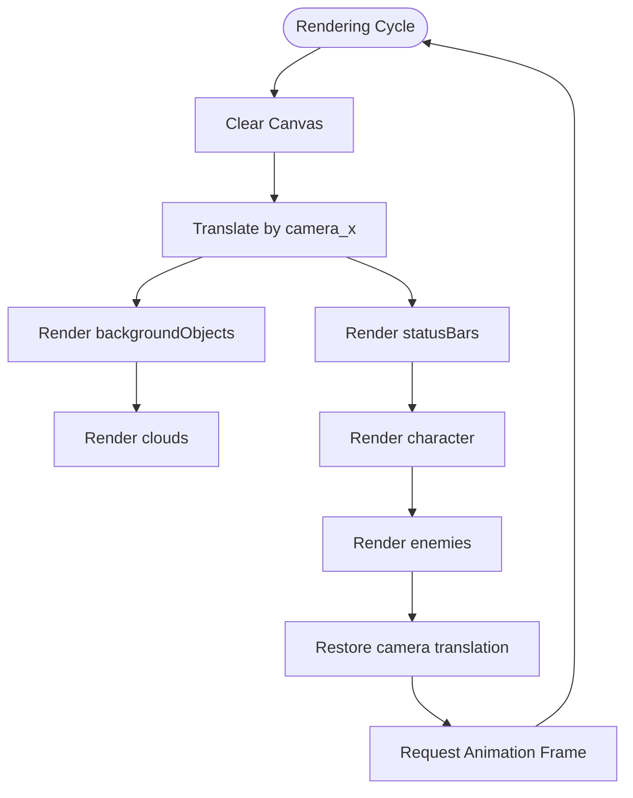

# Level Class Reference

<cite>
**Referenced Files in This Document**   
- [level.class.js](file://models/level.class.js)
- [level1.js](file://levels/level1.js)
- [2-world.class.js](file://models/2-world.class.js)
- [clouds.class.js](file://models/clouds.class.js)
- [chicken.class.js](file://models/chicken.class.js)
- [endboss.class.js](file://models/endboss.class.js)
- [background-object.class.js](file://models/background-object.class.js)
- [status-bar.class.js](file://models/status-bar.class.js)
</cite>

## Table of Contents
1. [Introduction](#introduction)
2. [Core Properties](#core-properties)
3. [Constructor Parameters](#constructor-parameters)
4. [Level Composition Example](#level-composition-example)
5. [Integration with World System](#integration-with-world-system)
6. [Camera and Rendering Pipeline](#camera-and-rendering-pipeline)
7. [Creating Custom Levels](#creating-custom-levels)
8. [Conclusion](#conclusion)

## Introduction

The Level class serves as a fundamental data container that encapsulates all game world elements for a specific stage in the game. Rather than implementing active behaviors or game logic, this class functions as a structured repository for organizing and managing game objects within a level. It plays a critical role in the game's architecture by providing the World system with a complete representation of the game environment, including background elements, enemies, visual effects, and user interface components.

**Section sources**
- [level.class.js](file://models/level.class.js#L1-L13)

## Core Properties

The Level class exposes several key properties that define the composition of a game level:

- **clouds**: An array containing Cloud objects that provide atmospheric elements in the background
- **enemies**: An array of enemy instances including Chicken and Endboss characters that the player must navigate
- **backgroundObjects**: An array of BackgroundObject instances that create the layered parallax background effect
- **statusBars**: An array of StatusBar objects that display player health, coin count, bottle inventory, and endboss health
- **levelEndX**: A fixed property set to 2160 that defines the horizontal boundary of the level, constraining player movement

These properties are initialized through the constructor and remain accessible throughout the game session to support rendering and collision detection systems.



**Diagram sources**
- [level.class.js](file://models/level.class.js#L1-L13)

**Section sources**
- [level.class.js](file://models/level.class.js#L1-L13)

## Constructor Parameters

The Level class constructor accepts four parameters that allow for flexible composition of game levels:

- **clouds**: Array of Cloud objects that populate the sky layer of the game world
- **enemies**: Array of enemy instances (Chicken, Endboss) that present challenges to the player
- **backgroundObjects**: Array of BackgroundObject instances that create the multi-layered scrolling background
- **statusBars**: Array of StatusBar objects that provide visual feedback on player status

These parameters enable the creation of diverse level configurations by accepting different combinations of game objects. The constructor simply assigns these arrays to the corresponding instance properties, establishing a clean separation between data composition and game logic.

**Section sources**
- [level.class.js](file://models/level.class.js#L7-L13)

## Level Composition Example

The level1.js configuration demonstrates a complete level instantiation using the Level class:

```javascript
const level1 = new Level(
    [new Cloud()],
    [new Chicken(), new Endboss()],
    [
        new BackgroundObject('../assets/img/5_background/layers/air.png', -1440),
        new BackgroundObject('../assets/img/5_background/layers/3_third_layer/1.png', -1440),
        // ... additional background layers
        new BackgroundObject('../assets/img/5_background/layers/1_first_layer/2.png', 2160)
    ],
    [
        new StatusBar('imagesHealthBar', 0),
        new StatusBar('imagesHealthBar', 1),
        // ... additional status bars
        new StatusBar('imagesHealthBarEndboss', 2)
    ]
);
```

This example shows how multiple instances of game objects are organized into arrays and passed to the Level constructor. The background objects are strategically positioned at different x-coordinates to create a seamless scrolling effect, while the status bars are configured with specific types and positions to display various game metrics.

**Section sources**
- [level1.js](file://levels/level1.js#L1-L51)

## Integration with World System

The Level class integrates directly with the World system, which manages game rendering, collision detection, and player interactions. The World class references the current level through its `level` property and accesses the level's object arrays during the rendering and collision detection processes.

During collision detection, the World iterates through the `level.enemies` array to check for collisions with the player character. The `levelEndX` property of 2160 serves as a boundary constraint, preventing the player from progressing beyond the designated end of the level. This integration allows the World system to maintain a consistent interface for accessing game objects regardless of the specific level configuration.



**Diagram sources**
- [2-world.class.js](file://models/2-world.class.js#L50-L85)
- [level.class.js](file://models/level.class.js#L1-L13)

**Section sources**
- [2-world.class.js](file://models/2-world.class.js#L50-L85)
- [level.class.js](file://models/level.class.js#L5-L6)

## Camera and Rendering Pipeline

The Level class works in conjunction with the camera system to create a dynamic scrolling effect. The World class uses the `camera_x` property to translate the rendering context, creating the illusion of movement as the player progresses through the level. The background objects are positioned at specific x-coordinates (e.g., -1440, -720, 0, 720, 1440, 2160) to ensure seamless tiling as the camera moves.

The rendering pipeline follows a specific order to maintain proper visual layering:
1. Background objects are rendered first to establish the base layer
2. Clouds are rendered on top of the background
3. Status bars are rendered in a fixed position relative to the screen
4. The player character and enemies are rendered last to appear in front of the environment

This layered approach ensures that game elements appear in the correct visual hierarchy, with background elements behind the player and UI elements in front.



**Diagram sources**
- [2-world.class.js](file://models/2-world.class.js#L60-L85)

**Section sources**
- [2-world.class.js](file://models/2-world.class.js#L60-L85)

## Creating Custom Levels

Creating new levels involves instantiating the Level class with custom arrays of game objects. Developers can compose levels by:

1. Creating arrays of Cloud objects for atmospheric effects
2. Populating the enemies array with Chicken and Endboss instances at strategic positions
3. Constructing the backgroundObjects array with BackgroundObject instances positioned to create a seamless scrolling effect
4. Configuring the statusBars array with StatusBar instances for different metrics

The levelEndX property of 2160 provides a consistent boundary for all levels, ensuring predictable player movement constraints. When creating custom levels, developers should ensure that background objects span the complete range from negative x-coordinates to 2160 to maintain visual continuity throughout the level.

**Section sources**
- [level.class.js](file://models/level.class.js#L1-L13)
- [level1.js](file://levels/level1.js#L1-L51)

## Conclusion

The Level class serves as a crucial organizational component in the game architecture, providing a structured way to compose and manage game world elements. By functioning as a data container rather than an active controller, it enables clean separation of concerns between level composition and game logic. Its integration with the World system allows for consistent rendering and collision detection across different levels, while the fixed levelEndX boundary ensures predictable gameplay mechanics. This design pattern facilitates easy creation of new levels by simply instantiating the Level class with different combinations of game objects, promoting reusability and maintainability in the game codebase.

[No sources needed since this section summarizes without analyzing specific files]