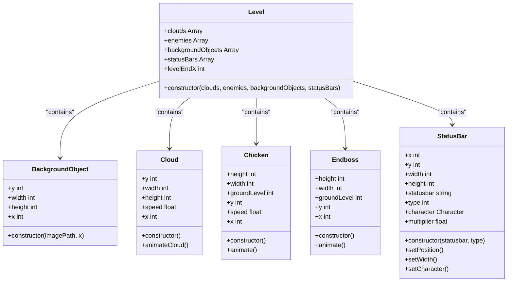
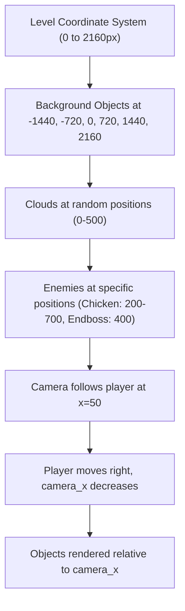
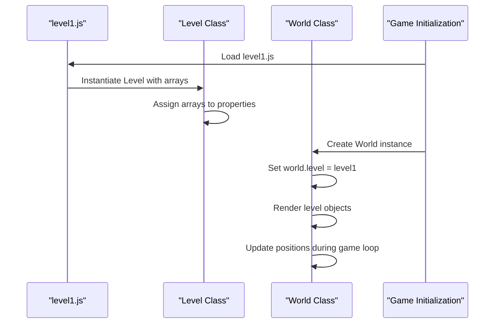
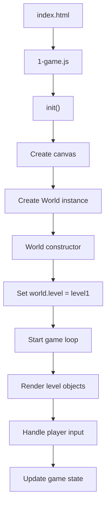

# Level Configuration Reference

<cite>
**Referenced Files in This Document**   
- [level1.js](file://levels/level1.js)
- [level.class.js](file://models/level.class.js)
- [background-object.class.js](file://models/background-object.class.js)
- [clouds.class.js](file://models/clouds.class.js)
- [chicken.class.js](file://models/chicken.class.js)
- [endboss.class.js](file://models/endboss.class.js)
- [status-bar.class.js](file://models/status-bar.class.js)
- [2-world.class.js](file://models/2-world.class.js)
- [1-game.js](file://js/1-game.js)
</cite>

## Table of Contents
1. [Introduction](#introduction)
2. [Level Structure Overview](#level-structure-overview)
3. [Component Arrays](#component-arrays)
4. [Coordinate System and Positioning](#coordinate-system-and-positioning)
5. [Modifying and Extending Level Configuration](#modifying-and-extending-level-configuration)
6. [Creating Additional Level Files](#creating-additional-level-files)
7. [Level-World Integration](#level-world-integration)
8. [Conclusion](#conclusion)

## Introduction
The `level1.js` file defines the configuration for the first game level in the El Pollo Loco game. This document provides comprehensive documentation for the level configuration structure, explaining how game objects are organized and positioned within the game world. The level configuration instantiates the `Level` class with arrays of game entities including clouds, enemies, background objects, and status bars, creating a complete game environment that spans 2160 pixels in width.

**Section sources**
- [level1.js](file://levels/level1.js#L1-L51)

## Level Structure Overview
The level configuration follows a structured pattern where the `level1` constant instantiates the `Level` class with four primary arrays: clouds, enemies, backgroundObjects, and statusBars. Each array contains instances of their respective game object classes, properly configured for the game environment. The `Level` class constructor accepts these four parameters and assigns them to corresponding properties, establishing the complete game world structure.

**Diagram sources**
- [level.class.js](file://models/level.class.js#L1-L14)
- [background-object.class.js](file://models/background-object.class.js#L1-L10)
- [clouds.class.js](file://models/clouds.class.js#L1-L17)
- [chicken.class.js](file://models/chicken.class.js#L1-L34)
- [endboss.class.js](file://models/endboss.class.js#L1-L41)
- [status-bar.class.js](file://models/status-bar.class.js#L1-L133)

**Section sources**
- [level1.js](file://levels/level1.js#L1-L51)
- [level.class.js](file://models/level.class.js#L1-L14)

## Component Arrays

### Background Objects
The backgroundObjects array contains instances of the `BackgroundObject` class that create the parallax scrolling background. Each background object is positioned at specific x-coordinates (-1440, -720, 0, 720, 1440, 2160) to create a seamless, repeating landscape that spans the entire 2160px level. The objects are layered with different image paths representing air, third layer, second layer, and first layer elements, creating depth in the background.

**Section sources**
- [level1.js](file://levels/level1.js#L13-L36)
- [background-object.class.js](file://models/background-object.class.js#L1-L10)

### Clouds
The clouds array contains instances of the `Cloud` class that provide parallax scrolling elements in the sky. Each cloud instance is automatically positioned at a random x-coordinate between 0 and 500 pixels upon creation. The clouds move from right to left at a speed of 0.15 pixels per frame, creating a dynamic sky effect. The cloud images are 1440px wide to ensure seamless coverage across the game viewport.

**Section sources**
- [level1.js](file://levels/level1.js#L2-L3)
- [clouds.class.js](file://models/clouds.class.js#L1-L17)

### Enemies
The enemies array contains instances of enemy classes including `Chicken` and `Endboss`. Chicken instances are positioned at random x-coordinates between 200 and 700 pixels with random speeds between 0.25 and 0.75 pixels per frame. The Endboss is positioned at x=400 and represents the final challenge in the level. Each enemy moves from right to left, creating obstacles for the player character.

**Section sources**
- [level1.js](file://levels/level1.js#L5-L9)
- [chicken.class.js](file://models/chicken.class.js#L1-L34)
- [endboss.class.js](file://models/endboss.class.js#L1-L41)

### Status Bars
The statusBars array contains multiple `StatusBar` instances that display game UI elements including health, bottles, coins, and endboss health. Each status bar type has three components: the empty bar, the filled bar, and the icon. The status bars are positioned in the top-left corner of the screen with specific coordinates and dimensions. The health bar width dynamically updates based on the player character's energy level.

**Section sources**
- [level1.js](file://levels/level1.js#L38-L49)
- [status-bar.class.js](file://models/status-bar.class.js#L1-L133)

## Coordinate System and Positioning
The game uses a coordinate system where the x-axis represents horizontal position from left to right, and the y-axis represents vertical position from top to bottom. The level spans 2160 pixels in width, defined by the `levelEndX` property in the `Level` class. Objects are positioned along this axis with specific x-coordinates that determine their placement in the game world.

Background objects are positioned at regular intervals of 720 pixels (-1440, -720, 0, 720, 1440, 2160) to create a seamless, repeating landscape. This spacing matches the width of each background image (720px), ensuring continuous coverage as the player moves through the level. The camera system, controlled by the `camera_x` property in the `World` class, translates the game view based on the player character's position, creating the illusion of movement through the level.

**Diagram sources**
- [level1.js](file://levels/level1.js#L13-L36)
- [level.class.js](file://models/level.class.js#L6-L7)
- [2-world.class.js](file://models/2-world.class.js#L15-L16)

**Section sources**
- [level1.js](file://levels/level1.js#L1-L51)
- [level.class.js](file://models/level.class.js#L6-L7)
- [2-world.class.js](file://models/2-world.class.js#L15-L16)

## Modifying and Extending Level Configuration
To modify existing object positions, edit the x-coordinate parameters in the respective class constructors. For background objects, change the second parameter in the `BackgroundObject` constructor. For example, to move a background element further to the right, increase its x-coordinate value.

To add new entities to the level, instantiate new objects of the appropriate class and add them to the corresponding array. For example, to add another chicken enemy, uncomment the commented `new Chicken()` lines or add a new instance to the enemies array. When adding new background objects, ensure they are positioned at appropriate intervals to maintain the seamless scrolling effect.

**Diagram sources**
- [level1.js](file://levels/level1.js#L1-L51)
- [level.class.js](file://models/level.class.js#L1-L14)
- [2-world.class.js](file://models/2-world.class.js#L4-L6)

**Section sources**
- [level1.js](file://levels/level1.js#L1-L51)

## Creating Additional Level Files
To create additional level files following the same pattern, create a new JavaScript file in the levels directory (e.g., level2.js). The file should define a constant that instantiates the `Level` class with the same four arrays: clouds, enemies, backgroundObjects, and statusBars. While the statusBars array can remain identical across levels, the other arrays should be customized to create unique level experiences.

Each new level file should follow the same structure as level1.js, ensuring compatibility with the `World` class which expects the level configuration to have the same interface. The level files can be interchanged by modifying the `level` property in the `World` class to reference the new level constant.

**Section sources**
- [level1.js](file://levels/level1.js#L1-L51)
- [level.class.js](file://models/level.class.js#L1-L14)
- [2-world.class.js](file://models/2-world.class.js#L4-L6)

## Level-World Integration
The `World` class accesses the level data during game initialization through its `level` property, which is set to `level1` by default. During the game loop, the `draw()` method renders all level objects by calling `addObjectsToMap()` with each of the level's component arrays. The camera system translates the rendering context based on the player character's position, creating the scrolling effect as the player moves through the 2160px level.

The game initialization process begins in `1-game.js` where the `init()` function creates the canvas and `World` instance, passing the keyboard input handler. The `World` constructor then sets up the game loop, collision detection, and rendering system, fully integrating the level configuration into the active game world.

**Diagram sources**
- [1-game.js](file://js/1-game.js#L7-L10)
- [2-world.class.js](file://models/2-world.class.js#L4-L6)
- [level1.js](file://levels/level1.js#L1-L51)

**Section sources**
- [1-game.js](file://js/1-game.js#L7-L10)
- [2-world.class.js](file://models/2-world.class.js#L4-L6)

## Conclusion
The level1.js configuration file provides a comprehensive blueprint for the first game level, organizing game entities into logical arrays that are processed by the game engine. The structured approach to level design allows for easy modification and extension, enabling the creation of diverse game experiences while maintaining a consistent interface. Understanding the coordinate system and positioning logic is essential for creating balanced and visually appealing levels that provide an engaging gameplay experience.