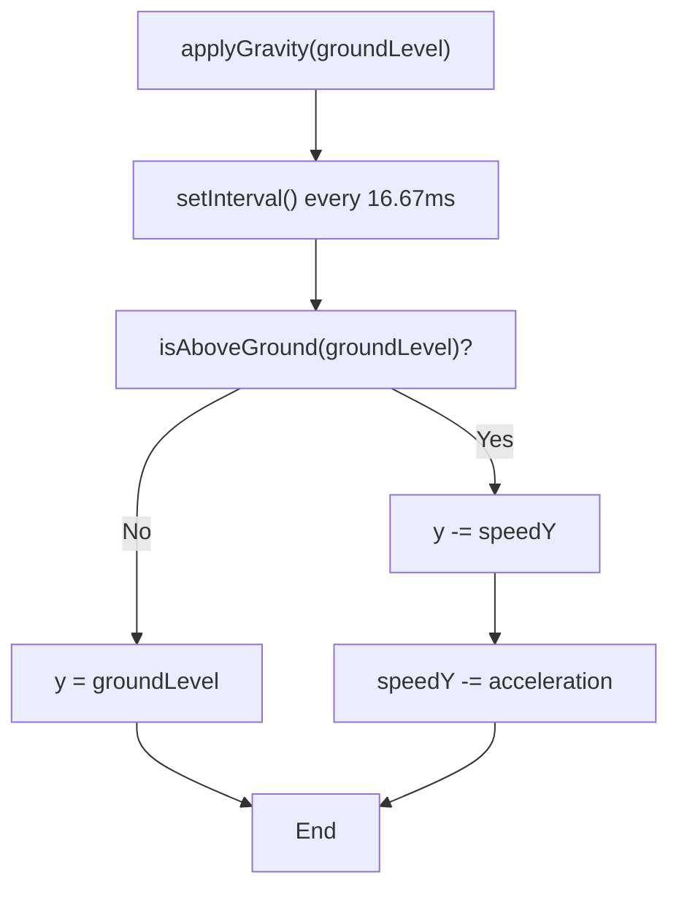
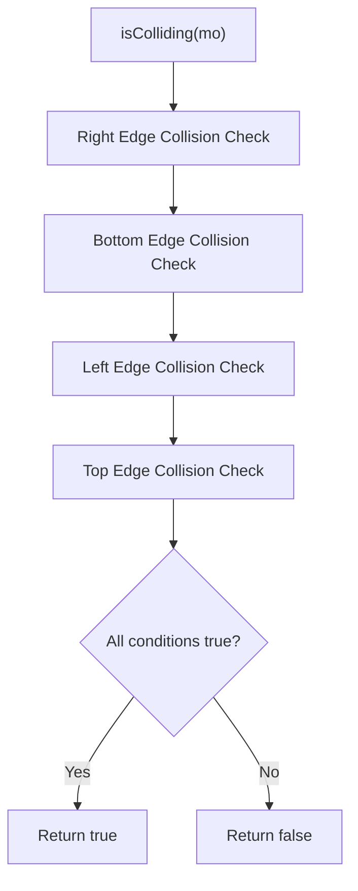
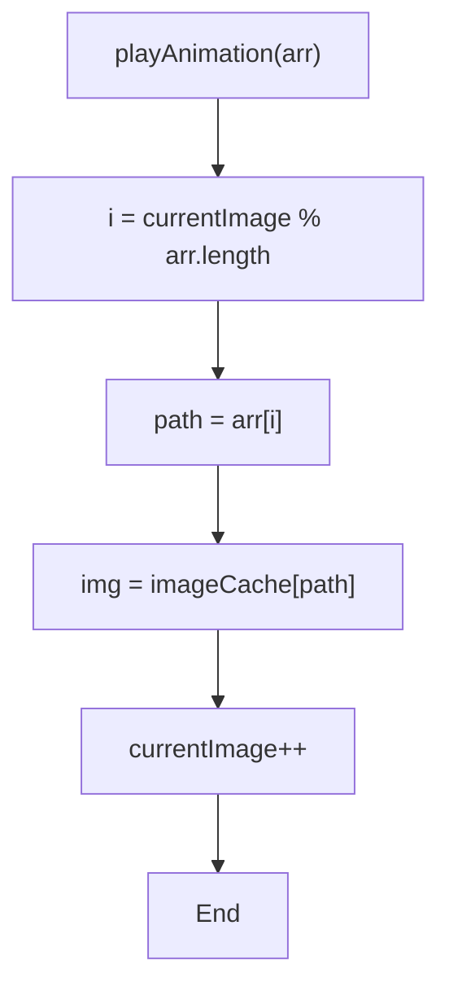
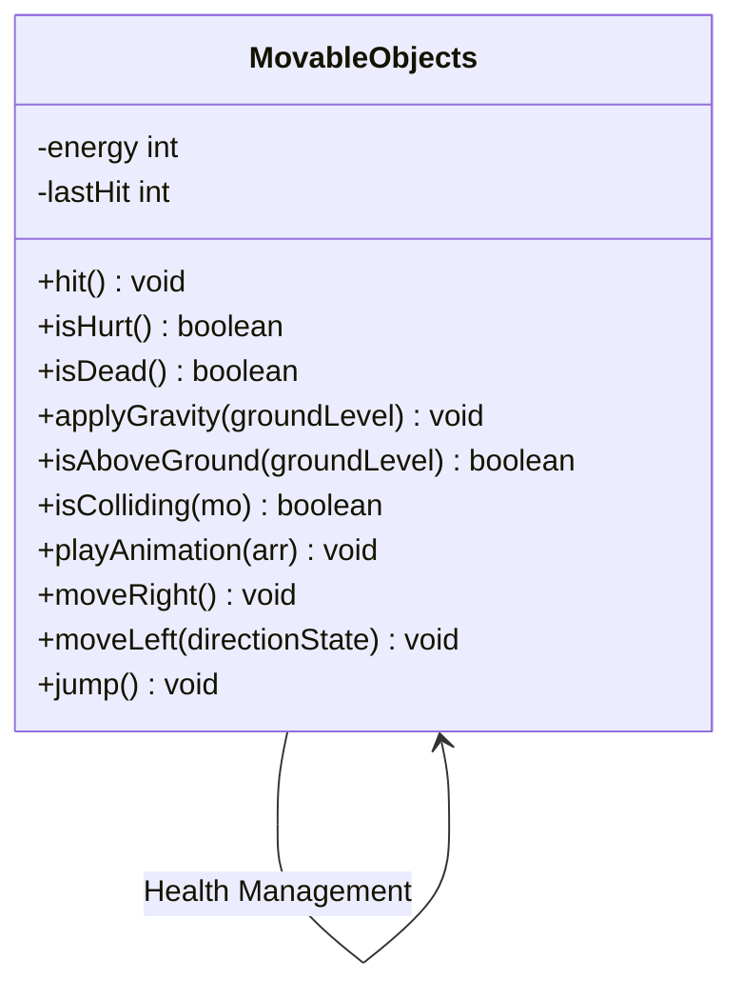
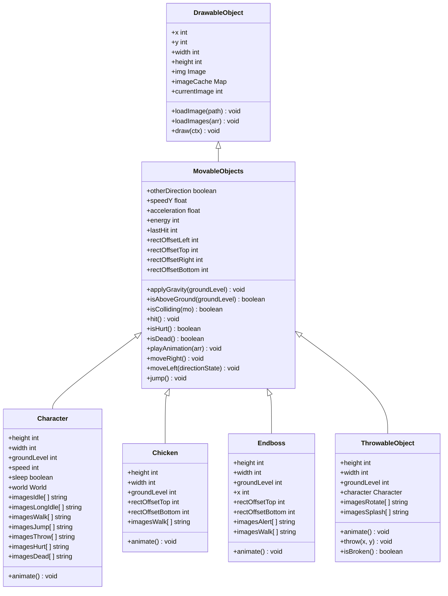

# MovableObjects Class Reference

<cite>
**Referenced Files in This Document**   
- [movable-objects.class.js](file://models/movable-objects.class.js)
- [drawable-object.class.js](file://models/drawable-object.class.js)
- [character.class.js](file://models/character.class.js)
- [chicken.class.js](file://models/chicken.class.js)
- [endboss.class.js](file://models/endboss.class.js)
- [thowable-object.class.js](file://models/thowable-object.class.js)
</cite>

## Table of Contents
1. [Introduction](#introduction)
2. [Core Properties](#core-properties)
3. [Physics and Gravity System](#physics-and-gravity-system)
4. [Collision Detection](#collision-detection)
5. [Animation System](#animation-system)
6. [Movement and Interaction Methods](#movement-and-interaction-methods)
7. [Health and Status Management](#health-and-status-management)
8. [Inheritance Hierarchy](#inheritance-hierarchy)
9. [Implementation Examples](#implementation-examples)

## Introduction

The MovableObjects class serves as the foundational base class for all dynamic entities in the game environment, extending the DrawableObject class to provide physics, animation, and collision capabilities. This class implements core functionality for movement, gravity, collision detection, and state management that is inherited by all moving game entities including Character, Chicken, Endboss, and ThrowableObject. The class is designed to handle the complete lifecycle of moving objects from initialization through animation, physics simulation, and interaction with other game elements.

**Section sources**
- [movable-objects.class.js](file://models/movable-objects.class.js#L0-L75)
- [drawable-object.class.js](file://models/drawable-object.class.js#L0-L43)

## Core Properties

The MovableObjects class defines several key properties that control the behavior and state of moving entities:

- **speedY**: Vertical speed component used in gravity calculations, initialized to 0
- **acceleration**: Gravity acceleration factor set to 0.3, determining the rate of vertical speed change
- **energy**: Health/energy level initialized to 100, used for hit detection and death state
- **lastHit**: Timestamp of the last hit event, used for invulnerability period calculation
- **rectOffsetLeft**: Left collision boundary offset for fine-tuning hitbox positioning
- **rectOffsetTop**: Top collision boundary offset for fine-tuning hitbox positioning
- **rectOffsetRight**: Right collision boundary offset for fine-tuning hitbox positioning
- **rectOffsetBottom**: Bottom collision boundary offset for fine-tuning hitbox positioning
- **otherDirection**: Boolean flag indicating the facing direction of the object

These properties enable precise control over object behavior, with the rectOffset values allowing developers to create collision boundaries that differ from the visual boundaries of the sprite.

**Section sources**
- [movable-objects.class.js](file://models/movable-objects.class.js#L3-L13)

## Physics and Gravity System

The MovableObjects class implements a gravity system using JavaScript's setInterval function to create continuous physics updates at 60 frames per second (1000/60 ms interval). The gravity implementation follows a velocity-based approach where the object's vertical position is updated based on its current speedY value, which itself is modified by the acceleration constant.

**Diagram sources**
- [movable-objects.class.js](file://models/movable-objects.class.js#L14-L23)

The isAboveGround method determines whether an object is in the air by checking if its current position minus the next speedY increment would still be above the ground level. This predictive approach prevents objects from penetrating the ground surface. When an object reaches the ground level, its vertical position is fixed and speedY is reset, effectively stopping the fall.

**Section sources**
- [movable-objects.class.js](file://models/movable-objects.class.js#L14-L27)

## Collision Detection

The MovableObjects class implements a comprehensive collision detection system using offset-aware bounding boxes. The isColliding method performs intersection testing between two movable objects by comparing their positions and dimensions, taking into account the rectOffset properties that allow for fine-tuned collision boundaries.

The collision algorithm uses the following conditions to determine intersection:
- The right edge of this object (x + width - rectOffsetRight) is to the right of the left edge of the other object (mo.x + mo.rectOffsetLeft)
- The bottom edge of this object (y + height - rectOffsetBottom) is below the top edge of the other object (mo.y + mo.rectOffsetTop)
- The left edge of this object (x + rectOffsetLeft) is to the left of the right edge of the other object (mo.x + mo.width - mo.rectOffsetRight)
- The top edge of this object (y + rectOffsetTop) is above the bottom edge of the other object (mo.y + mo.height - mo.rectOffsetBottom)

This implementation allows for precise collision detection that can be adjusted independently of the visual sprite dimensions through the rectOffset properties.

**Diagram sources**
- [movable-objects.class.js](file://models/movable-objects.class.js#L29-L34)

**Section sources**
- [movable-objects.class.js](file://models/movable-objects.class.js#L29-L34)

## Animation System

The MovableObjects class provides a flexible animation system through the playAnimation method, which cycles through arrays of image paths to create sprite animations. The system uses a modulo operation to loop through animation frames, incrementing a currentImage counter that determines which frame to display.

**Diagram sources**
- [movable-objects.class.js](file://models/movable-objects.class.js#L55-L60)

The animation system relies on the imageCache property inherited from DrawableObject, which stores preloaded images for efficient access during animation. When playAnimation is called with an array of image paths, it calculates the current frame index using modulo arithmetic to ensure the animation loops seamlessly, retrieves the corresponding image from the cache, and updates the object's img property to display the new frame.

**Section sources**
- [movable-objects.class.js](file://models/movable-objects.class.js#L55-L60)
- [drawable-object.class.js](file://models/drawable-object.class.js#L15-L21)

## Movement and Interaction Methods

The MovableObjects class provides several methods for controlling object movement and interactions:

- **moveRight()**: Increases the x position by the object's speed value and sets otherDirection to false
- **moveLeft(directionState)**: Decreases the x position by the object's speed value and sets otherDirection to the provided directionState parameter
- **jump()**: Sets the speedY value to 8, initiating an upward movement that will be modified by gravity in subsequent frames

These movement methods are designed to be called repeatedly in game loops to create continuous motion. The directionState parameter in moveLeft allows for preserving the object's facing direction state, which is particularly useful for animation systems that need to know which way the character is facing.

**Section sources**
- [movable-objects.class.js](file://models/movable-objects.class.js#L62-L75)

## Health and Status Management

The MovableObjects class implements a comprehensive health and status management system with methods for handling damage, injury states, and death conditions:

**Diagram sources**
- [movable-objects.class.js](file://models/movable-objects.class.js#L0-L75)

The hit() method reduces the object's energy by 10 points, ensuring it never goes below zero, and records the current timestamp in lastHit if the object still has energy. The isHurt() method checks whether the object is currently in a hurt state by calculating the time elapsed since the last hit and returning true if less than 1 second has passed. The isDead() method simply checks if the energy property has reached zero.

**Section sources**
- [movable-objects.class.js](file://models/movable-objects.class.js#L36-L53)

## Inheritance Hierarchy

The MovableObjects class forms the foundation of the game's object hierarchy, serving as the parent class for all moving entities in the game world:

**Diagram sources**
- [movable-objects.class.js](file://models/movable-objects.class.js#L0-L75)
- [character.class.js](file://models/character.class.js#L0-L150)
- [chicken.class.js](file://models/chicken.class.js#L0-L34)
- [endboss.class.js](file://models/endboss.class.js#L0-L40)
- [thowable-object.class.js](file://models/thowable-object.class.js#L0-L82)

The inheritance hierarchy demonstrates how the MovableObjects class provides the core functionality that is extended by specific game entities. Each child class adds specialized properties and methods while inheriting the fundamental physics, animation, and collision capabilities.

**Section sources**
- [movable-objects.class.js](file://models/movable-objects.class.js#L0-L75)
- [character.class.js](file://models/character.class.js#L0-L150)
- [chicken.class.js](file://models/chicken.class.js#L0-L34)
- [endboss.class.js](file://models/endboss.class.js#L0-L40)
- [thowable-object.class.js](file://models/thowable-object.class.js#L0-L82)

## Implementation Examples

The MovableObjects class is used as the base for several game entities, each demonstrating different aspects of its functionality:

### Character Implementation
The Character class extends MovableObjects and implements a comprehensive animation system that selects different animation sequences based on player input and game state. It uses multiple image arrays for idle, walking, jumping, throwing, hurt, and dead states, with the playAnimation method called in a timed interval to cycle through frames.

### Chicken Implementation
The Chicken class demonstrates simple enemy movement with automatic leftward motion and a walking animation. It uses the moveLeft method with a fixed direction state and calls playAnimation with its imagesWalk array to create the walking motion.

### ThrowableObject Implementation
The ThrowableObject class shows how MovableObjects can be used for projectiles, implementing a throw method that sets initial velocity and applies gravity. It uses different animation sequences (imagesRotate and imagesSplash) depending on whether the object is in the air or has hit the ground.

These implementations showcase the flexibility of the MovableObjects class in supporting various types of moving entities with different behaviors while maintaining a consistent interface for physics, animation, and collision.

**Section sources**
- [character.class.js](file://models/character.class.js#L0-L150)
- [chicken.class.js](file://models/chicken.class.js#L0-L34)
- [thowable-object.class.js](file://models/thowable-object.class.js#L0-L82)