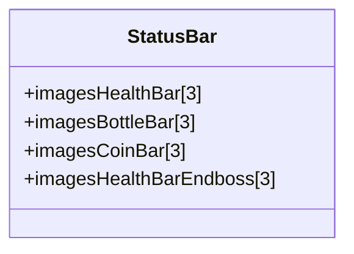
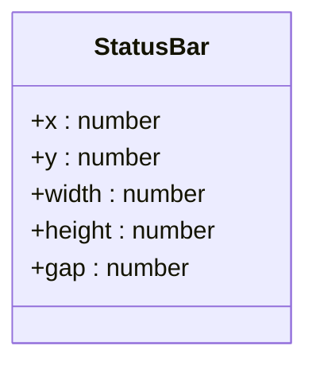
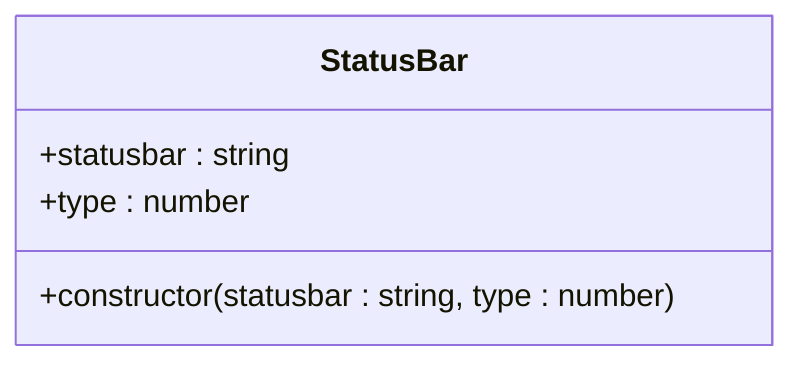
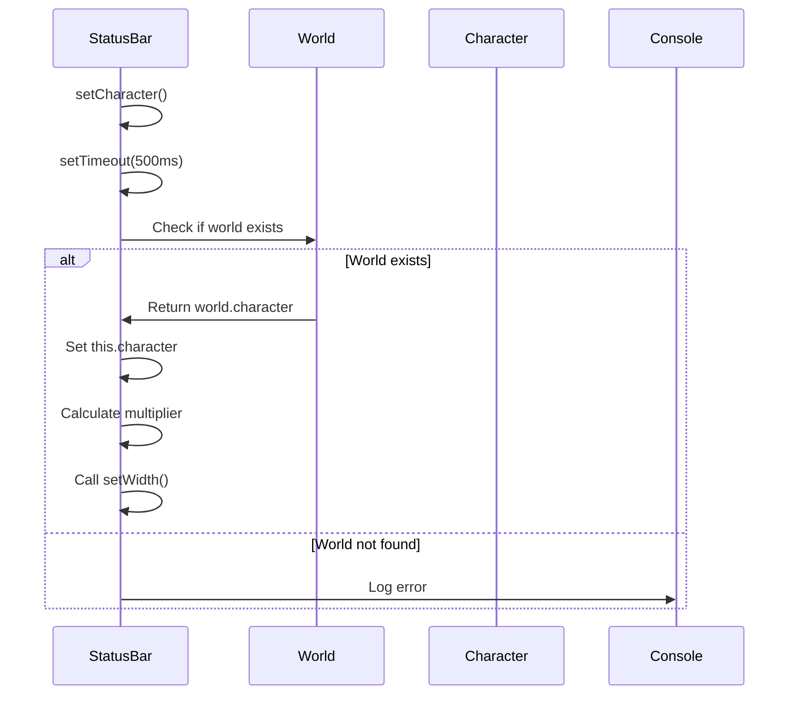
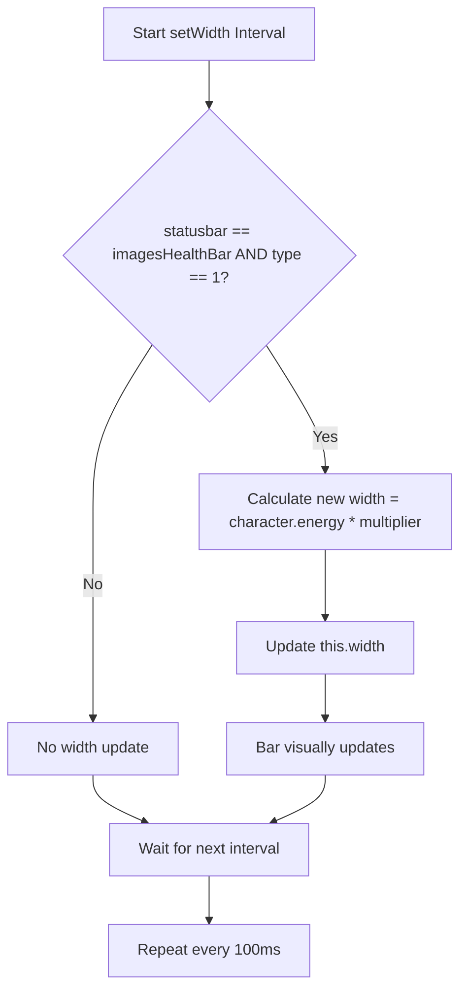
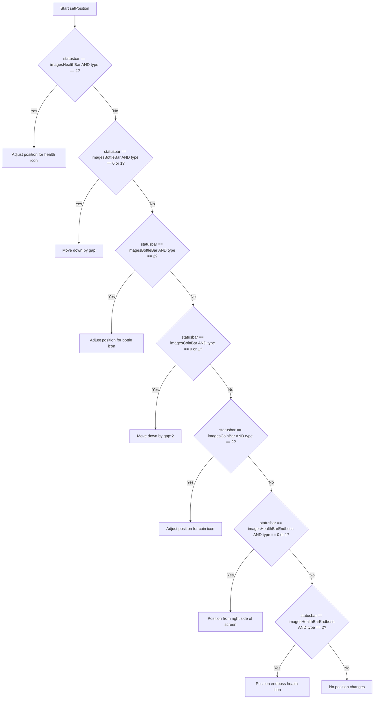
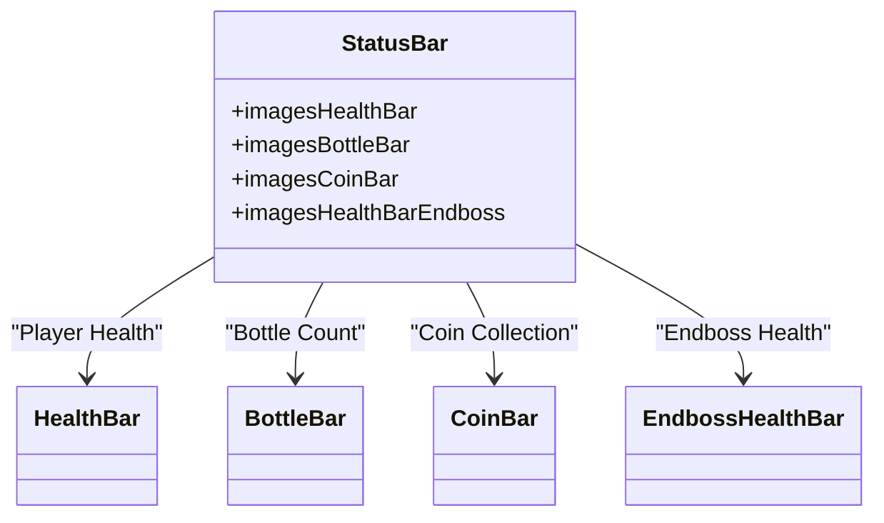
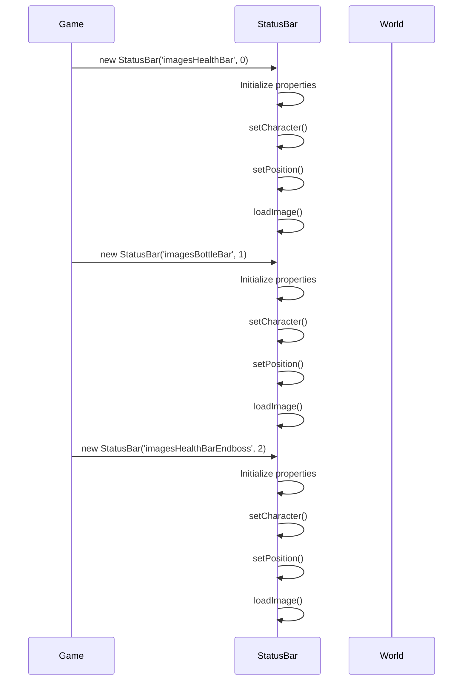
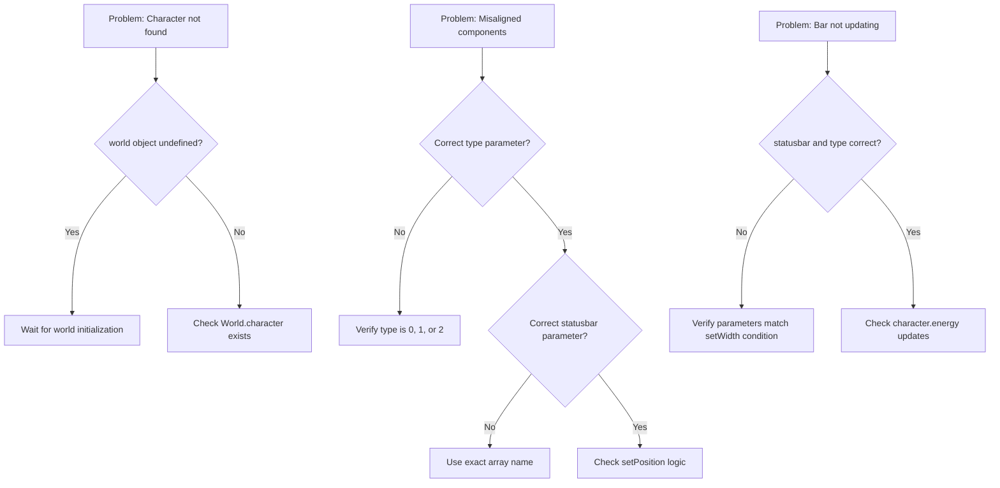

# StatusBar Class Reference

<cite>
**Referenced Files in This Document**  
- [status-bar.class.js](file://models/status-bar.class.js)
- [2-world.class.js](file://models/2-world.class.js)
- [1-game.js](file://js/1-game.js)
- [drawable-object.class.js](file://models/drawable-object.class.js)
</cite>

## Table of Contents
1. [Introduction](#introduction)
2. [Image Arrays](#image-arrays)
3. [Positioning Properties](#positioning-properties)
4. [Constructor Parameters](#constructor-parameters)
5. [setCharacter() Method](#setcharacter-method)
6. [setWidth() Method](#setwidth-method)
7. [setPosition() Method](#setposition-method)
8. [Status Bar Types](#status-bar-types)
9. [Usage Examples](#usage-examples)
10. [Troubleshooting Guide](#troubleshooting-guide)

## Introduction
The StatusBar class is responsible for displaying visual indicators of player and boss health, bottle count, and coin collection in the game. It extends the DrawableObject class and integrates with the World object to dynamically update based on character state. The class manages three primary status bar types (health, bottle, coin) and includes special handling for the endboss health bar. Each status bar consists of three components: an empty bar background, a filled bar indicating current value, and an icon representing the status type.

**Section sources**
- [status-bar.class.js](file://models/status-bar.class.js#L0-L132)

## Image Arrays
The StatusBar class defines four image arrays that contain the visual assets for different status bar types. Each array contains three elements: the empty bar background, the filled bar, and the icon.

**Diagram sources**
- [status-bar.class.js](file://models/status-bar.class.js#L15-L42)

**Section sources**
- [status-bar.class.js](file://models/status-bar.class.js#L15-L42)

## Positioning Properties
The class includes several properties that control the position and dimensions of status bar components. These properties are modified by the setPosition() method based on the status bar type and component.

**Diagram sources**
- [status-bar.class.js](file://models/status-bar.class.js#L44-L49)

**Section sources**
- [status-bar.class.js](file://models/status-bar.class.js#L44-L49)

## Constructor Parameters
The StatusBar constructor accepts two parameters that determine which status bar type to create and which component to display.

**Diagram sources**
- [status-bar.class.js](file://models/status-bar.class.js#L70-L76)

**Section sources**
- [status-bar.class.js](file://models/status-bar.class.js#L70-L76)

## setCharacter() Method
The setCharacter() method asynchronously links the StatusBar instance to the World's character object. It uses a setTimeout to ensure the World object is available before attempting to access it. Once the character is found, it initializes the energy multiplier used for width calculations and triggers the setWidth() method.

**Diagram sources**
- [status-bar.class.js](file://models/status-bar.class.js#L72-L83)
- [2-world.class.js](file://models/2-world.class.js#L3-L3)

**Section sources**
- [status-bar.class.js](file://models/status-bar.class.js#L72-L83)

## setWidth() Method
The setWidth() method dynamically updates the bar width based on the character's energy level. It runs on a 100ms interval and only applies to the filled health bar component (type 1). The width is calculated by multiplying the character's current energy by the pre-calculated multiplier.

**Diagram sources**
- [status-bar.class.js](file://models/status-bar.class.js#L85-L91)

**Section sources**
- [status-bar.class.js](file://models/status-bar.class.js#L85-L91)

## setPosition() Method
The setPosition() method contains complex logic for positioning different bar components based on their type and status bar category. It adjusts the x, y, width, and height properties according to specific rules for each combination of statusbar and type values.

**Diagram sources**
- [status-bar.class.js](file://models/status-bar.class.js#L93-L131)

**Section sources**
- [status-bar.class.js](file://models/status-bar.class.js#L93-L131)

## Status Bar Types
The StatusBar class supports three main status bar types with distinct visual representations and positioning rules. Each type has three components (empty bar, filled bar, icon) represented by different type values (0, 1, 2).

**Diagram sources**
- [status-bar.class.js](file://models/status-bar.class.js#L15-L42)

**Section sources**
- [status-bar.class.js](file://models/status-bar.class.js#L15-L42)

## Usage Examples
To create different types of status bars, instantiate the StatusBar class with the appropriate image array name and type parameter. The constructor automatically handles character linking, positioning, and image loading.

**Diagram sources**
- [status-bar.class.js](file://models/status-bar.class.js#L70-L76)
- [1-game.js](file://js/1-game.js#L3-L8)

**Section sources**
- [status-bar.class.js](file://models/status-bar.class.js#L70-L76)

## Troubleshooting Guide
Common issues with the StatusBar class include undefined character references and misaligned components. These problems typically occur due to timing issues or incorrect parameter values.

**Diagram sources**
- [status-bar.class.js](file://models/status-bar.class.js#L72-L83)
- [status-bar.class.js](file://models/status-bar.class.js#L85-L91)
- [status-bar.class.js](file://models/status-bar.class.js#L93-L131)

**Section sources**
- [status-bar.class.js](file://models/status-bar.class.js#L72-L131)