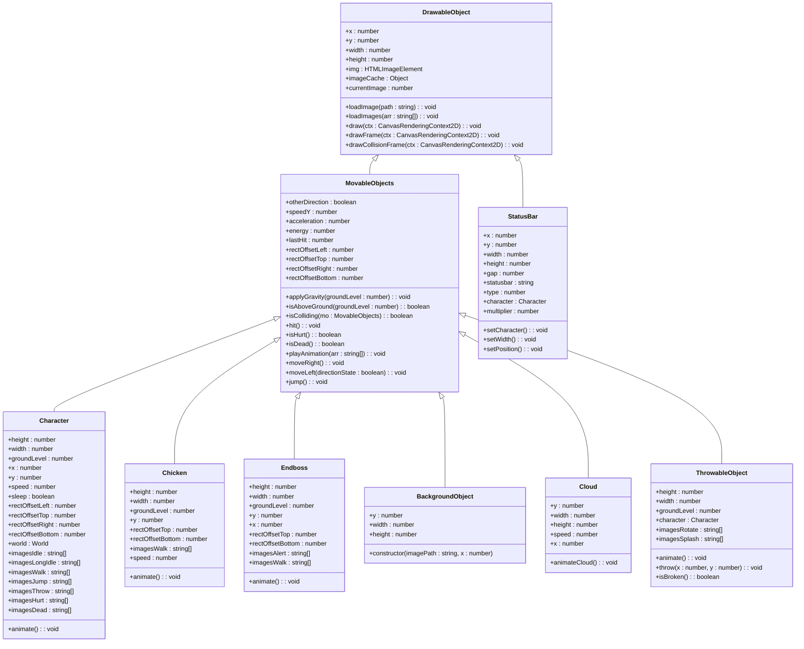

# Technical Reference

<cite>
**Referenced Files in This Document**   
- [drawable-object.class.js](file://models/drawable-object.class.js)
- [movable-objects.class.js](file://models/movable-objects.class.js)
- [character.class.js](file://models/character.class.js)
- [chicken.class.js](file://models/chicken.class.js)
- [endboss.class.js](file://models/endboss.class.js)
- [clouds.class.js](file://models/clouds.class.js)
- [background-object.class.js](file://models/background-object.class.js)
- [status-bar.class.js](file://models/status-bar.class.js)
- [thowable-object.class.js](file://models/thowable-object.class.js)
- [keyboard.class.js](file://models/keyboard.class.js)
- [2-world.class.js](file://models/2-world.class.js)
- [level.class.js](file://models/level.class.js)
- [1-game.js](file://js/1-game.js)
- [level1.js](file://levels/level1.js)
</cite>

## Table of Contents
1. [Introduction](#introduction)
2. [Core Classes API Reference](#core-classes-api-reference)
   - [DrawableObject](#drawableobject)
   - [MovableObjects](#movableobjects)
   - [Character](#character)
   - [Chicken](#chicken)
   - [Endboss](#endboss)
   - [Clouds](#clouds)
   - [BackgroundObject](#backgroundobject)
   - [StatusBar](#statusbar)
   - [ThrowableObject](#throwableobject)
   - [Keyboard](#keyboard)
   - [World](#world)
   - [Level](#level)
3. [Key Methods Documentation](#key-methods-documentation)
4. [Initialization Function](#initialization-function)
5. [Level Configuration Structure](#level-configuration-structure)
6. [Inheritance Relationships](#inheritance-relationships)
7. [Extending Game Elements](#extending-game-elements)

## Introduction
This technical reference provides comprehensive API documentation for the el_polo_loco game codebase. It details all public classes, methods, properties, and their usage patterns. The documentation covers the inheritance hierarchy, key functionality, and provides guidance for extending the game with new elements. The system follows an object-oriented design pattern with a clear separation between drawable, movable, and game-specific objects.

## Core Classes API Reference

### DrawableObject
Base class for all visual game elements that can be rendered on the canvas.

**Constructor Parameters**
- None (default constructor)

**Public Properties**
- `x`: number - X-coordinate position
- `y`: number - Y-coordinate position
- `width`: number - Width of the object
- `height`: number - Height of the object
- `img`: HTMLImageElement - Current image element
- `imageCache`: Object - Cache of loaded images by path
- `currentImage`: number - Index of current animation frame (default: 0)

**Public Methods**
- `loadImage(path: string)`: void - Loads a single image from the specified path
- `loadImages(arr: string[])`: void - Loads multiple images from an array of paths into imageCache
- `draw(ctx: CanvasRenderingContext2D)`: void - Renders the object on the canvas
- `drawFrame(ctx: CanvasRenderingContext2D)`: void - Draws a blue bounding box around the object (for Character, Chicken, Endboss)
- `drawCollisionFrame(ctx: CanvasRenderingContext2D)`: void - Draws a red collision detection box using rectOffset values

**Section sources**
- [drawable-object.class.js](file://models/drawable-object.class.js#L0-L43)

### MovableObjects
Base class for all objects that can move and have physics properties. Extends DrawableObject.

**Constructor Parameters**
- None (inherits from DrawableObject)

**Public Properties**
- `otherDirection`: boolean - Direction flag (false = right, true = left)
- `speedY`: number - Vertical speed for jumping/falling
- `acceleration`: number - Gravity acceleration (default: 0.3)
- `energy`: number - Health/energy points (default: 100)
- `lastHit`: number - Timestamp of last hit (default: 0)
- `rectOffsetLeft`: number - Left collision box offset
- `rectOffsetTop`: number - Top collision box offset
- `rectOffsetRight`: number - Right collision box offset
- `rectOffsetBottom`: number - Bottom collision box offset

**Public Methods**
- `applyGravity(groundLevel: number)`: void - Applies gravity effect with ground collision
- `isAboveGround(groundLevel: number)`: boolean - Checks if object is above ground level
- `isColliding(mo: MovableObjects)`: boolean - Detects collision with another movable object
- `hit()`: void - Reduces energy by 10 and records hit time
- `isHurt()`: boolean - Checks if object was hit within the last second
- `isDead()`: boolean - Checks if energy is zero
- `playAnimation(arr: string[])`: void - Cycles through animation frames from image array
- `moveRight()`: void - Moves object right by speed amount
- `moveLeft(directionState: boolean)`: void - Moves object left and sets direction state
- `jump()`: void - Initiates jump with upward speed

**Section sources**
- [movable-objects.class.js](file://models/movable-objects.class.js#L0-L75)

### Character
Player character class that extends MovableObjects with animation states and user input handling.

**Constructor Parameters**
- None

**Public Properties**
- `height`: number - Character height (280)
- `width`: number - Character width (140)
- `groundLevel`: number - Y-coordinate of ground
- `x`: number - Initial X position (50)
- `y`: number - Initial Y position (groundLevel)
- `speed`: number - Movement speed (5)
- `sleep`: boolean - Idle animation state
- `rectOffsetLeft`: number - Collision box left offset (50)
- `rectOffsetTop`: number - Collision box top offset (110)
- `rectOffsetRight`: number - Collision box right offset (100)
- `rectOffsetBottom`: number - Collision box bottom offset (125)
- `world`: World - Reference to game world
- `imagesIdle`: string[] - Array of idle animation images
- `imagesLongIdle`: string[] - Array of long idle animation images
- `imagesWalk`: string[] - Array of walking animation images
- `imagesJump`: string[] - Array of jumping animation images
- `imagesThrow`: string[] - Array of throwing animation images
- `imagesHurt`: string[] - Array of hurt animation images
- `imagesDead`: string[] - Array of dead animation images

**Public Methods**
- `animate()`: void - Handles all character animations based on input and state

**Section sources**
- [character.class.js](file://models/character.class.js#L0-L150)

### Chicken
Enemy chicken class that extends MovableObjects with leftward movement.

**Constructor Parameters**
- None

**Public Properties**
- `height`: number - Chicken height (75)
- `width`: number - Chicken width (60)
- `groundLevel`: number - Y-coordinate of ground (365)
- `y`: number - Initial Y position (groundLevel)
- `rectOffsetTop`: number - Collision box top offset (25)
- `rectOffsetBottom`: number - Collision box bottom offset (30)
- `imagesWalk`: string[] - Array of walking animation images
- `speed`: number - Movement speed (random between 0.25-0.75)

**Public Methods**
- `animate()`: void - Handles chicken movement and animation

**Section sources**
- [chicken.class.js](file://models/chicken.class.js#L0-L34)

### Endboss
Final boss enemy class that extends MovableObjects with alert and walk animations.

**Constructor Parameters**
- None

**Public Properties**
- `height`: number - Endboss height (400)
- `width`: number - Endboss width (320)
- `groundLevel`: number - Y-coordinate of ground (50)
- `y`: number - Initial Y position (groundLevel)
- `x`: number - Initial X position (400)
- `rectOffsetTop`: number - Collision box top offset (70)
- `rectOffsetBottom`: number - Collision box bottom offset (85)
- `imagesAlert`: string[] - Array of alert animation images
- `imagesWalk`: string[] - Array of walking animation images

**Public Methods**
- `animate()`: void - Handles endboss animation (currently only walk)

**Section sources**
- [endboss.class.js](file://models/endboss.class.js#L0-L40)

### Clouds
Background cloud class that extends MovableObjects with continuous leftward movement.

**Constructor Parameters**
- None

**Public Properties**
- `y`: number - Y-coordinate position (0)
- `width`: number - Width of the cloud (1440)
- `height`: number - Height of the cloud (480)
- `speed`: number - Movement speed (0.15)
- `x`: number - Random initial X position (0-500)

**Public Methods**
- `animateCloud()`: void - Handles cloud movement animation

**Section sources**
- [clouds.class.js](file://models/clouds.class.js#L0-L17)

### BackgroundObject
Static background element that extends MovableObjects.

**Constructor Parameters**
- `imagePath`: string - Path to the background image
- `x`: number - X-coordinate position

**Public Properties**
- `y`: number - Y-coordinate position (0)
- `width`: number - Width of the object (720)
- `height`: number - Height of the object (480)

**Section sources**
- [background-object.class.js](file://models/background-object.class.js#L0-L9)

### StatusBar
UI element that displays game status (health, bottles, coins).

**Constructor Parameters**
- `statusbar`: string - Type of status bar ('imagesHealthBar', 'imagesBottleBar', 'imagesCoinBar', 'imagesHealthBarEndboss')
- `type`: number - Index of the specific image (0, 1, or 2)

**Public Properties**
- `x`: number - X-coordinate position
- `y`: number - Y-coordinate position
- `width`: number - Width of the bar (200)
- `height`: number - Height of the bar (20)
- `gap`: number - Vertical spacing between bars (35)
- `statusbar`: string - Current status bar type
- `type`: number - Current type index
- `character`: Character - Reference to player character
- `multiplier`: number - Scaling factor for health bar

**Public Methods**
- `setCharacter()`: void - Sets reference to character after world initialization
- `setWidth()`: void - Updates health bar width based on character energy
- `setPosition()`: void - Sets position based on status bar type and index

**Section sources**
- [status-bar.class.js](file://models/status-bar.class.js#L0-L132)

### ThrowableObject
Projectile class for thrown items (salsa bottles).

**Constructor Parameters**
- `character`: Character - Reference to the throwing character

**Public Properties**
- `height`: number - Object height (70)
- `width`: number - Object width (21)
- `groundLevel`: number - Y-coordinate of ground (375)
- `character`: Character - Reference to throwing character
- `imagesRotate`: string[] - Array of rotation animation images
- `imagesSplash`: string[] - Array of splash animation images

**Public Methods**
- `animate()`: void - Handles rotation and splash animations
- `throw(x: number, y: number)`: void - Throws the object with physics and direction
- `isBroken()`: boolean - Checks if object has hit the ground

**Section sources**
- [thowable-object.class.js](file://models/thowable-object.class.js#L0-L82)

### Keyboard
Input handler class that tracks keyboard state.

**Public Properties**
- `LEFT`: boolean - Left arrow key state
- `RIGHT`: boolean - Right arrow key state
- `UP`: boolean - Up arrow key state
- `DOWN`: boolean - Down arrow key state
- `SPACE`: boolean - Space bar state
- `ANY`: boolean - Any key pressed state

**Section sources**
- [keyboard.class.js](file://models/keyboard.class.js#L0-L7)

### World
Main game world controller that manages rendering, collisions, and game objects.

**Constructor Parameters**
- `canvas`: HTMLCanvasElement - Game canvas element
- `keyboard`: Keyboard - Input handler instance

**Public Properties**
- `character`: Character - Player character instance
- `level`: Level - Current game level
- `canvas`: HTMLCanvasElement - Game canvas
- `ctx`: CanvasRenderingContext2D - Canvas 2D context
- `keyboard`: Keyboard - Input handler
- `camera_x`: number - Camera horizontal position
- `throwableObjects`: ThrowableObject[] - Array of active projectiles
- `lastThrow`: number - Timestamp of last thrown object

**Public Methods**
- `setWorld()`: void - Sets world reference on all game objects
- `run()`: void - Starts game loop for collision and throw checks
- `checkCollisions()`: void - Checks for character-enemy collisions
- `checkThrowableObject()`: void - Handles throwable object creation
- `throwInterval()`: boolean - Checks if enough time has passed since last throw
- `draw()`: void - Main rendering loop
- `addObjectsToMap(objects: any[])`: void - Renders array of objects
- `addToMap(mo: MovableObjects)`: void - Renders single object with direction handling
- `flipImage(mo: MovableObjects)`: void - Flips image for leftward movement
- `flipImageBack(mo: MovableObjects)`: void - Restores image after leftward movement

**Section sources**
- [2-world.class.js](file://models/2-world.class.js#L0-L131)

### Level
Data structure that defines the game level layout.

**Constructor Parameters**
- `clouds`: Cloud[] - Array of cloud objects
- `enemies`: MovableObjects[] - Array of enemy objects
- `backgroundObjects`: BackgroundObject[] - Array of background objects
- `statusBars`: StatusBar[] - Array of status bar objects

**Public Properties**
- `clouds`: Cloud[] - Cloud objects array
- `enemies`: MovableObjects[] - Enemy objects array
- `backgroundObjects`: BackgroundObject[] - Background objects array
- `statusBars`: StatusBar[] - Status bar objects array
- `levelEndX`: number - X-coordinate where level ends (2160)

**Section sources**
- [level.class.js](file://models/level.class.js#L0-L13)

## Key Methods Documentation

### Character.jump()
**Purpose**: Initiates a jump action for the character. This method sets the vertical speed to initiate upward movement, which is then processed by the applyGravity method. The jump can only be performed when the character is on the ground.

**Usage Example**:
```javascript
// Jump when up arrow is pressed and character is on ground
if (this.world.keyboard.UP && !this.isAboveGround(this.groundLevel)) {
    this.jump();
}
```

**Section sources**
- [character.class.js](file://models/character.class.js#L140-L143)
- [movable-objects.class.js](file://models/movable-objects.class.js#L72-L74)

### World.checkCollisions()
**Purpose**: Detects and handles collisions between the player character and enemies. When a collision is detected and the character is not in a hurt state, the character's hit method is called to reduce energy.

**Implementation Details**:
- Iterates through all enemies in the current level
- Uses the isColliding method to detect overlap
- Only processes collisions when character is not already hurt
- Calls character.hit() to apply damage
- Logs energy level to console

**Usage Example**:
```javascript
// Automatically called every 200ms by the game loop
setInterval(() => {
    this.checkCollisions();
}, 200);
```

**Section sources**
- [2-world.class.js](file://models/2-world.class.js#L43-L50)

### ThrowableObject.throw()
**Purpose**: Launches a throwable object (salsa bottle) from the character's position with physics-based movement. The direction is determined by the character's facing direction.

**Parameters**:
- `x`: number - Starting X coordinate
- `y`: number - Starting Y coordinate

**Implementation Details**:
- Calculates throw direction based on character's otherDirection flag
- Positions the object relative to character's dimensions and offsets
- Sets initial vertical speed for arc trajectory
- Applies gravity effect
- Updates horizontal position in game loop

**Usage Example**:
```javascript
// Called during object construction with character's position
this.throw(this.x, this.y);
```

**Section sources**
- [thowable-object.class.js](file://models/thowable-object.class.js#L61-L76)

### DrawableObject.draw()
**Purpose**: Renders the object's current image on the canvas at its position with specified dimensions.

**Parameters**:
- `ctx`: CanvasRenderingContext2D - The canvas 2D rendering context

**Implementation Details**:
- Uses the canvas drawImage method
- Draws from current img property
- Positions at (x, y) coordinates
- Scales to (width, height) dimensions

**Usage Example**:
```javascript
// Called by World.addToMap during rendering
mo.draw(this.ctx);
```

**Section sources**
- [drawable-object.class.js](file://models/drawable-object.class.js#L23-L25)

## Initialization Function

### init() in 1-game.js
**Purpose**: Initializes the game by setting up the canvas and creating the world instance.

**Invocation Requirements**:
- Must be called after DOM is loaded
- Requires a canvas element with ID 'canvas' in the HTML
- Creates a new Keyboard instance for input handling

**Side Effects**:
- Assigns canvas element to global variable
- Creates and assigns World instance to global variable
- Makes world accessible globally via window.world
- Starts the game rendering loop

**Usage Example**:
```html
<!-- In HTML file -->
<script>
    // Game starts when page loads
    window.onload = function() {
        init();
    }
</script>
```

**Section sources**
- [1-game.js](file://js/1-game.js#L0-L55)

## Level Configuration Structure

### level1.js
Defines the first level configuration using the Level class constructor.

**Structure**:
```javascript
const level1 = new Level(
    [
        // Clouds array
        new Cloud()
    ],
    [
        // Enemies array
        new Chicken(),
        new Endboss()
    ],
    [
        // BackgroundObjects array
        new BackgroundObject('../assets/img/5_background/layers/air.png', -1440),
        // ... additional background layers at different x positions
    ],
    [
        // StatusBars array
        new StatusBar('imagesHealthBar', 0), // Empty health bar
        new StatusBar('imagesHealthBar', 1), // Filled health bar
        new StatusBar('imagesHealthBar', 2), // Health icon
        // ... additional status bars for bottles, coins, and endboss
    ]
);
```

**Arrays**:
- **backgroundObjects**: 24 BackgroundObject instances creating a parallax scrolling effect with multiple layers
- **clouds**: 1 Cloud instance that moves independently
- **enemies**: 2 enemy instances (1 Chicken, 1 Endboss)
- **statusBars**: 12 StatusBar instances (3 each for health, bottles, coins, and endboss health)

**Section sources**
- [level1.js](file://levels/level1.js#L0-L51)

## Inheritance Relationships

### Class Hierarchy
The game uses a clear inheritance hierarchy:



**Diagram sources**
- [drawable-object.class.js](file://models/drawable-object.class.js#L0-L43)
- [movable-objects.class.js](file://models/movable-objects.class.js#L0-L75)
- [character.class.js](file://models/character.class.js#L0-L150)
- [chicken.class.js](file://models/chicken.class.js#L0-L34)
- [endboss.class.js](file://models/endboss.class.js#L0-L40)
- [background-object.class.js](file://models/background-object.class.js#L0-L9)
- [clouds.class.js](file://models/clouds.class.js#L0-L17)
- [thowable-object.class.js](file://models/thowable-object.class.js#L0-L82)
- [status-bar.class.js](file://models/status-bar.class.js#L0-L132)

**Section sources**
- [drawable-object.class.js](file://models/drawable-object.class.js#L0-L43)
- [movable-objects.class.js](file://models/movable-objects.class.js#L0-L75)

## Extending Game Elements

### Creating New Game Elements
To create new game elements following the established patterns:

1. **For static background elements**: Extend BackgroundObject or create a new class that extends MovableObjects with appropriate properties.

2. **For moving enemies**: Create a new class that extends MovableObjects with:
   - Appropriate dimensions and collision offsets
   - Movement pattern in the constructor/animate method
   - Animation frames array
   - Enemy-specific behavior

3. **For new projectiles**: Extend ThrowableObject with:
   - Custom images for animation
   - Modified throw physics
   - Special effects on impact

4. **For new status indicators**: Extend StatusBar with:
   - New image arrays
   - Custom positioning logic
   - Special update behavior

### Best Practices
- Always call `super()` in constructors when extending classes
- Use the imageCache system for efficient image loading
- Implement animation using setInterval with playAnimation
- Use rectOffset properties for precise collision detection
- Follow the naming convention: [ClassName].class.js
- Maintain consistent physics properties (gravity, speed, etc.)

**Section sources**
- [character.class.js](file://models/character.class.js#L0-L150)
- [chicken.class.js](file://models/chicken.class.js#L0-L34)
- [endboss.class.js](file://models/endboss.class.js#L0-L40)
- [thowable-object.class.js](file://models/thowable-object.class.js#L0-L82)