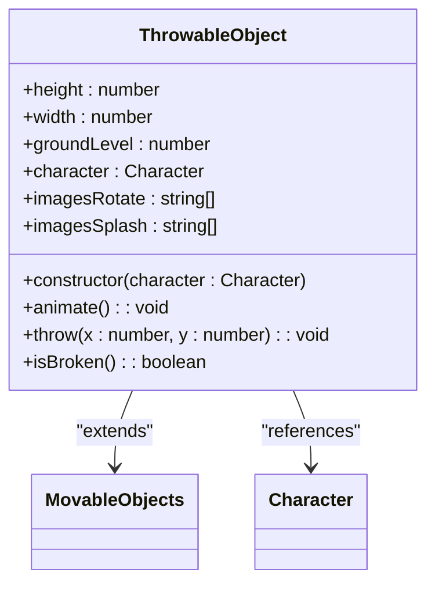
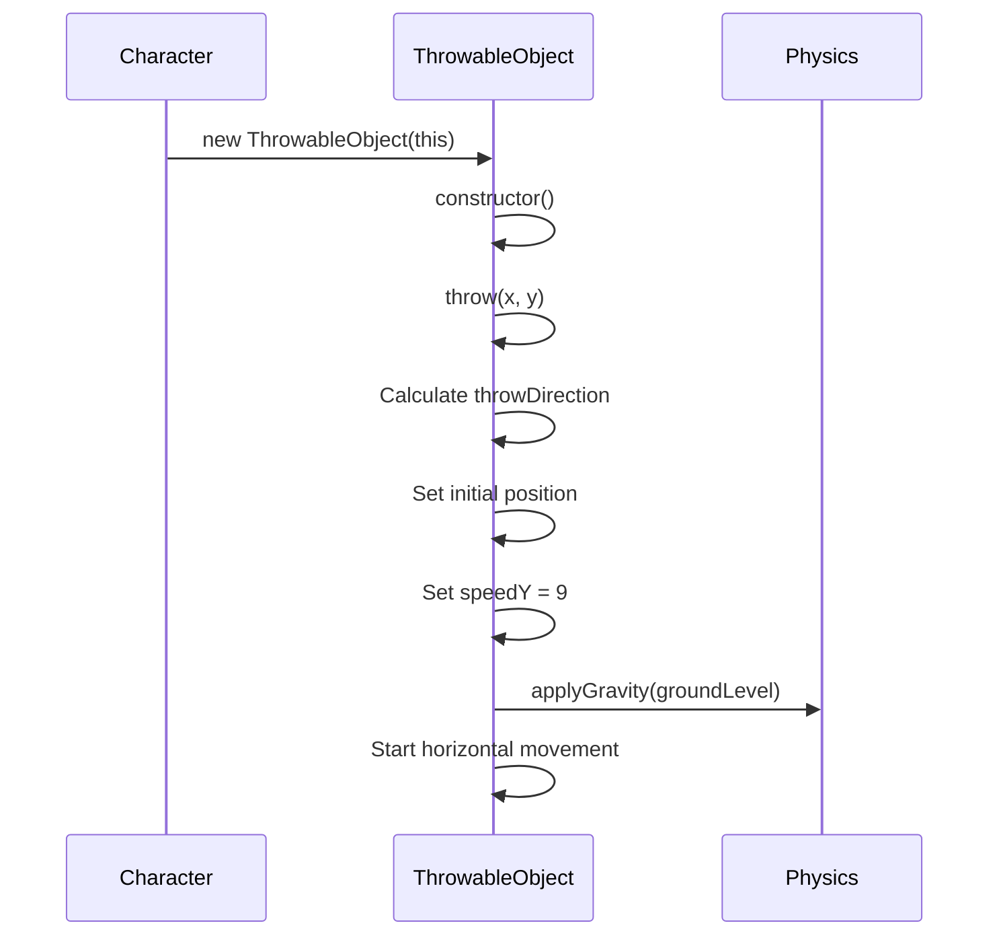
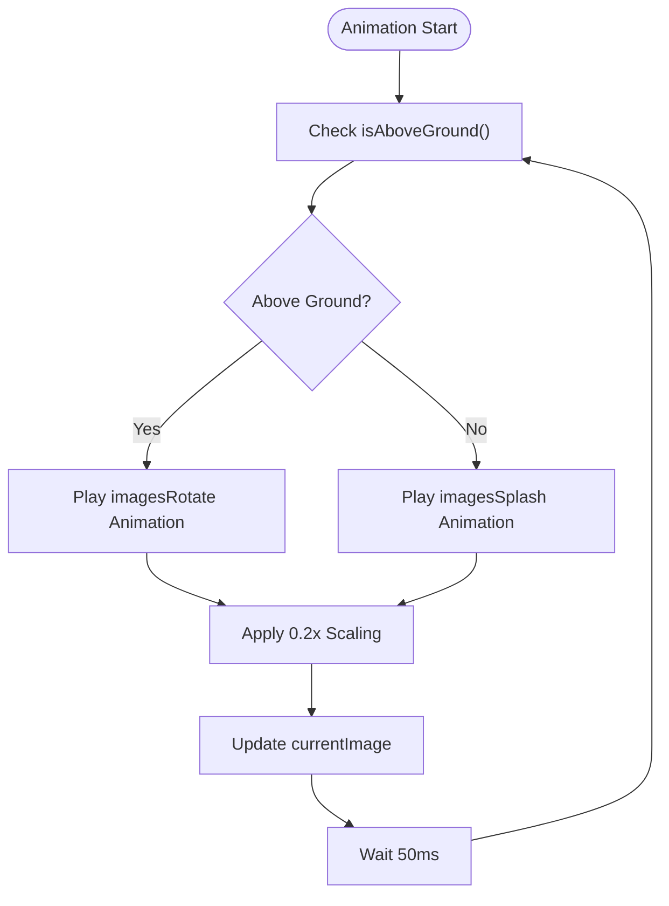
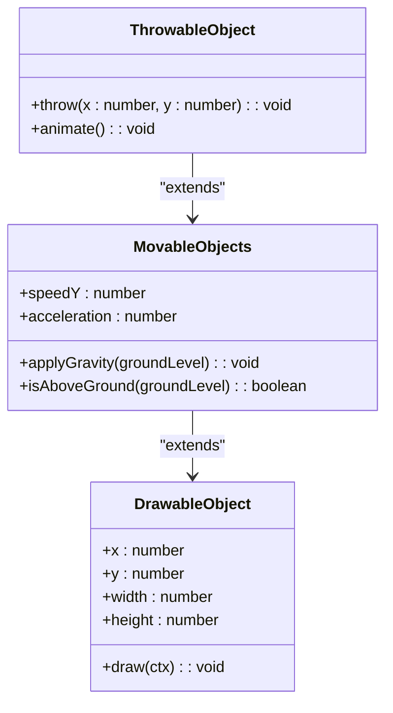

# ThrowableObject Class Reference

<cite>
**Referenced Files in This Document**  
- [thowable-object.class.js](file://models/thowable-object.class.js)
- [2-world.class.js](file://models/2-world.class.js)
- [movable-objects.class.js](file://models/movable-objects.class.js)
- [character.class.js](file://models/character.class.js)
- [drawable-object.class.js](file://models/drawable-object.class.js)
</cite>

## Table of Contents
1. [Introduction](#introduction)
2. [Core Properties](#core-properties)
3. [Constructor Implementation](#constructor-implementation)
4. [Throw Mechanics](#throw-mechanics)
5. [Animation System](#animation-system)
6. [Physics Implementation](#physics-implementation)
7. [World Integration](#world-integration)
8. [Extension Guidelines](#extension-guidelines)

## Introduction
The `ThrowableObject` class represents projectiles (specifically salsa bottles) that can be thrown by the player character in the game. This class extends the `MovableObjects` base class and inherits physics, animation, and collision capabilities. The throwable objects are managed within the game world and follow realistic physics including gravity and directional movement. This documentation provides a comprehensive reference for the class structure, behavior, and integration within the game ecosystem.

## Core Properties
The `ThrowableObject` class defines several key properties that govern its appearance, position, and behavior in the game world.

**Section sources**
- [thowable-object.class.js](file://models/thowable-object.class.js#L3-L11)

### Dimension Properties
- **height**: Fixed at 70 pixels, representing the vertical size of the projectile
- **width**: Calculated as 30% of the height (approximately 21 pixels), maintaining proportional scaling
- **groundLevel**: Computed as 445 minus the object's height, determining the baseline where the object lands and triggers splash animation

### Animation Sprite Arrays
- **imagesRotate**: Array containing 12 image paths for the bottle rotation animation sequence during flight
- **imagesSplash**: Array containing 6 image paths for the bottle splash animation sequence upon ground impact

### Reference Properties
- **character**: Stores a reference to the character instance that threw the object, used for positioning and direction calculation

**Diagram sources**
- [thowable-object.class.js](file://models/thowable-object.class.js#L3-L82)

## Constructor Implementation
The constructor initializes a new throwable object with proper positioning, sprite loading, and immediate activation of animation and throwing mechanics.

**Section sources**
- [thowable-object.class.js](file://models/thowable-object.class.js#L14-L28)

### Character Reference and Positioning
When instantiated, the `ThrowableObject` receives a reference to the character that is throwing it. The object's initial position (x, y coordinates) is set to match the character's current position, ensuring the projectile appears at the correct location relative to the character.

### Sprite Loading Process
The constructor performs three critical image loading operations:
1. Loads the first rotation image as the initial display image using `loadImage()`
2. Pre-loads all rotation animation frames using `loadImages()` for the flight sequence
3. Pre-loads all splash animation frames using `loadImages()` for the ground impact sequence

### Immediate Behavior Activation
Immediately after initialization, the constructor triggers two essential behaviors:
- Calls `animate()` to start the animation cycle
- Invokes `throw(x, y)` to initiate the projectile's physics-based movement

This design ensures that every throwable object is fully operational immediately upon creation, with no additional setup required by the calling code.

## Throw Mechanics
The `throw(x, y)` method implements the projectile's trajectory calculation and movement based on the character's state and direction.

**Section sources**
- [thowable-object.class.js](file://models/thowable-object.class.js#L30-L48)

### Directional Calculation
The method determines throw direction by checking the character's `otherDirection` property:
- When `otherDirection` is true (character facing left), the throw direction is -2 (moving left)
- When `otherDirection` is false (character facing right), the throw direction is 2 (moving right)

### Position Adjustment
The method adjusts the starting x-coordinate based on direction to ensure proper positioning relative to the character:
- For right-facing throws: `x = character.x + character.width - character.rectOffsetLeft`
- For left-facing throws: `x = character.x + character.rectOffsetLeft - object.width`

The y-coordinate is set to `character.y + character.rectOffsetTop` to position the bottle at the appropriate height on the character.

### Physics Initialization
The method establishes the initial physics properties:
- Sets `speedY` to 9, providing upward momentum
- Calls `applyGravity(groundLevel)` to initiate the gravity effect
- Establishes horizontal movement through a setInterval that updates the x-position at 60fps

**Diagram sources**
- [thowable-object.class.js](file://models/thowable-object.class.js#L30-L48)
- [movable-objects.class.js](file://models/movable-objects.class.js#L15-L25)

## Animation System
The `animate()` method manages the visual state of the throwable object, switching between rotation and splash animations based on physics conditions.

**Section sources**
- [thowable-object.class.js](file://models/thowable-object.class.js#L50-L62)

### Conditional Animation Selection
The animation system operates on a 50ms interval and evaluates the object's vertical position:
- While `isAboveGround(groundLevel)` returns true, the rotation animation (`imagesRotate`) is played
- When the object reaches or passes the ground level, the splash animation (`imagesSplash`) is triggered

### Dynamic Image Scaling
During each animation frame, the method dynamically scales the displayed image:
- Sets height to 20% of the natural image height (`naturalHeight * 0.2`)
- Sets width to 20% of the natural image width (`naturalWidth * 0.2`)

This consistent scaling ensures that all throwable objects appear at a uniform size regardless of their source image dimensions.

**Diagram sources**
- [thowable-object.class.js](file://models/thowable-object.class.js#L50-L62)

## Physics Implementation
The physics system combines gravity application, collision detection, and frame-based position updates to create realistic projectile motion.

**Section sources**
- [thowable-object.class.js](file://models/thowable-object.class.js#L30-L48)
- [movable-objects.class.js](file://models/movable-objects.class.js#L15-L25)

### Gravity Application
The `applyGravity()` method, inherited from `MovableObjects`, operates on a 60fps interval:
- While the object is above ground level, it decreases the y-coordinate by `speedY`
- Simultaneously decreases `speedY` by the acceleration constant (0.3)
- When the object reaches ground level, it stops vertical movement and sets y to groundLevel

### Collision Detection
The `isAboveGround()` method determines if the object should continue falling:
- Returns true if `(y - speedY) < groundLevel`
- This predictive calculation ensures smooth landing without positional glitches

### Horizontal Movement
The throw method establishes horizontal movement through a separate 60fps interval:
- Increments x by the throw direction value (±2) each frame
- This creates consistent horizontal velocity independent of the gravity calculation

**Diagram sources**
- [movable-objects.class.js](file://models/movable-objects.class.js#L3-L25)
- [drawable-object.class.js](file://models/drawable-object.class.js#L3-L10)

## World Integration
Throwable objects are integrated into the game world through the `World` class, which manages their lifecycle and rendering.

**Section sources**
- [2-world.class.js](file://models/2-world.class.js#L15-L45)

### Object Management
The `World` class maintains a `throwableObjects` array that stores all active projectiles:
- New throwable objects are instantiated and added to this array when the player presses the SPACE key
- The array is passed to the rendering system during each draw cycle

### Throwing Mechanism
The `checkThrowableObject()` method implements the throwing logic:
- Listens for SPACE key press via the keyboard input system
- Enforces a cooldown interval (1 second minimum between throws) using `throwInterval()`
- Creates a new `ThrowableObject` instance with the character reference when conditions are met

### Rendering Pipeline
During the draw cycle, throwable objects are rendered through the following process:
1. The world's `draw()` method calls `addObjectsToMap()` with the throwableObjects array
2. Each object is processed by `addToMap()` which handles directional flipping if needed
3. The drawable object's `draw()` method renders the current frame at the correct position

## Extension Guidelines
The `ThrowableObject` class can be extended to support different projectile types or enhanced effects.

**Section sources**
- [thowable-object.class.js](file://models/thowable-object.class.js#L3-L82)

### Creating New Projectile Types
To implement different projectiles:
1. Create a new class that extends `ThrowableObject`
2. Override the sprite arrays with new image paths
3. Adjust dimensions and physics parameters as needed
4. Implement specialized behavior in overridden methods

### Adding Explosion Effects
To enhance the splash animation:
1. Extend the `animate()` method to trigger additional visual effects upon ground impact
2. Implement particle systems or secondary animations
3. Add sound effects synchronized with the splash frames
4. Consider implementing area-of-effect damage for game mechanics

### Advanced Physics Modifications
For more complex projectile behavior:
1. Override the `throw()` method to implement arc trajectories or bouncing
2. Add rotation mechanics that sync with the visual rotation
3. Implement collision detection with enemies or obstacles
4. Create specialized gravity effects for different projectile types

The current implementation provides a solid foundation that can be extended while maintaining compatibility with the existing game systems and rendering pipeline.