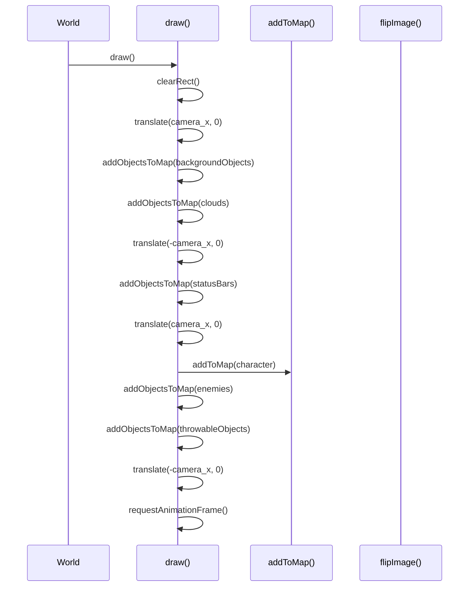
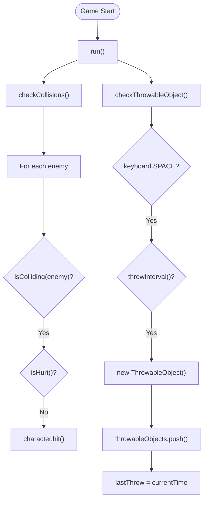

# World Class Reference

<cite>
**Referenced Files in This Document**   
- [2-world.class.js](file://models/2-world.class.js)
- [character.class.js](file://models/character.class.js)
- [level.class.js](file://models/level.class.js)
- [thowable-object.class.js](file://models/thowable-object.class.js)
- [movable-objects.class.js](file://models/movable-objects.class.js)
- [drawable-object.class.js](file://models/drawable-object.class.js)
- [level1.js](file://levels/level1.js)
</cite>

## Table of Contents
1. [Introduction](#introduction)
2. [Core Properties](#core-properties)
3. [Constructor](#constructor)
4. [Rendering System](#rendering-system)
5. [Game Loop and Logic](#game-loop-and-logic)
6. [Collision and Projectile Systems](#collision-and-projectile-systems)
7. [Object Management](#object-management)
8. [Performance Considerations](#performance-considerations)

## Introduction
The World class serves as the central game controller in the El Pollo Loco game, coordinating all game systems and maintaining references to key game objects. It manages the rendering context, game loop, collision detection, projectile spawning, and camera movement. This documentation provides a comprehensive reference for the World class, detailing its properties, methods, and interactions with other game components.

## Core Properties

The World class maintains several key properties that define the game state and coordinate interactions between game objects.

**Section sources**
- [2-world.class.js](file://models/2-world.class.js#L3-L10)

### character
A reference to the Character instance representing the player-controlled character in the game. This property is initialized with a new Character object using the keyboard input handler.

### level
A reference to the Level instance that defines the game environment, including enemies, background objects, clouds, and status bars. In the current implementation, this is set to the global level1 object.

### canvas and ctx
References to the HTML canvas element and its 2D rendering context, respectively. The canvas provides the drawing surface, while ctx enables drawing operations and transformations.

### keyboard
A reference to the keyboard input handler that captures user input events and translates them into game actions.

### camera_x
A numeric value representing the horizontal camera position, used to create the scrolling effect as the character moves through the game world.

### throwableObjects
An array that stores all active ThrowableObject instances (bottles) currently in the game world. This array is used to manage projectile rendering and collision detection.

### lastThrow
A timestamp (in milliseconds) that records the time of the last bottle throw, used to implement rate limiting on projectile spawning.

## Constructor

The World constructor initializes the game environment and starts the core game systems.

**Section sources**
- [2-world.class.js](file://models/2-world.class.js#L12-L22)

### Responsibilities
The constructor performs several critical initialization tasks:
- Sets up the rendering context by extracting the 2D context from the provided canvas element
- Stores references to the canvas and keyboard input handler
- Initializes the lastThrow timestamp to the current time
- Establishes a global reference to this World instance via window.world
- Initiates the rendering system by calling the draw() method
- Configures world references for game objects through setWorld()
- Starts the game logic loop by invoking run()

### Parameters
- **canvas**: The HTML canvas element used for game rendering
- **keyboard**: The keyboard input handler object that captures user input

## Rendering System

The rendering system handles all visual aspects of the game, including coordinate transformations and object rendering.

**Diagram sources**
- [2-world.class.js](file://models/2-world.class.js#L66-L85)
- [2-world.class.js](file://models/2-world.class.js#L87-L91)
- [2-world.class.js](file://models/2-world.class.js#L106-L117)

### draw() Method
The draw() method implements the main rendering loop using requestAnimationFrame for smooth, browser-optimized animation. It follows a specific rendering sequence:

1. Clears the canvas with clearRect()
2. Applies camera translation to create the scrolling effect
3. Renders background objects and clouds with camera offset
4. Temporarily removes camera offset to render UI elements (status bars)
5. Reapplies camera offset to render the character, enemies, and projectiles
6. Schedules the next frame with requestAnimationFrame()

This method uses coordinate translation to create the illusion of camera movement while the character remains relatively centered on screen.

### Coordinate Translation
The rendering system uses ctx.translate() to implement camera movement:
- Positive translation (camera_x) shifts the coordinate system right for background elements
- Negative translation (-camera_x) temporarily resets the coordinate system for UI elements
- This technique ensures status bars remain fixed on screen while background elements scroll

### addToMap() and addObjectsToMap()
These methods handle the rendering of individual game objects:

- **addToMap(mo)**: Renders a single movable object, applying image flipping for left-facing entities
- **addObjectsToMap(objects)**: Iterates through an array of objects, calling addToMap() for each

The methods also handle visual debugging by drawing bounding boxes and collision frames when enabled.

**Section sources**
- [2-world.class.js](file://models/2-world.class.js#L66-L85)
- [2-world.class.js](file://models/2-world.class.js#L87-L91)
- [2-world.class.js](file://models/2-world.class.js#L106-L117)

## Game Loop and Logic

The game logic is driven by setInterval-based loops that update game state independently of the rendering system.

**Diagram sources**
- [2-world.class.js](file://models/2-world.class.js#L36-L41)
- [2-world.class.js](file://models/2-world.class.js#L43-L50)
- [2-world.class.js](file://models/2-world.class.js#L52-L58)

### run() Method
The run() method initiates the game logic loop with a 200ms interval, calling two primary methods:
- checkCollisions(): Detects and handles character-enemy collisions
- checkThrowableObject(): Processes bottle throwing based on input and cooldown

This creates a game logic update rate of approximately 5 times per second, independent of the rendering frame rate.

**Section sources**
- [2-world.class.js](file://models/2-world.class.js#L36-L41)

## Collision and Projectile Systems

The World class implements collision detection and projectile management systems.

### checkCollisions()
This method iterates through all enemies in the current level, checking for collisions with the character using the character's isColliding() method. When a collision is detected and the character is not currently hurt (invulnerable), it triggers the character's hit() method, reducing energy and updating the lastHit timestamp.

**Section sources**
- [2-world.class.js](file://models/2-world.class.js#L43-L50)

### checkThrowableObject() and throwInterval()
These methods work together to manage bottle throwing:

- **checkThrowableObject()**: Checks if the SPACE key is pressed and if the throw interval has elapsed
- **throwInterval()**: Calculates the time since the last throw and returns true if more than 1 second has passed

When both conditions are met, a new ThrowableObject is created at the character's position and added to the throwableObjects array.

**Section sources**
- [2-world.class.js](file://models/2-world.class.js#L52-L64)

## Object Management

The World class coordinates object relationships and rendering through several helper methods.

### setWorld()
This method establishes bidirectional references between the World instance and game objects:
- Sets the world property of the character to this World instance
- Sets the world property of all throwable objects to this World instance

This enables game objects to access World properties and methods, such as camera position and input state.

### Image Flipping
The flipImage() and flipImageBack() methods handle rendering of left-facing entities:
- **flipImage(mo)**: Saves the current context, translates and scales to flip the image horizontally
- **flipImageBack(mo)**: Restores the context and adjusts the object's x-coordinate

These methods use the canvas context's save() and restore() functions to preserve the transformation state.

**Section sources**
- [2-world.class.js](file://models/2-world.class.js#L24-L34)
- [2-world.class.js](file://models/2-world.class.js#L119-L129)

## Performance Considerations

The current implementation has several performance characteristics and potential optimization opportunities.

### Multiple setInterval Loops
The game architecture uses multiple setInterval loops across different classes:
- World.run(): 200ms interval for collision and throw checks
- Character.animate(): Multiple intervals for input processing (100ms), movement (16.67ms), and animation (150ms)
- MovableObjects.applyGravity(): 16.67ms interval for gravity simulation
- ThrowableObject.animate(): 50ms interval for bottle animation

This creates a complex timing system with potential for synchronization issues and unnecessary CPU usage.

### Optimization Strategies
Potential improvements include:
- Consolidating game logic into a single requestAnimationFrame loop
- Using delta time calculations for consistent movement across different frame rates
- Implementing object pooling for throwable objects to reduce garbage collection
- Adding visibility culling to skip rendering off-screen objects
- Using a more efficient collision detection algorithm for large numbers of objects

The current architecture prioritizes simplicity and modularity over performance, which may be appropriate for a small-scale game but could benefit from optimization as complexity increases.

**Section sources**
- [2-world.class.js](file://models/2-world.class.js)
- [character.class.js](file://models/character.class.js)
- [movable-objects.class.js](file://models/movable-objects.class.js)
- [thowable-object.class.js](file://models/thowable-object.class.js)