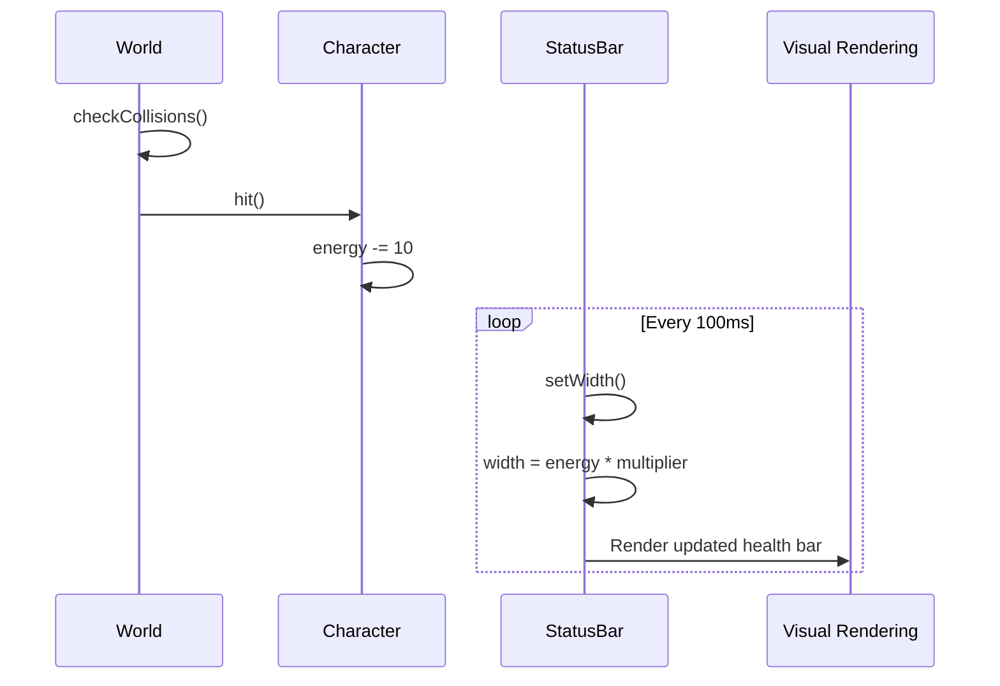
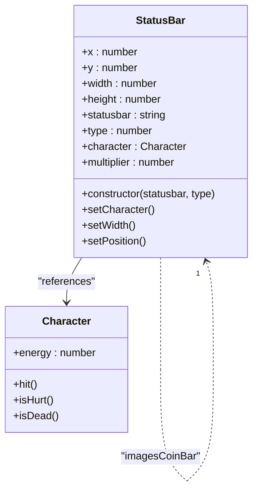

# Health Management

<cite>
**Referenced Files in This Document**   
- [character.class.js](file://models/character.class.js)
- [status-bar.class.js](file://models/status-bar.class.js)
- [2-world.class.js](file://models/2-world.class.js)
- [movable-objects.class.js](file://models/movable-objects.class.js)
</cite>

## Table of Contents
1. [Introduction](#introduction)
2. [Core Components](#core-components)
3. [Data Flow and Update Mechanism](#data-flow-and-update-mechanism)
4. [StatusBar Scaling and Visualization](#statusbar-scaling-and-visualization)
5. [Delayed Initialization Pattern](#delayed-initialization-pattern)
6. [Troubleshooting Common Issues](#troubleshooting-common-issues)
7. [Optimization Recommendations](#optimization-recommendations)

## Introduction
This document details the health management system in the game, focusing on the interaction between the Character and StatusBar classes. It explains how character energy is decremented upon collision with enemies and how this value drives the visual update of the health bar. The documentation covers the complete data flow from collision detection to UI rendering, including the 100ms interval update mechanism, pixel-to-energy ratio calculation, and component initialization patterns.

## Core Components

The health management system consists of four primary components that work together to maintain and display character health status. The Character class inherits from MovableObjects and represents the player-controlled entity. The StatusBar class handles the visual representation of health, while the World class manages game state and collision detection. All movable entities inherit energy tracking functionality from the base MovableObjects class.

**Section sources**
- [character.class.js](file://models/character.class.js#L1-L150)
- [status-bar.class.js](file://models/status-bar.class.js#L1-L132)
- [2-world.class.js](file://models/2-world.class.js#L1-L132)
- [movable-objects.class.js](file://models/movable-objects.class.js#L1-L76)

## Data Flow and Update Mechanism

The health update process follows a clear sequence from collision detection to visual rendering. When a collision occurs between the character and an enemy, the World.checkCollisions method invokes Character.hit(), which decrements the energy property by 10 points. This change triggers a continuous update cycle in the StatusBar component that refreshes the visual representation every 100ms.

**Diagram sources**
- [2-world.class.js](file://models/2-world.class.js#L43-L50)
- [movable-objects.class.js](file://models/movable-objects.class.js#L36-L43)
- [status-bar.class.js](file://models/status-bar.class.js#L85-L91)

**Section sources**
- [2-world.class.js](file://models/2-world.class.js#L43-L50)
- [movable-objects.class.js](file://models/movable-objects.class.js#L36-L43)
- [status-bar.class.js](file://models/status-bar.class.js#L85-L91)

## StatusBar Scaling and Visualization

The StatusBar class implements a precise scaling mechanism to convert the character's energy value into a visual bar width. The multiplier property is calculated during initialization as the ratio of the maximum bar width (200 pixels) to the maximum energy value (100 points), resulting in a conversion factor of 2 pixels per energy point. This ensures accurate and proportional representation of health status.

The status bar consists of three distinct visual elements managed by type parameter: the background (type 0), the fill portion (type 1), and the icon (type 2). Only the fill portion (type 1) has its width dynamically updated based on current energy, while the background and icon maintain static dimensions and positions. This separation ensures visual consistency while allowing dynamic health representation.

**Diagram sources**
- [status-bar.class.js](file://models/status-bar.class.js#L1-L132)
- [character.class.js](file://models/character.class.js#L1-L150)

**Section sources**
- [status-bar.class.js](file://models/status-bar.class.js#L60-L60)
- [status-bar.class.js](file://models/status-bar.class.js#L85-L91)

## Delayed Initialization Pattern

The StatusBar class employs a delayed initialization pattern using setTimeout to ensure proper dependency resolution. Since the StatusBar instance is created before the World object is fully initialized, direct access to world.character would result in undefined references. The 500ms delay in setCharacter() allows sufficient time for the World constructor to complete and assign the character instance.

This pattern prevents race conditions and ensures that the StatusBar can safely access the character's energy property for both initial multiplier calculation and subsequent updates. The initialization sequence guarantees that all dependencies are properly established before the health bar begins its update cycle, maintaining system stability and preventing null reference errors.

**Section sources**
- [status-bar.class.js](file://models/status-bar.class.js#L65-L75)
- [2-world.class.js](file://models/2-world.class.js#L3-L3)

## Troubleshooting Common Issues

### Health Bar Not Updating
If the health bar fails to update after damage, verify that:
1. The World.checkCollisions method is properly detecting collisions
2. The Character.hit() method is being called (check console logs)
3. The StatusBar.setCharacte() method successfully assigned the character reference
4. The 100ms interval in setWidth() is active and running

### Incorrect Energy Display
When energy values appear incorrect in the UI:
1. Confirm the multiplier calculation uses the correct initial values (200px width / 100 energy points)
2. Check that energy never drops below 0 due to the clamp in hit()
3. Verify that the StatusBar instance for type 1 (fill portion) is the one being updated
4. Ensure no other processes are modifying the width property directly

### Synchronization Delays
To address synchronization issues between game state and UI:
1. Monitor the 500ms delay in setCharacter() - it may need adjustment based on system performance
2. Verify that the 100ms update interval provides smooth visual feedback
3. Check that collision detection and hit() calls occur before the next render cycle
4. Ensure the World instance is properly assigned to window.world for global access

**Section sources**
- [status-bar.class.js](file://models/status-bar.class.js#L65-L75)
- [movable-objects.class.js](file://models/movable-objects.class.js#L36-L43)
- [2-world.class.js](file://models/2-world.class.js#L43-L50)

## Optimization Recommendations

While the current polling-based update mechanism functions correctly, several optimizations can improve performance and responsiveness:

1. **Event-Driven Updates**: Replace the 100ms interval with an event system where the StatusBar listens for "energyChanged" events from the Character, eliminating unnecessary polling.

2. **Dynamic Update Frequency**: Implement adaptive update intervals that increase frequency during damage events and decrease during stable states to balance responsiveness and performance.

3. **Debounced Rendering**: Use requestAnimationFrame instead of setInterval to synchronize updates with the browser's refresh rate, preventing unnecessary repaints.

4. **Initialization Synchronization**: Replace the fixed 500ms setTimeout with a promise-based initialization that resolves when the World object is ready, eliminating guesswork in timing.

5. **Batched Updates**: For multiple status bars (health, bottles, coins), consolidate update intervals to reduce timer overhead and improve performance.

These optimizations would maintain the same user experience while reducing CPU usage and improving overall game performance.

**Section sources**
- [status-bar.class.js](file://models/status-bar.class.js#L85-L91)
- [status-bar.class.js](file://models/status-bar.class.js#L65-L75)