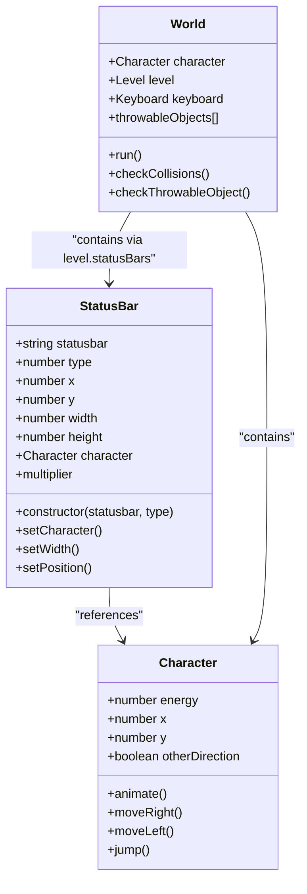
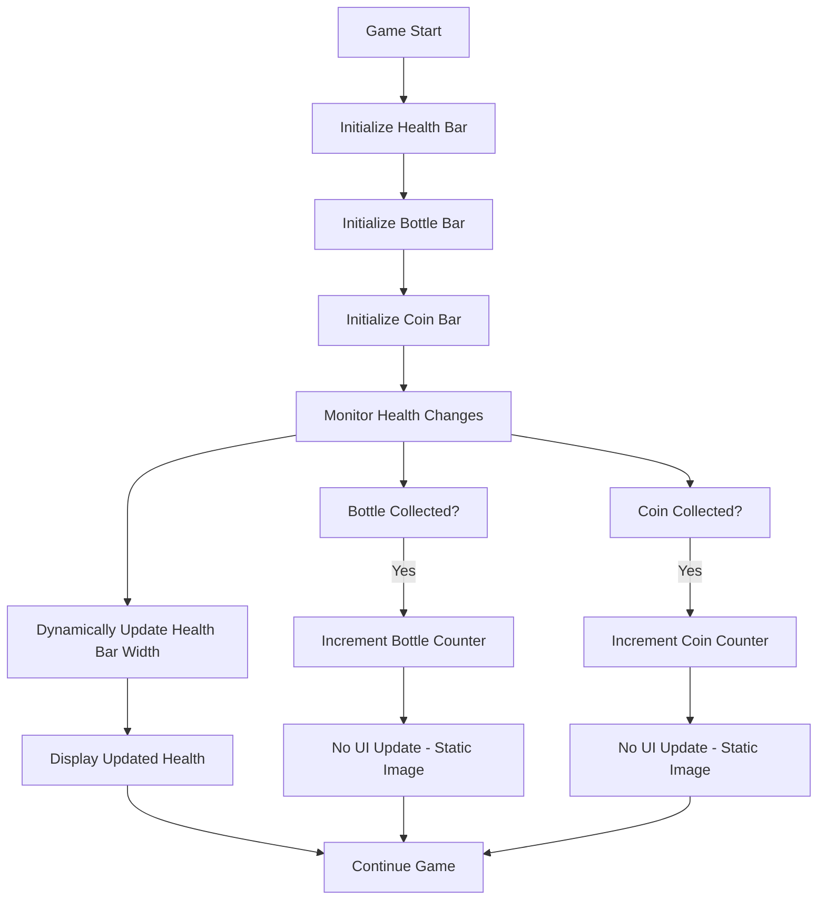
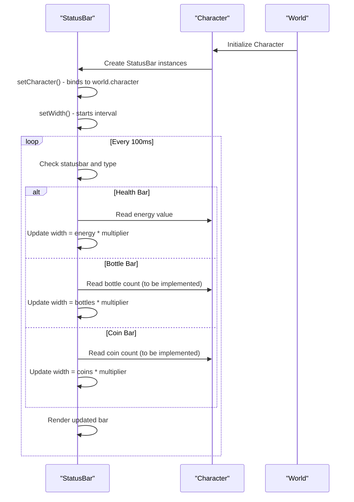
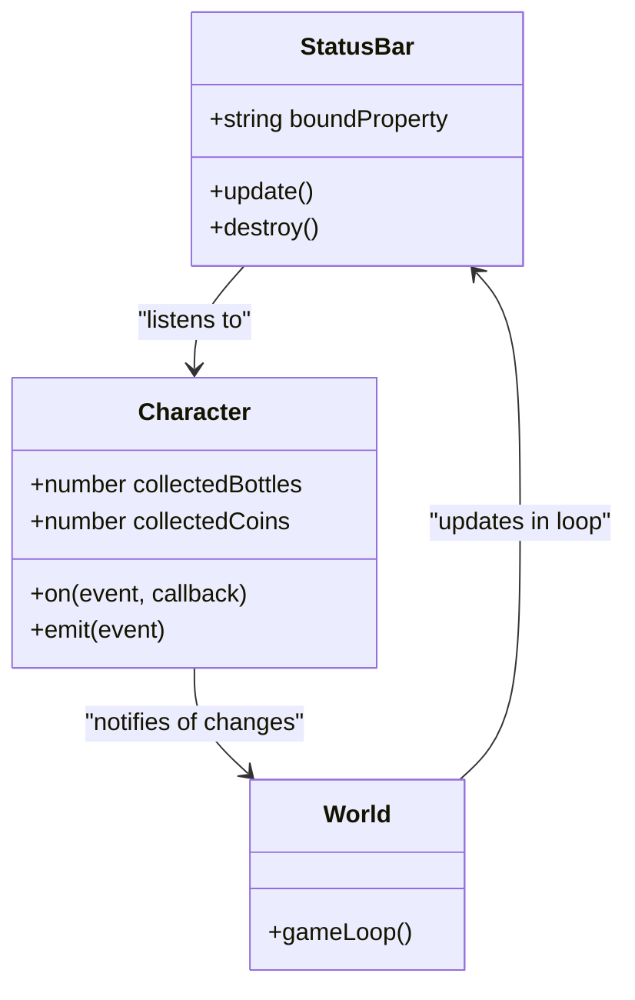

# Score Tracking

<cite>
**Referenced Files in This Document**   
- [character.class.js](file://models/character.class.js)
- [status-bar.class.js](file://models/status-bar.class.js)
- [2-world.class.js](file://models/2-world.class.js)
- [level1.js](file://levels/level1.js)
- [1-game.js](file://js/1-game.js)
- [thowable-object.class.js](file://models/thowable-object.class.js)
</cite>

## Table of Contents
1. [Introduction](#introduction)
2. [Score Tracking Mechanism Overview](#score-tracking-mechanism-overview)
3. [Current Implementation of Bottle and Coin Collection](#current-implementation-of-bottle-and-coin-collection)
4. [Status Bar System Architecture](#status-bar-system-architecture)
5. [Analysis of Static vs Dynamic Status Updates](#analysis-of-static-vs-dynamic-status-updates)
6. [Extending StatusBar for Dynamic Updates](#extending-statusbar-for-dynamic-updates)
7. [Implementation Challenges and Solutions](#implementation-challenges-and-solutions)
8. [Recommended Refactoring Strategy](#recommended-refactoring-strategy)
9. [Conclusion](#conclusion)

## Introduction
This document provides a comprehensive analysis of the score tracking mechanism in the El Pollo Loco game, focusing on bottle and coin collection systems. It examines how collected items are tracked within the Character class and displayed via status bars. The current implementation shows a critical gap: while health bars dynamically update based on character energy, bottle and coin counts rely solely on static image loading without real-time synchronization to inventory values. This document analyzes the implications for gameplay feedback and provides guidance for enhancing the StatusBar class to support dynamic updates across all metrics.

**Section sources**
- [status-bar.class.js](file://models/status-bar.class.js#L85-L91)
- [character.class.js](file://models/character.class.js#L0-L152)

## Score Tracking Mechanism Overview
The game tracks player progress through three primary metrics: health, collected bottles, and collected coins. These are visualized using status bars positioned in the UI. While health reflects character vitality and decreases upon enemy contact, bottles and coins represent collectible resources that should increase as players gather them during gameplay. The system currently lacks proper integration between actual inventory counts and their visual representation, resulting in misleading feedback to players.

The tracking mechanism relies on the Character class for state management and the StatusBar class for UI rendering. However, only the health bar receives dynamic width updates based on the character's energy level. Bottle and coin bars remain static after initialization, failing to reflect changes in collected items.

**Section sources**
- [character.class.js](file://models/character.class.js#L0-L152)
- [status-bar.class.js](file://models/status-bar.class.js#L0-L133)

## Current Implementation of Bottle and Coin Collection
Bottles are collected when the player throws a ThrowableObject, which is instantiated upon pressing the SPACE key. Each throw consumes one bottle from inventory, though this count is not currently reflected in the UI. Coins are collected through collision detection with coin objects in the level, but again, no mechanism exists to update the corresponding status bar.

The Character class manages animations for throwing actions but does not maintain explicit counters for bottles or coins. Instead, these values must be inferred from game events such as throwable object creation or collision detection with collectible items. This indirect approach creates a disconnect between gameplay mechanics and UI feedback.

**Section sources**
- [thowable-object.class.js](file://models/thowable-object.class.js#L0-L82)
- [2-world.class.js](file://models/2-world.class.js#L3-L3)
- [1-game.js](file://js/1-game.js#L0-L55)

## Status Bar System Architecture
The StatusBar class extends DrawableObject and is responsible for rendering visual indicators for health, bottles, and coins. It uses image arrays (`imagesHealthBar`, `imagesBottleBar`, `imagesCoinBar`) to display different components of each bar: background, fill, and icon.

Each status bar instance is created with a type parameter that determines its visual appearance and position. The constructor initializes the image based on the provided statusbar and type arguments, and `setPosition()` configures coordinates according to the bar's purpose. However, only health bars have dynamic width updates via the `setWidth()` method, which runs on an interval and scales the width proportionally to the character's energy.

**Diagram sources**
- [status-bar.class.js](file://models/status-bar.class.js#L0-L133)
- [character.class.js](file://models/character.class.js#L0-L152)
- [2-world.class.js](file://models/2-world.class.js#L0-L132)

## Analysis of Static vs Dynamic Status Updates
A fundamental inconsistency exists in the status bar system: health bars dynamically update their width based on character energy, while bottle and coin bars remain static. This discrepancy stems from the `setWidth()` method, which only applies conditional logic for `imagesHealthBar` with `type === 1`.

The current implementation uses a fixed interval (100ms) to continuously check and update the health bar width. This approach ensures smooth visual feedback for health changes but has not been extended to other metrics. As a result, players receive immediate feedback when damaged but no visual indication when collecting bottles or coins, undermining engagement and clarity.

This limitation affects gameplay experience by creating a disconnect between action and consequence. Players may not realize they've successfully collected items, reducing the sense of accomplishment and making resource management difficult.

**Diagram sources**
- [status-bar.class.js](file://models/status-bar.class.js#L85-L91)
- [status-bar.class.js](file://models/status-bar.class.js#L50-L55)

## Extending StatusBar for Dynamic Updates
To support dynamic updates for bottle and coin counts, the StatusBar class must be enhanced to track inventory values and update its width accordingly. This requires modifications to the constructor and the addition of new update logic.

First, the constructor should accept a callback or property path to monitor, allowing flexible binding to different character properties. Second, the `setWidth()` method should be generalized to handle multiple metric types by checking the statusbar and type combination and mapping them to appropriate character properties.

**Diagram sources**
- [status-bar.class.js](file://models/status-bar.class.js#L60-L91)
- [character.class.js](file://models/character.class.js#L0-L152)

## Implementation Challenges and Solutions
Extending the StatusBar class introduces several challenges:

1. **Multiple Interval Timers**: Each StatusBar instance creates its own `setInterval`, potentially leading to performance degradation with many bars. Solution: Centralize updates in the World class using a single game loop.

2. **Memory Leaks**: Uncleared intervals can persist after game restarts or level changes. Solution: Implement a `destroy()` method to clear intervals and remove references.

3. **Synchronization Issues**: UI updates may lag behind game events if not properly coordinated. Solution: Use event-driven updates instead of polling, triggering UI refreshes only when inventory changes.

4. **Inventory Tracking**: The Character class currently lacks explicit bottle and coin counters. Solution: Add `collectedBottles` and `collectedCoins` properties initialized to zero, incremented on collection events.

5. **Multiplier Calculation**: The width scaling factor (`multiplier`) is currently calculated only for health. Solution: Extend `setCharacter()` to calculate multipliers for all metrics based on maximum possible values.

These challenges can be addressed by refactoring the update mechanism to use a unified event system where the Character emits events like `bottleCollected`, `coinCollected`, and `healthChanged`, which the StatusBar listens to for immediate updates.

**Section sources**
- [status-bar.class.js](file://models/status-bar.class.js#L60-L91)
- [character.class.js](file://models/character.class.js#L0-L152)
- [2-world.class.js](file://models/2-world.class.js#L30-L35)

## Recommended Refactoring Strategy
To create a maintainable and scalable score tracking system, adopt a unified update mechanism across all status metrics:

1. **Add Inventory Properties**: Extend the Character class with `collectedBottles` and `collectedCoins` properties initialized to 0.

2. **Implement Event System**: Use a simple observer pattern where StatusBar instances subscribe to character events.

3. **Centralize Updates**: Move status bar updates into the World's animation loop to eliminate multiple intervals.

4. **Refactor StatusBar Constructor**: Accept a property name (e.g., "energy", "collectedBottles") to bind to, enabling generic handling.

5. **Create Update Method**: Replace `setWidth()` with a generic `update()` method that reads the bound property and adjusts width.

6. **Initialize Multipliers**: Calculate scaling factors for all metrics during initialization based on maximum expected values.

7. **Ensure Cleanup**: Implement proper cleanup methods to prevent memory leaks during game resets.

This approach ensures consistent behavior across all status metrics, improves performance by reducing timer overhead, and enhances maintainability through centralized logic.

**Diagram sources**
- [status-bar.class.js](file://models/status-bar.class.js#L0-L133)
- [character.class.js](file://models/character.class.js#L0-L152)

## Conclusion
The current score tracking system in El Pollo Loco provides adequate health feedback but fails to deliver meaningful visual updates for bottle and coin collections. By extending the StatusBar class to support dynamic updates for all metrics and implementing a unified update mechanism, the game can provide consistent and responsive feedback to players. The recommended refactoring strategy addresses performance concerns, prevents memory leaks, and creates a scalable foundation for future enhancements. Implementing these changes will significantly improve gameplay clarity and player engagement by ensuring that all collected items are properly reflected in the UI.