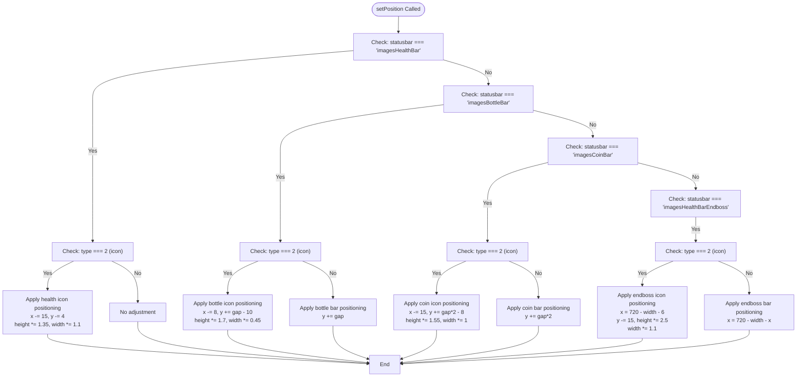
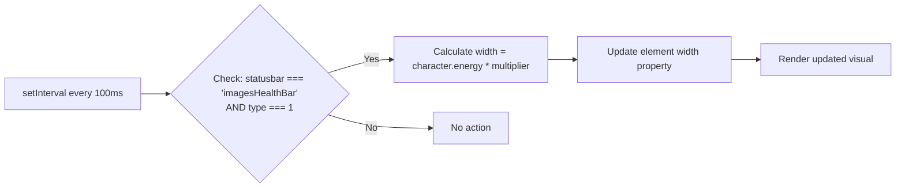

# Status Bars

<cite>
**Referenced Files in This Document**   
- [status-bar.class.js](file://models/status-bar.class.js)
- [character.class.js](file://models/character.class.js)
- [2-world.class.js](file://models/2-world.class.js)
- [1-game.js](file://js/1-game.js)
</cite>

## Table of Contents
1. [Introduction](#introduction)
2. [Core Components](#core-components)
3. [Visual Asset Management](#visual-asset-management)
4. [Constructor and Initialization](#constructor-and-initialization)
5. [Position Management](#position-management)
6. [Character Reference and Energy Calculation](#character-reference-and-energy-calculation)
7. [Dynamic Width Updates](#dynamic-width-updates)
8. [Common Issues and Troubleshooting](#common-issues-and-troubleshooting)
9. [Customization and Extension](#customization-and-extension)

## Introduction
The status bar system in the game provides visual feedback for key player metrics including health, bottle count, coin collection, and endboss health. Implemented through the StatusBar class, this system uses image-based percentage indicators to dynamically represent changing values during gameplay. The implementation leverages inheritance from DrawableObject to handle rendering while adding specialized logic for positioning, scaling, and updating based on game state. This document details the architecture and functionality of the status bar implementation, focusing on how different status bar types are managed and displayed.

## Core Components

The StatusBar class extends DrawableObject, inheriting core rendering capabilities while implementing specialized functionality for UI status indicators. The class manages four primary status bar types through dedicated image arrays: player health, bottle count, coin count, and endboss health. Each status bar consists of three visual elements: a background frame, a fill indicator showing current value, and an icon representing the metric type. The implementation uses a type-based system where different visual configurations and positioning rules are applied based on the statusbar type parameter passed to the constructor.

**Section sources**
- [status-bar.class.js](file://models/status-bar.class.js#L0-L132)

## Visual Asset Management

The status bar implementation uses four distinct image arrays to manage visual assets for different status indicators:

- `imagesHealthBar`: Contains assets for the player's health bar (empty frame, fill indicator, health icon)
- `imagesBottleBar`: Contains assets for the bottle collection bar (empty frame, fill indicator, bottle icon)
- `imagesCoinBar`: Contains assets for the coin collection bar (empty frame, fill indicator, coin icon)
- `imagesHealthBarEndboss`: Contains assets for the endboss health bar (empty frame, fill indicator, endboss health icon)

Each array follows a consistent structure with three elements: the background/status frame, the fill indicator showing current value, and the category icon. This standardized approach allows the same rendering logic to be applied across different status bar types while maintaining visual distinction through different asset paths.

**Section sources**
- [status-bar.class.js](file://models/status-bar.class.js#L15-L50)

## Constructor and Initialization

The StatusBar constructor accepts two parameters: `statusbar` (specifying which image array to use) and `type` (indicating which element within that array to display). The constructor follows a specific initialization sequence: first establishing a character reference through setCharacter(), then storing the statusbar and type parameters, positioning the element through setPosition(), and finally loading the appropriate image asset using this[statusbar][type] dynamic property access. This approach allows flexible instantiation of different status bar elements from the same class by simply changing the parameters.

**Section sources**
- [status-bar.class.js](file://models/status-bar.class.js#L105-L112)

## Position Management

The setPosition() method implements conditional logic to dynamically adjust coordinates and dimensions based on the statusbar type combination. Different positioning rules are applied for each status bar category:

- Player health bar elements are positioned in the top-left area with specific offsets for the icon
- Bottle bar elements are positioned below the health bar with vertical gap adjustments
- Coin bar elements are positioned below the bottle bar with additional vertical spacing
- Endboss health bar elements are positioned in the top-right area with mirrored X-coordinate calculation

The method uses type-specific adjustments to both position (x, y) and dimensions (width, height), ensuring proper alignment and scaling for each visual element. Icon elements receive special treatment with reduced dimensions and precise positioning to align with their corresponding status bars.



**Diagram sources**
- [status-bar.class.js](file://models/status-bar.class.js#L114-L132)

**Section sources**
- [status-bar.class.js](file://models/status-bar.class.js#L114-L132)

## Character Reference and Energy Calculation

The setCharacter() method establishes a reference to the player character by accessing the globally available world object. Due to initialization timing constraints, this operation is wrapped in a setTimeout with a 500ms delay to ensure the world object has been properly instantiated. Once the character reference is established, the method calculates a width multiplier by dividing the status bar's initial width by the character's maximum energy value. This multiplier is crucial for converting energy values to pixel widths in the setWidth() method. If the world object is not available, an error is logged to the console.

```mermaid
sequenceDiagram
participant StatusBar
participant World
participant Character
StatusBar->>StatusBar : setCharacter() called
StatusBar->>StatusBar : setTimeout(500ms)
loop Every 500ms check
StatusBar->>World : Check if world exists
alt World exists
World-->>StatusBar : Return world reference
StatusBar->>Character : Access world.character
StatusBar->>StatusBar : Store character reference
StatusBar->>StatusBar : Calculate multiplier = width / character.energy
StatusBar->>StatusBar : Initialize setWidth()
break End loop
else
StatusBar->>Console : Log "Character nicht gefunden"
end
end
```

**Diagram sources**
- [status-bar.class.js](file://models/status-bar.class.js#L100-L109)

**Section sources**
- [status-bar.class.js](file://models/status-bar.class.js#L100-L109)
- [2-world.class.js](file://models/2-world.class.js#L10-L11)
- [1-game.js](file://js/1-game.js#L3-L3)

## Dynamic Width Updates

The setWidth() method implements continuous updates to the health bar width through setInterval with a 100ms interval. Currently, the implementation only updates the player's health bar (when statusbar is 'imagesHealthBar' and type is 1), calculating the current width by multiplying the character's current energy value by the pre-calculated multiplier. This creates a proportional visual representation where the fill indicator's width corresponds directly to the percentage of remaining energy. The interval-based approach ensures smooth, real-time updates as the player's health changes during gameplay.



**Diagram sources**
- [status-bar.class.js](file://models/status-bar.class.js#L113-L118)

**Section sources**
- [status-bar.class.js](file://models/status-bar.class.js#L113-L118)

## Common Issues and Troubleshooting

Several common issues may arise with the status bar implementation:

1. **Delayed Character Initialization**: The 500ms setTimeout in setCharacter() may not always be sufficient depending on system performance. If the character reference fails to establish, verify that the world object is properly initialized in 1-game.js and that the init() function has completed.

2. **Misaligned UI Elements**: Positioning issues can occur if canvas dimensions change. The endboss health bar uses hardcoded X-coordinate calculations (720 - width - x) that assume a specific canvas width. Adjust these values if the display resolution changes.

3. **Incorrect Scaling**: The width multiplier calculation assumes the character's energy value remains constant after initialization. If energy values change dynamically, the multiplier should be recalculated.

4. **Missing Assets**: Ensure all image paths in the status bar arrays exist in the assets directory and that file names match exactly, including case sensitivity.

**Section sources**
- [status-bar.class.js](file://models/status-bar.class.js#L100-L109)
- [status-bar.class.js](file://models/status-bar.class.js#L114-L132)

## Customization and Extension

The status bar system can be customized and extended in several ways:

1. **Modify Bar Dimensions**: Adjust the default width (200) and height (20) properties in the StatusBar class, or modify the scaling factors in setPosition() for specific element types.

2. **Change Asset Paths**: Update the image array paths to use different visual designs. Ensure new assets maintain similar dimensions for proper alignment.

3. **Add New Status Bar Types**: Create additional image arrays following the existing pattern (background, fill, icon) and extend the setPosition() logic to handle new type combinations.

4. **Enhance Update Logic**: Extend setWidth() to support other status bars beyond player health by adding additional conditions for bottle count and coin collection.

5. **Improve Initialization**: Replace the setTimeout-based character reference with an event-driven approach that listens for world initialization completion.

**Section sources**
- [status-bar.class.js](file://models/status-bar.class.js#L15-L50)
- [status-bar.class.js](file://models/status-bar.class.js#L114-L132)