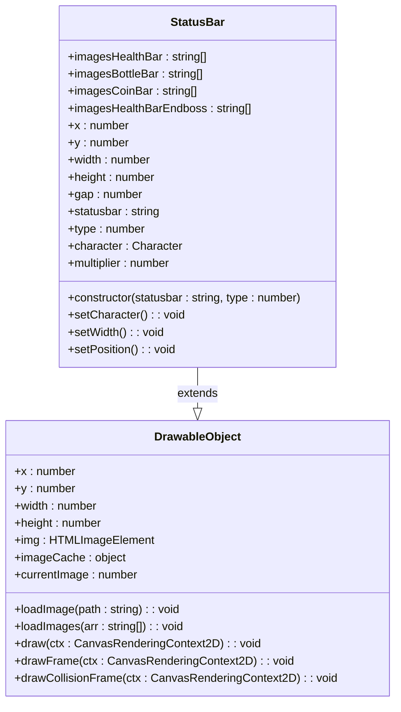
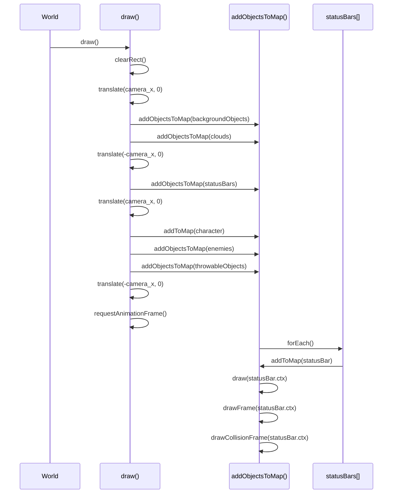
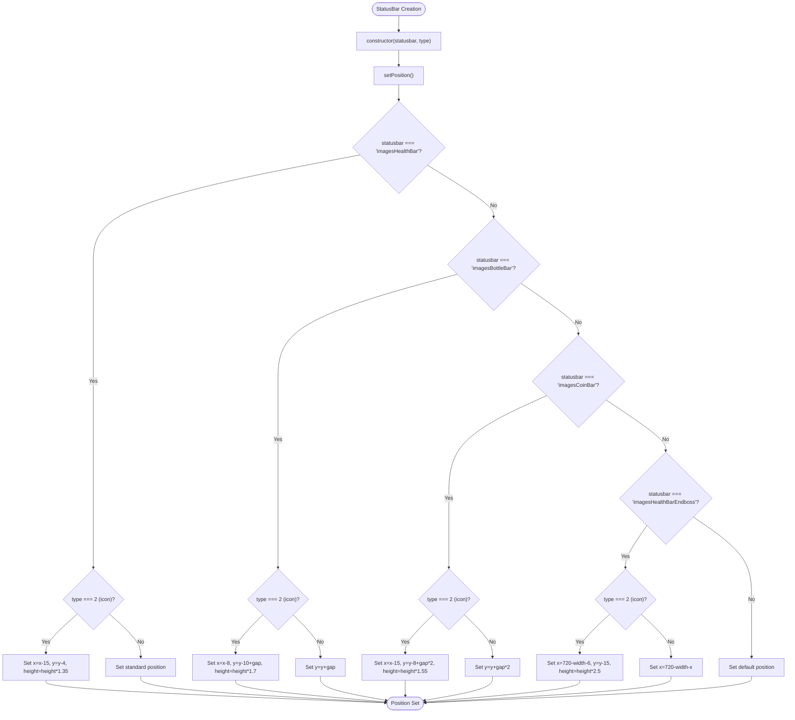

# UI System

<cite>
**Referenced Files in This Document**   
- [status-bar.class.js](file://models/status-bar.class.js)
- [2-world.class.js](file://models/2-world.class.js)
- [character.class.js](file://models/character.class.js)
- [level1.js](file://levels/level1.js)
- [drawable-object.class.js](file://models/drawable-object.class.js)
</cite>

## Table of Contents
1. [Introduction](#introduction)
2. [StatusBar Class Architecture](#statusbar-class-architecture)
3. [Status Bar Types and Visual Elements](#status-bar-types-and-visual-elements)
4. [Integration with World Rendering](#integration-with-world-rendering)
5. [Dynamic Value Updates and Percentage Mapping](#dynamic-value-updates-and-percentage-mapping)
6. [Coordinate Translation and Positioning](#coordinate-translation-and-positioning)
7. [Debugging Visual Boundaries](#debugging-visual-boundaries)
8. [Common UI Issues and Troubleshooting](#common-ui-issues-and-troubleshooting)
9. [Customization and Extension](#customization-and-extension)
10. [Conclusion](#conclusion)

## Introduction
The UI system in the game implements a comprehensive status bar framework that visually represents key gameplay metrics including player health, collected bottles, coins, and endboss health. These status bars use percentage-based visual indicators to provide immediate feedback to players about their current game state. The system is built around the StatusBar class which extends DrawableObject, enabling it to integrate seamlessly with the game's rendering pipeline. Status bars are positioned and updated dynamically based on changing game state values from the Character and other entities, with their visual representation automatically adjusting to reflect current values.

## StatusBar Class Architecture

The StatusBar class serves as the foundation for all visual status indicators in the game. It extends the DrawableObject base class, inheriting core rendering capabilities while adding specialized functionality for status visualization. The class manages three distinct visual components for each status type: the background frame, the fill bar, and the icon indicator. Each status bar instance is created with specific parameters that determine its type and visual representation.

The architecture follows a component-based approach where different status types (health, bottles, coins, endboss) share the same underlying implementation but display different visual assets. This design promotes code reuse while allowing for visual differentiation between metrics. The StatusBar class maintains references to the player character to access current state values and calculates appropriate visual representations based on these values.

**Section sources**
- [status-bar.class.js](file://models/status-bar.class.js#L0-L132)

## Status Bar Types and Visual Elements

The game implements four primary status bar types, each with distinct visual characteristics and positioning requirements. The health bar for the player character consists of three components: a background frame (type 0), a fill bar (type 1), and an icon (type 2). Similarly, bottle and coin collection metrics follow the same three-component pattern. The endboss health bar uses a separate visual theme with different asset paths and positioning to distinguish it from player metrics.

Each status type utilizes specific image arrays defined as class properties:
- `imagesHealthBar`: Contains assets for player health visualization
- `imagesBottleBar`: Contains assets for bottle collection visualization  
- `imagesCoinBar`: Contains assets for coin collection visualization
- `imagesHealthBarEndboss`: Contains assets for endboss health visualization

These image arrays follow a consistent structure with three elements representing the three visual components of each status bar. The constructor accepts the statusbar type and component type as parameters, loading the appropriate image asset based on these values.



**Diagram sources**
- [status-bar.class.js](file://models/status-bar.class.js#L0-L132)
- [drawable-object.class.js](file://models/drawable-object.class.js#L0-L45)

**Section sources**
- [status-bar.class.js](file://models/status-bar.class.js#L0-L132)

## Integration with World Rendering

The status bar system integrates with the game world through the World class's rendering pipeline. Status bars are treated as drawable objects that are rendered alongside other game elements. The World.draw() method orchestrates the entire rendering process, ensuring status bars appear in the correct visual layer relative to game objects.

The rendering sequence in World.draw() follows a specific order to maintain proper visual hierarchy:
1. Clear the canvas
2. Translate coordinates based on camera position
3. Draw background objects and clouds
4. Reset translation and draw status bars
5. Translate again and draw character, enemies, and throwable objects
6. Reset translation

This sequence ensures that status bars remain fixed in the screen space while game objects move with the camera. The addObjectsToMap() method handles the rendering of status bar arrays, calling addToMap() for each individual status bar instance.



**Diagram sources**
- [2-world.class.js](file://models/2-world.class.js#L66-L85)
- [2-world.class.js](file://models/2-world.class.js#L106-L117)

**Section sources**
- [2-world.class.js](file://models/2-world.class.js#L66-L85)

## Dynamic Value Updates and Percentage Mapping

The StatusBar class implements dynamic updates that reflect changing game state values in real-time. The setWidth() method establishes an interval that continuously updates the width of the fill bar based on the player character's current energy level. This creates a percentage-based visual indicator where the filled portion of the bar corresponds directly to the character's health percentage.

The percentage mapping works through a multiplier calculation established in setCharacter(). The multiplier is calculated as the ratio of the maximum bar width to the character's maximum energy value (100), resulting in a conversion factor of 2.0. When the character's energy changes, this multiplier is applied to calculate the current visual width of the fill bar.

For example:
- When character energy = 100 (100%), bar width = 200px (fully filled)
- When character energy = 50 (50%), bar width = 100px (half filled)  
- When character energy = 25 (25%), bar width = 50px (quarter filled)

This percentage-based approach ensures smooth visual transitions as values change during gameplay. The system currently supports health percentage updates for the player character, with similar mechanisms potentially applicable to other metrics like bottle and coin collection.

**Section sources**
- [status-bar.class.js](file://models/status-bar.class.js#L85-L91)
- [status-bar.class.js](file://models/status-bar.class.js#L75-L83)

## Coordinate Translation and Positioning

The positioning system for status bars accounts for both the game camera's movement and the specific visual requirements of each status component. The setPosition() method configures the x, y, width, and height properties for each status bar instance based on its type and component.

Player status bars are positioned in the top-left area of the screen with the following layout:
- Health bar components aligned vertically with appropriate spacing
- Bottle collection bar positioned below health with gap offset
- Coin collection bar positioned below bottles with double gap offset

The endboss health bar is positioned in the top-right area of the screen, with its x-coordinate calculated relative to the canvas width (720px). This creates a mirrored layout where player metrics appear on the left and endboss metrics on the right, enhancing visual clarity during boss encounters.

The coordinate system must account for camera translation during rendering. Status bars are drawn outside the camera translation block in World.draw(), ensuring they remain fixed in screen space rather than moving with the game world. This creates a heads-up display (HUD) effect where status indicators stay in place while the game environment scrolls beneath them.



**Diagram sources**
- [status-bar.class.js](file://models/status-bar.class.js#L93-L131)
- [level1.js](file://levels/level1.js#L0-L51)

**Section sources**
- [status-bar.class.js](file://models/status-bar.class.js#L93-L131)

## Debugging Visual Boundaries

The UI system includes built-in debugging tools through the drawFrame() and drawCollisionFrame() methods inherited from DrawableObject. These methods provide visual overlays that help developers verify the positioning and dimensions of status bars during development and troubleshooting.

The drawFrame() method renders a blue rectangle around the entire status bar component, showing its complete bounding box. This helps identify positioning issues, alignment problems, or unexpected size changes. The drawCollisionFrame() method renders a red rectangle that represents the collision detection area, which may differ from the visual bounds due to offset values.

These debugging frames are conditionally rendered only for specific object types (Character, Chicken, Endboss) as defined in the method implementations. For status bars, these frames can be temporarily enabled by modifying the instanceof checks, allowing developers to visualize the exact coordinates and dimensions of each status component during gameplay.

The debugging system integrates with the main rendering loop through the World.addToMap() method, which calls both drawFrame() and drawCollisionFrame() after the primary draw() operation. This ensures debugging visuals appear on top of the regular game graphics, making them clearly visible during testing.

```mermaid
classDiagram
class DrawableObject {
+draw(ctx)
+drawFrame(ctx)
+drawCollisionFrame(ctx)
}
class StatusBar {
+draw(ctx)
+drawFrame(ctx)
+drawCollisionFrame(ctx)
}
DrawableObject <|-- StatusBar
note right of DrawableObject
drawFrame() : Renders blue outline
showing visual boundaries
end note
note right of DrawableObject
drawCollisionFrame() : Renders red outline
showing collision detection area
end note
```

**Diagram sources**
- [drawable-object.class.js](file://models/drawable-object.class.js#L27-L41)
- [2-world.class.js](file://models/2-world.class.js#L106-L117)

**Section sources**
- [drawable-object.class.js](file://models/drawable-object.class.js#L27-L41)

## Common UI Issues and Troubleshooting

Several common UI issues can occur with the status bar system, primarily related to positioning, value updates, and visibility. Misaligned bars typically result from incorrect coordinate calculations in the setPosition() method or conflicts with camera translation in the rendering pipeline. Ensuring status bars are rendered outside the camera translation blocks in World.draw() prevents them from scrolling with the game world.

Incorrect percentage calculations often stem from timing issues in the setCharacter() method. The setTimeout delay of 500ms allows the world object to initialize before accessing the character reference. If this timing is insufficient, the character reference may be null, preventing proper multiplier calculation. Adjusting the timeout duration or implementing a more robust initialization sequence can resolve this issue.

Visibility problems during gameplay may occur when status bars are rendered in the wrong visual layer. The rendering order in World.draw() is critical: status bars must be drawn after background elements but before foreground game objects. Incorrect ordering can cause status bars to be obscured by clouds or other elements.

Other potential issues include:
- Missing image assets causing broken visuals
- Inconsistent scaling between bar components
- Performance impacts from frequent width updates
- Layout conflicts on different screen resolutions

These issues can be diagnosed using the debugging frame methods and by verifying the initialization sequence of the StatusBar instances in level1.js.

**Section sources**
- [status-bar.class.js](file://models/status-bar.class.js#L75-L83)
- [2-world.class.js](file://models/2-world.class.js#L66-L85)
- [status-bar.class.js](file://models/status-bar.class.js#L93-L131)

## Customization and Extension

The status bar system can be extended to support additional metrics such as score or timer displays. New status types can be implemented by adding corresponding image arrays to the StatusBar class and updating the setPosition() method to handle the new component's positioning requirements.

For example, adding a score display would involve:
1. Creating a new image array (e.g., imagesScoreBar) with background, fill, and icon assets
2. Adding positioning logic in setPosition() for the new score components
3. Creating StatusBar instances in level1.js for the score display
4. Implementing a setWidth() variant that updates based on score values rather than energy

Customization of appearance can be achieved by modifying the image assets or adjusting the dimensional properties (width, height, gap) in the StatusBar class. The modular design allows for visual theme changes without altering the underlying logic.

The system could also be enhanced with animation effects for value changes, color transitions based on thresholds (e.g., red when health is low), or responsive layouts that adapt to different screen sizes. These improvements would maintain the existing architecture while providing richer visual feedback to players.

**Section sources**
- [status-bar.class.js](file://models/status-bar.class.js#L0-L132)
- [level1.js](file://levels/level1.js#L0-L51)

## Conclusion

The UI system effectively implements a comprehensive status bar framework that provides clear visual feedback on key gameplay metrics. The StatusBar class, integrated with the World rendering pipeline, creates a dynamic heads-up display that updates in real-time based on game state changes. The percentage-based visual indicators for health, bottles, coins, and endboss health enhance player immersion by providing immediate feedback on their progress and status.

The system demonstrates a well-structured approach to UI design with reusable components, clear separation of concerns, and effective integration with the game's rendering architecture. While currently focused on essential metrics, the modular design allows for straightforward extension to include additional displays like score, timer, or special ability indicators. The debugging tools provided by drawFrame() and drawCollisionFrame() methods support ongoing development and troubleshooting, ensuring the UI remains reliable and visually consistent throughout gameplay.