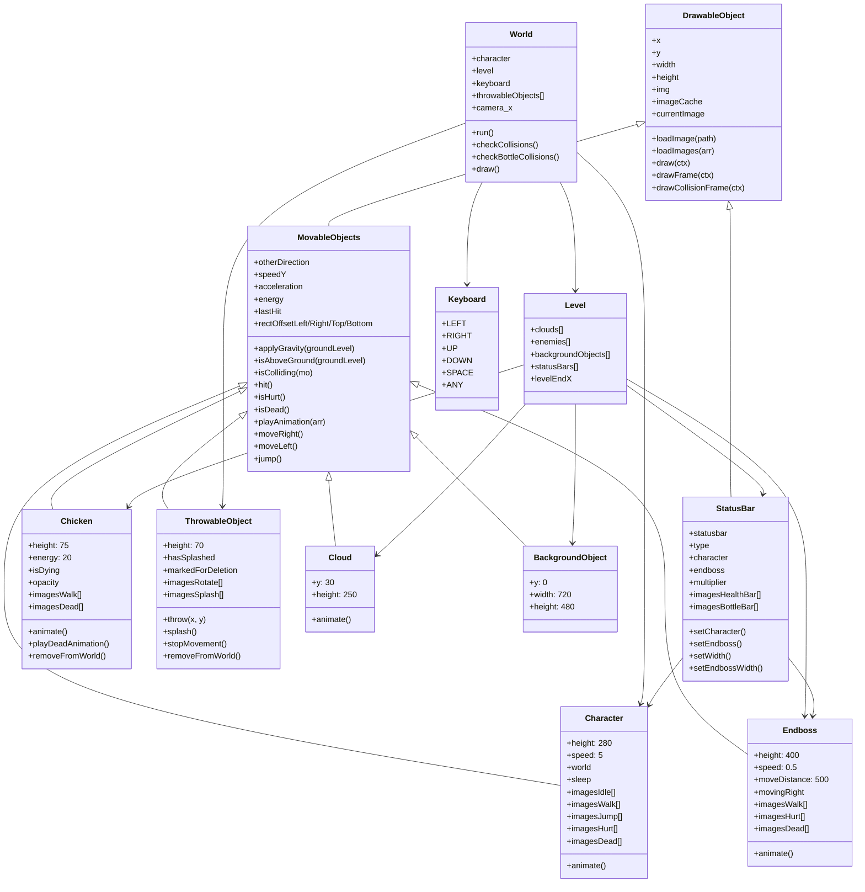
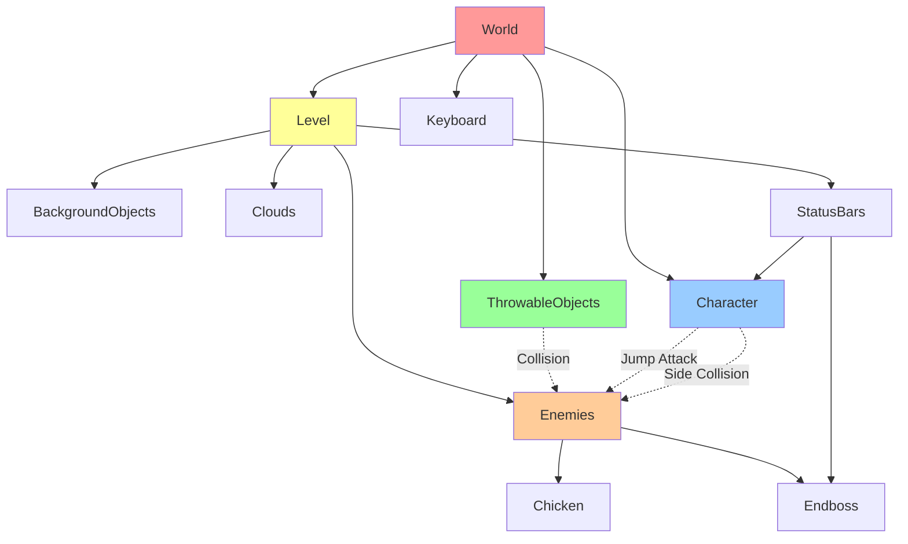
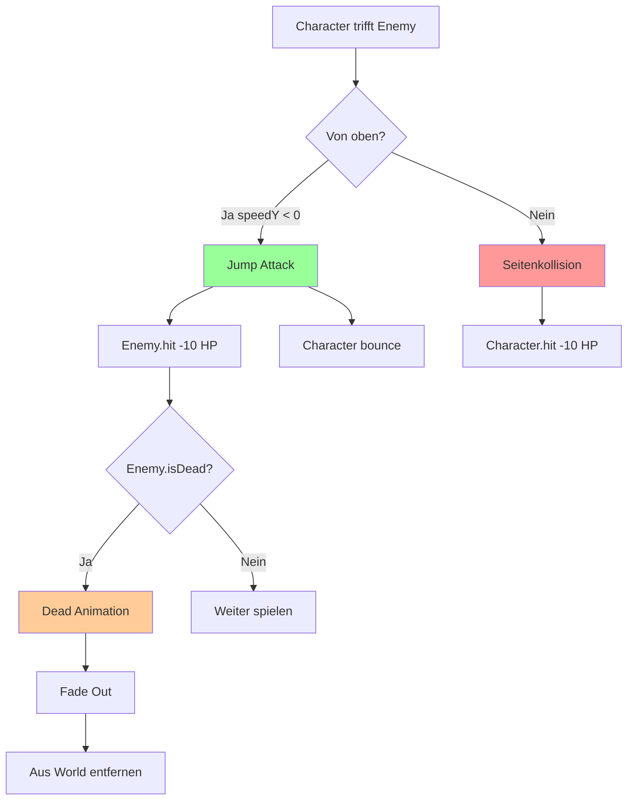
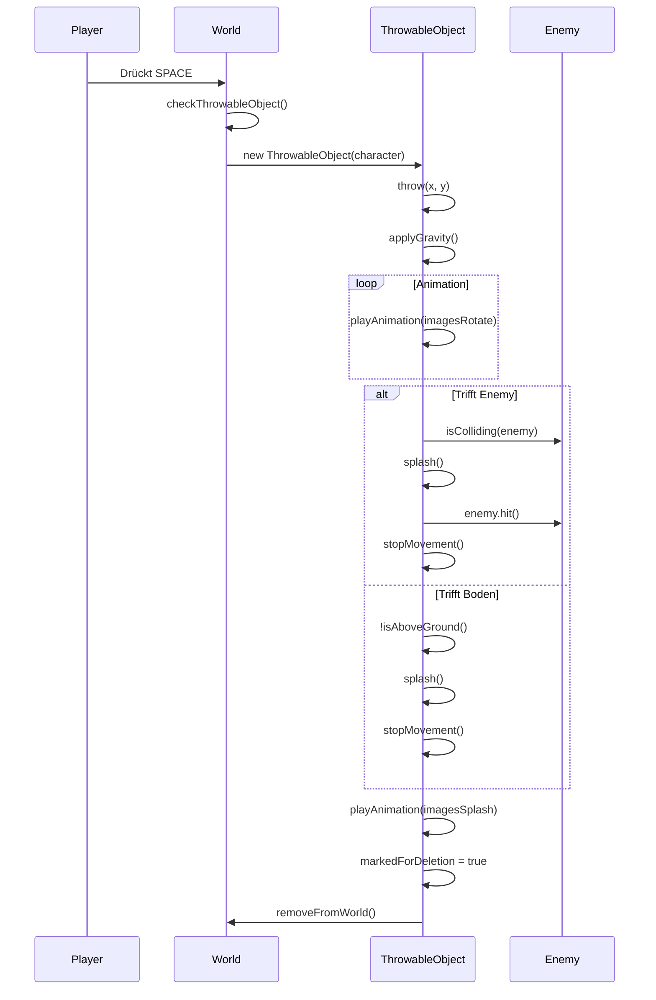

# El Polo Loco - Klassen-Diagramm

## Visuelles Klassen-Diagramm

### Vererbungshierarchie

### Interaktions-Diagramm

### Kollisions-Logik

### Flasche Wurf-Ablauf

---

## 1. DrawableObject (Basis-Klasse)

**Datei:** `models/drawable-object.class.js`

### Properties:

- `x` - X-Position
- `y` - Y-Position
- `width` - Breite
- `height` - Höhe
- `img` - Aktuelles Bild
- `imageCache` - Cache für vorgeladene Bilder
- `currentImage` - Index des aktuellen Bildes

### Methoden:

- `loadImage(path)` - Lädt ein einzelnes Bild
- `loadImages(arr)` - Lädt mehrere Bilder in den Cache
- `draw(ctx)` - Zeichnet das Objekt (mit Opacity-Unterstützung)
- `drawFrame(ctx)` - Zeichnet blauen Rahmen (für Character, Chicken, Endboss, ThrowableObject)
- `drawCollisionFrame(ctx)` - Zeichnet roten Kollisions-Rahmen

---

## 2. MovableObjects

**Datei:** `models/movable-objects.class.js`
**Extends:** DrawableObject

### Properties:

- `otherDirection` - Boolean für Blickrichtung
- `speedY` - Vertikale Geschwindigkeit
- `acceleration` - Beschleunigung (Gravität)
- `energy` - Lebensenergie (Standard: 100)
- `lastHit` - Zeitpunkt des letzten Treffers
- `rectOffsetLeft/Right/Top/Bottom` - Kollisions-Box Offsets

### Methoden:

- `applyGravity(groundLevel)` - Wendet Gravitation an
- `isAboveGround(groundLevel)` - Prüft ob über dem Boden
- `isColliding(mo)` - Prüft Kollision mit anderem Objekt
- `hit()` - Reduziert Energy um 10
- `isHurt()` - Gibt true zurück für 1 Sekunde nach Treffer
- `isDead()` - Gibt true zurück wenn Energy = 0
- `playAnimation(arr)` - Spielt Animation ab
- `moveRight()` - Bewegt nach rechts
- `moveLeft(directionState)` - Bewegt nach links
- `jump()` - Springt (speedY = 8)

---

## 3. Character

**Datei:** `models/character.class.js`
**Extends:** MovableObjects

### Properties:

- `height = 280`
- `width = height * 0.5`
- `groundLevel = 445 - height`
- `x = 50`
- `speed = 5`
- `sleep` - Boolean für Idle-Zustand
- `rectOffsetLeft = 50`
- `rectOffsetTop = 110`
- `rectOffsetRight = 100`
- `rectOffsetBottom = 125`
- `world` - Referenz zur World
- `imagesIdle`, `imagesLongIdle`, `imagesWalk`, `imagesJump`, `imagesThrow`, `imagesHurt`, `imagesDead`

### Methoden:

- `animate()` - Steuert alle Animationen und Bewegungen

---

## 4. Chicken

**Datei:** `models/chicken.class.js`
**Extends:** MovableObjects

### Properties:

- `height = 75`
- `width = height * 0.8`
- `energy = 20`
- `groundLevel = 440 - height`
- `rectOffsetTop = 1`
- `rectOffsetBottom = 5`
- `world` - Referenz zur World
- `markedForDeletion` - Lösch-Flag
- `isDying` - Stirbt-Flag
- `moveInterval`, `animationInterval` - Interval-Referenzen
- `opacity = 1` - Für Fade-Out
- `imagesWalk`, `imagesDead`

### Methoden:

- `animate()` - Bewegung und Animation
- `playDeadAnimation()` - Spielt Dead-Animation mit Fade-Out
- `removeFromWorld()` - Entfernt sich aus enemies Array

---

## 5. Endboss

**Datei:** `models/endboss.class.js`
**Extends:** MovableObjects

### Properties:

- `height = 400`
- `width = height * 0.8`
- `groundLevel = 450 - height`
- `x = 400`
- `speed = 0.5`
- `startX = 400` - Startposition
- `moveDistance = 500` - Bewegungsdistanz
- `movingRight = true` - Bewegungsrichtung
- `rectOffsetTop = 70`
- `rectOffsetBottom = 15`
- `rectOffsetLeft = 40`
- `rectOffsetRight = 40`
- `imagesWalk`, `imagesAlert`, `imagesAttack`, `imagesHurt`, `imagesDead`

### Methoden:

- `animate()` - Hin-und-Her-Bewegung + Animation (Walk/Hurt/Dead)

---

## 6. ThrowableObject

**Datei:** `models/thowable-object.class.js`
**Extends:** MovableObjects

### Properties:

- `height = 70`
- `width = height * 0.3`
- `groundLevel = 445 - height`
- `character` - Referenz zum werfenden Character
- `world` - Referenz zur World
- `hasSplashed` - Boolean für Aufprall
- `splashAnimationComplete` - Boolean für Animation
- `throwInterval` - Bewegungs-Interval
- `markedForDeletion` - Lösch-Flag
- `rectOffsetLeft/Right/Top/Bottom = 5`
- `imagesRotate`, `imagesSplash`

### Methoden:

- `animate()` - Rotations- und Splash-Animation
- `throw(x, y)` - Wirft die Flasche
- `splash()` - Triggert Splash-Animation
- `stopMovement()` - Stoppt horizontale Bewegung
- `removeFromWorld()` - Entfernt sich aus throwableObjects Array

---

## 7. Cloud

**Datei:** `models/clouds.class.js`
**Extends:** MovableObjects

### Properties:

- `y = 30`
- `height = 250`
- `width = height * 2`

### Methoden:

- `animate()` - Bewegt Wolke langsam nach links

---

## 8. BackgroundObject

**Datei:** `models/background-object.class.js`
**Extends:** MovableObjects

### Properties:

- `y = 0`
- `width = 720`
- `height = 480`

### Methoden:

- Keine eigenen (nutzt nur geerbte)

---

## 9. StatusBar

**Datei:** `models/status-bar.class.js`
**Extends:** DrawableObject

### Properties:

- `x = 30`, `y = 20`
- `width = 200`, `height = 20`
- `gap = 35`
- `statusbar`, `type` - Typ der Statusbar
- `character` - Referenz zum Character
- `endboss` - Referenz zum Endboss
- `multiplier`, `endbossMultiplier` - Skalierungsfaktoren
- `initialWidth`, `initialX` - Anfangswerte für Endboss-Bar
- `imagesHealthBar`, `imagesBottleBar`, `imagesCoinBar`, `imagesHealthBarEndboss`

### Methoden:

- `setCharacter()` - Setzt Character-Referenz und Multiplier
- `setEndboss()` - Setzt Endboss-Referenz und Multiplier
- `setWidth()` - Aktualisiert Character-Statusbar dynamisch
- `setEndbossWidth()` - Aktualisiert Endboss-Statusbar (von links nach rechts)
- `setPosition()` - Positioniert die Statusbar

---

## 10. Level

**Datei:** `models/level.class.js`

### Properties:

- `clouds` - Array von Wolken
- `enemies` - Array von Gegnern
- `backgroundObjects` - Array von Hintergründen
- `statusBars` - Array von Statusbars
- `levelEndX` - Ende des Levels

### Methoden:

- Keine (nur Container für Level-Objekte)

---

## 11. Keyboard

**Datei:** `models/keyboard.class.js`

### Properties:

- `LEFT` - Boolean für Pfeiltaste links
- `RIGHT` - Boolean für Pfeiltaste rechts
- `UP` - Boolean für Pfeiltaste oben
- `DOWN` - Boolean für Pfeiltaste unten
- `SPACE` - Boolean für Leertaste
- `ANY` - Boolean wenn irgendeine Taste gedrückt

### Methoden:

- Keine (nur Properties, Event-Listener in HTML)

---

## 12. World

**Datei:** `models/2-world.class.js`

### Properties:

- `character` - Der Spieler-Character
- `level` - Das aktuelle Level
- `canvas`, `ctx` - Canvas und Context
- `keyboard` - Keyboard-Objekt
- `camera_x` - Kamera-Position
- `throwableObjects` - Array geworfener Flaschen
- `lastThrow` - Zeitpunkt des letzten Wurfs

### Methoden:

- `setWorld()` - Setzt World-Referenzen für alle Objekte
- `run()` - Startet Game-Loops (Kollisionen alle 200ms, Flaschen alle 50ms)
- `checkCollisions()` - Prüft Character-Gegner-Kollisionen (mit Jump-Attack-Logik)
- `isJumpingOnEnemy(character, enemy)` - Prüft Jump-Attack
- `checkBottleCollisions()` - Prüft Flaschen-Gegner-Kollisionen
- `checkThrowableObject()` - Erstellt neue Flaschen beim Wurf
- `throwInterval()` - Prüft Wurf-Cooldown
- `draw()` - Zeichnet alle Objekte (60 FPS)
- `addObjectsToMap(objects)` - Zeichnet Array von Objekten
- `addToMap(mo)` - Zeichnet einzelnes Objekt
- `flipImage(mo)`, `flipImageBack(mo)` - Spiegelt Bilder

---

## Wichtige Interaktionen

### Character ↔ Enemies

- Kollision von der Seite → Character verliert Energy
- Kollision von oben (Jump-Attack) → Enemy verliert Energy, Character bounced

### ThrowableObject ↔ Enemies

- Kollision → Enemy verliert Energy, Flasche spielt Splash-Animation

### StatusBar ↔ Character/Endboss

- Überwacht Energy und passt Breite dynamisch an
- Character-Bar: Schmaler von rechts nach links
- Endboss-Bar: Schmaler von links nach rechts

### World-Zentrale

- Koordiniert alle Kollisionen
- Verwaltet Kamera-Position
- Rendert alle Objekte
