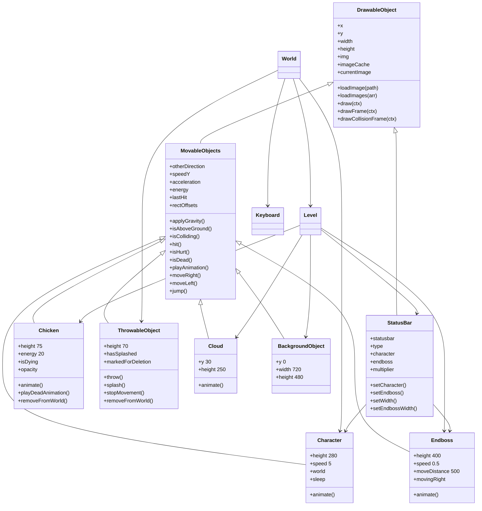
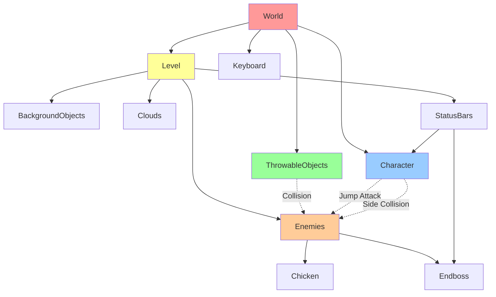
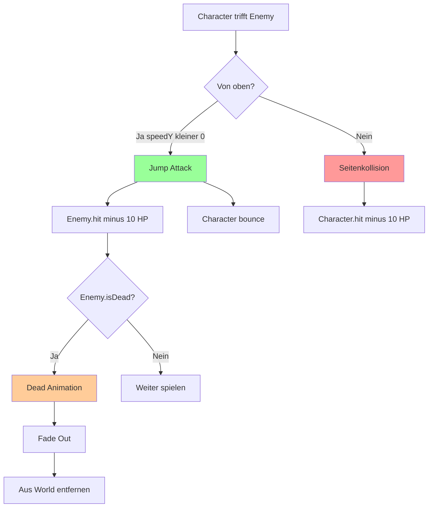
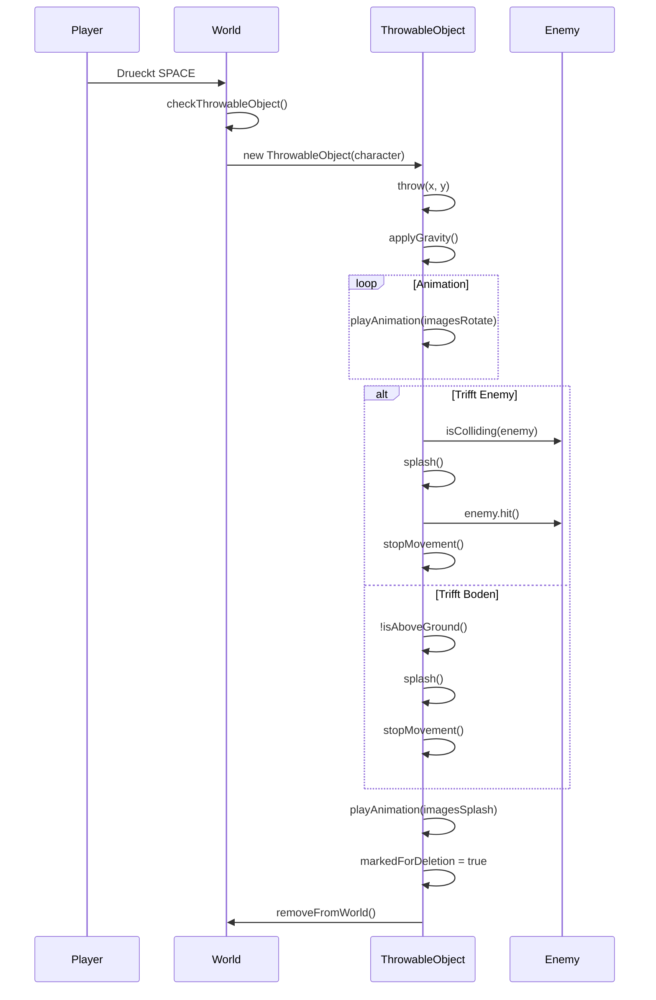

# El Polo Loco - Visuelle Diagramme

## Klassen-Vererbungshierarchie

```mermaid
classDiagram
    DrawableObject <|-- MovableObjects
    DrawableObject <|-- StatusBar
    MovableObjects <|-- Character
    MovableObjects <|-- Chicken
    MovableObjects <|-- Endboss
    MovableObjects <|-- ThrowableObject
    MovableObjects <|-- Cloud
    MovableObjects <|-- BackgroundObject

    class DrawableObject {
        +x
        +y
        +width
        +height
        +img
        +imageCache
        +currentImage
        +loadImage(path)
        +loadImages(arr)
        +draw(ctx)
        +drawFrame(ctx)
        +drawCollisionFrame(ctx)
    }

    class MovableObjects {
        +otherDirection
        +speedY
        +acceleration
        +energy
        +lastHit
        +rectOffsets
        +applyGravity()
        +isAboveGround()
        +isColliding()
        +hit()
        +isHurt()
        +isDead()
        +playAnimation()
        +moveRight()
        +moveLeft()
        +jump()
    }

    class Character {
        +height 280
        +speed 5
        +world
        +sleep
        +animate()
    }

    class Chicken {
        +height 75
        +energy 20
        +isDying
        +opacity
        +animate()
        +playDeadAnimation()
        +removeFromWorld()
    }

    class Endboss {
        +height 400
        +speed 0.5
        +moveDistance 500
        +movingRight
        +animate()
    }

    class ThrowableObject {
        +height 70
        +hasSplashed
        +markedForDeletion
        +throw()
        +splash()
        +stopMovement()
        +removeFromWorld()
    }

    class Cloud {
        +y 30
        +height 250
        +animate()
    }

    class BackgroundObject {
        +y 0
        +width 720
        +height 480
    }

    class StatusBar {
        +statusbar
        +type
        +character
        +endboss
        +multiplier
        +setCharacter()
        +setEndboss()
        +setWidth()
        +setEndbossWidth()
    }

    World --> Character
    World --> Level
    World --> Keyboard
    World --> ThrowableObject
    Level --> Chicken
    Level --> Endboss
    Level --> Cloud
    Level --> BackgroundObject
    Level --> StatusBar
    StatusBar --> Character
    StatusBar --> Endboss
```

## Interaktions-Diagramm

```mermaid
graph TB
    W[World] --> C[Character]
    W --> L[Level]
    W --> K[Keyboard]
    W --> T[ThrowableObjects]

    L --> E[Enemies]
    L --> BG[BackgroundObjects]
    L --> CL[Clouds]
    L --> SB[StatusBars]

    E --> CH[Chicken]
    E --> EB[Endboss]

    SB --> C
    SB --> EB

    T -.Collision.-> E
    C -.Jump Attack.-> E
    C -.Side Collision.-> E

    style W fill:#ff9999
    style C fill:#99ccff
    style E fill:#ffcc99
    style T fill:#99ff99
    style L fill:#ffff99
```

## Kollisions-Logik Flowchart

```mermaid
flowchart TD
    Start[Character trifft Enemy] --> Check{Von oben?}
    Check -->|Ja speedY kleiner 0| JumpAttack[Jump Attack]
    Check -->|Nein| SideHit[Seitenkollision]

    JumpAttack --> EnemyDamage[Enemy.hit minus 10 HP]
    JumpAttack --> Bounce[Character bounce]

    SideHit --> CharDamage[Character.hit minus 10 HP]

    EnemyDamage --> DeadCheck{Enemy.isDead?}
    DeadCheck -->|Ja| DeadAnim[Dead Animation]
    DeadCheck -->|Nein| Continue[Weiter spielen]

    DeadAnim --> FadeOut[Fade Out]
    FadeOut --> Remove[Aus World entfernen]

    style JumpAttack fill:#99ff99
    style SideHit fill:#ff9999
    style DeadAnim fill:#ffcc99
```

## Flasche Wurf-Sequenz

```mermaid
sequenceDiagram
    participant P as Player
    participant W as World
    participant T as ThrowableObject
    participant E as Enemy

    P->>W: Drueckt SPACE
    W->>W: checkThrowableObject()
    W->>T: new ThrowableObject(character)
    T->>T: throw(x, y)
    T->>T: applyGravity()

    loop Animation
        T->>T: playAnimation(imagesRotate)
    end

    alt Trifft Enemy
        T->>E: isColliding(enemy)
        T->>T: splash()
        T->>E: enemy.hit()
        T->>T: stopMovement()
    else Trifft Boden
        T->>T: !isAboveGround()
        T->>T: splash()
        T->>T: stopMovement()
    end

    T->>T: playAnimation(imagesSplash)
    T->>T: markedForDeletion = true
    T->>W: removeFromWorld()
```
